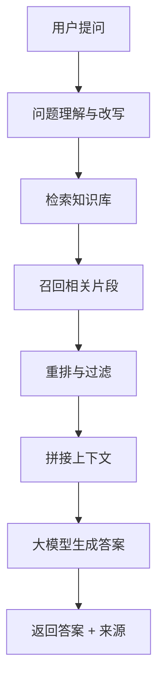
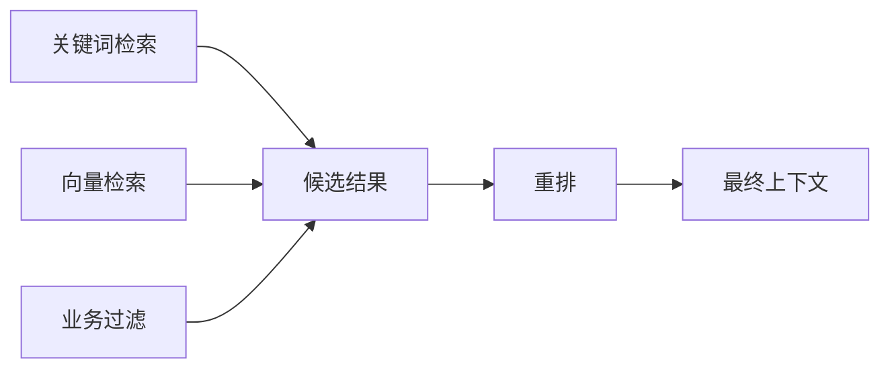

# 什么是RAG检索增强生成

RAG（Retrieval-Augmented Generation，检索增强生成）是一种让大模型“先查资料，再回答”的技术方案。

它不是让模型重新训练，也不是把所有文档一次性塞进提示词，而是在用户提问时，从外部知识库中检索相关资料，再把资料作为上下文交给模型生成答案。

## 一、为什么需要 RAG

大模型很强，但它有三个现实限制：

1. **不知道你的私有数据**：公司制度、项目文档、接口说明、客户资料不会自动进入模型。
2. **知识可能过期**：模型训练完成后，后续发生的变化不会自然更新。
3. **容易幻觉**：缺少依据时，模型可能生成看似合理但不存在的内容。

RAG 的核心价值就是把回答建立在可检索资料之上。

## 二、RAG 的基本流程



简单理解：

```text
问题 → 找资料 → 带着资料问模型 → 输出答案
```

## 三、一个例子

用户问：

```text
公司差旅报销中，高铁一等座能报销吗？
```

没有 RAG 时，模型可能基于通用经验回答，甚至胡编制度。

有 RAG 时，系统会先检索：

- 《差旅报销制度.md》
- 《财务审批规则.pdf》
- 《2026费用报销补充说明.docx》

然后把相关条款交给模型：

```text
请基于以下制度条款回答用户问题。
如果资料没有明确说明，请不要自行推断。
```

最终答案可以包含：

- 结论
- 适用条件
- 原文依据
- 不确定事项
- 后续操作建议

## 四、RAG 系统由哪些模块组成

| 模块 | 作用 | 关键问题 |
| --- | --- | --- |
| 文档采集 | 获取 PDF、网页、Markdown、数据库内容 | 数据是否完整 |
| 文档清洗 | 去掉无效内容，保留正文和结构 | 是否保留标题层级 |
| 文档切片 | 把长文拆成可检索片段 | 切多大合适 |
| Embedding | 把文本转成向量 | 语义是否准确 |
| 向量数据库 | 存储向量和元数据 | 检索是否快 |
| 召回 | 找到可能相关的片段 | 有没有漏掉 |
| 重排 | 从候选片段中选最相关的 | 是否真的相关 |
| 生成 | 基于资料回答 | 是否引用来源 |
| 评估 | 检查答案质量 | 是否可持续优化 |

## 五、RAG 和微调有什么区别

| 对比项 | RAG | 微调 |
| --- | --- | --- |
| 适合问题 | 查资料、问文档、更新频繁的知识 | 学习固定风格、格式、任务习惯 |
| 数据更新 | 更新知识库即可 | 通常需要重新训练 |
| 可追溯性 | 可以引用原文 | 难以说明依据 |
| 成本 | 工程复杂但更新灵活 | 训练成本更高 |
| 典型场景 | 企业知识库、客服、文档问答 | 分类器、风格迁移、专用格式输出 |

经验上：**需要事实依据和持续更新，优先考虑 RAG；需要模型学会特定行为，再考虑微调。**

## 六、RAG 的常见失败原因

### 6.1 文档切片不合理

切片太大，检索结果不精准；切片太小，答案缺少上下文。

建议：

- 技术文档按标题层级切
- FAQ 按问答对切
- 制度文档按条款切
- 长文保留前后重叠片段

### 6.2 只做向量检索

向量检索擅长语义相似，但对编号、产品型号、人名、订单号这类精确匹配不一定稳定。

企业知识库通常需要：



### 6.3 没有权限控制

RAG 不是把所有资料放进一个池子里给所有人查。每个文档片段都应该带上权限、部门、项目、来源等元数据。

### 6.4 没有评估集

没有测试问题，就不知道优化是否真的有效。

建议准备四类问题：

- 高频真实问题
- 容易混淆的问题
- 没有答案的问题
- 权限隔离问题

## 七、适合落地的场景

- 企业制度问答
- 产品文档助手
- 内部研发知识库
- 客服辅助回复
- 合同条款检索
- 代码仓库问答
- 售前方案资料检索

这些场景有一个共同点：**答案必须来自资料，而不是模型自由发挥。**

## 八、延伸阅读

- [LangChain：Build a RAG agent](https://docs.langchain.com/oss/python/langchain/rag)
- [LlamaIndex：Introduction to RAG](https://developers.llamaindex.ai/python/framework/understanding/rag/)
- [OpenAI：File Search](https://developers.openai.com/api/docs/guides/tools-file-search)
- [OpenAI Cookbook：Evaluate RAG with LlamaIndex](https://developers.openai.com/cookbook/examples/evaluation/evaluate_rag_with_llamaindex)

一句话总结：

> RAG 让大模型从“凭记忆回答”变成“带资料回答”。
