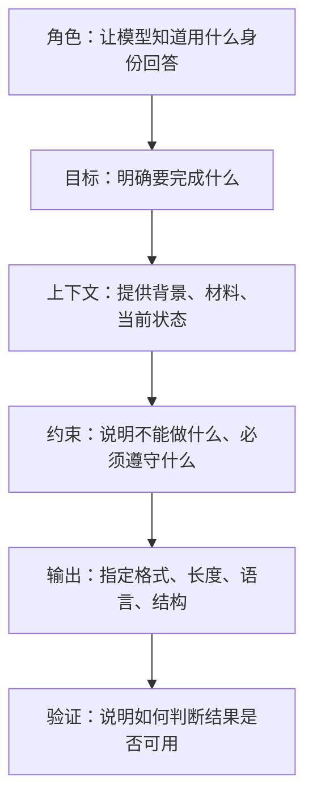

# 什么是提示词工程

提示词工程（Prompt Engineering）不是写“咒语”，也不是把提示词写得越长越好。它的核心是：**用清晰、可验证、可复用的方式，把任务交给模型**。

OpenAI 官方文档把 Prompt Engineering 定义为编写有效指令，让模型更稳定地产生符合要求的结果。由于模型输出具有不确定性，提示词既需要表达艺术，也需要工程化评估。

## 一、为什么提示词决定结果质量

大模型并不知道你的真实意图，它只能根据你提供的文字、图片、文件和工具结果进行推断。

如果你说：

```text
帮我优化一下这段代码
```

模型不知道你想优化什么：

- 性能？
- 可读性？
- 类型安全？
- 代码体积？
- 兼容性？
- 还是业务逻辑？

更好的表达是：

```text
请在不改变外部 API 的前提下，优化这个 Vue 组件的可读性。
要求：
1. 不新增依赖
2. 不修改 props 和 emit 名称
3. 保留现有 CSS class
4. 输出修改后的代码，并说明改动原因
5. 最后列出需要执行的验证命令
```

这不是“更啰嗦”，而是把隐藏条件显式化。

## 二、提示词的基本结构

一个稳定的提示词通常包含六个部分：



对应模板：

```text
你是【角色】。

目标：
【这次要完成的事情】

上下文：
【已有材料、业务背景、代码片段、用户画像】

约束：
1. 【不能做什么】
2. 【必须遵守什么】

输出格式：
【Markdown / JSON / 表格 / 分步骤说明】

验收标准：
【什么样的结果算完成】
```

## 三、不同场景怎么写

### 3.1 写文章

```text
你是技术博客作者。
请面向前端工程师解释 RAG。
要求：
- 先用生活类比解释
- 再给工程流程图
- 最后给一个产品落地案例
- 不要堆术语
- 输出 Markdown，包含二级标题
```

重点：给读者对象、文章结构、表达限制。

### 3.2 写代码

```text
你是资深 TypeScript 工程师。
请根据下面的接口返回结构，生成类型定义和数据转换函数。
约束：
- 不引入第三方库
- 对可选字段做空值保护
- 函数必须是纯函数
- 输出代码后补充 3 个边界测试用例
```

重点：说明技术栈、边界条件、测试要求。

### 3.3 做分析

```text
请分析这份用户反馈。
输出：
1. 高频问题分类
2. 每类问题的代表原文
3. 可能根因
4. 产品优化建议
5. 需要进一步确认的数据
```

重点：让模型不要直接给结论，而是先分层整理。

## 四、提示词常用技巧

### 4.1 给参考材料

如果任务要求准确，最好提供材料，并要求模型只基于材料回答。

```text
请只基于以下资料回答。
如果资料不足，请明确说“当前资料无法确认”，不要自行补充。
```

这对知识库问答、制度查询、合同分析尤其重要。

### 4.2 给输出格式

格式越明确，结果越容易被后续系统消费。

```json
{
  "summary": "一句话总结",
  "risks": ["风险1", "风险2"],
  "nextActions": ["行动1", "行动2"]
}
```

### 4.3 拆分复杂任务

复杂任务不要一次性要求模型“全部完成”，可以拆成：


这样可以减少方向性错误。

### 4.4 要求说明不确定性

```text
如果有不确定的地方，请单独列出“假设与风险”，不要把推测写成事实。
```

这能显著降低“看起来很自信但实际不可靠”的回答。

## 五、常见误区

| 误区 | 问题 | 更好的做法 |
| --- | --- | --- |
| 提示词越长越好 | 信息噪声变多 | 只保留和任务相关的信息 |
| 只给目标不给背景 | 模型会自己猜 | 补充上下文和约束 |
| 只看回答顺不顺 | 可能没有依据 | 要求引用来源或说明验证方式 |
| 一次做完所有事 | 容易跑偏 | 分阶段推进 |
| 完全相信输出 | 可能有幻觉 | 人工复核关键结论 |

## 六、可复用的提示词检查清单

在发送前问自己 6 个问题：

- 我有没有说清楚任务目标？
- 我有没有提供必要背景？
- 我有没有说明不能做什么？
- 我有没有给输出格式？
- 我有没有说明评价标准？
- 我有没有要求模型暴露不确定性？

## 七、延伸阅读

- [OpenAI：Prompt Engineering](https://developers.openai.com/api/docs/guides/prompt-engineering)
- [OpenAI：Prompt Guidance](https://developers.openai.com/api/docs/guides/prompt-guidance)
- [DeepLearning.AI：ChatGPT Prompt Engineering for Developers](https://learn.deeplearning.ai/courses/chatgpt-prompt-eng/information)
- [Prompt Engineering Guide](https://www.promptingguide.ai/)

一句话总结：

> 好提示词不是命令模型“变聪明”，而是把目标、上下文、边界和验收标准讲清楚。
