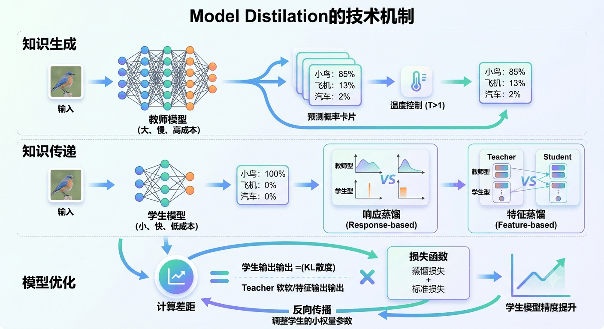

# 搞懂模型蒸馏：大模型是如何手把手“教”小模型的？

随着大语言模型（LLM）的爆发，GPT-4、DeepSeek-R1 等强力模型展现出了惊人的能力。然而，这些庞然大物动辄成百上千亿参数，不仅推理延迟高，显存与算力成本更是一笔巨额开支。

如何在**不牺牲太多精度**的前提下，让模型变得**极小、极快、能直接跑在手机或轻量服务器上**？

答案就是：**模型蒸馏（Model Distillation）**。

## 什么是模型蒸馏？

简单来说，模型蒸馏是一种神经网络压缩技术，**核心思想就是“名师出高徒”**：

* **教师模型（Teacher Model）**：结构复杂、参数量巨大、表现极佳但运行昂贵的大模型。
* **学生模型（Student Model）**：结构精简、参数量小、计算极快的小模型。
* **蒸馏过程**：让教师模型将自己掌握的“隐性知识”与“解题思路”迁移给学生模型，使小模型以极低的资源消耗获得接近大模型的性能。

## 核心机制：计算机到底是怎么“教”的？

模型蒸馏的本质不是让小模型背诵答案，而是**通过数学上的“对齐”，缩小小模型与大模型之间的输出差距**。

下图完整展示了模型蒸馏的工作流程与技术机制：

我们可以把整个“教学”过程分为三个阶段：

### 1. 知识生成：提取“暗黑知识”（Dark Knowledge）

如果直接用数据集训练小模型，小模型只能学会**硬标签（Hard Targets）**。比如识别一张长得有点像狗的猫的图片：

* **硬标签**：`猫: 100%, 狗: 0%, 汽车: 0%`

但教师模型在识别时，输出的是**软标签（Soft Targets）**：

* **软标签**：`猫: 85%, 飞机/狗: 13%, 汽车: 2%`

这个概率分布透露了一个关键信息：**“虽然这是只猫，但它长得有点像狗/飞机，但绝对不像汽车。”** 这种类别间的相似度关系，就是传递给学生模型的“暗黑知识”。

> **温度系数（Temperature, $T$）：**
> 为了让这些隐藏信息更明显，我们会引入温度参数 $T$ 对 Softmax 进行平滑化：
> $$q_i = \frac{\exp(z_i / T)}{\sum_j \exp(z_j / T)}$$
>
>
> $T$ 值越高，输出的概率分布越平缓，传递给小模型的隐性知识就越丰富。

### 2. 知识传递：不同的“教学姿势”

根据想要小模型模仿教师模型的部位不同，主流的蒸馏方式主要有：

1. **响应蒸馏（Response-based）**：小模型直接学习教师模型的**最终输出概率分布（Logits）**。结构最简单，通用性极强。
2. **特征蒸馏（Feature-based）**：不仅看最终答案，还让小模型的中间隐藏层（Hidden Layers）去贴合大模型的特征表达，学会大模型提取特征的“姿势”。
3. **思维链蒸馏（CoT / Reasoning Distillation）**：在生成式 LLM 时代（如 DeepSeek-R1），直接让大模型输出完整的**推理思考过程（Reasoning Traces）**，将这些思维链文本作为训练数据去喂养小模型。

---

### 3. 模型优化：计算差距与反向传播

有了老师的示范和学生的回答，系统会通过联合损失函数来“纠正”小模型：

$$\mathcal{L}_{\text{total}} = \alpha \cdot T^2 \cdot \mathcal{L}_{\text{KL}}(P_{\text{Student}}, P_{\text{Teacher}}) + (1 - \alpha) \cdot \mathcal{L}_{\text{CE}}(y_{\text{Student}}, y_{\text{GroundTruth}})$$

* **蒸馏损失（$\mathcal{L}_{\text{KL}}$）**：计算小模型输出分布与大模型软标签之间的 KL 散度（差距）。
* **标准损失（$\mathcal{L}_{\text{CE}}$）**：计算小模型预测值与真实标签之间的交叉熵，确保基本对错不偏离。

通过这个损失函数进行**反向传播**，不断微调小模型的权重，直到小模型的回答风格和逻辑与大模型高度一致。

## 为什么模型蒸馏是未来的趋势？

| 维度 | 大模型 (Teacher) | 蒸馏后的小模型 (Student) |
| --- | --- | --- |
| **参数量** | 百亿 ~ 千亿级 | 几亿 ~ 几十亿级 |
| **部署成本** | 高昂（需要多卡 A100/H100） | 极低（单卡甚至端侧 CPU/NPU） |
| **推理延迟** | 高（秒级） | 低（毫秒级，适合实时交互） |
| **表现能力** | 100% 满血版 | 保留 85% ~ 95% 的大模型能力 |

在追求 AI 落地与降本增效的今天，**“用大模型做数据标注和能力蒸馏，再将轻量模型部署到线上”** 已经成为绝大多数企业的标准实践。

## 总结

模型蒸馏并非创造了全新的知识，而是**高效地将庞大神经网络中的智慧“浓缩”并“继承”给了轻量模型**。它是连接高高在上的前沿大模型与真实落地应用之间最关键的技术桥梁之一。
