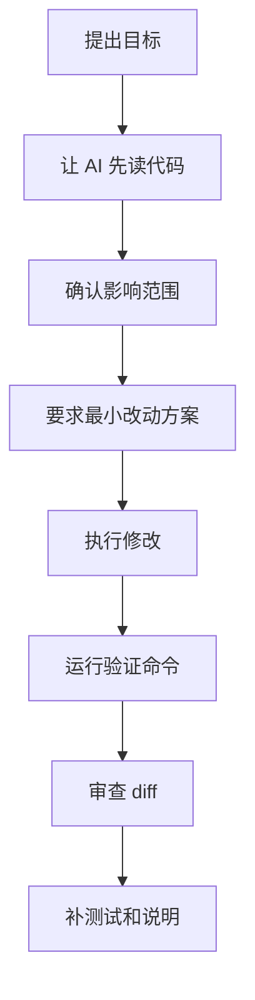

# AI编码助手实战指南

AI 编码助手的价值不在“自动替你写完所有代码”，而在于缩短从问题定位到可验证修改的路径。把它当作结对编程伙伴，而不是无人驾驶程序员，效果会稳定很多。

## 一、AI 编码助手适合做什么

| 场景 | 适合程度 | 原因 |
| --- | --- | --- |
| 阅读陌生模块 | 高 | 可以快速总结结构和调用链 |
| 生成样板代码 | 高 | 重复性强，规则明确 |
| 补单元测试 | 高 | 可以覆盖边界用例 |
| 解释报错 | 高 | 适合搜索和归纳 |
| 小范围重构 | 中 | 需要明确边界 |
| 大规模架构调整 | 低 | 依赖长期上下文和业务判断 |
| 安全关键代码 | 低 | 必须人工审查 |

## 二、推荐工作流



不要一上来就说“帮我改好”。更稳的方式是让 AI 先理解现状。

## 三、读代码模板

```text
请先不要修改代码。
请阅读以下文件/模块，并输出：
1. 模块职责
2. 主要数据流
3. 关键函数和依赖
4. 可能的修改入口
5. 风险点
```

适合场景：

- 接手旧项目
- 不知道 bug 在哪
- 想改功能但不清楚影响范围

## 四、修 bug 模板

```text
目标：修复【具体问题】。

请按下面流程执行：
1. 先说明可能原因
2. 指出需要查看的文件
3. 给出最小修改方案
4. 修改时不要做无关重构
5. 修改后列出验证命令

约束：
- 不新增依赖
- 不改变已有 API
- 不删除用户已有逻辑
```

关键点：把“不要做什么”说清楚。

## 五、补测试模板

```text
请根据当前实现补充测试。
要求覆盖：
1. 正常路径
2. 空值输入
3. 异常返回
4. 边界条件
5. 已修复 bug 的回归用例

请保持现有测试风格，不引入新测试框架。
```

AI 很适合帮你列测试场景，但测试是否真的有价值仍然要人工判断。

## 六、代码生成前的上下文清单

让 AI 写代码前，尽量提供：

- 目标功能
- 当前代码文件
- 相关类型定义
- 接口返回示例
- 不能改的边界
- 项目使用的框架和版本
- 验证命令

示例：

```text
当前项目：Vue 3 + TypeScript + VitePress
目标：新增一个文章列表过滤功能
不能改：现有路由结构和 SearchList 组件 API
需要改：只允许改 docs/column/AIFuture/list.ts
验证：npm run build
```

## 七、如何审查 AI 生成的代码

重点看这些地方：

- 是否引入未安装依赖
- 是否破坏公开 API
- 是否删除原有逻辑
- 是否只处理 happy path
- 是否把临时代码留在仓库里
- 是否缺少错误处理
- 是否缺少测试或验证说明

可以要求 AI 自检：

```text
请对刚才的修改做一次代码评审。
只关注 bug、回归风险、缺失测试和安全问题。
不要给风格化建议。
```

## 八、常见失败方式

### 8.1 目标太大

```text
帮我重构整个项目
```

更好：

```text
请只重构 UserCard 组件内部的数据格式化逻辑，不改变 props、emit 和样式类名。
```

### 8.2 没有验收标准

```text
帮我优化性能
```

更好：

```text
目标：列表滚动时减少重复渲染。
验收：输入框输入时，未变化的列表项不重新渲染。
```

### 8.3 只看答案不跑验证

AI 生成的代码看起来合理，不代表能通过构建。至少跑：

```bash
npm run build
```

如果项目有测试，也要跑对应测试。

## 九、延伸阅读

- [GitHub Copilot Docs](https://docs.github.com/en/copilot)
- [GitHub Copilot Code Review](https://docs.github.com/en/copilot/how-tos/use-copilot-agents/request-a-code-review/use-code-review)
- [Anthropic：Claude Code Overview](https://docs.anthropic.com/en/docs/claude-code/overview)
- [OpenAI：Codex](https://developers.openai.com/codex/)

一句话总结：

> AI 编码助手最适合放大工程师的判断力，而不是替代工程师的判断力。
