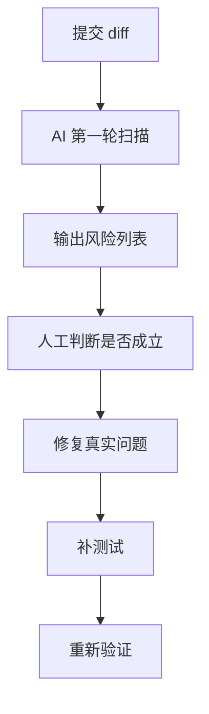
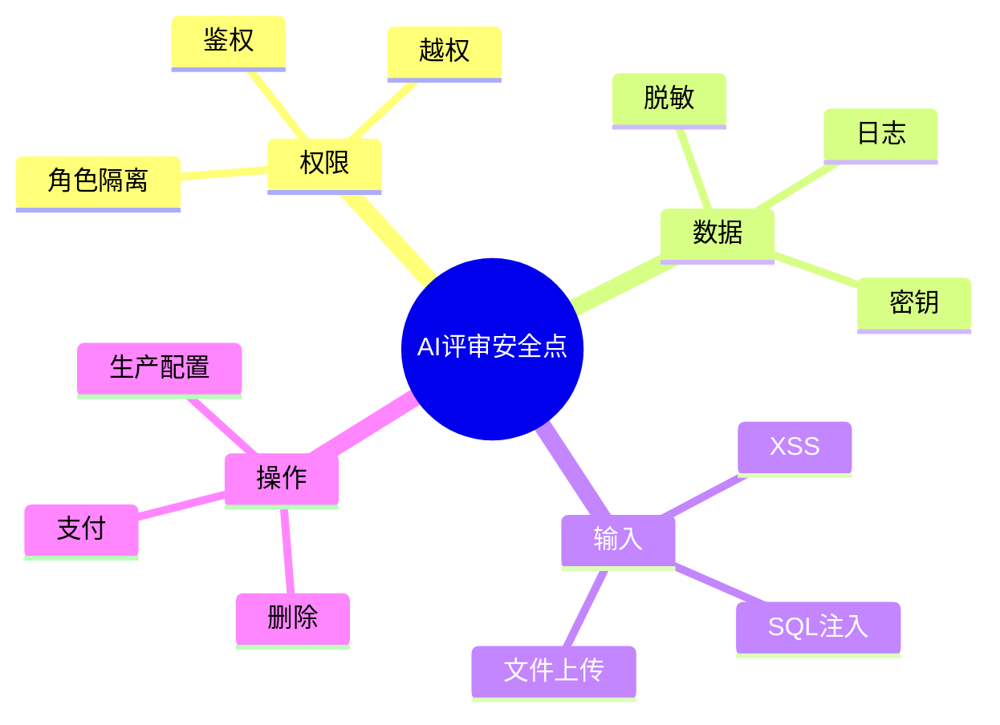

# AI辅助代码评审清单

AI 很适合做代码评审的“初筛器”，但不能替代最终责任人。正确做法是：**让 AI 扩大检查面，让工程师判断问题是否成立**。

## 一、AI 适合评审什么

| 检查项 | AI 是否适合 | 说明 |
| --- | --- | --- |
| 空值和边界条件 | 适合 | 模式明显，容易扫描 |
| 异步竞态 | 适合 | 能发现常见顺序问题 |
| 类型不一致 | 适合 | 结合 TypeScript 更有效 |
| 测试遗漏 | 适合 | 能从 diff 推断用例 |
| 安全和权限 | 部分适合 | 能提示风险，但要人工确认 |
| 业务策略 | 不适合单独判断 | 需要领域知识 |
| 架构取舍 | 不适合单独判断 | 需要长期上下文 |

## 二、评审流程图



重点：AI 输出的是“候选风险”，不是最终结论。

## 三、通用评审提示词

```text
你是严格的代码评审者。
请只关注以下问题：
1. 明确 bug
2. 回归风险
3. 缺失测试
4. 权限或安全问题
5. 性能问题

不要输出主观风格建议。
每个问题请说明：
- 问题位置
- 为什么是问题
- 可能影响
- 建议修复方式
- 是否需要补测试
```

## 四、前端代码重点检查

### 4.1 状态管理

- loading、error、empty 状态是否完整
- 异步请求返回顺序是否可能错乱
- 组件卸载后是否还更新状态
- 表单重置是否遗漏字段
- 多次点击是否会重复提交

### 4.2 组件接口

- props 是否向后兼容
- emit 名称是否改变
- slot 是否破坏
- 默认值是否合理
- 受控/非受控状态是否混用

### 4.3 用户体验

- 错误是否有提示
- 操作是否可撤销
- 长列表是否卡顿
- 移动端是否溢出
- 空数据是否有处理

## 五、后端/API 重点检查

- 入参是否校验
- 鉴权是否完整
- 是否存在越权查询
- 是否暴露敏感字段
- 幂等性是否处理
- 外部接口失败是否有兜底
- 数据库事务是否完整

## 六、安全风险检查



AI 发现安全问题后，不要直接照改，先确认业务场景和真实权限模型。

## 七、测试缺口清单

让 AI 检查测试时，重点问：

```text
请基于这次 diff 判断缺少哪些测试。
按优先级输出：
P0：没有会导致严重回归
P1：核心路径应该补
P2：边界场景建议补
```

常见需要补测试的情况：

- 修了 bug 但没有回归用例
- 新增分支没有覆盖
- 错误状态没有覆盖
- 权限分支没有覆盖
- 异步失败没有覆盖

## 八、评审输出模板

```md
## 发现的问题

### P1：标题
- 位置：
- 原因：
- 影响：
- 修复建议：
- 测试建议：

## 没发现问题但仍需人工确认
- 业务规则是否符合预期
- 权限模型是否完整
```

## 九、延伸阅读

- [GitHub Copilot：Code Review](https://docs.github.com/en/copilot/how-tos/use-copilot-agents/request-a-code-review/use-code-review)
- [OWASP Top 10](https://owasp.org/www-project-top-ten/)
- [Google Engineering Practices：Code Review](https://google.github.io/eng-practices/review/)

一句话总结：

> 让 AI 找风险，让人判断风险是否成立。
