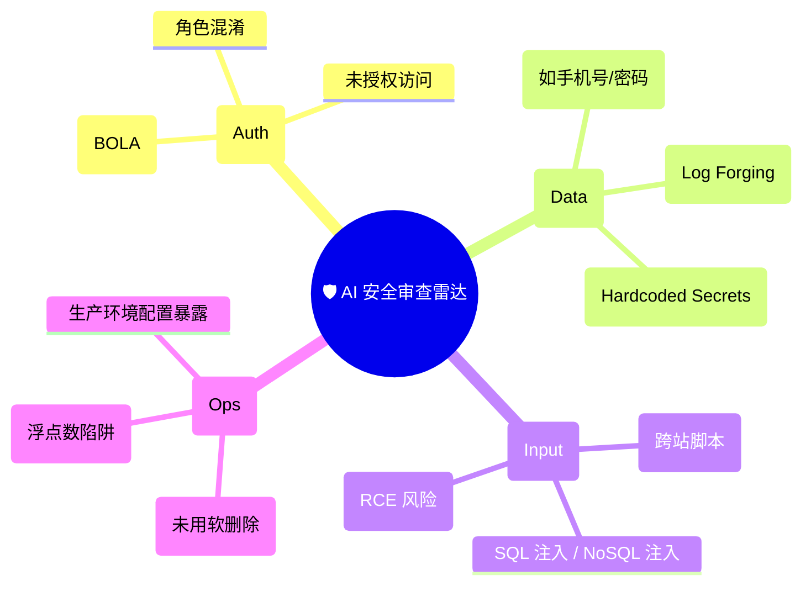

# AI 辅助代码评审 (Code Review) 实战清单：打造智能初筛防线

在现代软件工程中，代码评审（Code Review, CR）是保障代码质量的最后一道防线，但也往往是研发流程中最耗时的瓶颈。引入 AI 辅助代码评审，其核心定位是 **“不知疲倦的初筛扫描仪”**，而非最终的决策者。

> 💡 **核心认知：**
> **让 AI 扩大检查面（广度与细节），让工程师判断风险是否成立（深度与业务）。** AI 负责找出“潜在的坏味道”，人类负责拍板“是否需要修改”。

## 一、能力矩阵：AI 在 CR 中的适用边界

不要期望 AI 能理解复杂的商业逻辑或长期的架构演进规划。将其能力用在刀刃上：

| 审查维度 | AI 胜任度 | 核心表现与局限性 |
| :--- | :---: | :--- |
| **空指针与边界溢出 (Edge Cases)** | 🟢 **极高** | 擅长通过静态分析推断 `null/undefined` 风险、数组越界及死循环。 |
| **异步竞态与并发问题 (Race Conditions)** | 🟢 **极高** | 能敏锐捕捉 Promise 遗漏 `await`、锁未释放、状态更新时序错乱等隐蔽 Bug。 |
| **类型一致性 (Type Safety)** | 🟢 **极高** | 结合 TypeScript/Rust 等强类型语言的 AST，能精准发现隐式转换或泛型擦除问题。 |
| **测试用例遗漏 (Test Gaps)** | 🟢 **极高** | 极其擅长根据业务代码的 Diff，反推并罗列未被覆盖的测试分支。 |
| **基础安全漏洞 (Security Flaws)** | 🟡 **中等** | 能扫出明显的 SQL 注入、XSS 或硬编码密钥，但对复杂的“越权访问”逻辑无能为力，需人工复核。 |
| **业务策略与领域模型 (Domain Logic)** | 🔴 **极低** | 无法判断代码是否真正符合产品需求（例如：“打折逻辑是否与双十一活动冲突”）。 |
| **全局架构取舍 (Architecture)** | 🔴 **极低** | 缺乏全局上下文，无法判断引入某个第三方库是否违背了团队的技术栈演进方向。 |

## 二、工业级人机协同评审流 (Workflow)

```mermaid
flowchart TD
  A["💻 开发者提交 PR / Diff"] --> B["🤖 AI 静态初筛扫描"]
  B --> C["📋 AI 输出结构化风险清单"]
  C --> D{"🕵️ 人类 Reviewer 仲裁"}
  D -->|误报 (False Positive)| E["忽略该建议"]
  D -->|确认为 Bug / 隐患| F["驳回修改或补充代码"]
  F --> G["🧪 补充防回归测试"]
  G --> H["✅ 重新验证并合并"]

  style B fill:#e1f5fe,stroke:#0288d1
  style C fill:#e1f5fe,stroke:#0288d1
  style D fill:#fff3e0,stroke:#f57c00
```

## 三、黄金 CR 提示词 (Prompt) 模板

让 AI 做 Code Review 时，最怕它在“代码格式”和“主观风格”上长篇大论。必须用严格的 Prompt 约束它的行为：

```text
【角色设定】：你是一位严苛的资深架构师，正在进行代码评审 (Code Review)。
【审查目标】：请审视以下 Diff 代码，严格忽略所有关于代码风格（如缩进、变量命名规范）的讨论。

请仅从以下 5 个高优维度进行排查：
1. 明显的运行时 Bug（如空指针、死循环、未捕获异常）。
2. 历史逻辑的回归风险（是否破坏了现有的 API 契约）。
3. 异步并发与竞态条件风险。
4. 安全漏洞（如 XSS、注入、越权隐患、敏感信息硬编码）。
5. 缺失的关键边界测试用例。

【输出格式】：
针对发现的每一个问题，请严格按照以下结构输出：
- 📍 **位置**：[具体的文件名与行数]
- 💣 **风险**：[为什么这是一个问题，可能导致什么后果]
- 🛠️ **建议**：[具体的修复代码段]
```

## 四、领域深度核对表 (Checklists)

不同端侧的代码，AI 关注的侧重点应当有所不同。你可以将以下清单作为 Context 喂给 AI。

### 4.1 前端交互与状态层 (Front-end)

- [ ] **状态机完整性**：异步请求的 `loading`、`error`、`empty`、`success` 四态是否全部闭环处理？
- [ ] **竞态拦截**：多次极速点击同一个提交按钮，是否会导致重复请求？
- [ ] **内存泄漏**：组件卸载 (Unmount) 时，定时器、事件监听器 (Event Listeners) 是否已清理？
- [ ] **防御性渲染**：深层级对象访问（如 `user.profile.avatar`）是否加了可选链 `?.`？长列表是否会导致主线程卡顿？
- [ ] **组件契约**：修改 `Props` 或 `Emits` 是否向后兼容？是否会导致消费该组件的其他页面崩溃？

### 4.2 后端逻辑与 API 层 (Back-end)

- [ ] **防御性入参**：所有来自外部的请求参数，是否经过了严格的 Schema 校验？
- [ ] **水平/垂直越权**：查询或修改数据时，是否带入了当前登录用户的身份标识（如 `where user_id = ?`）？
- [ ] **接口幂等性**：支付、创建订单等核心写接口，重试时是否会产生脏数据？
- [ ] **数据库事务**：涉及多张表更新的逻辑，事务边界是否清晰？发生异常时是否正确 `rollback`？
- [ ] **外部依赖兜底**：调用第三方 API 超时或报错时，是否有重试机制或优雅降级（Fallback）方案？

## 五、安全风险雷达 (Security Mindmap)

在安全领域，AI 的定位是“报警器”，听到警报后，人类必须亲自排爆。



## 六、反推测试缺口 (Test Gap Analysis)

不要自己想测试用例，让 AI 看着 Diff 反推你漏掉了什么：

```text
【指令】：请基于本次提交的 Diff，评估现有单元测试的覆盖缺口。
请按以下优先级列出必须补充的测试用例：
- P0 (阻断级)：若不覆盖将导致严重回归的场景。
- P1 (核心级)：新增逻辑的主流程 Happy Path。
- P2 (边界级)：极端输入、异步超时或错误抛出分支。
```

## 七、延伸阅读

- [Google 官方工程实践指南：Code Review](https://google.github.io/eng-practices/review/)
- [GitHub Copilot 辅助 Code Review 实践](https://docs.github.com/en/copilot/how-tos/use-copilot-agents/request-a-code-review/use-code-review)
- [OWASP Top 10 安全漏洞清单](https://owasp.org/www-project-top-ten/)

> **一句话总结：**
> 不要问 AI “这段代码好不好”，而是命令 AI “找出这段代码在并发、边界和安全上的漏洞”。
