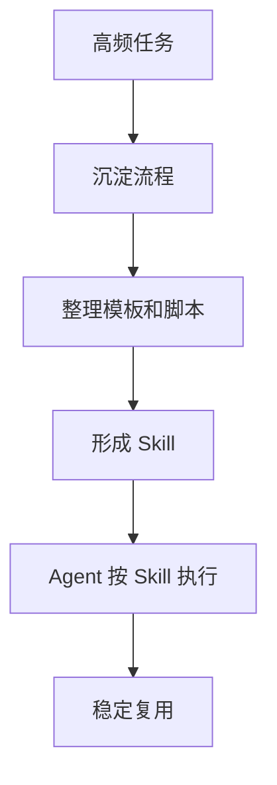
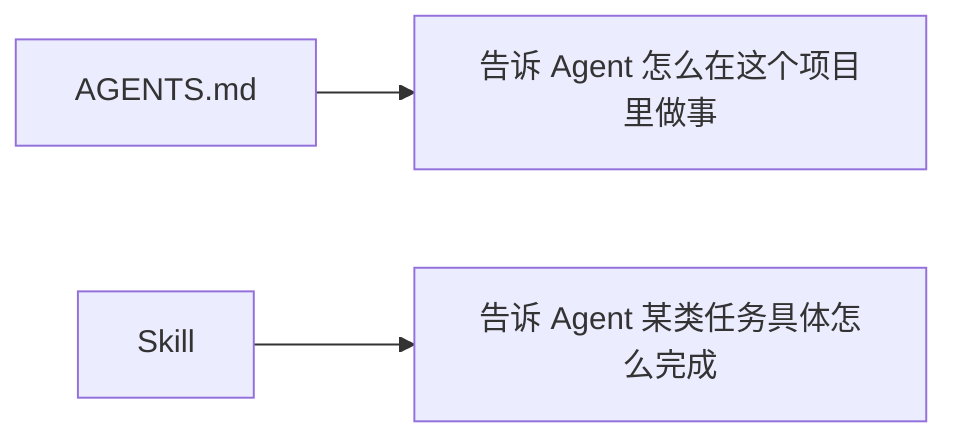

# Agent Skills

Agent Skills 可以理解为给 AI Agent 准备的“可复用能力包”。它把某类任务需要的说明、流程、脚本、模板、示例文件放在一起，让 Agent 遇到对应任务时按固定方法执行。

简单说：

> Prompt 是一次性说明，Skill 是可复用的工作方法。

## 一、为什么需要 Skills

只靠一次性提示词，很难保证每次执行都稳定。

比如你经常让 AI 做这些事：

- 按固定格式整理会议纪要
- 按团队规范生成代码评审意见
- 把 Excel 数据转换成图表和结论
- 把产品需求拆成任务清单
- 按公司模板生成周报
- 根据项目规范改代码、跑测试、写说明

如果每次都重新解释一遍，成本很高，也容易漏信息。Skill 的价值就是把这些流程固化下来。



## 二、Skill 里通常有什么

一个实用 Skill 通常包含这些内容：

| 内容 | 作用 | 示例 |
| --- | --- | --- |
| 触发条件 | 说明什么时候使用 | “用户要求生成周报时使用” |
| 工作流程 | 固定执行步骤 | “先读取数据，再聚合，再输出表格” |
| 输入要求 | 用户需要提供什么 | 日期范围、数据文件、目标格式 |
| 输出格式 | 最终结果长什么样 | Markdown、JSON、表格 |
| 约束规则 | 哪些事不能做 | 不编造数据、不发送外部消息 |
| 脚本工具 | 复用自动化能力 | 表格解析脚本、图片处理脚本 |
| 示例文件 | 让 Agent 模仿 | 模板、样例、参考输出 |

## 三、Skill 和 AGENTS.md 的区别

| 对比项 | AGENTS.md | Skill |
| --- | --- | --- |
| 作用范围 | 项目或仓库级规则 | 某类任务的能力模块 |
| 关注点 | 约束 Agent 行为 | 指导 Agent 完成任务 |
| 生命周期 | 长期生效 | 需要时触发 |
| 内容形式 | 规则、规范、流程 | 说明、脚本、模板、资产 |

可以这样理解：



两者可以配合使用：AGENTS.md 负责全局边界，Skill 负责具体能力。

## 四、一个 Skill 的设计示例

假设你想让 AI 帮你稳定生成技术文章，可以设计一个“技术博客写作 Skill”。

```text
触发条件：
- 用户要求写技术博客、教程、学习笔记时使用

工作流程：
1. 明确读者对象
2. 提炼核心概念
3. 给出流程图或结构图
4. 提供实际案例
5. 补充常见坑
6. 给出延伸阅读链接

输出格式：
- 标题
- 概念解释
- 图解
- 实战步骤
- 常见问题
- 总结

约束：
- 不编造链接
- 不使用无法验证的数据
- 不堆砌术语
```

这样下次写文章时，就不需要重复说明写作标准。

## 五、适合做成 Skill 的任务

### 5.1 高频且格式固定

例如周报、日报、复盘、会议纪要。

### 5.2 需要多步处理

例如“读取表格 → 清洗数据 → 统计 → 生成图表 → 写结论”。

### 5.3 需要团队规范

例如代码评审、组件开发、接口文档生成。

### 5.4 需要复用资产

例如固定模板、示例文件、校验脚本、品牌素材。

## 六、不适合做成 Skill 的任务

- 一次性问题
- 目标不稳定的探索任务
- 高风险决策任务
- 需要大量人工判断的任务

Skill 不是越多越好。如果任务没有稳定流程，硬做成 Skill 反而会限制 Agent。

## 七、设计 Skill 的五个原则

1. **触发条件清晰**：避免 Agent 误用。
2. **步骤尽量短**：复杂 Skill 拆成多个小 Skill。
3. **输出格式固定**：方便后续复用和自动化。
4. **示例优先**：示例比抽象描述更容易被模型执行。
5. **风险前置**：涉及文件删除、外部发送、生产变更时必须确认。

## 八、延伸阅读

- [Anthropic：Claude Skills](https://docs.anthropic.com/en/docs/claude-code/skills)
- [Anthropic：Create and use skills](https://support.anthropic.com/en/articles/12078970-how-to-create-and-use-skills)
- [Anthropic：Skill creator tool](https://docs.claude.com/en/docs/agents-and-tools/claude-code/tutorials/how-to-use-the-skill-creator-tool)
- [Model Context Protocol](https://modelcontextprotocol.io/)

一句话总结：

> Skill 是把个人经验和团队方法沉淀成 AI 可复用能力的方式。
