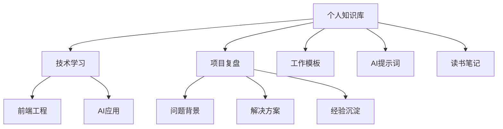
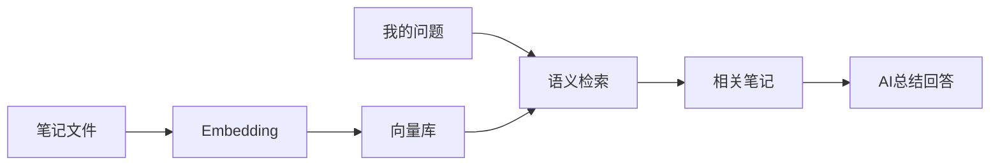

# 用AI搭建个人知识库

个人知识库的目标不是“收藏更多资料”，而是让资料能被快速找回、理解和复用。AI 可以帮助我们把零散内容变成可检索、可总结、可追问的知识系统。

## 一、什么内容值得进入知识库

适合放入：

- 技术文章和官方文档
- 项目复盘和踩坑记录
- 会议纪要和需求讨论
- 常用提示词和工作模板
- 读书笔记、课程笔记
- 个人项目设计思路
- 常见问题排查记录

不建议放入：

- 账号密码
- API Key
- 身份证、手机号等隐私信息
- 未脱敏的客户数据
- 公司明确禁止外传的资料

## 二、知识库的基本结构

推荐按“主题 + 类型 + 时间”组织：



每篇笔记建议包含：

```md
# 标题

## 来源
- 链接：
- 时间：
- 作者：

## 一句话总结

## 核心内容

## 我的理解

## 可复用场景

## 相关链接
```

## 三、AI 可以帮你做什么

### 3.1 摘要

把长文整理成：

- 一句话结论
- 关键概念
- 可执行建议
- 适合收藏的原文片段

提示词：

```text
请把下面这篇文章整理成个人知识库笔记。
要求：
1. 先给一句话总结
2. 提炼 5 个核心要点
3. 标出适合实践的建议
4. 说明适用场景
5. 不要丢失原文链接
```

### 3.2 打标签

让 AI 自动生成标签：

```text
请为这篇笔记生成 3 到 6 个标签。
标签要用于后续检索，避免太宽泛。
```

示例：

- `RAG`
- `前端性能`
- `代码评审`
- `项目复盘`
- `提示词工程`

### 3.3 生成问答

把笔记转成可复习的问题：

```text
请根据这篇笔记生成 10 个复习问题，并给出简洁答案。
问题要覆盖概念、流程、常见坑和实践建议。
```

### 3.4 语义检索

当笔记积累多了以后，可以用 RAG 或本地知识库工具做语义检索。



## 四、推荐工作流

1. 看到资料时先保存原文链接
2. 用 AI 生成初版摘要
3. 自己补充判断和使用场景
4. 用统一模板归档
5. 定期把零散笔记合并成专题
6. 对高价值专题建立问答索引

## 五、质量标准

一篇知识库笔记是否有价值，看三个问题：

- 三个月后还能看懂吗？
- 能快速定位原始出处吗？
- 能指导下一次实践吗？

如果不能，说明它只是摘录，不是知识沉淀。

## 六、工具选择建议

| 类型 | 适合人群 | 示例 |
| --- | --- | --- |
| Markdown 文件夹 | 喜欢本地管理、可 Git 同步 | Obsidian、VS Code |
| 在线文档 | 团队协作 | Notion、飞书文档 |
| RAG 知识库 | 文档多、需要语义检索 | Dify、AnythingLLM、LlamaIndex |
| 代码仓库文档 | 技术博客和项目文档 | VitePress、Docusaurus |

工具不是核心，稳定的整理习惯才是核心。

## 七、延伸阅读

- [Obsidian](https://obsidian.md/)
- [LlamaIndex：RAG](https://developers.llamaindex.ai/python/framework/understanding/rag/)
- [OpenAI：File Search](https://developers.openai.com/api/docs/guides/tools-file-search)
- [Dify Docs](https://docs.dify.ai/)

一句话总结：

> 个人知识库不是资料仓库，而是个人经验的检索系统。
