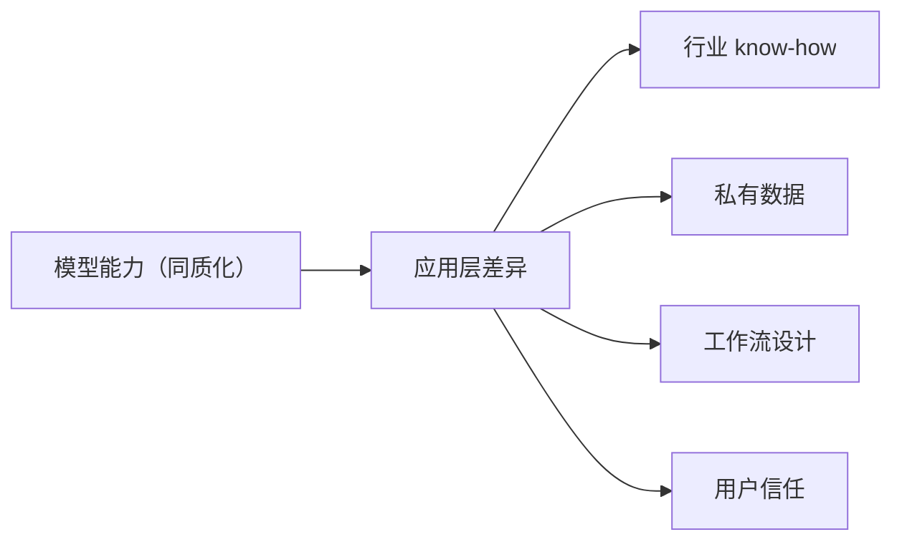
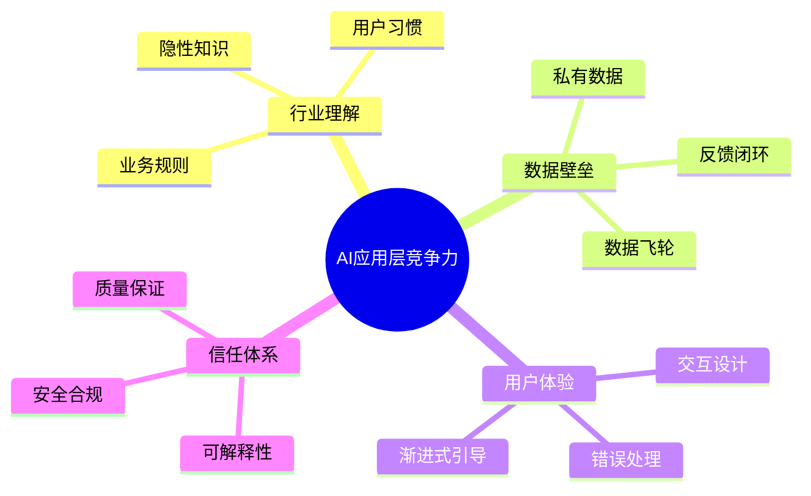

# 从卷模型到卷产品：AI应用层的机会在哪

去年所有人都在追 SOTA。谁的模型跑分高一点，朋友圈能刷屏三天。

今年风向明显变了。

各家基础模型的差距在快速缩小。GPT-4 级别的能力正在变成标配而非卖点。于是战场悄悄从"谁的模型更强"转移到了"谁能用模型做出好产品"。

这不是我猜的，你看看周围：去年融资最多的是模型公司，今年在闷声赚钱的是把 AI 嵌入到具体业务场景里的团队。

## 模型在贬值，场景在升值

一个很直观的信号：API 调用价格一直在降。GPT-4 刚出来的时候贵得离谱，现在同类能力的价格可能只有当时的十分之一。

这意味着什么？

**靠模型能力本身做差异化的窗口在快速关闭。** 你能调的模型，别人也能调。你能用的 RAG、Agent、MCP，别人也能用。

那什么东西别人抄不走？

- 你对某个行业的理解深度
- 你自己的数据积累
- 你跟用户建立的信任关系
- 你把 AI 嵌入到具体工作流的方式

## 哪些方向有真实需求？

说几个我实际看到有人在闷声干、而且用户愿意付费的方向：

### 垂直行业的 AI 助手

不是泛泛的"AI 客服"，而是真正懂一个行业的：

- 律师事务所的合同审查助手（不是通用 PDF 问答，是懂法条、懂判例、懂客户行业）
- 诊所的病历整理和辅助诊断（不是替代医生，是帮医生省打字和翻资料的时间）
- 外贸公司的邮件和单据处理（懂报关流程、懂各国合规要求）

这些场景的共同点是：**门外汉看起来很简单，但真正做起来全是行业细节。** 而细节就是护城河。

### 企业内部工作流自动化

不是 RPA，是 AI + 流程。

比如一个采购流程：
1. 员工提交采购申请
2. AI 自动查历史价格、供应商资质、预算余额
3. 低于 5000 且合规 → 自动审批
4. 否则 → 推给对应审批人，附上 AI 整理的所有信息

这类产品的价值不在于 AI 多聪明，在于**把原来需要翻五个系统、打三个电话的事，变成一次对话能解决的体验。**

### 开发者的 AI 原生工具

码农的钱最好赚，前提是你真的解决了痛点：

- 不是"AI 帮你写代码"（这个太卷了），而是"AI 帮你理解为什么当年那个同事写了这行代码"
- 不是"AI 生成文档"，而是"代码改了文档自动更新，不需要任何人提醒"
- 不是"AI 做 Code Review"，而是"AI 帮你找出这次改动对哪些下游系统有影响"

做工具不难，难的是做到**少一个步骤都不行**的体验。

## 做 AI 产品最容易犯的三个错

### 1. 把 AI 当卖点

"我们是 AI 驱动的 XX 平台"——用户根本不在乎你是不是 AI 驱动，只在乎你解没解决他的问题。

好的 AI 产品是 **"用了 AI 但用户感觉不到 AI"**。比如 Notion 的 AI，你不会说"我要用 AI 写文档"，你只是在写文档的过程中顺手用了。

### 2. 堆功能，不解决真问题

做了个"AI 合同助手"，功能列了一长串：智能起草、风险识别、条款对比、法律检索、自动归档...

但用户打开后，第一件事还是手动复制粘贴合同内容进去。入口体验就断了。

**先做好一个场景到极致，再扩展。** 贪多嚼不烂在 AI 产品上尤其适用。

### 3. 忽视 AI 的不可靠性

模型的回答有时候会瞎编，这是客观事实，不是"再优化优化就能解决"的。

好的产品设计不是祈祷模型不出错，而是**设计了模型出错时的兜底方案**：
- 给用户展示信息来源
- 不确定的时候主动标注"建议人工核实"
- 关键操作必须确认

## 应用层真正在卷什么？

这些没有一个跟模型能力直接相关。这才是应用层的机会所在。

## 给想做 AI 产品的人几句实在话

1. **别盯着模型跑分找灵感**。跑分高不代表场景成立。反过来想：哪些事之前因为太贵/太慢/太麻烦做不了，现在 AI 让它变得可行了？

2. **先在一个小场景做到 80 分再扩展**。别一上来就想做平台。把一个场景做透了，用户会帮你找到下一个场景。

3. **数据的价值会在未来两年集中兑现**。你有别人没有的数据，比你有别人没有的模型重要得多。

4. **别怕大厂**。大厂做平台，你做垂直。大厂追求通用，你可以追求"就这一个行业、就这一种用户、就这一个场景"的极致体验。

> 模型能力在趋同，但好产品和烂产品之间的距离，从来不是模型拉开的。

---

*延伸阅读*

- [a16z：The State of AI in 2025](https://a16z.com/the-state-of-ai-2025/)
- [Sequoia：Generative AI's Act o1](https://www.sequoiacap.com/article/generative-ai-act-o1/)
