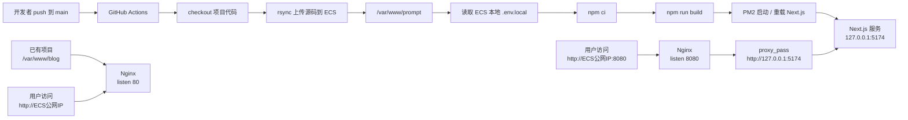

# Next项目自动部署到ECS-初始版

**从 0 到 1：把一个 Next.js 项目部署到 ECS，并用 GitHub Actions 自动发布**

最近我把自己的一个项目 **Prompt Gallery** 部署到了阿里云 ECS 上。这个项目是一个基于 Next.js 的 Prompt 案例库，支持案例浏览、分类筛选、收藏、投稿、后台审核、主题切换等功能。

这篇文章记录完整部署过程，包括为什么不能直接访问 `/var/www/prompt`、为什么需要 Nginx、为什么 `.env.local` 要放在 ECS、GitHub Actions 如何部署，以及过程中遇到的坑。

## 一、项目背景

项目是一个 Next.js 应用，不是传统静态站点。

本地启动方式类似：

```bash
npm run dev
```

生产启动方式是：

```bash
npm run build
npm run start
```

项目里的 `start` 脚本是：

```json
"start": "next start -H 127.0.0.1 -p 5174"
```

也就是说，生产环境里 Next.js 会运行在：

```text
127.0.0.1:5174
```

这里的 `127.0.0.1` 指的是“当前机器自己”。在 ECS 上运行时，它指的就是 ECS 自己，而不是本地电脑。

## 二、最终部署结构



当前 ECS 上已经有一个老项目：

```text
/var/www/blog
```

它占用了 80 端口，所以不能直接改掉原来的 Nginx 配置。

因此我给 Next.js 项目单独用了一个端口：

```text
http://ECS公网IP:8080
```

## 三、为什么不能直接访问 /var/www/prompt

很多新手容易误解：

```text
/var/www/prompt
```

这是服务器上的文件路径，不是浏览器 URL。

不能这样访问：

```text
http://ECS公网IP/var/www/prompt
```

Next.js 也不是简单的 `index.html` 静态目录，不能只靠：

```nginx
root /var/www/prompt;
```

正确方式是：

```text
Nginx 接收外部请求
再反向代理给 Next.js 服务
```

## 四、ECS 上需要准备什么

安装基础环境：

```bash
yum install -y git nginx curl rsync
curl -fsSL https://rpm.nodesource.com/setup_22.x | bash -
yum install -y nodejs
npm install -g pm2
```

创建部署目录：

```bash
mkdir -p /var/www/prompt
```

然后把生产环境变量放进去：

```bash
vim /var/www/prompt/.env.local
chmod 600 /var/www/prompt/.env.local
```

示例：

```txt
NEXT_PUBLIC_SUPABASE_URL=
NEXT_PUBLIC_SUPABASE_ANON_KEY=

SUPABASE_URL=
SUPABASE_SERVICE_ROLE_KEY=

ALIYUN_OSS_REGION=
ALIYUN_OSS_BUCKET=
ALIYUN_OSS_ACCESS_KEY_ID=
ALIYUN_OSS_ACCESS_KEY_SECRET=
ALIYUN_OSS_PUBLIC_BASE_URL=

ENABLE_HTTPS_HEADERS=false
```

这里特别注意：

```txt
ENABLE_HTTPS_HEADERS=false
```

因为当前是通过：

```text
http://ECS公网IP:8080
```

访问，还没有配置 HTTPS。如果提前开启 HTTPS 安全头，浏览器会把静态资源自动升级成 `https://...`，导致：

```text
ERR_SSL_PROTOCOL_ERROR
```

## 五、Nginx 配置

原来的 blog 项目不要动。只需要在 `http {}` 里面新增一个 server：

```nginx
server {
    listen 8080 default_server;
    server_name _;

    location / {
        proxy_pass http://127.0.0.1:5174;
        proxy_http_version 1.1;

        proxy_set_header Host $host;
        proxy_set_header X-Real-IP $remote_addr;
        proxy_set_header X-Forwarded-For $proxy_add_x_forwarded_for;
        proxy_set_header X-Forwarded-Proto http;

        proxy_set_header Upgrade $http_upgrade;
        proxy_set_header Connection "upgrade";

        proxy_read_timeout 300;
        proxy_connect_timeout 300;
        proxy_send_timeout 300;
    }
}
```

检查配置：

```bash
nginx -t
systemctl reload nginx
```

还需要在 ECS 安全组放行：

```text
8080
```

## 六、GitHub Actions 为什么不用 git clone

一开始我让 ECS 自己执行：

```bash
git clone https://github.com/xxx.git
```

结果失败了：

```text
fatal: unable to access ... Empty reply from server
```

原因是 ECS 访问 GitHub 不稳定。

所以改成更稳的方式：

```text
GitHub Actions 自己 checkout 代码
然后用 rsync 上传到 ECS
```

这样 ECS 不需要访问 GitHub。

## 七、GitHub Actions 配置

GitHub Secrets：

```text
ECS_HOST
ECS_USER
ECS_PORT
ECS_SSH_KEY
```

GitHub Variables：

```text
ECS_PATH=/var/www/prompt
```

部署流程是：

```text
checkout 代码
配置 SSH
确认 ECS 上存在 .env.local
rsync 上传源码
在 ECS 上 npm ci
npm run build
PM2 启动或重载
```

关键点是 rsync 排除了这些文件：

```text
.env
.env.local
.next
node_modules
```

所以 ECS 本地的 `.env.local` 不会被覆盖。

## 八、PM2 的作用

Next.js 启动后需要常驻运行。

使用 PM2：

```bash
pm2 start npm --name prompt-gallery -- run start
pm2 save
```

首次建议配置开机自启：

```bash
pm2 startup
```

以后每次部署时只需要：

```bash
pm2 reload prompt-gallery --update-env
```

## 九、当前方案的优缺点

### 优点

1. 不影响已有 blog 项目。
2. 不需要 ECS 访问 GitHub。
3. `.env.local` 不进入仓库，密钥更安全。
4. 部署流程清晰，适合新手排查。
5. GitHub push 后可以自动发布。
6. Nginx 统一管理外部入口，Next.js 服务不直接暴露公网。

### 缺点

1. 需要在 ECS 上安装 Node.js、npm、PM2、rsync。
2. 每次部署都在 ECS 上执行 `npm ci` 和 `npm run build`，ECS 配置太低时构建会慢。
3. 当前用 IP + 8080 访问，不如正式域名体验好。
4. HTTPS 还没接入，需要等域名和证书。
5. ECS 项目目录里会有 `node_modules`，这是正常的，但占用磁盘空间。

## 十、更好的后续方案

后续可以继续优化。

第一步，申请域名并配置 HTTPS：

```text
https://你的域名
  -> Nginx 443
  -> 127.0.0.1:5174
```

然后把：

```txt
ENABLE_HTTPS_HEADERS=true
```

重新构建部署。

第二步，可以考虑 Docker：

```text
GitHub Actions 构建 Docker 镜像
推送到镜像仓库
ECS 拉取镜像并重启容器
```

这样环境更稳定。

第三步，可以使用 Next.js standalone 输出，减少服务器上的依赖体积。

第四步，如果访问量变大，可以使用：

```text
CDN + HTTPS + ECS + PM2/Docker + 日志监控
```

## 十一、总结

这次部署最终采用的是：

```text
GitHub Actions + rsync + ECS + PM2 + Nginx
```

对当前项目来说，这是一个比较稳妥的中间方案。

它没有 Docker 那么复杂，也比手动登录 ECS 部署更可靠。
对于个人项目、小型产品、内部工具来说，这套方案足够清晰，也方便后续继续演进。
