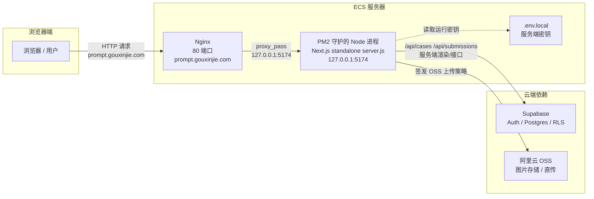

#  Next.js项目通过 GitHub Action 自动部署到 ECS 上- prompt案例

> 本文档是 Prompt Gallery 部署到 ECS 的说明。
> 当前方案采用 **GitHub Actions 构建产物，ECS 只运行服务** 的方式，避免在 ECS 上保存完整源码和执行项目构建。

## 一、方案概览

### 为什么不在 ECS 上构建

最初的做法是"源码上传到 ECS 再构建"：

```text
GitHub Actions -> SSH 到 ECS -> git clone / rsync 源码 -> ECS 执行 npm install -> ECS 执行 npm run build -> PM2 启动 -> Nginx 反代
```

这个方案能跑通，但有明显问题：

- ECS 需要能稳定访问 GitHub 和 npm registry，网络不稳定时容易失败。
- ECS 上会保留完整源码，暴露面大。
- 每次部署都在 ECS 上构建，占用服务器 CPU 和内存。
- `node_modules` 或构建缓存状态不一致时难以排查。

优化后，**构建发生在 GitHub Actions，ECS 只接收可运行产物并负责运行**。

### 整体架构

```text
GitHub Actions
  -> actions/checkout 拉取源码
  -> npm ci
  -> npm run build（构建 Next.js standalone 产物）
  -> 整理 deploy-artifact
  -> rsync 上传到 /var/www/prompt
  -> SSH 到 ECS
  -> PM2 通过 ecosystem.config.cjs 读取 ECS 本地 .env.local
  -> PM2 重启 node server.js
  -> Nginx 反向代理到 127.0.0.1:5174
```

ECS 上不再执行 `git clone`、`npm ci`、`npm run build`，但仍需要 Node.js 和 PM2，因为本项目包含 Next.js 服务端能力和 `/api` 接口，**不是纯静态站**。

### 职责划分（排查问题的最重要边界）

```text
GitHub Actions 负责构建期
ECS 负责运行期
GitHub Variables 负责 NEXT_PUBLIC 构建变量
ECS .env.local 负责服务端运行密钥
PM2 负责守护 Node 进程
Nginx 负责对外代理入口
```

**构建失败看 GitHub Actions，启动失败看 PM2，访问失败看 Nginx，变量问题先判断它属于构建期还是运行期。**

### 运行时部署架构图

下面这张图反映的是**部署完成后，线上一次真实的请求**在 ECS 上的流转路径：



架构要点：

- **浏览器只认识 Nginx**：用户的请求先到达 Nginx（公网 80 端口，域名 `prompt.gouxinjie.com`），Nginx 再转发给内网的 Node 服务。
- **Node 进程监听内网地址** `127.0.0.1:5174`，**不直接暴露公网**。
- **Node 服务端**处理 Next.js 渲染与 `/api/*` 接口，并连接 Supabase、签发 OSS 策略。
- **`.env.local` 只被 PM2 启动的 Node 进程读取**，不经过浏览器，也不进仓库。

### 为什么用了 PM2 还要用 Nginx

这是一个常见的疑问：既然 PM2 已经能把 Node 服务跑起来并监听端口，为什么还要在前面加一层 Nginx？

**因为 PM2 和 Nginx 解决的是完全不同层次的问题。**

#### PM2 管的是"进程"，Nginx 管的是"入口"

| 对比维度 | PM2 | Nginx |
|---------|-----|-------|
| 定位 | **进程守护** | **反向代理 / Web 服务器** |
| 管什么 | 让 Node 进程常驻、崩溃自动重启、日志收集 | 接收公网流量、转发给内部服务 |
| 监听位置 | 内网 `127.0.0.1:5174` | 公网 `80` |
| 是否处理请求内容 | 不关心 HTTP 细节 | 解析 HTTP、做转发、加响应头 |

#### 具体来说，Nginx 承担了 PM2 做不了或不该做的事

1. **只暴露一个对外端口**。Node 直接监听 `5174` 暴露公网的话，端口会暴露服务细节，也不方便多服务共用 80 端口。Nginx 统一在 80 端口收口，Node 缩到内网，安全性更好。

2. **统一入口、方便日后扩展**。以后如果同一个 ECS 上还想跑第二个服务，或者给图片加 CDN，都可以在 Nginx 这一层分流（按路径/域名转发到不同后端），而 PM2 只需管好自己的 Node 进程。

3. **HTTPS 终止**。配置域名证书后，TLS 握手在 Nginx 完成，Node 服务仍然用明文内网通信，简化 Node 侧配置。

4. **静态资源优化、超时与连接复用**。Nginx 可以缓存静态资源、调整代理超时（本项目配了 `proxy_read_timeout 300`），这些是 Web 服务器层的通用能力。

5. **请求头与升级协议处理**。Nginx 补上 `X-Forwarded-*` 头、支持 WebSocket 升级（`Upgrade`/`Connection`），让 Node 能拿到真实来源信息。

#### 一句话总结

> **PM2 负责"让 Node 服务活着"，Nginx 负责"把用户流量正确地送到 Node 服务"。**
> 一个管进程，一个管网络入口，两者分工不同，不能互相替代。

如果去掉 Nginx 直接让浏览器访问 `127.0.0.1:5174`，除非你把 Node 监听公网并放弃统一入口、HTTPS 终止和后续扩展，否则在生产环境不推荐。

## 二、为什么 Next.js 不能用 Nginx root 直接访问

本项目不是纯静态站，包含：

- `/api/cases/list`
- `/api/submissions/create`
- `/api/upload/image-policy`
- `/api/admin/*`
- 服务端读取 Supabase service role key
- 服务端生成 OSS 上传策略

所以不能 `root /var/www/prompt;` 直接访问。正确链路：

```text
浏览器 -> Nginx -> proxy_pass http://127.0.0.1:5174 -> PM2 管理的 Next.js server.js
```

## 三、GitHub Secrets

在仓库的 `Settings -> Secrets and variables -> Actions -> Secrets` 中配置：

```text
ECS_HOST      ECS 公网 IP 或域名
ECS_USER      SSH 用户，例如 root
ECS_SSH_KEY   SSH 私钥内容（必须放 Secrets）
ECS_PORT      SSH 端口，通常是 22，可不填
```

说明：

- `ECS_SSH_KEY` 是 SSH 私钥，**必须放在 Secrets**，绝不能写进 workflow 或提交到仓库。
- workflow 已校验：`ECS_HOST`、`ECS_USER`、`ECS_SSH_KEY`、`NEXT_PUBLIC_SUPABASE_URL`、`NEXT_PUBLIC_SUPABASE_ANON_KEY` 缺失会直接失败。

## 四、GitHub Variables

在仓库的 `Settings -> Secrets and variables -> Actions -> Variables` 中配置：

```text
ECS_PATH                              ECS 部署目录，例如 /var/www/prompt
NEXT_PUBLIC_SUPABASE_URL              Supabase 项目 URL
NEXT_PUBLIC_SUPABASE_ANON_KEY         Supabase anon key
NEXT_PUBLIC_UPLOAD_POLICY_ENDPOINT    可选，默认 /api/upload/image-policy
ENABLE_HTTPS_HEADERS                  没有 HTTPS 时填 false
```

说明：

- 未配置 `ECS_PATH` 时默认 `/var/www/prompt`。
- workflow 会校验 `ECS_PATH` 必须是安全绝对路径，拒绝 `/`、`/var`、`/var/www`、含 `..` 或单引号的路径，避免 `rsync --delete` 清理到错误目录。
- 未配置 `ENABLE_HTTPS_HEADERS` 时默认 `false`。
- workflow 对 `NEXT_PUBLIC_SUPABASE_URL` 和 `NEXT_PUBLIC_SUPABASE_ANON_KEY` 同时支持 `vars` 与 `secrets` 回退（`$&#123;&#123; vars.X || secrets.X &#125;&#125;`），放哪个都可以，但建议放 Variables。

### Secrets 与 Variables 的区别

| 类型 | 用途 | 示例 |
|------|------|------|
| **Secrets** | 敏感信息，加密存储 | `ECS_HOST`、`ECS_USER`、`ECS_SSH_KEY`、`ECS_PORT` |
| **Variables** | 非敏感配置，明文 | `ECS_PATH`、`NEXT_PUBLIC_*`、`ENABLE_HTTPS_HEADERS` |

容易误解的是 `NEXT_PUBLIC_SUPABASE_ANON_KEY`：它虽然叫 key，但属于**前端公开变量**（前端代码本来就会用到），可以放 Variables。

真正不能放前端的服务端密钥：

```text
SUPABASE_SERVICE_ROLE_KEY
ALIYUN_OSS_ACCESS_KEY_SECRET
```

这些只能放在 ECS 的 `/var/www/prompt/.env.local`。

### 为什么 NEXT_PUBLIC 变量必须放到 Actions

Next.js 中 `NEXT_PUBLIC_*` 是**构建期变量**：

```text
npm run build 时读取
写入前端构建产物
浏览器运行时使用
```

现在构建发生在 GitHub Actions，所以 GitHub Actions 必须能读到 `NEXT_PUBLIC_SUPABASE_URL` 和 `NEXT_PUBLIC_SUPABASE_ANON_KEY`。如果没配置，会出现 `Missing NEXT_PUBLIC_SUPABASE_URL`。**这不是 ECS `.env.local` 的问题**。

```text
GitHub Actions Variables -> 负责构建期 NEXT_PUBLIC_* 变量
ECS .env.local            -> 负责运行时服务端密钥
```

## 五、ECS 环境准备

在 ECS 上安装基础环境：

```bash
yum install -y nginx curl rsync
curl -fsSL https://rpm.nodesource.com/setup_22.x | bash -
yum install -y nodejs
npm install -g pm2
```

> 注意：workflow 的 `setup-node` 使用 Node.js 22，ECS 上也应安装 Node.js 22 以保持一致。

首次配置 PM2 开机自启：

```bash
pm2 startup
```

执行后 PM2 会输出一条带 `sudo env PATH=...` 的命令，需要复制并执行一次。后续 GitHub Actions 中的 `pm2 save` 才能保证 ECS 重启后自动恢复应用进程。

创建部署目录：

```bash
mkdir -p /var/www/prompt
```

## 六、环境变量文件

生产环境变量文件只放在 ECS，不提交到 Git：

```bash
vim /var/www/prompt/.env.local
chmod 600 /var/www/prompt/.env.local
```

示例字段（与 `.env.example` 保持一致）：

```env
NEXT_PUBLIC_SUPABASE_URL=
NEXT_PUBLIC_SUPABASE_ANON_KEY=
NEXT_PUBLIC_UPLOAD_POLICY_ENDPOINT=

SUPABASE_URL=
SUPABASE_SERVICE_ROLE_KEY=
ADMIN_EMAILS=

ALIYUN_OSS_ACCESS_KEY_ID=
ALIYUN_OSS_ACCESS_KEY_SECRET=
ALIYUN_OSS_BUCKET=
ALIYUN_OSS_REGION=oss-cn-hangzhou
ALIYUN_OSS_ENDPOINT=
ALIYUN_OSS_PUBLIC_BASE_URL=
ALIYUN_OSS_UPLOAD_DIR=prompt-template-covers
ALIYUN_OSS_OBJECT_ACL=
ALIYUN_OSS_MAX_UPLOAD_BYTES=8388608

# 未配置 HTTPS 时不要开启。域名和证书配置完成后可设为 true。
ENABLE_HTTPS_HEADERS=false
```

字段说明：

- `NEXT_PUBLIC_SUPABASE_URL`、`NEXT_PUBLIC_SUPABASE_ANON_KEY`：前端 Supabase 客户端变量，也被 GitHub Actions 构建使用。
- `NEXT_PUBLIC_UPLOAD_POLICY_ENDPOINT`：可留空，前端会回退使用 `/api/upload/image-policy`。
- `SUPABASE_URL`、`SUPABASE_SERVICE_ROLE_KEY`：服务端 API 使用，`SUPABASE_SERVICE_ROLE_KEY` 绝不能放前端或进仓库。
- `ADMIN_EMAILS`：注册时识别管理员邮箱，多个邮箱按项目实现约定配置。
- `ALIYUN_OSS_*`：服务端 OSS 上传策略签发使用，`ALIYUN_OSS_ACCESS_KEY_SECRET` 绝不能放前端。
- `ENABLE_HTTPS_HEADERS`：控制 `next.config.ts` 是否启用 HTTPS 强制升级响应头（CSP 的 `upgrade-insecure-requests` 与 HSTS），未配置时默认 false。

运行时会通过 PM2 ecosystem 配置读取 `/var/www/prompt/.env.local`，**不会使用 shell `source` 执行该文件**，而是由 `ecosystem.config.cjs` 用 Node.js 解析，避免 `.env.local` 中的特殊字符被 shell 错误解释。建议每行保持 `KEY=value` 格式；如果值中包含空格，可以用单引号或双引号包裹。

通过 `http://prompt.gouxinjie.com`（80 端口）访问时，必须保持 `ENABLE_HTTPS_HEADERS=false` 或不配置该变量。否则 `next.config.ts` 会启用 CSP 的 `upgrade-insecure-requests` 指令，浏览器会把所有静态资源升级为 HTTPS 请求，而服务器没有 HTTPS 监听，导致 `ERR_SSL_PROTOCOL_ERROR`。

### ecosystem.config.cjs 由谁生成

`ecosystem.config.cjs` **不在项目仓库里**，而是 workflow 在构建阶段动态写入 `deploy-artifact/ecosystem.config.cjs`。它：

- 用 Node.js 解析 `/var/www/prompt/.env.local`（不经过 shell source）
- 注入 `NODE_ENV=production`、`PORT=5174`、`HOSTNAME=127.0.0.1`
- 通过 `process.env.PM2_NAME` / `APP_PORT` / `APP_HOST` 支持运行时覆盖

这是刻意设计：**密钥不进仓库、不经过 CI 日志**。

## 七、上传到 ECS 的内容

GitHub Actions 会先生成 `deploy-artifact`，再上传到 ECS。主要内容：

```text
server.js
node_modules/         Next.js standalone 最小运行依赖
.next/server/
.next/static/
public/
package.json
package-lock.json
next.config.ts
ecosystem.config.cjs
```

不会上传完整 `src/`、`api/`、`supabase/`、`.git/` 等源码目录。`rsync --delete` 会清理旧产物，但会排除 `.env.local`，因此不会覆盖 ECS 本地环境变量。

## 八、Nginx 反向代理

本项目在 ECS 上的 Nginx 使用**独立 server 配置文件**，放在 Nginx 的 `conf.d/` 目录下，避免与 `nginx.conf` 主配置或其他项目耦合。

配置文件位置：

```text
/etc/nginx/conf.d/server_prompt-gallery.conf
```

线上真实配置如下：

```nginx
server {
    listen 80;
    server_name prompt.gouxinjie.com;

    location / {
        proxy_pass http://127.0.0.1:5174;
        proxy_http_version 1.1;

        proxy_set_header Host $host;
        proxy_set_header X-Real-IP $remote_addr;
        proxy_set_header X-Forwarded-For $proxy_add_x_forwarded_for;
        proxy_set_header X-Forwarded-Proto $scheme;
        proxy_set_header Upgrade $http_upgrade;
        proxy_set_header Connection "upgrade";

        # 动态内容禁用缓存
        add_header Cache-Control "no-cache, no-store, must-revalidate" always;

        # 超时设置
        proxy_connect_timeout 60s;
        proxy_send_timeout 60s;
        proxy_read_timeout 60s;
    }

    # 安全头
    add_header X-Content-Type-Options "nosniff" always;
    add_header X-Frame-Options "SAMEORIGIN" always;
}
```

配置要点说明：

- **域名入口**：`server_name prompt.gouxinjie.com` 监听 80 端口，通过 `proxy_pass http://127.0.0.1:5174` 转发到 PM2 守护的 Node 服务。访问地址是 `http://prompt.gouxinjie.com`。
- **`conf.d/` 目录**：将 server 块放在独立文件而不是 `nginx.conf` 的 `http {}` 里，便于独立管理和日后扩展其他项目。
- **动态内容禁用缓存**：`Cache-Control "no-cache, no-store, must-revalidate"` 确保 `location /` 下的动态页面和接口不被浏览器/CDN 缓存，避免更新后看到旧数据。
- **超时设置**：60 秒的连接/发送/读取超时，足够覆盖服务端接口的正常响应时间。
- **安全头**：`X-Content-Type-Options: nosniff` 防止 MIME 嗅探，`X-Frame-Options: SAMEORIGIN` 防止被其他站点 iframe 嵌入。

检查并重载 Nginx：

```bash
nginx -t
systemctl reload nginx
```

### 关于 HTTPS

当前线上是 `http://prompt.gouxinjie.com`（80 端口）。配置了 HTTPS 证书后，需要：

- 在域名服务商和 ECS 安全组中放行 443 端口。
- 将 `ENABLE_HTTPS_HEADERS` 设为 `true` 并重新触发一次部署，让 `next.config.ts` 注入 HTTPS 强制升级响应头（CSP 的 `upgrade-insecure-requests` 与 HSTS）。
- 可以在 Nginx 层配置 80 → 443 跳转，或使用 `certbot` 为域名签发证书。

未配置 HTTPS 时，必须保持 `ENABLE_HTTPS_HEADERS=false`，否则浏览器会把静态资源升级为 HTTPS 请求，导致 `ERR_SSL_PROTOCOL_ERROR`。

## 九、自动部署

工作流文件位于：

```text
.github/workflows/deploy-ecs.yml
```

触发方式：

- 推送到 `main` 自动部署
- 在 GitHub Actions 页面手动运行 `Deploy to ECS`

部署流程：

```text
校验 ECS_HOST / ECS_USER / ECS_SSH_KEY / NEXT_PUBLIC_SUPABASE_URL / NEXT_PUBLIC_SUPABASE_ANON_KEY
安装依赖并在 GitHub Actions 中构建（npm ci + npm run build）
整理 Next.js standalone 运行产物，动态生成 ecosystem.config.cjs
通过 rsync 上传产物，排除 .env.local
SSH 到 ECS 读取 .env.local
PM2 通过 ecosystem.config.cjs 执行 startOrReload
```

### 首次部署 / 从旧方案切换

从旧的 `npm run start` 方式切换到 standalone 时，如果旧 PM2 进程已存在，需要先手动删除一次（否则会出现 `sh: next: command not found`）：

```bash
cd /var/www/prompt
pm2 delete prompt-gallery
PM2_NAME=prompt-gallery APP_PORT=5174 APP_HOST=127.0.0.1 pm2 start ecosystem.config.cjs --only prompt-gallery --update-env
pm2 save
```

之后自动部署就可以正常 `startOrReload`。

### 什么时候需要手动运行 workflow

- 修改了 GitHub Variables
- 上一次部署失败，需要重试
- ECS 上修复了 `.env.local`，需要重新部署
- 想强制重新构建一次产物

## 十、常用排查

### 1. Missing NEXT_PUBLIC_SUPABASE_URL

原因：GitHub Actions 构建阶段没有配置 `NEXT_PUBLIC_SUPABASE_URL`。

解决：在 `Settings -> Secrets and variables -> Actions -> Variables` 添加 `NEXT_PUBLIC_SUPABASE_URL` 和 `NEXT_PUBLIC_SUPABASE_ANON_KEY`。

### 2. SSH 连接失败

常见原因：

```text
ECS_HOST 填错
ECS_PORT 填错
ECS_USER 没权限
ECS_SSH_KEY 不是对应私钥
ECS 安全组没有放行 SSH 端口
```

排查时先在本地验证：

```bash
ssh -i 私钥文件 -p 端口 用户@ECS公网IP
```

本地能连通后，再把同一把私钥放到 GitHub Secrets。

### 3. .env.local 不存在

workflow 会检查 `test -f "$ECS_PATH/.env.local"`，失败说明 ECS 上没有生产环境变量文件。需要在 ECS 上创建并设置权限：

```bash
mkdir -p /var/www/prompt
vim /var/www/prompt/.env.local
chmod 600 /var/www/prompt/.env.local
```

### 4. 部署成功但页面是 Nginx 50x

这通常说明 Nginx 能收到请求，但后端 Node 服务不可用。在 ECS 上检查：

```bash
pm2 status
pm2 logs prompt-gallery --lines 100
ss -lntp | grep 5174
curl -I http://127.0.0.1:5174
```

如果日志里有 `sh: next: command not found`，说明 PM2 还在用旧的 `npm run start`，需要切换到 `server.js`（参考"首次部署"）。

### 5. ERR_SSL_PROTOCOL_ERROR

如果通过 `http://prompt.gouxinjie.com` 访问，浏览器却把静态资源升级成 HTTPS 请求，说明 `ENABLE_HTTPS_HEADERS` 被设为 `true`，`next.config.ts` 注入了 CSP 的 `upgrade-insecure-requests`。没有 HTTPS 时在 ECS 的 `.env.local` 和 GitHub Actions Variables 中都保持 `ENABLE_HTTPS_HEADERS=false`，并重新触发部署。

### 排查判断原则

```text
构建失败，看 GitHub Actions。
上传失败，看 rsync 和 SSH。
服务启动失败，看 PM2。
外部访问失败，看 Nginx 和安全组。
```

## 十一、安全注意事项

- `ECS_SSH_KEY` 必须放 Secrets。
- 不要把服务端密钥写进 workflow。
- 不要把 `.env.local` 提交到 Git。
- workflow 权限使用最小权限，例如 `contents: read`。
- `rsync --delete` 必须校验目标路径（workflow 已内置校验）。
- 服务器上的 `.env.local` 设置为 `chmod 600`。
- 有条件时，为部署创建单独的 SSH 用户，不直接使用 root。当前项目为了操作简单使用 root 也能运行，但更规范的生产方案是单独创建部署用户，并限制它只能操作 `/var/www/prompt`。

## 十二、方案边界与后续演进

### 当前方案的局限

- ECS 仍然需要 Node.js 和 PM2。
- 仍然需要维护 ECS `.env.local`。
- 单机部署没有天然回滚机制。
- 多服务器部署需要进一步设计。
- 构建产物仍包含运行时 `node_modules`。

### 后续演进

如果项目变大，可升级为 Docker 镜像部署：

```text
GitHub Actions -> docker build -> push 镜像仓库 -> ECS docker pull -> docker compose up -d
```

这种方式环境一致性更强、回滚更清晰。对于当前中小型 Next.js 项目，`output: 'standalone'` + GitHub Actions 产物部署已经足够实用。

### 最关键的四条边界

- `NEXT_PUBLIC_*` 必须在 GitHub Actions 构建阶段配置。
- 服务端密钥只放 ECS 的 `.env.local`。
- standalone 要用 `node server.js`，不能继续依赖 `next start`。
- HTTP IP 访问时不要开启 HTTPS 强制升级响应头。
