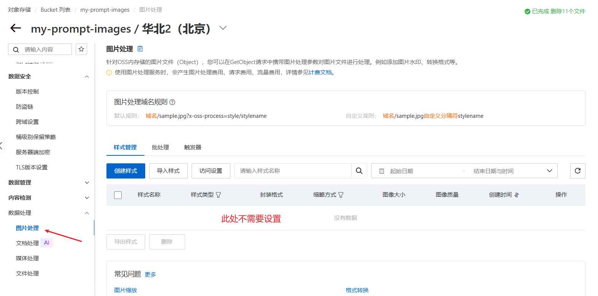

# 用阿里云 OSS 图片处理，把上传的 PNG 在加载时实时转成 JPG

这篇文章记录当前 Prompt Gallery 项目里一次针对「图片加载体积」的优化实践。核心目标只有一个：

> 上传到 OSS 的原始图片（比如 PNG）保持不变，但页面展示时让它以体积更小的 JPG 加载，从而提升图片加载速度、节省带宽。

如果你只想记住一句话：

> 阿里云 OSS 开通「图片处理服务」后，直接给图片 URL 追加 `?x-oss-process=image/format,jpg` 就能在加载时实时把 PNG 转成 JPG，原图仍然保留在 OSS 上。

## 一、背景：为什么会有这个问题

项目的封面图、参考图是通过阿里云 OSS 浏览器直传方式上传的。用户上传的是**原始图片**，包括 PNG、JPG、WebP、GIF 等格式，OSS 上存储的也是这些原始文件。

PNG 是无损格式，体积通常远大于 JPG。当用户在首页、详情页浏览大量封面图时，浏览器会下载这些体积很大的原图，导致：

- 首屏加载慢，尤其是图片多的页面。
- 消耗大量带宽和流量费用。
- 移动端网络环境下体验更差。

我们当然可以把 PNG 在上传时就转成 JPG，但那样会：

- 丢失原图，用户无法再下载高清 PNG。
- 增加服务端图片处理能力，改造面大。

有没有一种「不动原图、只在展示时优化」的办法？答案就是阿里云 OSS 的**图片处理服务**。

## 二、方案：OSS 图片处理服务 + URL 参数

阿里云 OSS 提供图片处理服务，可以针对存储的图片对象，在**读取时**做格式转换、缩放、裁剪、加水印等操作。它不需要修改原图，只需要在请求 URL 上携带处理参数。

### 1. 开通图片处理服务

在 OSS 控制台 → Bucket → 数据处理 → 图片处理 中开通即可。开通之后，**不需要做任何额外配置**，直接用 URL 参数就能生效。

需要特别注意的是：图片处理只在 **OSS 原生域名**（`*.aliyuncs.com`）或**已开启图片处理透传的 CDN 域名**上生效。如果你的图片是通过自定义 CDN 域名访问的，需要确认该 CDN 是否透传图片处理参数，否则参数会被忽略、返回原图。



### 2. 格式转换参数

把任意图片格式转成 JPG，在 URL 后面追加：

```text
?x-oss-process=image/format,jpg
```

例如：

```text
https://bucket.oss-cn-beijing.aliyuncs.com/covers/xxx.png?x-oss-process=image/format,jpg
```

浏览器请求这个 URL 时，OSS 会实时把 PNG 转成 JPG 返回。原图 `covers/xxx.png` 仍然存在，不影响下载。

### 3. 叠加多个处理操作

如果既想转格式，又想限制宽度（进一步减小体积），可以叠加多个操作。**一个 `x-oss-process` 参数只能包含一条 `image` 操作链，`image/` 前缀只写一次**，多个操作之间用 `/` 分隔：

```text
?x-oss-process=image/format,jpg/resize,w_1200
```

这是**正确**写法。如果写成下面这种，OSS 会返回 400：

```text
?x-oss-process=image/format,jpg/image/resize,w_1200   # 错误：重复写了 image/
```

这是我实际踩过的坑。当时直接把操作数组用 `/` join，结果每个操作都带上了 `image/` 前缀，拼接出来就是错误的语法，导致图片加载报 400。

### 4. 参数含义

- `format,jpg`：把图片输出为 JPG 格式。
- `resize,w_1200`：把图片宽度限制在 1200px 以内（高度等比缩放，不拉伸、不裁切）。OSS 的 `resize` 默认只缩小不放大。

### 5. 注意事项：GIF 例外

`format,jpg` 会把 GIF 转成静态 JPG，**丢失动画**。如果页面里有需要保留动画的 GIF 图，就不能对它追加格式转换。我们的做法是：GIF 只做缩放、不做格式转换，即 GIF 用 `image/resize,w_1200`，其他格式用 `image/format,jpg/resize,w_1200`。

## 三、前端实现：统一图片展示地址工具

图片展示点很多：首页卡片、详情页封面、收藏列表、投稿记录、管理后台、图片预览弹层等。如果每个地方都手动拼接 `x-oss-process` 参数，代码会重复且容易遗漏。

因此我们把逻辑收敛到一个公共工具函数，所有 `` 展示统一走它。

### 1. 核心工具函数 `toDisplayImageUrl`

文件：`src/utils/imageUrl.ts`

```ts
/**
 * 判断是否为阿里云 OSS 域名（原生域名或通用特征）。
 */
function isOssHostname(hostname: string): boolean {
  return hostname.endsWith('.aliyuncs.com') || hostname.startsWith('oss-') || hostname.startsWith('img-');
}

/**
 * 生成 OSS 图片处理参数。
 * 一个 x-oss-process 参数只能包含一条 image 操作链，image/ 前缀只写一次，
 * 后续操作直接跟在 / 后面（如 image/format,jpg/resize,w_1200），重复写 image/ 会导致 400。
 * GIF 转 JPG 会丢失动画，故 GIF 只做缩放，不追加格式转换。
 */
function buildProcessParam(objectKey: string | null, url: URL): string {
  const hasObjectKey = Boolean(objectKey && objectKey.trim());
  const isOss = isOssHostname(url.hostname);
  if (!hasObjectKey && !isOss) return '';

  const extension = url.pathname.split('.').pop()?.toLowerCase() ?? '';
  const operations: string[] = [];
  if (extension !== 'gif') operations.push('format,jpg');
  operations.push('resize,w_1200');
  return `image/${operations.join('/')}`;
}

/**
 * 为展示图片生成 OSS 图片处理地址，在加载时实时转 JPG 并限制宽度。
 */
export function toDisplayImageUrl(image: { url: string; objectKey?: string | null } | string): string {
  const imageUrl = typeof image === 'string' ? image : image.url;
  const objectKey = typeof image === 'string' ? null : image.objectKey ?? null;
  try {
    const url = new URL(imageUrl);
    const processParam = buildProcessParam(objectKey, url);
    if (!processParam) return imageUrl;
    // 若已存在同名处理参数则直接返回，避免重复追加。
    if (url.searchParams.has('x-oss-process')) return imageUrl;
    const separator = url.search ? (url.search.endsWith('&') || url.search.endsWith('?') ? '' : '&') : '?';
    return `${url.origin}${url.pathname}${url.search}${separator}x-oss-process=${processParam}${url.hash || ''}`;
  } catch {
    return imageUrl;
  }
}
```

### 2. 函数设计要点

- **识别 OSS 图片**：优先看对象路径 `objectKey`（非空即 OSS 图片）；兼容老数据仅有 URL 时，按 OSS 域名特征（`.aliyuncs.com` 等）兜底识别。
- **非 OSS 外链不处理**：GitHub、Gitee、外链等图片 URL 不追加参数，避免破坏访问。
- **已追加过不重复追加**：如果 URL 已经带了 `x-oss-process`，直接返回原样，防止多次调用叠加。
- **URL 解析失败兜底**：`new URL` 抛错时返回原 URL，保证不因异常破坏页面。
- **手动拼接处理参数**：避免用 `URLSearchParams` 把 `/` 和 `,` 编码成 `%2F`、`%2C`。OSS 图片处理要求 `image/resize,w_1200` 保持原样，被编码后无法识别会返回原图。

### 3. 统一替换所有展示点

把项目里所有 `` 的 `src` 从原始 URL 改为 `toDisplayImageUrl(...)`。涉及页面：

| 场景 | 文件 |
|------|------|
| 详情页封面/封面组/参考图/相关推荐 | `CaseDetailPage.tsx` |
| 首页 Hero 大图、热门案例条 | `HomePage.tsx` |
| 首页案例卡片 | `CaseCard.tsx` |
| 收藏列表封面 | `FavoritesPage.tsx` |
| 我的投稿封面 | `MySubmissionsPage.tsx` |
| 管理后台投稿审核封面/参考图 | `admin/SubmissionsPage.tsx` |
| 管理后台案例列表缩略图 | `admin/CasesManagePage.tsx` |
| 大图预览弹层 | `ImagePreviewDialog.tsx` |
| 上传组件预览缩略图 | `ImageListInput.tsx` / `CoverImageInput.tsx` |

同时，把原先写在 `CaseDetailPage` 里的私有 `displayImageUrl` 函数迁移到公共工具，避免逻辑重复。

## 四、展示转换与下载原图分离

一个容易被忽略的关键点：**展示用的地址和下载用的地址必须分离**。

- **展示**：用 `toDisplayImageUrl(...)`，返回带 `x-oss-process` 参数的 JPG 地址，加载快、体积小。
- **下载**：用数据库里存的**原始 URL**（不带参数），用户下载到的是高清原图。

项目里的下载流程是通过 `/api/download-image` 同源接口代理跨域图片。下载时传给接口的是 `activeCoverUrl`——即数据库里存的原始 OSS URL，不含任何处理参数，因此下载得到的是原图。

文件名扩展名也通过解析原始 URL 得到（`.png`、`.jpg` 等），和下载内容保持一致，不会出现「文件名说 jpg、内容却是 png」的错位。

这套设计的价值：**页面性能优先（展示小图）、下载质量优先（提供原图）**，两者互不干扰。

## 五、验证结果

### 1. 语法验证

用浏览器或 `curl` 直接访问拼接好的地址：

```text
https://my-prompt-images.oss-cn-beijing.aliyuncs.com/covers/xxx.png?x-oss-process=image/format,jpg
```

能正常返回 JPG（可对比原图确认体积明显变小）。格式转换语法错误时 OSS 会返回 400。

### 2. 类型校验

```bash
npm run typecheck
```

通过（exitCode 0），无 linter 错误。

## 六、遗留关注点

这套方案在「OSS 原生域名」场景下效果很好，但有几个边界需要知悉，未来接入时注意：

1. **透明 PNG 的背景问题**：带透明通道的 PNG 转成 JPG 后，透明区域会变成黑色或白色背景。如果封面图包含透明底图，视觉上会有变化。
2. **自定义域名识别**：`isOssHostname` 用 `startsWith('img-')` 判断自定义域名，但形如 `img.xxx.com`（点号分隔）不匹配，会被误判为外链而不转换。当前项目用的是 `*.oss-cn-*.aliyuncs.com` 原生域名，`endsWith('.aliyuncs.com')` 能正确匹配，不受影响。若未来换自定义域名，需要同步调整识别逻辑。
3. **JPG vs WebP**：JPG 兼容性最好、保存无坑；如果追求更小体积，可换成 `image/format,webp`，体积通常再小约 30%，现代浏览器均支持，但在微信里长按保存时可能被转码。

## 七、总结

| 环节 | 方案 |
|------|------|
| 原图存储 | 保持不变，OSS 上仍是原始 PNG |
| 页面展示 | URL 追加 `x-oss-process=image/format,jpg/resize,w_1200`，实时转 JPG 并限宽 |
| 用户下载 | 仍用原始 URL，下载高清原图 |
| 代码组织 | 公共工具 `toDisplayImageUrl` 统一所有展示点 |
| 边界处理 | GIF 保留动画；非 OSS 外链不处理；已带参数不重复追加 |

一句话总结：**借助 OSS 图片处理服务，用「不改原图、只改加载参数」的方式，在不牺牲下载质量的前提下，让所有页面图片以更小的体积加载。** 这既避免了引入服务端图片处理能力，也保证了用户始终能拿到高清原图，是一个性价比很高、侵入性很小的优化方案。
