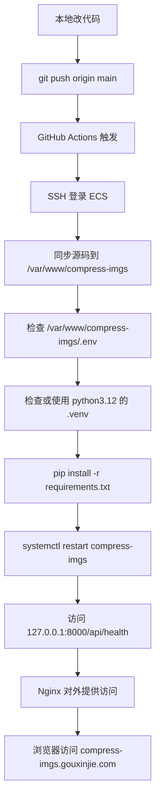
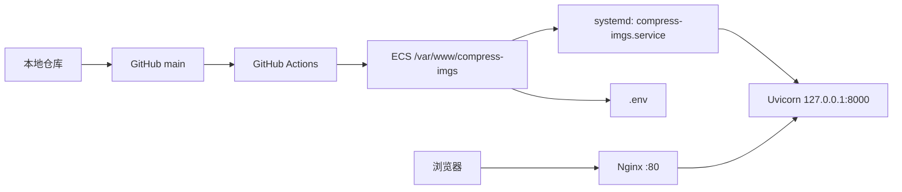

# 一个 FastAPI 图片压缩项目怎么发布到 ECS：把流程一次理顺

这次我把一个单机版图片压缩工具部署到了阿里云 ECS。项目本身不复杂，技术栈也不重，真正需要理顺的，其实是发布流程本身：代码怎么上服务器、环境变量放哪、服务怎么托管、域名怎么访问、后续怎么做到一键发版。

所以这篇文章不准备铺太多项目背景，重点只讲一件事：

**一个典型的 Python Web 单机项目，怎么把 ECS 发布流程真正收口。**

## 一、先交代项目形态

这是一个类似 TinyPNG 的图片压缩工具 MVP，当前形态很简单：

- 后端：`FastAPI`
- 页面：`Jinja2`
- 启动：`Uvicorn`
- 反向代理：`Nginx`
- 进程托管：`systemd`
- 自动发布：`GitHub Actions + SSH`
- 文件存储：本地临时目录
- 任务状态：本地 JSON

它没有数据库，没有消息队列，也没有多实例协作，所以非常适合先按单机 ECS 的方式部署。

## 二、这次最终定下来的发布标准

先把结论放前面，后面的所有流程都围绕这套固定约定展开：

- 项目目录：`/var/www/compress-imgs`
- 生产配置：`/var/www/compress-imgs/.env`
- 服务名：`compress-imgs.service`
- 应用监听：`127.0.0.1:8000`
- 对外访问：`Nginx -> Uvicorn`
- 访问域名：`compress-imgs.gouxinjie.com`
- Python 版本：`python3.12`

这里最关键的是两件事：

1. 生产 `.env` 只放在 ECS 本机，不交给 GitHub Actions 管
2. 后续发布只做“同步代码、更新依赖、重启服务、健康检查”

这能把发布链路压到最短，也最容易排查问题。

## 三、先看完整发布流程

如果只看一句话，这套发布流程其实就是：

**本地提交代码 -> GitHub Actions 触发 -> SSH 登录 ECS -> 同步代码 -> 校验 Python 3.12 环境 -> 重启 systemd 服务 -> 检查健康接口 -> 通过域名访问**

对应流程图如下：



这套流程里，GitHub Actions 负责的是持续发版，不是服务器初始化。

也就是说，**首台 ECS 需要先手工准备好**，后面才能轻松。

## 四、首台 ECS 需要先准备什么

这一步只做一次，但必须做扎实。后面发版省不省事，就看这里有没有收口。

### 1. 安装基础软件

先在 ECS 安装这些基础依赖：

```bash
sudo apt update
sudo apt install -y python3.12 python3.12-venv nginx git rsync
```

核心点不是发行版细节，而是要保证这些东西到位：

- `python3.12`
- `venv`
- `nginx`
- `git`
- `rsync`

### 2. 创建项目目录

```bash
sudo mkdir -p /var/www/compress-imgs
```

后面所有发布动作都默认往这个目录收敛，不要一会儿放 `/opt`，一会儿放 `/srv`，一会儿又改成别的名字。

### 3. 手工放入生产 `.env`

生产环境变量固定放在：

```text
/var/www/compress-imgs/.env
```

例如：

```env
TINIFY_API_KEY=你的_tinify_key
MAX_FILES_PER_UPLOAD=10
MAX_FILE_SIZE_MB=10
MAX_REQUEST_SIZE_MB=100
TEMP_DIR=work/tmp
FILE_EXPIRE_MINUTES=30
POLL_INTERVAL_MS=1000
RATE_LIMIT_PER_MINUTE=5
```

这里有一个明确原则：

- `TINIFY_API_KEY` 不放 GitHub Secrets
- `.env` 不让工作流生成
- 生产配置只保留 ECS 本机这一份

### 4. 手工创建虚拟环境

```bash
cd /var/www/compress-imgs
python3.12 -m venv .venv
.venv/bin/pip install --upgrade pip
.venv/bin/pip install -r requirements.txt
```

这一步的目的不是为了手工部署，而是为了先确认：

- ECS 上的 Python 版本对了
- 依赖能正常安装
- 运行环境可用

### 5. 配置 systemd 服务

创建：

```bash
sudo vim /etc/systemd/system/compress-imgs.service
```

内容示例：

```ini
[Unit]
Description=Compress Imgs FastAPI Service
After=network.target

[Service]
Type=simple
User=root
Group=root
WorkingDirectory=/var/www/compress-imgs
ExecStart=/var/www/compress-imgs/.venv/bin/python -m uvicorn app.main:app --host 127.0.0.1 --port 8000
Restart=always
RestartSec=3

[Install]
WantedBy=multi-user.target
```

然后执行：

```bash
# 重新加载 systemd 管理器配置，识别新增或修改的 service 文件
sudo systemctl daemon-reload

# 设置 compress-imgs 服务开机自启
sudo systemctl enable compress-imgs

# 立即启动 compress-imgs 服务
sudo systemctl start compress-imgs
```

### 6. 先做本机健康检查

```bash
curl http://127.0.0.1:8000/api/health
```

如果返回：

```json
{"status":"ok","app":"CompressImgs"}
```

说明 Python 应用和 systemd 这一层已经打通了。

### 7. 配置 Nginx

当前这台 ECS 适合用：

```text
/etc/nginx/conf.d/compress-imgs.conf
```

配置示例：

```nginx
server {
    listen 80;
    server_name compress-imgs.gouxinjie.com;

    client_max_body_size 100M;

    location / {
        proxy_pass http://127.0.0.1:8000;
        proxy_http_version 1.1;
        proxy_set_header Host $host;
        proxy_set_header X-Real-IP $remote_addr;
        proxy_set_header X-Forwarded-For $proxy_add_x_forwarded_for;
        proxy_set_header X-Forwarded-Proto $scheme;
    }
}
```

测试并重载：

```bash
sudo nginx -t
sudo systemctl reload nginx
```

做到这里，首台 ECS 的初始化就结束了。后面就不该再反复碰这些基础配置。

## 五、GitHub Actions 在这套流程里到底负责什么

很多人会把自动部署理解成“GitHub Actions 帮你把服务器全配好”，但实际不应该这样设计。

在这套方案里，GitHub Actions 只负责四件事：

- 连接 ECS
- 同步代码
- 更新依赖
- 重启服务并做健康检查

它不负责：

- 创建 `.env`
- 保存 `TINIFY_API_KEY`
- 创建 `systemd` 服务
- 首次配置 Nginx

边界越清晰，流程越稳。

## 六、仓库里要准备哪些发布配置

仓库里真正和自动发布相关的核心内容，主要是两部分：

- GitHub Actions 工作流
- ECS 上执行的发布脚本

当前仓库里对应的是：

1..github/workflows/deploy-ecs.yml

```yml
name: Deploy To ECS

on:
  push:
    branches:
      - main
  workflow_dispatch:

permissions:
  contents: read

concurrency:
  group: deploy-ecs-production
  cancel-in-progress: true

jobs:
  deploy:
    runs-on: ubuntu-latest
    env:
      APP_DIR: /var/www/compress-imgs
      SERVICE_NAME: compress-imgs
      STAGING_DIR: /var/www/compress-imgs/.deploy-work/${{ github.run_id }}-${{ github.sha }}
      ECS_HOST: ${{ secrets.ECS_HOST }}
      ECS_PORT: ${{ secrets.ECS_PORT }}
      ECS_USER: ${{ secrets.ECS_USER }}
      ECS_SSH_PRIVATE_KEY: ${{ secrets.ECS_SSH_PRIVATE_KEY }}
      ECS_SERVICE_NAME: ${{ secrets.ECS_SERVICE_NAME }}
    steps:
      - name: Checkout repository
        uses: actions/checkout@v4

      - name: Install deployment tools
        shell: bash
        run: |
          set -euo pipefail
          sudo apt-get update
          sudo apt-get install -y rsync openssh-client

      - name: Validate required secrets
        shell: bash
        run: |
          set -euo pipefail

          test -n "${ECS_HOST}" || { echo "Missing secret: ECS_HOST"; exit 1; }
          test -n "${ECS_USER}" || { echo "Missing secret: ECS_USER"; exit 1; }
          test -n "${ECS_SSH_PRIVATE_KEY}" || { echo "Missing secret: ECS_SSH_PRIVATE_KEY"; exit 1; }

      - name: Prepare SSH
        shell: bash
        run: |
          set -euo pipefail

          REMOTE_PORT="${ECS_PORT:-22}"

          mkdir -p "${HOME}/.ssh"
          chmod 700 "${HOME}/.ssh"
          printf '%s\n' "${ECS_SSH_PRIVATE_KEY}" > "${HOME}/.ssh/id_ed25519"
          chmod 600 "${HOME}/.ssh/id_ed25519"
          ssh-keyscan -p "${REMOTE_PORT}" -H "${ECS_HOST}" >> "${HOME}/.ssh/known_hosts"

      - name: Ensure remote app directory
        shell: bash
        run: |
          set -euo pipefail

          REMOTE_PORT="${ECS_PORT:-22}"
          ssh -p "${REMOTE_PORT}" "${ECS_USER}@${ECS_HOST}" "mkdir -p '${APP_DIR}' '${STAGING_DIR}'"

      - name: Build deploy manifest
        shell: bash
        run: |
          set -euo pipefail
          git ls-files > .deploy-manifest

      - name: Sync project files to staging
        shell: bash
        run: |
          set -euo pipefail

          REMOTE_PORT="${ECS_PORT:-22}"
          rsync -az \
            --exclude '.git/' \
            --exclude '.github/' \
            --exclude '.venv/' \
            --exclude '.env' \
            --exclude 'work/tmp/' \
            --exclude '__pycache__/' \
            --exclude '*.pyc' \
            --exclude '.pytest_cache/' \
            -e "ssh -p ${REMOTE_PORT}" \
            ./ "${ECS_USER}@${ECS_HOST}:${STAGING_DIR}/"

      - name: Install dependencies and restart service
        shell: bash
        run: |
          set -euo pipefail

          REMOTE_PORT="${ECS_PORT:-22}"
          ssh -p "${REMOTE_PORT}" "${ECS_USER}@${ECS_HOST}" \
            "chmod +x '${STAGING_DIR}/deploy/deploy_on_ecs.sh' && APP_DIR='${APP_DIR}' SOURCE_DIR='${STAGING_DIR}' SERVICE_NAME='${ECS_SERVICE_NAME:-$SERVICE_NAME}' PYTHON_BIN='python3.12' EXPECTED_PYTHON_VERSION='3.12' bash '${STAGING_DIR}/deploy/deploy_on_ecs.sh'"

```

2.deploy/deploy_on_ecs.sh

```yml
#!/usr/bin/env bash

set -euo pipefail

APP_DIR="${APP_DIR:-/var/www/compress-imgs}"
SOURCE_DIR="${SOURCE_DIR:-$APP_DIR}"
SERVICE_NAME="${SERVICE_NAME:-compress-imgs}"
PYTHON_BIN="${PYTHON_BIN:-python3.12}"
EXPECTED_PYTHON_VERSION="${EXPECTED_PYTHON_VERSION:-3.12}"
MANIFEST_NAME=".deploy-manifest"
CURRENT_MANIFEST="${APP_DIR}/${MANIFEST_NAME}"
NEW_MANIFEST="${SOURCE_DIR}/${MANIFEST_NAME}"
HEALTHCHECK_URL="${HEALTHCHECK_URL:-http://127.0.0.1:8000/api/health}"

if ! command -v "${PYTHON_BIN}" >/dev/null 2>&1; then
  echo "Python executable not found: ${PYTHON_BIN}" >&2
  exit 1
fi

if ! command -v rsync >/dev/null 2>&1; then
  echo "rsync is required on ECS but was not found." >&2
  exit 1
fi

if [ ! -d "${SOURCE_DIR}" ]; then
  echo "Source directory not found: ${SOURCE_DIR}" >&2
  exit 1
fi

if [ ! -f "${NEW_MANIFEST}" ]; then
  echo "Missing deploy manifest: ${NEW_MANIFEST}" >&2
  exit 1
fi

mkdir -p "${APP_DIR}"

if [ ! -f "${APP_DIR}/.env" ]; then
  echo "Missing ${APP_DIR}/.env. Create it on ECS before running the workflow." >&2
  exit 1
fi

mkdir -p "${APP_DIR}/work/tmp"

rsync -az \
  --exclude '.env' \
  --exclude '.venv/' \
  --exclude 'work/tmp/' \
  --exclude "${MANIFEST_NAME}" \
  "${SOURCE_DIR}/" "${APP_DIR}/"

"${PYTHON_BIN}" - "${APP_DIR}" "${CURRENT_MANIFEST}" "${NEW_MANIFEST}" <<'PY'
from pathlib import Path
import sys

app_dir = Path(sys.argv[1]).resolve()
current_manifest = Path(sys.argv[2])
new_manifest = Path(sys.argv[3])

protected_paths = {
    Path(".env"),
    Path(".venv"),
    Path(".deploy-manifest"),
}
protected_prefixes = (
    Path("work/tmp"),
    Path(".deploy-work"),
)

old_files = set()
if current_manifest.exists():
    old_files = {
        line.strip()
        for line in current_manifest.read_text(encoding="utf-8").splitlines()
        if line.strip()
    }

new_files = {
    line.strip()
    for line in new_manifest.read_text(encoding="utf-8").splitlines()
    if line.strip()
}

stale_files = sorted(old_files - new_files)
stale_parents = set()

for rel in stale_files:
    rel_path = Path(rel)
    if rel_path in protected_paths:
        continue
    if any(rel_path == prefix or prefix in rel_path.parents for prefix in protected_prefixes):
        continue

    target = (app_dir / rel_path).resolve()
    try:
        target.relative_to(app_dir)
    except ValueError:
        continue

    if target.is_file():
        target.unlink()
    elif target.exists():
        continue

    parent = rel_path.parent
    while parent != Path("."):
        if parent in protected_paths or any(parent == prefix or prefix in parent.parents for prefix in protected_prefixes):
            break
        stale_parents.add(parent)
        parent = parent.parent

for rel_dir in sorted(stale_parents, key=lambda path: len(path.parts), reverse=True):
    target_dir = (app_dir / rel_dir).resolve()
    try:
        target_dir.relative_to(app_dir)
    except ValueError:
        continue
    try:
        target_dir.rmdir()
    except OSError:
        pass
PY

cp "${NEW_MANIFEST}" "${CURRENT_MANIFEST}"

cd "${APP_DIR}"

if [ ! -d ".venv" ]; then
  "${PYTHON_BIN}" -m venv .venv
fi

VENV_PYTHON_VERSION="$(
  .venv/bin/python - <<'PY'
import sys
print(f"{sys.version_info.major}.{sys.version_info.minor}")
PY
)"

if [ "${VENV_PYTHON_VERSION}" != "${EXPECTED_PYTHON_VERSION}" ]; then
  echo "Existing .venv uses Python ${VENV_PYTHON_VERSION}, expected ${EXPECTED_PYTHON_VERSION}. Recreate /var/www/compress-imgs/.venv with ${PYTHON_BIN} and rerun deployment." >&2
  exit 1
fi

.venv/bin/python -m pip install --upgrade pip
.venv/bin/pip install -r requirements.txt

if ! sudo -n systemctl list-unit-files "${SERVICE_NAME}.service" --no-pager | grep -q "^${SERVICE_NAME}\\.service"; then
  echo "Systemd unit not found: ${SERVICE_NAME}.service" >&2
  echo "Create /etc/systemd/system/${SERVICE_NAME}.service on ECS, or set GitHub secret ECS_SERVICE_NAME to your existing service name." >&2
  echo "Related service units on ECS:" >&2
  sudo -n systemctl list-unit-files --type=service --no-pager | grep 'imgs\\.service' || true
  exit 1
fi

sudo -n systemctl restart "${SERVICE_NAME}"
sudo -n systemctl status "${SERVICE_NAME}" --no-pager

for attempt in 1 2 3 4 5 6 7 8 9 10; do
  if .venv/bin/python - "${HEALTHCHECK_URL}" <<'PY'
import json
import sys
import urllib.request

url = sys.argv[1]
with urllib.request.urlopen(url, timeout=5) as response:
    payload = json.load(response)

if payload.get("status") != "ok":
    raise SystemExit(1)
PY
  then
    exit 0
  fi

  if [ "${attempt}" -eq 10 ]; then
    echo "Health check failed: ${HEALTHCHECK_URL}" >&2
    exit 1
  fi

  sleep 2
done

```

这两个文件配合起来，完成整条自动发布链路。

## 七、GitHub 里要配置哪些 Secrets

当前这套发布方案需要的 GitHub Secrets 很少，只保留下面这些：

- `ECS_HOST`
- `ECS_PORT`
- `ECS_USER`
- `ECS_SSH_PRIVATE_KEY`
- `ECS_SERVICE_NAME`

分别对应：

- `ECS_HOST`：ECS 公网 IP 或可 SSH 地址
- `ECS_PORT`：SSH 端口，默认通常是 `22`
- `ECS_USER`：登录 ECS 的用户，当前就是 `root`
- `ECS_SSH_PRIVATE_KEY`：GitHub Actions 用来 SSH 登录 ECS 的私钥
- `ECS_SERVICE_NAME`：服务名本体，填写 `compress-imgs`

注意，这里故意没有 `TINIFY_API_KEY`。

因为它只应该存在于：

```text
/var/www/compress-imgs/.env
```

## 八、后续一次正常发版是什么样

当首台 ECS 已经准备好之后，后续一次正常发版应该非常短：

1. 本地改代码
2. 提交并 push 到 `main`
3. GitHub Actions 自动触发
4. SSH 登录 ECS
5. 同步最新代码
6. 用 `python3.12` 环境安装或更新依赖
7. 重启 `compress-imgs.service`
8. 调 `/api/health` 确认服务存活
9. 浏览器直接访问最新版本

如果后面每次发版还需要手工做这些事：

- 重新建 `.venv`
- 重新写 `.env`
- 重新配置 Nginx
- 手工运行 Uvicorn

那说明流程并没有真正收口。

## 九、发布之后怎么访问

这次的默认方案不以 HTTPS 为前提，先把 HTTP 跑通就够了。

部署完成后，访问方式应该是：

- 首页：`http://compress-imgs.gouxinjie.com/`
- 健康检查：`http://compress-imgs.gouxinjie.com/api/health`

如果域名还没生效，也可以先用 ECS 公网 IP 验证：

- `http://ECS公网IP/`
- `http://ECS公网IP/api/health`

不建议长期直接访问：

- `http://ECS公网IP:8000/`

`8000` 更适合本机排障，不适合作为正式入口。

## 十、这次发布过程中最容易踩的坑

虽然流程最后看起来很顺，但真正容易出问题的点基本就这几个。

### 1. 默认 `python3` 版本太老

这次 ECS 上默认还是 `Python 3.6.8`，而项目代码已经要求现代 Python 语法，所以最后必须强制使用 `python3.12`。

### 2. `.env` 来源不统一

如果一部分配置在 ECS，本地一部分配置又让 GitHub Actions 下发，后面出问题时会很难判断到底谁覆盖了谁。

### 3. 服务名、目录名、域名不统一

像 `process-imgs` 和 `compress-imgs` 混着用，看起来是小问题，实际会直接影响工作流重启、文档准确性和运维排查。

### 4. Nginx 目录结构照搬教程

很多教程默认写 `sites-available` 和 `sites-enabled`，但实际机器可能根本不是这套。当前这台 ECS 用的是：

```text
/etc/nginx/conf.d/compress-imgs.conf
```

### 5. 把自动部署理解成“自动初始化服务器”

自动部署负责的是持续发布，不是帮你把服务器从零配置完成。首次机器初始化这一步，必须手工做好。

## 十一、用一张图总结整套发布链路



如果把这张图看明白，这个项目的发布流程就已经完全清楚了。

## 十二、结语

这次部署真正做成的，不是“把代码传到 ECS”，而是把下面这几件事固定了下来：

- 统一目录
- 统一服务名
- 统一 Python 版本
- 统一配置来源
- 统一自动发布链路

对一个单机 Python Web 项目来说，发布流程一旦被固定，后面维护成本会低很多，线上稳定性也会明显提升。

这也是我现在更看重的事情：不是把部署写得多复杂，而是让它以后每次发版都简单、确定、可重复。
