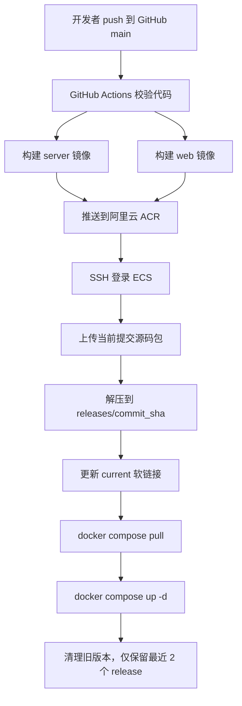
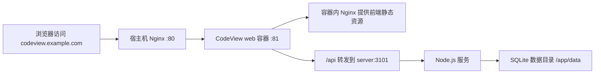

# React+Node+SQLite项目自动发布到ECS实战-git看板

> CodeView项目部署实战：用 GitHub Actions + Docker Compose 把项目稳定发布到阿里云 ECS

## 一、项目背景

`CodeView` 是一个基于 GitHub 数据的可视化产品，目标不是做一个简单的项目列表页面，而是把 GitHub 仓库的活跃度、提交趋势、技术栈画像、流量数据和基础经营数据沉淀下来，形成一个长期可用的数据看板。

从技术形态看，它是一个标准的前后端分离项目：

- 前端：`React + Vite + TypeScript + SCSS + ECharts`
- 后端：`Node.js + Express + TypeScript`
- 数据库：`SQLite`
- 运行方式：前后端双容器部署

这类项目上线时，真正麻烦的部分通常不是“把程序跑起来”，而是如何把下面这些环节串成稳定链路：

- 前端静态资源发布
- 后端 API 服务启动
- SQLite 数据持久化
- 生产环境变量管理
- 自动化部署
- 镜像仓库管理
- 服务器目录和回滚策略

这篇文章记录的，就是 CodeView 从本地开发到阿里云 ECS 实际落地的一整套部署方案。

## 二、部署前的准备清单

在真正开始自动部署前，建议先把准备项一次性整理好。这样可以避免 workflow 第一次运行就因为环境不完整而失败。

### 1. GitHub 仓库侧

需要具备：

- 可正常 push 的 GitHub 仓库
- 已启用 GitHub Actions
- 仓库默认发布分支为 `main`

同时需要进入仓库：

```text
Settings -> Secrets and variables -> Actions
```

提前配置好部署所需 Secrets。

### 2. 阿里云侧

需要具备：

- 一台可 SSH 登录的 ECS
- 已创建好的阿里云 ACR 个人版实例
- 已创建好的 ACR 命名空间
- 已创建好的镜像仓库：
  - `codeview/server`
  - `codeview/web`

以当前项目为例，实际使用的是：

```text
ACR_REGISTRY=crpi-********.cn-shanghai.personal.cr.aliyuncs.com
ACR_NAMESPACE=codeview
```

### 3. ECS 安全组

安全组至少要放行这些端口：

- `22`：用于 GitHub Actions SSH 登录服务器
- `80`：用于域名访问网站

如果你还没接入宿主机 Nginx，临时直接用公网端口访问容器，也可以临时放行：

- `81`

但在当前最终方案里，如果已经由宿主机 Nginx 反代 `127.0.0.1:81`，那外网层面其实不一定需要长期暴露 `81`。

## 三、这次部署想解决什么问题

这次不是临时上线一个 demo，而是希望得到一套可长期维护的生产方案。

目标很明确：

1. 推送到 GitHub `main` 后自动部署。
2. ECS 只负责运行，不在服务器本地构建业务镜像。
3. 配置和代码分离，避免每次发版都改环境文件。
4. 保留最近版本，出现问题时能快速回滚。
5. 尽量少做手工操作，降低后续维护成本。

最终落地后的核心链路是：

- GitHub Actions 构建镜像
- 推送镜像到阿里云 ACR
- ECS 通过 Docker Compose 拉取镜像并启动
- 宿主机 Nginx 保持在 `80` 端口，对 CodeView 做反向代理
- ECS 内只保留最近两个 release

## 四、为什么没有直接在 ECS 上执行 `docker compose up --build`

一开始最直觉的方案其实很简单：

1. GitHub Actions 通过 SSH 连到 ECS。
2. 上传源码。
3. 在 ECS 上执行 `docker compose up -d --build`。

看起来很合理，但实际部署时很快遇到三个关键问题。

### 1. Docker 服务没有启动

第一次运行工作流时，直接报错：

```text
Cannot connect to the Docker daemon at unix:///var/run/docker.sock
```

这说明不是部署脚本先错了，而是 ECS 本身的 Docker 服务还没准备好。

### 2. ECS 无法稳定访问 Docker Hub

后面即使把 Docker 服务启动起来，构建阶段又卡在基础镜像拉取：

```text
node:20-bookworm-slim: failed to resolve source metadata
```

在 ECS 上手动执行：

```bash
docker pull node:20-bookworm-slim
```

同样失败，报 `context deadline exceeded` 或 `i/o timeout`。

这说明问题不是 workflow 写错了，而是 ECS 到 Docker Hub 的访问本身不稳定。继续坚持“在 ECS 上构建业务镜像”没有意义。

### 3. 宿主机 80 端口已经被 Nginx 占用

当镜像问题绕过去后，容器启动又遇到端口冲突：

```text
bind: address already in use
```

排查后发现，是宿主机 Nginx 已经监听了 `80` 端口。

这也意味着容器不能直接把 Web 服务绑定到宿主机 `80`，必须重新设计入口层。

## 五、最终采用的部署方案

经过调整，最终方案变成下面这样：

### 核心原则

- 镜像只在 GitHub Actions 中构建
- 镜像统一推送到阿里云 ACR
- ECS 只负责拉镜像和运行容器
- 生产环境变量放在共享目录
- 当前版本通过固定软链接访问
- 自动清理旧版本，只保留最新两个 release

### 总体流程图



## 六、最终部署架构说明

### 1. 容器拆分

项目分成两个容器：

- `server`
  负责 Node.js API、GitHub 数据同步、SQLite 读写和定时任务。
- `web`
  负责托管前端静态资源，并把 `/api` 转发到 `server:3101`。

### 2. 目录结构

ECS 上目录设计如下：

```text
/var/www/codeview/
  releases/
    <commit_sha_1>/
    <commit_sha_2>/
  shared/
    .env
    data/
  current -> /var/www/codeview/releases/<latest_commit_sha>
```

这套结构的好处很明显：

- `releases/` 保存发版快照，便于回滚。
- `shared/.env` 独立保存生产配置，不跟着版本目录走。
- `shared/data/` 存放 SQLite 数据，容器重建后数据还在。
- `current` 是固定入口，手工维护时不用再查具体 commit 目录。

### 3. 域名与入口层

最终线上访问使用的是二级域名：

```text
codeview.example.com
```

但容器没有直接占用宿主机 `80`，而是采用下面这套入口结构：



简单说就是：

- 宿主机 Nginx 保留；
- CodeView 对外暴露到 `81` 端口；
- 宿主机 Nginx 再把域名请求转发到 `127.0.0.1:81`。

这能避免和宿主机已有 Web 服务抢占 `80` 端口。

## 七、为什么生产环境变量放在 `shared/.env`

这次部署中，一个非常关键的调整是：**不使用 release 目录里的环境文件，而是统一使用共享环境文件**。

最终路径为：

```text
/var/www/codeview/shared/.env
```

这样做比把环境文件放在每次发版目录里更合理，原因有三点：

1. 代码和配置分离，发版时不需要重复修改配置。
2. 版本切换时不影响环境变量。
3. 后续修改端口、域名、镜像地址时，只改一份文件。

这也是为什么最终没有继续使用单独的 `codeview.env` 文件名，而是直接统一成 `.env`。这样和 Docker Compose 的习惯也一致。

## 八、生产环境的关键配置

### 1. GitHub Secrets

GitHub Actions 需要以下 Secrets：

- `ECS_HOST`
- `ECS_PORT`
- `ECS_USER`
- `ECS_SSH_KEY`
- `ACR_REGISTRY`
- `ACR_NAMESPACE`
- `ACR_USERNAME`
- `ACR_PASSWORD`

以当前项目为例：

```text
ACR_REGISTRY=crpi-********.cn-shanghai.personal.cr.aliyuncs.com
ACR_NAMESPACE=codeview
```

对应镜像地址为：

```text
crpi-********.cn-shanghai.personal.cr.aliyuncs.com/codeview/server:latest
crpi-********.cn-shanghai.personal.cr.aliyuncs.com/codeview/web:latest
```

### 2. ECS 共享环境文件

`/var/www/codeview/shared/.env` 可以按下面方式配置：

```env
CODEVIEW_HTTP_PORT=81
CODEVIEW_DATA_DIR=/var/www/codeview/shared/data

SERVER_IMAGE=crpi-********.cn-shanghai.personal.cr.aliyuncs.com/codeview/server:latest
WEB_IMAGE=crpi-********.cn-shanghai.personal.cr.aliyuncs.com/codeview/web:latest

SERVER_PORT=3101
WEB_ORIGIN=http://codeview.example.com
DATABASE_PATH=/app/data/asset-console.db
DEFAULT_USER_ID=local-user
ENCRYPTION_SECRET=替换成足够长的随机字符串
```

这里最关键的是两个变量：

#### `CODEVIEW_HTTP_PORT`

决定宿主机把哪个端口映射给容器内的 Web 服务。

因为宿主机 `80` 已被已有 Nginx 占用，所以实际值设为：

```env
CODEVIEW_HTTP_PORT=81
```

#### `WEB_ORIGIN`

这个值必须和外部用户实际访问地址一致，否则后端的跨域判断会出问题。

当前实际接入域名后，应写成：

```env
WEB_ORIGIN=http://codeview.example.com
```

如果没有走域名，而是直接通过公网 IP + `81` 访问，则应改成：

```env
WEB_ORIGIN=http://***.***.***.***:81
```

## 九、GitHub 仓库里需要配置什么

### 1. workflow 文件

当前自动部署依赖仓库内这个文件：

```text
.github/workflows/deploy-ecs-compose.yml
```

它的触发方式是：

- push 到 `main`
- 手动执行 `workflow_dispatch`

### 2. 必填 Secrets

GitHub Actions 至少需要下面这些 Secrets：

- `ECS_HOST`
- `ECS_PORT`
- `ECS_USER`
- `ECS_SSH_KEY`
- `ACR_REGISTRY`
- `ACR_NAMESPACE`
- `ACR_USERNAME`
- `ACR_PASSWORD`

可以按下面方式理解：

- `ECS_HOST` / `ECS_PORT` / `ECS_USER` / `ECS_SSH_KEY`
  用于让 GitHub Actions 能登录你的 ECS。
- `ACR_REGISTRY` / `ACR_NAMESPACE` / `ACR_USERNAME` / `ACR_PASSWORD`
  用于让 GitHub Actions 能把镜像推送到阿里云 ACR，也让 ECS 能从 ACR 拉取镜像。

## 十、ECS 首次需要做哪些准备

如果是第一次部署到一台新的 ECS，建议先手工准备下面这些内容。

### 1. 安装并启动 Docker

```bash
sudo systemctl enable docker
sudo systemctl start docker
sudo systemctl status docker --no-pager
```

### 2. 创建部署目录

```bash
sudo mkdir -p /var/www/codeview/releases
sudo mkdir -p /var/www/codeview/shared
sudo mkdir -p /var/www/codeview/shared/data
```

### 3. 创建生产环境文件

```bash
sudo vi /var/www/codeview/shared/.env
```

写入前面那份 `.env` 内容即可。

### 4. 确认 Docker Compose 可用

```bash
docker compose version
```

### 5. 确认端口占用情况

```bash
sudo ss -lntp | grep ':80'
sudo ss -lntp | grep ':81'
```

如果 `80` 已被宿主机 Nginx 占用，这是正常现象，只要 `81` 没冲突即可。

## 十一、GitHub Actions 的实际部署逻辑

当前这套 workflow 的实际动作可以概括为：

1. 拉取仓库代码。
2. 执行 `npm ci`。
3. 执行 `npm run typecheck`。
4. 构建 `server` 镜像。
5. 构建 `web` 镜像。
6. 推送镜像到阿里云 ACR。
7. 使用 `git archive` 打包当前提交的源码。
8. 上传压缩包到 ECS。
9. 在 ECS 解压到 `/var/www/codeview/releases/<commit_sha>`。
10. 更新 `/var/www/codeview/current` 软链接。
11. 执行 `docker compose pull`。
12. 执行 `docker compose up -d`。
13. 自动清理旧版本，只保留最近两个 release。

这套逻辑和“在 ECS 本地 build 镜像”最大的区别在于：

- ECS 不再承担构建职责；
- ECS 只做稳定的拉取和运行；
- 构建失败会集中发生在 GitHub Actions 上，更容易排查。

## 十二、部署时踩过的坑，以及为什么这样修

这一部分最有参考价值，因为它直接决定了最终方案为什么是现在这样。

### 坑 1：`Cannot connect to the Docker daemon`

根因：

- Docker 服务没有启动。

修复：

```bash
sudo systemctl enable docker
sudo systemctl start docker
```

经验：

- 先确认服务器运行环境，再谈自动化部署。
- 首次上 ECS，一定先手工验证 Docker 是否可用。

### 坑 2：`docker pull node:20-bookworm-slim` 超时

根因：

- ECS 访问 Docker Hub 不稳定。
- 用 ECS 充当镜像构建机不合适。

修复思路：

- 不再在 ECS 上执行 `docker build`；
- 改成 GitHub Actions 构建后推送到 ACR。

经验：

- 构建和运行应该分离。
- 服务器越简单，生产环境越稳定。

### 坑 3：Web 容器绑定 `80` 失败

根因：

- 宿主机 Nginx 已经占用 `80`。

排查命令：

```bash
sudo ss -lntp | grep ':80'
```

修复：

- 保留宿主机 Nginx；
- 把 CodeView 的容器端口改为 `81`；
- 由宿主机 Nginx 转发到 `127.0.0.1:81`。

经验：

- 端口冲突不是单纯“谁抢到谁用”的问题；
- 生产环境更重要的是入口层边界清晰。

### 坑 4：每次手工命令都要写完整 release 目录

原来重启要写成这样：

```bash
docker compose --project-name codeview --file /var/www/codeview/releases/<commit_sha>/compose.yaml --env-file /var/www/codeview/shared/.env up -d
```

太长，也容易输错。

修复：

- 增加 `/var/www/codeview/current` 软链接。

修复后命令固定成：

```bash
docker compose --project-name codeview --file /var/www/codeview/current/compose.yaml --env-file /var/www/codeview/shared/.env up -d
```

经验：

- 生产环境里，固定入口路径是非常划算的设计。

### 坑 5：`releases/` 会越来越大

根因：

- 每次发布都会新生成一个 release 目录。

修复：

- 在 workflow 中自动清理旧版本。
- 只保留最新两个 release。

经验：

- 版本快照要有，但不能无限堆积。
- “当前版本 + 上一个版本”通常已经足够满足回滚需求。

## 十三、域名解析和宿主机 Nginx 还要做什么

如果你要通过 `codeview.example.com` 访问，而不是直接通过 `IP:81`，还需要补两步。

### 1. 配置 DNS 解析

在你的域名 DNS 控制台中，给二级域名增加一条 `A` 记录：

```text
主机记录：codeview
记录类型：A
记录值：你的 ECS 公网 IP
```

这样 `codeview.example.com` 才会解析到 ECS。

### 2. 配置宿主机 Nginx

因为当前方案保留了宿主机 Nginx，所以域名入口应该配置在宿主机，而不是容器外再暴露一个公网 `80`。

一个常见写法如下：

```nginx
server {
    listen 80;
    server_name codeview.example.com;

    location / {
        proxy_pass http://127.0.0.1:81;
        proxy_http_version 1.1;
        proxy_set_header Host $host;
        proxy_set_header X-Real-IP $remote_addr;
        proxy_set_header X-Forwarded-For $proxy_add_x_forwarded_for;
        proxy_set_header X-Forwarded-Proto $scheme;
    }
}
```

这里要注意两件事：

1. `deploy/nginx/default.conf` 是**容器内 Nginx 配置**，不是宿主机 Nginx 配置。
2. 如果你保留宿主机 Nginx，那宿主机反向代理配置仍然需要你自己维护。

也就是说：

- 容器内 `default.conf` 不需要手工拷贝；
- 宿主机上的反向代理规则，需要按你的域名和服务器情况配置。

## 十四、宿主机 Nginx 配完后怎么生效

配置文件写完后，建议在 ECS 上执行：

```bash
sudo nginx -t
sudo systemctl reload nginx
```

如果 `nginx -t` 失败，先不要 reload，先把语法错误修掉。

## 十五、如何验收部署是否成功

部署完成后，可以按下面顺序检查。

### 1. 查看容器状态

```bash
docker ps
```

预期至少能看到：

- `codeview-server`
- `codeview-web`

### 2. 验证容器端口

```bash
curl http://127.0.0.1:81/api/health
```

预期返回类似：

```json
{"success":true,"code":200,"message":"操作成功","data":{"status":"ok"}}
```

### 3. 查看 compose 状态

```bash
docker compose --project-name codeview --file /var/www/codeview/current/compose.yaml --env-file /var/www/codeview/shared/.env ps
```

### 4. 查看最近日志

```bash
docker compose --project-name codeview --file /var/www/codeview/current/compose.yaml --env-file /var/www/codeview/shared/.env logs --tail=100
```

### 5. 浏览器访问

如果走宿主机端口访问，可以先试：

```text
http://***.***.***.***:81/
```

接入域名并配置好宿主机 Nginx 后，再访问：

```text
http://codeview.example.com
```

## 十六、出问题时如何回滚

因为当前只保留最近两个 release，所以回滚也比较直接。

### 1. 先查看现有 release

```bash
ls -lt /var/www/codeview/releases
```

### 2. 把 `current` 指向上一个版本

假设你要回滚到：

```text
/var/www/codeview/releases/<previous_commit_sha>
```

则执行：

```bash
ln -sfn /var/www/codeview/releases/<previous_commit_sha> /var/www/codeview/current
```

### 3. 重新启动 compose

```bash
docker compose --project-name codeview --file /var/www/codeview/current/compose.yaml --env-file /var/www/codeview/shared/.env up -d
```

这套方式的前提是：

- 上一个 release 目录还在
- 镜像 tag 仍然可拉取
- 共享配置和数据目录没有被破坏

## 十七、手工运维时最常用的命令

### 查看运行状态

```bash
docker compose --project-name codeview --file /var/www/codeview/current/compose.yaml --env-file /var/www/codeview/shared/.env ps
```

### 重新拉取并启动

```bash
docker compose --project-name codeview --file /var/www/codeview/current/compose.yaml --env-file /var/www/codeview/shared/.env pull
docker compose --project-name codeview --file /var/www/codeview/current/compose.yaml --env-file /var/www/codeview/shared/.env up -d
```

### 查看日志

```bash
docker compose --project-name codeview --file /var/www/codeview/current/compose.yaml --env-file /var/www/codeview/shared/.env logs --tail=100
```

### 查看当前 release 指向

```bash
ls -l /var/www/codeview/current
```

### 查看已有版本

```bash
ls -lt /var/www/codeview/releases
```

## 十八、这套方案适合什么项目

这套方案很适合下面几类项目：

- 个人项目
- 小型管理后台
- 前后端分离项目
- 使用 SQLite 或本地文件持久化的项目
- 单台 ECS 即可承载的业务

它的优点是很务实：

- 自动化足够完整；
- 结构足够清晰；
- 运维复杂度不高；
- 已经具备基础回滚能力；
- 对个人开发者和小团队非常友好。

如果后续项目继续演进到下面这些阶段：

- 多实例部署
- 多服务拆分
- 云数据库替代 SQLite
- 灰度发布、弹性扩缩容、服务治理

那时再考虑升级到 Kubernetes 或托管容器平台会更合适。

## 十九、结论

这次 CodeView 上线，真正有价值的不是“项目终于能访问了”，而是把部署这件事做成了可持续维护的工程方案。

最终沉淀下来的关键设计有五个：

1. GitHub Actions 负责构建。
2. 阿里云 ACR 负责托管镜像。
3. ECS 只负责拉镜像和运行。
4. `shared/.env` 负责统一生产配置。
5. `current + releases` 负责稳定运维和基础回滚。

从结果上看，这套方案已经满足一个真实线上项目最关键的要求：

- 能自动部署
- 能稳定运行
- 能快速排查
- 能保留版本
- 能继续演进

如果后面继续完善，最值得追加的方向通常是：

1. 给域名接入 HTTPS。
2. 增加容器健康检查。
3. 补充日志归档和监控。
4. 为 SQLite 做备份策略。

但对于当前阶段的 CodeView 来说，这套方案已经足够专业，也足够简单易懂，完全可以作为个人项目上云的标准实践。
