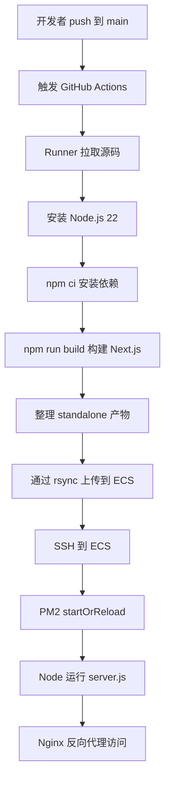

# GitHub Actions 自动化详解

这篇文章围绕当前 Prompt Gallery 项目的部署实践，系统介绍 GitHub Actions 的概念、执行流程、配置细节、变量密钥管理、和 ECS 自动部署的完整链路。

如果只用一句话解释 GitHub Actions：

> GitHub Actions 是 GitHub 提供的自动化流水线能力，可以在代码推送、手动触发、定时触发等事件发生时，自动执行安装依赖、构建、测试、上传产物、部署服务器等任务。

在这个项目里，它承担的核心职责是：

```text
代码 push 到 main
  -> 自动拉取代码
  -> 安装依赖
  -> 构建 Next.js standalone 产物
  -> 通过 SSH/rsync 上传到 ECS
  -> 通知 PM2 重载 Node 服务
```

也就是说，GitHub Actions 不是线上服务器，也不是运行时环境。它更像一个自动化执行机器，负责把“每次部署要手动做的步骤”写成脚本并稳定执行。

## 一、为什么需要 GitHub Actions

没有 GitHub Actions 时，部署通常是人工操作：

```text
1. 登录 ECS
2. 拉取最新代码
3. 安装依赖
4. 执行构建
5. 重启服务
6. 检查日志
```

这套流程能用，但问题很多：

- 每次都要手动操作，容易漏步骤。
- 不同人执行命令可能不一致。
- ECS 网络访问 GitHub 或 npm 不稳定时，部署容易失败。
- 服务器上可能残留源码、构建缓存、旧依赖。
- 出问题后不容易还原当时执行了什么。

使用 GitHub Actions 后，这些步骤都写在仓库的 workflow 文件中：

```text
.github/workflows/deploy-ecs.yml
```

之后只要推送代码到 `main`，或者手动点击运行 workflow，就能自动部署。

## 二、GitHub Actions 的核心概念

理解 GitHub Actions，先理解几个关键词。

### 1. Workflow

Workflow 是一条自动化流水线。

它通常放在：

```text
.github/workflows/xxx.yml
```

例如当前项目的部署 workflow：

```text
.github/workflows/deploy-ecs.yml
```

一个仓库可以有多个 workflow，比如：

```text
deploy-ecs.yml       部署到 ECS
test.yml             跑测试
lint.yml             检查代码规范
release.yml          发布版本
```

### 2. Event

Event 是触发 workflow 的事件。

常见事件：

```text
push              推送代码时触发
pull_request      创建或更新 PR 时触发
workflow_dispatch 手动触发
schedule          定时触发
```

当前项目使用的是：

```yaml
on:
  push:
    branches: ["main"]
  workflow_dispatch:
```

含义是：

```text
推送到 main 分支时自动部署
也允许在 GitHub Actions 页面手动运行
```

### 3. Job

Job 是 workflow 里的一个任务组。

例如：

```yaml
jobs:
  deploy:
    runs-on: ubuntu-latest
```

这里的 `deploy` 就是一个 job。

一个 workflow 可以有多个 job：

```text
lint
test
build
deploy
```

多个 job 可以串行，也可以并行。

### 4. Step

Step 是 job 里的具体执行步骤。

例如：

```yaml
steps:
  - name: Checkout code
    uses: actions/checkout@v4

  - name: Install dependencies
    run: npm ci

  - name: Build
    run: npm run build
```

每一个 `- name` 都是一个 step。

### 5. Action

Action 是别人写好的可复用动作。

例如：

```yaml
uses: actions/checkout@v4
```

表示使用官方的 checkout action 拉取仓库代码。

再比如：

```yaml
uses: actions/setup-node@v4
```

表示使用官方 action 安装 Node.js 环境。

### 6. Runner

Runner 是真正执行 workflow 的机器。

当前项目使用：

```yaml
runs-on: ubuntu-latest
```

意思是 GitHub 提供一台 Ubuntu 环境的临时机器来执行部署流程。

这台机器是临时的：

- workflow 开始时创建。
- workflow 结束后销毁。
- 不会长期保存项目文件。
- 不等同于你的 ECS。

## 三、当前项目的自动部署架构

当前项目采用的是：

```text
GitHub Actions 构建产物，ECS 只运行服务
```

整体链路：



这种方式的关键点是：

```text
构建发生在 GitHub Actions
运行发生在 ECS
Nginx 负责入口
PM2 负责守护 Node 进程
```

## 四、为什么不在 ECS 上构建

最开始可以在 ECS 上执行：

```bash
npm install
npm run build
npm run start
```

但这会带来几个实际问题：

- ECS 需要安装完整构建依赖。
- ECS 需要能稳定访问 npm。
- 构建会占用服务器资源。
- 源码和开发依赖会留在服务器上。
- 网络不稳定时容易部署失败。

优化后，ECS 只接收构建产物：

```text
server.js
.next/
node_modules/
public/
ecosystem.config.cjs
```

其中 `node_modules` 是 Next.js standalone 追踪出的最小运行依赖，不是 ECS 上重新安装出来的完整开发依赖。

## 五、workflow 文件结构

一个部署 workflow 通常由这几块组成：

```yaml
name: Deploy to ECS

on:
  push:
    branches: ["main"]
  workflow_dispatch:

permissions:
  contents: read

concurrency:
  group: ecs
  cancel-in-progress: true

jobs:
  deploy:
    runs-on: ubuntu-latest
    steps:
      - name: Checkout code
        uses: actions/checkout@v4
```

逐个解释。

### name

```yaml
name: Deploy to ECS
```

这是 workflow 在 GitHub Actions 页面显示的名称。

### on

```yaml
on:
  push:
    branches: ["main"]
  workflow_dispatch:
```

表示：

- 推送到 `main` 自动运行。
- 支持手动运行。

### permissions

```yaml
permissions:
  contents: read
```

表示这个 workflow 只需要读取仓库内容，不需要写仓库权限。

权限越小越安全。

### concurrency

```yaml
concurrency:
  group: ecs
  cancel-in-progress: true
```

表示同一时间只允许一个 ECS 部署流程运行。

如果连续 push 多次，新部署会取消旧部署，避免多个部署同时上传文件、重启服务，造成状态混乱。

## 六、Secrets 和 Variables 的区别

GitHub Actions 有两类常用配置：

```text
Secrets
Variables
```

### Secrets

Secrets 适合放敏感信息。

例如：

```text
ECS_HOST
ECS_USER
ECS_SSH_KEY
ECS_PORT
```

尤其是：

```text
ECS_SSH_KEY
```

这是 SSH 私钥，必须放在 Secrets。

### Variables

Variables 适合放非敏感配置。

例如：

```text
ECS_PATH
NEXT_PUBLIC_SUPABASE_URL
NEXT_PUBLIC_SUPABASE_ANON_KEY
NEXT_PUBLIC_UPLOAD_POLICY_ENDPOINT
ENABLE_HTTPS_HEADERS
```

这里容易误解的是 `NEXT_PUBLIC_SUPABASE_ANON_KEY`。它虽然叫 key，但属于前端公开变量，不是服务端密钥。前端代码里本来就会用到它，所以可以放在 Variables。

真正不能放到前端的是：

```text
SUPABASE_SERVICE_ROLE_KEY
ALIYUN_OSS_ACCESS_KEY_SECRET
```

这些应该只放在 ECS 的：

```text
/var/www/prompt/.env.local
```

## 七、为什么 NEXT_PUBLIC 变量必须放到 Actions

Next.js 中 `NEXT_PUBLIC_*` 变量是构建期变量。

也就是说：

```text
npm run build 时读取
写入前端构建产物
浏览器运行时使用
```

现在构建发生在 GitHub Actions，所以 GitHub Actions 必须能读到：

```text
NEXT_PUBLIC_SUPABASE_URL
NEXT_PUBLIC_SUPABASE_ANON_KEY
```

如果没配置，就会出现：

```text
Missing NEXT_PUBLIC_SUPABASE_URL
```

这不是 ECS `.env.local` 的问题。

正确理解是：

```text
GitHub Actions Variables
  -> 负责构建期 NEXT_PUBLIC_* 变量

ECS .env.local
  -> 负责运行时服务端密钥
```

## 八、安装依赖为什么用 npm ci

workflow 中使用：

```bash
npm ci
```

而不是：

```bash
npm install
```

原因是 `npm ci` 更适合 CI 环境：

- 严格按照 `package-lock.json` 安装。
- 安装结果更稳定。
- 如果 `package.json` 和 `package-lock.json` 不一致，会直接失败。
- 通常比 `npm install` 更适合自动化流水线。

所以在 GitHub Actions 里推荐：

```yaml
- name: Install dependencies
  run: npm ci
```

## 九、构建 Next.js standalone 产物

项目中需要在 `next.config.ts` 配置：

```ts
import type { NextConfig } from 'next';

const nextConfig: NextConfig = {
  output: 'standalone'
};

export default nextConfig;
```

构建命令：

```bash
npm run build
```

构建后会生成：

```text
.next/standalone/
.next/static/
public/
```

部署时需要把这些内容整理到 `deploy-artifact`：

```bash
rm -rf deploy-artifact
mkdir -p deploy-artifact/.next
cp -R .next/standalone/. deploy-artifact/
cp -R .next/static deploy-artifact/.next/static
if [ -d public ]; then cp -R public deploy-artifact/public; fi
cp package.json package-lock.json next.config.ts deploy-artifact/
```

这里最关键的是：

```text
.next/standalone 里有 server.js 和最小 node_modules
.next/static 需要额外复制
public 需要额外复制
```

## 十、为什么使用 rsync 上传

上传产物可以用 `scp`，也可以用 `rsync`。

当前项目使用 `rsync`：

```bash
rsync -az --delete \
  --exclude='.env' \
  --exclude='.env.local' \
  -e "ssh -i ~/.ssh/ecs_key -p $ECS_PORT" \
  deploy-artifact/ \
  "$ECS_USER@$ECS_HOST:$ECS_PATH/"
```

原因是：

- `rsync` 可以增量同步。
- `--delete` 可以清理旧产物。
- 可以排除 `.env.local`，避免覆盖生产密钥。
- 多次部署后目录更干净。

但 `--delete` 也有风险。

如果 `ECS_PATH` 配错，可能清理错误目录。所以 workflow 里需要校验路径：

```bash
case "$ECS_PATH" in
  /*) ;;
  *) echo "ECS_PATH must be an absolute path" && exit 1 ;;
esac

case "$ECS_PATH" in
  "/"|"/var"|"/var/"|"/var/www"|"/var/www/"|*..*|*"'"*)
    echo "Unsafe ECS_PATH: $ECS_PATH"
    exit 1
    ;;
esac
```

这类保护很重要，尤其是自动部署脚本。

## 十一、SSH 在 Actions 中怎么工作

GitHub Actions 要连接 ECS，需要先准备 SSH key：

```yaml
- name: Setup SSH
  run: |
    set -e
    mkdir -p ~/.ssh
    printf '%s\n' "$ECS_SSH_KEY" > ~/.ssh/ecs_key
    chmod 600 ~/.ssh/ecs_key
    ssh-keyscan -p "$ECS_PORT" "$ECS_HOST" >> ~/.ssh/known_hosts
```

这里做了几件事：

```text
创建 ~/.ssh 目录
把 GitHub Secret 中的私钥写入临时文件
设置权限为 600
把 ECS 主机指纹写入 known_hosts
```

然后就可以执行：

```bash
ssh -i ~/.ssh/ecs_key -p "$ECS_PORT" "$ECS_USER@$ECS_HOST" "命令"
```

workflow 结束后，Runner 会销毁，这个临时私钥文件也会随环境消失。

## 十二、部署后为什么要 PM2 重载

产物上传到 ECS 后，还需要让运行中的服务加载新代码。

当前项目用：

```bash
pm2 startOrReload ecosystem.config.cjs --only prompt-gallery --update-env
```

这条命令的含义是：

```text
如果进程不存在，就启动
如果进程已存在，就重载
同时更新环境变量
```

它比单纯 `pm2 restart` 更适合基于 ecosystem 的部署。

但从旧部署切换到 standalone 时，如果旧 PM2 进程是 `npm run start`，可能需要先手动删除一次：

```bash
pm2 delete prompt-gallery
```

再按新配置启动：

```bash
PM2_NAME=prompt-gallery APP_PORT=5174 APP_HOST=127.0.0.1 \
pm2 start ecosystem.config.cjs --only prompt-gallery --update-env
pm2 save
```

之后自动部署就可以正常 `startOrReload`。

## 十三、完整执行链路复盘

一次成功部署大致是这样：

```text
1. push 代码到 main
2. GitHub 触发 Deploy to ECS workflow
3. Runner 创建 Ubuntu 环境
4. checkout 拉取仓库代码
5. setup-node 安装 Node.js 22
6. 校验 Secrets 和 Variables
7. npm ci 安装依赖
8. npm run build 构建 Next.js
9. 复制 standalone、static、public 到 deploy-artifact
10. 写入 ecosystem.config.cjs
11. 配置 SSH
12. 检查 ECS_PATH 和 .env.local
13. rsync 上传产物
14. SSH 到 ECS
15. PM2 startOrReload
16. pm2 save
17. Nginx 继续代理到 127.0.0.1:5174
18. 用户访问新版本
```

这个流程清晰后，排查问题就不会混乱。

## 十四、常见错误和排查

### 1. Missing NEXT_PUBLIC_SUPABASE_URL

现象：

```text
Missing NEXT_PUBLIC_SUPABASE_URL
Error: Process completed with exit code 1.
```

原因：

```text
GitHub Actions 构建阶段没有配置 NEXT_PUBLIC_SUPABASE_URL
```

解决：

```text
Settings -> Secrets and variables -> Actions -> Variables
```

添加：

```text
NEXT_PUBLIC_SUPABASE_URL
NEXT_PUBLIC_SUPABASE_ANON_KEY
```

### 2. SSH 连接失败

常见原因：

```text
ECS_HOST 填错
ECS_PORT 填错
ECS_USER 没权限
ECS_SSH_KEY 不是对应私钥
ECS 安全组没有放行 SSH 端口
```

排查时先在本地验证：

```bash
ssh -i 私钥文件 -p 端口 用户@ECS公网IP
```

本地能连通后，再把同一把私钥放到 GitHub Secrets。

### 3. .env.local 不存在

workflow 会检查：

```bash
test -f "$ECS_PATH/.env.local"
```

如果失败，说明 ECS 上没有生产环境变量文件。

需要在 ECS 上创建：

```bash
mkdir -p /var/www/prompt
vim /var/www/prompt/.env.local
chmod 600 /var/www/prompt/.env.local
```

### 4. 部署成功但页面是 Nginx 50x

这通常说明 Nginx 能收到请求，但后端 Node 服务不可用。

在 ECS 上检查：

```bash
pm2 status
pm2 logs prompt-gallery --lines 100
ss -lntp | grep 5174
curl -I http://127.0.0.1:5174
```

如果日志里有：

```text
sh: next: command not found
```

说明 PM2 还在用旧的 `npm run start`，需要切换到 `server.js`。

### 5. ERR_SSL_PROTOCOL_ERROR

如果通过 HTTP IP 访问：

```text
http://ECS公网IP:8080
```

却看到资源被升级成 HTTPS，通常是 `ENABLE_HTTPS_HEADERS` 配置不对。

没有 HTTPS 时保持：

```text
ENABLE_HTTPS_HEADERS=false
```

并重新触发部署。

## 十五、日志怎么看

GitHub Actions 的日志分为两类。

第一类是 Actions 页面日志。

适合看：

```text
npm ci 是否成功
npm run build 是否成功
rsync 是否成功
SSH 命令是否成功
```

第二类是 ECS 运行日志。

适合看：

```bash
pm2 logs prompt-gallery --lines 100
tail -f /var/log/nginx/error.log
```

判断原则：

```text
构建失败，看 GitHub Actions。
上传失败，看 rsync 和 SSH。
服务启动失败，看 PM2。
外部访问失败，看 Nginx 和安全组。
```

## 十六、安全注意事项

GitHub Actions 自动部署时，安全边界要清楚。

建议：

- `ECS_SSH_KEY` 必须放 Secrets。
- 不要把服务端密钥写进 workflow。
- 不要把 `.env.local` 提交到 Git。
- workflow 权限使用最小权限，例如 `contents: read`。
- `rsync --delete` 必须校验目标路径。
- 服务器上的 `.env.local` 设置为 `chmod 600`。
- 有条件时，为部署创建单独的 SSH 用户，不直接使用 root。

当前项目为了操作简单使用 root 也能运行，但更规范的生产方案是单独创建部署用户，并限制它只能操作 `/var/www/prompt`。

## 十七、什么时候需要手动运行 workflow

除了 push 自动部署，还可以手动触发：

```text
GitHub 仓库
  -> Actions
  -> Deploy to ECS
  -> Run workflow
```

常见手动触发场景：

- 修改了 GitHub Variables。
- 上一次部署失败，需要重试。
- ECS 上修复了 `.env.local`，需要重新部署。
- 想强制重新构建一次产物。

## 十八、这个方案的优点

当前 GitHub Actions 部署方案的优点：

- 自动化程度高。
- 不依赖 ECS 拉 GitHub 源码。
- 构建过程留痕清晰。
- ECS 上不需要保留完整源码。
- 部署步骤统一，减少人工误操作。
- 支持手动重跑。
- 和 PM2、Nginx 的职责划分清晰。

## 十九、这个方案的局限

它也有边界：

- ECS 仍然需要 Node.js 和 PM2。
- 仍然需要维护 ECS `.env.local`。
- 单机部署没有天然回滚机制。
- 多服务器部署需要进一步设计。
- 构建产物仍包含运行时 `node_modules`。

如果后续项目变大，可以升级为 Docker 镜像部署：

```text
GitHub Actions
  -> docker build
  -> push 镜像仓库
  -> ECS docker pull
  -> docker compose up -d
```

这种方式环境一致性更强，回滚也更清晰。

## 二十、最终总结

GitHub Actions 在当前项目中的定位是：

```text
自动化构建和部署工具
```

它负责：

```text
拉代码
装依赖
构建
整理产物
上传 ECS
触发 PM2 重载
```

它不负责：

```text
长期运行服务
处理用户请求
保存生产密钥
替代 Nginx
替代 PM2
```

当前最重要的边界是：

```text
GitHub Actions 负责构建期
ECS 负责运行期
GitHub Variables 负责 NEXT_PUBLIC 构建变量
ECS .env.local 负责服务端运行密钥
PM2 负责守护 Node 进程
Nginx 负责对外代理入口
```

把这些职责分清楚后，部署问题就会变得很好排查。构建失败看 Actions，启动失败看 PM2，访问失败看 Nginx，变量问题先判断它属于构建期还是运行期。
