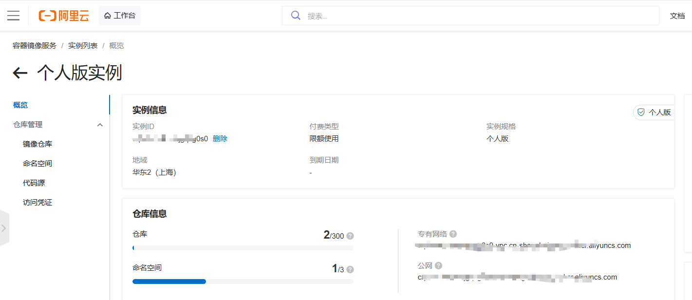
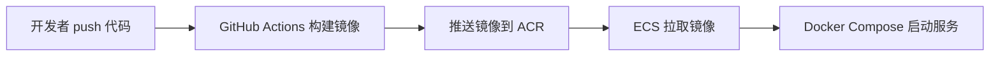
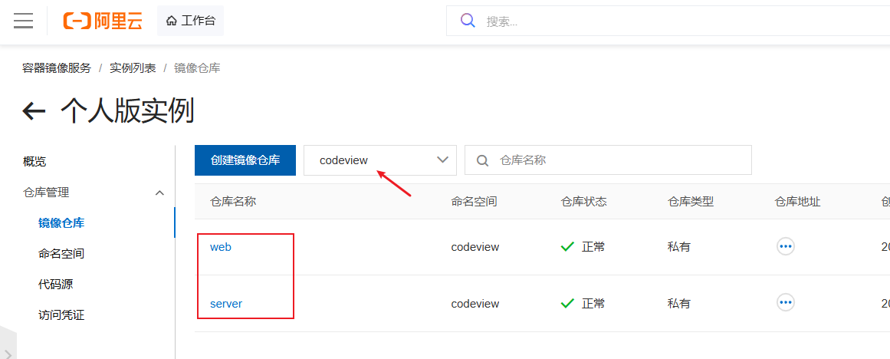
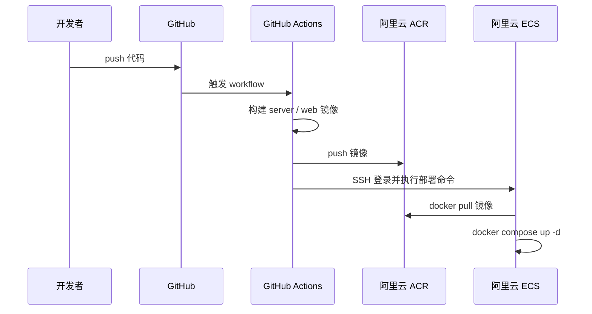

# 阿里云容器镜像服务是什么

> 阿里云容器镜像服务是什么，这篇文章结合下面的 CodeView 项目部署 讲清楚 ACR 在部署里的作用
>



## 一、先说结论：阿里云容器镜像服务到底是干什么的

很多人第一次把项目部署到阿里云 ECS 时，会卡在一个问题上：

“为什么还要多一个容器镜像服务？我不是已经有代码仓库和服务器了吗？”

如果用一句话解释：

**阿里云容器镜像服务 ACR，本质上是一个专门存放 Docker 镜像的仓库。**

它存的不是源码，而是已经构建好的运行产物。服务器真正拉取并运行的，不是 GitHub 仓库代码，而是这些镜像。

在 CodeView 这个项目里，ACR 的作用非常明确：

- GitHub 负责存源码
- GitHub Actions 负责构建镜像
- 阿里云 ACR 负责存镜像
- 阿里云 ECS 负责拉镜像并运行

只要把这四个角色分清楚，整个部署链路就会一下子清晰很多。

## 二、为什么只有 GitHub 和 ECS 还不够

很多人一开始会以为：

1. 代码在 GitHub
2. 服务器是 ECS
3. GitHub Actions SSH 到 ECS
4. 在 ECS 上执行 `docker compose up --build`

这样就够了。

理论上可以，但实际很容易出问题。

在 CodeView 这次部署中，真正遇到过的就是下面这些典型问题：

- ECS 上 Docker 服务可能还没启动
- ECS 拉 Docker Hub 基础镜像可能超时
- 服务器网络不适合承担构建任务
- 构建时间长，失败点多，不稳定

尤其是下面这个问题最关键：

```text
docker pull node:20-bookworm-slim
context deadline exceeded
```

这说明一件事：**服务器适合运行，不一定适合构建。**

所以部署方案才会演进成更稳定的结构：

- 在 GitHub Actions 里构建镜像
- 把镜像推到阿里云 ACR
- ECS 只负责拉镜像并运行

这就是 ACR 出场的真正原因。

## 三、什么是“镜像”，为什么它不是源码

想理解 ACR，先要理解“镜像”。

你可以把 Docker 镜像理解成：

**一个已经打包好的、可以直接运行的应用快照。**

它通常包含：

- 运行环境
- 系统依赖
- Node 版本
- 项目构建产物
- 启动命令
- Nginx 配置或应用运行配置

比如 CodeView 的 `web` 镜像里，放的是：

- 前端打包后的静态资源
- 容器内的 Nginx
- `/api` 的转发配置

`server` 镜像里放的是：

- Node.js 运行环境
- 编译后的后端代码
- 启动命令

所以镜像和源码的区别是：

- **源码**是给开发者看的
- **镜像**是给服务器运行的

GitHub 管源码，ACR 管镜像，职责完全不同。

## 四、阿里云容器镜像服务 ACR 可以把它理解成什么

如果你熟悉 GitHub 仓库，可以用一个很直白的类比：

- GitHub 仓库：存代码
- ACR 仓库：存镜像

只是 ACR 存的不是：

- `src/`
- `package.json`
- `README.md`

而是类似下面这种东西：

```text
crpi-********.cn-shanghai.personal.cr.aliyuncs.com/codeview/web:latest
crpi-********.cn-shanghai.personal.cr.aliyuncs.com/codeview/server:latest
```

这两条不是普通地址，而是镜像引用地址。

它告诉 Docker：

- 去哪个镜像仓库找
- 找哪个命名空间
- 找哪个镜像仓库
- 拉哪个标签版本

## 五、第一次看 ACR 时，最容易搞混的几个概念

很多人不是不会用，而是第一次看到控制台时，术语太多了。

下面这几个概念，最好一次分清。

### 1. 实例

你可以把实例理解成一个镜像服务的总体容器环境。

它像是“总入口”。

### 2. 登录地址

例如：

```text
crpi-********.cn-shanghai.personal.cr.aliyuncs.com
```

它决定了镜像仓库在哪个区域、通过哪个域名登录。

这在项目里通常对应：

```text
ACR_REGISTRY
```

### 3. 命名空间

例如：

```text
codeview
```

它可以理解成镜像仓库的一层分组。

这在项目里通常对应：

```text
ACR_NAMESPACE
```

### 4. 镜像仓库

例如：

- `server`
- `web`

合起来就形成：

```text
codeview/server
codeview/web
```

### 5. 标签 Tag

例如：

- `latest`
- `b5a114a`
- `9812a71`

标签的作用是标识镜像版本。

所以完整镜像地址通常长这样：

```text
crpi-********.cn-shanghai.personal.cr.aliyuncs.com/codeview/server:latest
```

它的拆解方式是：

- 注册表地址：`crpi-********.cn-shanghai.personal.cr.aliyuncs.com`
- 命名空间：`codeview`
- 仓库名：`server`
- 标签：`latest`

只要把这四层看明白，ACR 基本就不再神秘。

## 六、结合 CodeView 看，为什么我们最终选了 ACR

CodeView 的最终部署方案不是：

- ECS 自己构建镜像

而是：

- GitHub Actions 构建镜像
- 推送到阿里云 ACR
- ECS 从 ACR 拉取镜像

原因很现实。

### 1. ECS 只保留运行职责

服务器越少做事，线上就越稳定。

如果 ECS 既要：

- 拉源码
- 安装依赖
- 本地 build
- 构建 Docker 镜像
- 再启动服务

那它的失败点会非常多。

改成：

- ECS 只拉镜像
- ECS 只运行 compose

以后排查问题会轻很多。

### 2. ACR 离 ECS 更近，更适合阿里云内部部署链路

在这次实操里，Docker Hub 拉基础镜像就超时过。继续坚持完全依赖 Docker Hub，会把部署稳定性压在外部网络上。

而 ACR 作为阿里云自己的镜像仓库服务，更适合作为阿里云 ECS 的上游镜像来源。

### 3. 更适合 CI/CD

一旦把“构建”和“运行”拆开，自动化流程就会很清晰：



这就是标准的 CI/CD 思路。

## 七、CodeView 在 ACR 里实际存了什么

在 CodeView 这套部署里，ACR 里主要有两个镜像：



### 1. `server` 镜像

例如：

```text
crpi-********.cn-shanghai.personal.cr.aliyuncs.com/codeview/server:latest
```

它负责：

- Node.js 后端 API
- GitHub 数据同步
- SQLite 数据访问
- 定时任务恢复和执行

### 2. `web` 镜像

例如：

```text
crpi-********.cn-shanghai.personal.cr.aliyuncs.com/codeview/web:latest
```

它负责：

- 承载前端静态资源
- 容器内 Nginx 提供页面访问
- `/api` 转发给 `server:3101`

所以 ACR 不是只放一个“大镜像”，而是按服务维度拆开管理。

这也意味着以后如果项目继续演进，增加更多服务时，ACR 里只是多几个镜像仓库而已，结构不会乱。

## 八、GitHub、ACR、ECS 三者到底怎么配合

如果把这三个角色画成一条链路，会更容易理解：



整个流程里：

- GitHub 是代码源
- GitHub Actions 是构建器
- ACR 是镜像仓库
- ECS 是运行环境

你会发现，ACR 正好卡在“构建完成”和“正式运行”之间。

这就是它最核心的定位：

**镜像中转站，也是正式发布源。**

## 九、如果没有 ACR，会发生什么

如果不用 ACR，常见就只剩两种方案。

### 方案一：ECS 本地 build

问题是：

- 依赖服务器环境
- 容易受网络影响
- 构建慢
- 部署时长更长
- 失败点更多

### 方案二：继续用 Docker Hub 当私有发布源

也不是不行，但在阿里云 ECS 场景下，未必是最稳的做法。

尤其当你已经确定部署目标就是阿里云时，把镜像发布源放到阿里云体系内，通常会更顺手。

所以对于 CodeView 这种“个人项目 + ECS + Docker Compose”的组合，ACR 是一个非常合适的选择。

## 十、对新手来说，ACR 最重要的不是“学会所有功能”，而是先理解它的最小用途

第一次接触 ACR，没必要上来就研究很复杂的企业级能力。

对个人项目来说，你先把最小用途理解清楚就够了：

1. 创建实例
2. 创建命名空间
3. 创建镜像仓库
4. 让 GitHub Actions 登录 ACR
5. 把镜像 push 上去
6. 让 ECS 从 ACR pull 下来

只要完成这六步，ACR 就已经发挥作用了。

换句话说，**你不需要把 ACR 当成一个很复杂的平台，先把它当成“阿里云上的 Docker 镜像仓库”就行。**

## 十一、CodeView 这套方案里，ACR 的配置长什么样

在 CodeView 里，实际使用到的关键配置大致如下：

### 1. GitHub Secrets

```text
ACR_REGISTRY
ACR_NAMESPACE
ACR_USERNAME
ACR_PASSWORD
```

### 2. 生产环境 `.env`

```env
SERVER_IMAGE=crpi-********.cn-shanghai.personal.cr.aliyuncs.com/codeview/server:latest
WEB_IMAGE=crpi-********.cn-shanghai.personal.cr.aliyuncs.com/codeview/web:latest
```

### 3. Workflow 的核心逻辑

可以概括成下面几步：

1. `docker login` 登录 ACR
2. 构建 `server` 镜像
3. 构建 `web` 镜像
4. 推送两个镜像到 ACR
5. ECS 部署时执行 `docker compose pull`
6. ECS 再执行 `docker compose up -d`

所以 ECS 侧并不关心源码构建细节，它只认镜像地址。

## 十二、如果你换了自己的 ACR，哪些镜像地址必须一起改

这是实际部署里非常容易漏掉的一步。

很多人已经在阿里云上创建好了自己的 ACR：

- 自己的实例
- 自己的命名空间
- 自己的 `server` 和 `web` 仓库

但如果项目里还保留着原来的镜像地址，ECS 拉取的仍然不是你自己的镜像，部署自然会出问题。

在 CodeView 这套方案里，**镜像地址至少有两个地方必须同步改**。

### 1. GitHub Actions 里的 ACR 配置

GitHub Actions 构建和推送镜像时，用的是这些 Secrets：

```text
ACR_REGISTRY
ACR_NAMESPACE
ACR_USERNAME
ACR_PASSWORD
```

比如你自己的 ACR 是：

```text
ACR_REGISTRY=crpi-xxxxxxxx.cn-shanghai.personal.cr.aliyuncs.com
ACR_NAMESPACE=codeview
```

那么 workflow 在 push 镜像时，最终就会生成：

```text
crpi-xxxxxxxx.cn-shanghai.personal.cr.aliyuncs.com/codeview/server:latest
crpi-xxxxxxxx.cn-shanghai.personal.cr.aliyuncs.com/codeview/web:latest
```

所以第一步不是改代码，而是先确认 GitHub 仓库里的 Secrets 已经换成你自己的值。

### 2. ECS 共享环境文件里的镜像地址

ECS 启动 Compose 时，真正读取的是：

```text
/var/www/codeview/shared/.env
```

里面这两个值必须和你自己的 ACR 保持一致：

```env
SERVER_IMAGE=crpi-xxxxxxxx.cn-shanghai.personal.cr.aliyuncs.com/codeview/server:latest
WEB_IMAGE=crpi-xxxxxxxx.cn-shanghai.personal.cr.aliyuncs.com/codeview/web:latest
```

也就是说：

- GitHub Actions 决定“镜像推到哪里”
- ECS `.env` 决定“服务器从哪里拉镜像”

这两个地方只改一个都不够，必须一起对上。

### 3. 最容易忽略的错误场景

最常见的错误有三种：

#### 场景一：Secrets 改了，ECS `.env` 没改

结果：

- GitHub Actions 已经把新镜像推到你自己的 ACR
- 但 ECS 还在按旧地址拉镜像

表现通常是：

- `docker compose pull` 拉不到镜像
- 或者拉到的不是你刚构建的新版本

#### 场景二：ECS `.env` 改了，Secrets 没改

结果：

- ECS 去你自己的 ACR 拉镜像
- 但 GitHub Actions 其实还在往旧 ACR 推

表现通常是：

- 服务器一直找不到对应 tag
- 你以为已经发布了，实际上新镜像根本没进你现在用的仓库

#### 场景三：只改了仓库名，没有改命名空间或 registry

例如把：

```text
codeview/server
```

改了，但：

```text
crpi-xxxxx.cn-shanghai.personal.cr.aliyuncs.com
```

或者命名空间 `codeview` 没同步改对。

结果一样会导致镜像地址不完整或不匹配。

### 4. 一个最稳的检查办法

可以按下面顺序检查：

1. 看 GitHub Secrets 里的 `ACR_REGISTRY` 和 `ACR_NAMESPACE`
2. 看 ECS `/var/www/codeview/shared/.env` 里的 `SERVER_IMAGE` 和 `WEB_IMAGE`
3. 确认两边拼出来的镜像地址完全一致

例如当前项目正确对齐后应该像这样：

```text
crpi-********.cn-shanghai.personal.cr.aliyuncs.com/codeview/server:latest
crpi-********.cn-shanghai.personal.cr.aliyuncs.com/codeview/web:latest
```

只要这两边不一致，部署大概率就会出问题。

## 十三、为什么说 ACR 让部署更像“发布”，而不是“现场组装”

这是我觉得最值得强调的一点。

没有 ACR 时，部署更像：

- 到服务器上装环境
- 现场拉依赖
- 现场 build
- 现场拼装
- 希望它能一次成功

而有了 ACR 之后，部署变成了：

- 先在 CI 中把成品打包好
- 把成品放进镜像仓库
- 服务器只负责拿成品运行

这两种思路差别非常大。

前者像“现场施工”，后者像“工厂预制 + 现场安装”。

对真实线上环境来说，后者显然更稳。

## 十四、这篇文章最适合哪些人看

这篇文章特别适合下面几类人：

- 第一次接触阿里云 ECS 部署的人
- 知道 Docker，但不理解镜像仓库作用的人
- 已经有 GitHub Actions，但不清楚 ACR 为什么还要接进来的人
- 准备用 Docker Compose 部署个人项目的人

如果你当前的项目和 CodeView 类似：

- 前后端分离
- 服务数量不多
- 用单台 ECS 部署
- 希望提交代码后自动更新

那么“GitHub Actions + ACR + ECS + Docker Compose”这条链路，基本就是一个很合理的起点。

## 十五、结论

阿里云容器镜像服务 ACR，并不是一个“额外增加复杂度”的东西，恰恰相反，它是在帮你把部署流程拆清楚。

在 CodeView 这次实践里，ACR 解决的不是一个抽象问题，而是非常具体的两个痛点：

1. ECS 不适合承担镜像构建职责。
2. 需要一个稳定的镜像发布源，让 ECS 只做拉取和运行。

所以如果你还在纠结“我的项目到底要不要接 ACR”，可以先用最朴素的判断标准：

如果你希望：

- 自动部署
- 服务器少干活
- 部署链路更稳定
- 镜像版本更清晰

那 ACR 基本就是值得接入的。

对于 CodeView 这种部署到阿里云 ECS 的项目来说，ACR 不是可有可无的配角，而是整条部署链路里非常关键的一环。

## 十六、延伸阅读

如果你想继续看完整的 CodeView 上线过程，可以结合这篇文档一起看：

- [CodeView 部署实战博客](./CodeView部署实战博客.md)
- [Docker Compose 部署到 ECS 说明](./Docker%20Compose部署到ECS说明.md)
