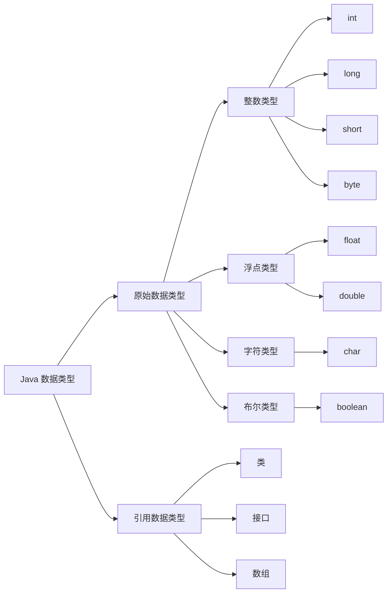

## 样式测试

> 样式测试

<sapn class="marker-text">这里是重重点</sapn>

---

<sapn class="marker-text-highlight">这里是荧光笔这里是荧光笔这里是荧光笔这里是荧光笔这里是荧光笔这里是荧光笔这里是荧光笔</sapn>

---

<sapn class="marker-evy">这里是尤雨溪的主页样式，鼠标放在我上面看效果</sapn>

**代码块样式测试**

```
├─ docs
│  ├─ .vitepress
│  │  └─ config.mts
│  │  └─ theme
│  │     └─ style
│  │        └─ index.css
│  │        └─ vp-code.css
│  └─ index.md
└─ node_modules
```

**代码组样式测试**

::: code-group

```sh [pnpm]
#查询pnpm版本
pnpm -v
```

```sh [yarn]
#查询yarn版本
yarn -v
```

:::

## 标题下显示更新时间

<update />

## todo 列表

- [ ] 吃饭
- [ ] 睡觉
- [x] 打豆豆

## mermaid 流程图



### 效果演示

::: tip 更多徽章样式 https://github.com/Ileriayo/markdown-badges

https://github.com/Envoy-VC/awesome-badges 


:::


**效果：**

#### 前端技术栈

<p>
   
   
   
   
   
   
   
   
   
   
   
   
   
   
  
  
  
   
   
   
</p>

#### DevOps

<p>
   
   
   
   
   
   
   
   
   
   
   
   
</p>

#### 运维技术栈

<p>
   
   
   
   
   
   
   
</p>

#### 测试技术栈

<p>
   
   
</p>

#### 开发工具

<p>
   
   
   
   
   
   
</p>

#### 其他

<p>
   
   
   
   
</p>
