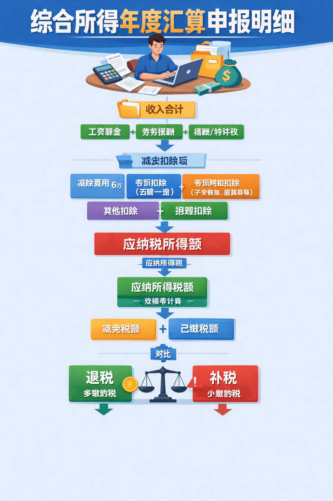

# 个人所得税已缴税额详解

[[toc]]

<!-- markdownlint-disable MD033 -->
<div style="text-align: center;">
  
</div>
<!-- markdownlint-enable MD033 -->

**综合所得年度汇算申报明细** 是中国个人所得税年度汇算清缴时的一张核心计算表。
它会把你 **一年所有综合所得 + 各种扣除项 + 已缴税额** 汇总，然后计算：

* 是否需要 **补税**
* 是否可以 **退税**

这个申报一般在每年 **3月1日–6月30日** 通过
个人所得税APP 完成。

下面把你列出的每一项 **逐个解释清楚，并给出计算逻辑**。

## 一、综合所得包含哪些收入

在中国个人所得税体系里，综合所得包括四类收入：

* 1️⃣ 工资薪金

上班族按月领取的固定收入,单位每月代扣个税，采用累计预扣法,3%-45%累进税率

* 2️⃣ 劳务报酬

自由接单如兼职、咨询、设计、讲课等非雇佣收入，按次/按月预扣，汇算时并入综合所得，扣20%费用

* 3️⃣ 稿酬

文字创作：出书、发表文章、翻译等，同劳务报酬预扣，但汇算时收入额减按70%计算（打7折）

* 4️⃣ 特许权使用费

知识产权：专利、商标、著作权、非专利技术等授权收入，同劳务报酬预扣方式，汇算时并入综合所得（程序员卖代码、设计师卖模板、发明人授权专利等）,扣20%费用

> 年度汇算就是把 **这四类收入全年合并计算**。

## 二、收入合计

**收入合计 = 全年综合所得总收入**

包含：

```text
工资薪金
劳务报酬
稿酬
特许权使用费
```

例如：

```text
工资收入      180000
劳务收入       20000
稿酬收入        5000
—————————————
收入合计      205000
```

注意：

这是 **税前收入**。

## 三、费用合计

**费用合计**主要指：

劳务报酬 / 稿酬 / 特许权使用费的 **费用扣除比例**

税法规定：

| 收入类型   | 扣除比例 |
| ------ | ---- |
| 劳务报酬   | 20%  |
| 稿酬     | 20%（稿酬所得的收入额减按百分之七十计算。）  |
| 特许权使用费 | 20%  |

**年度汇算时，劳务报酬、稿酬、特许权使用费所得如何计算收入额？**

**答：** 劳务报酬所得、稿酬所得、特许权使用费所得以收入减除百分之二十的费用后的余额为收入额。稿酬所得的收入额减按百分之七十计算。

**举例：** 居民个人小赵 2019 年取得工资收入 80000 元、劳务报酬收入 50000 元、特许权使用费收入 100000 元、稿酬收入 40000 元，请计算小赵 2019 年综合所得收入额是多少？

**所得收入额：** 80000+（50000+100000）×（1-20%）+40000×（1-20%）×70%=222400（元）

参考网站：[中国个人所得税年度汇算申报明细计算方法](https://hainan.chinatax.gov.cn/gzcy_2_4/09124629.html)

> 工资薪金一般 **没有这个费用扣除**。

## 四、免税收入

**免税收入 = 国家规定不用交税的收入**

常见包括：

* 生育津贴
* 工伤补助
* 保险赔付
* 国家补贴
* 军人津贴

例如：

```text
生育津贴 15000
```

就会算在免税收入。

## 五、减除费用

这是 **所有人都有的基础扣除**

中国个人所得税规定：

```text
每人每年 60000 元
```

也就是：

```text
每月 5000
全年 60000
```

这个叫：

**基本减除费用**

## 六、专项扣除合计

专项扣除是 **五险一金**。

包括：

```text
养老保险
医疗保险
失业保险
住房公积金
基本医疗保险
```

例如一年缴纳：

```text
养老保险      18000
医疗保险       5000
失业保险        800
公积金        20000
————————————
专项扣除合计  43800
```

## 七、专项附加扣除合计

这是国家鼓励政策，可以额外扣除。

主要包括：

| 扣除项目    | 金额         |
| ------- | ---------- |
| 子女教育    | 1000/月     |
| 继续教育    | 400/月      |
| 住房贷款利息  | 1000/月     |
| 租房      | 800-1500/月 |
| 赡养老人    | 2000/月     |
| 3岁以下婴幼儿 | 2000/月     |

例如：

```text
房贷利息 12000
赡养老人 24000
————————
专项附加扣除 36000
```

## 八、其他扣除合计

这部分比较少见，例如：

* 企业年金
* 职业年金
* 商业健康保险
* 税延养老保险

例如：

```text
商业健康保险 2400
```

## 九、准予扣除的捐赠额

如果你向公益机构捐款，可以扣税。

但有比例限制：

```text
不超过应纳税所得额的 30%
```

例如：

```text
公益捐款 5000
```

可以在这里扣除。

## 十、应纳税所得额

这是 **最关键的一项**。这是计算税的基础金额.

计算公式：

```text
应纳税所得额
=
收入合计
- 费用合计
- 免税收入
- 减除费用
- 专项扣除
- 专项附加扣除
- 其他扣除
- 捐赠扣除
```

举个完整例子：

```text
收入合计           200000
费用合计            4000
免税收入               0
减除费用           60000
专项扣除           43800
专项附加扣除       36000
其他扣除            2400
捐赠扣除            5000
——————————————
应纳税所得额       48800
```

这个 `48800` 只是“计税基础”，还没算税。

## 十一、应纳所得税额(应纳税额)

根据 **个人所得税税率表**计算。

中国综合所得税率：

| 级数 | 全年应纳税所得额           | 税率  | 速算扣除数   |
| :- | :----------------- | :-- | :------ |
| 1  | 不超过36,000元         | 3%  | 0       |
| 2  | 超过36,000至144,000元  | 10% | 2,520   |
| 3  | 超过144,000至300,000元 | 20% | 16,920  |
| 4  | 超过300,000至420,000元 | 25% | 31,920  |
| 5  | 超过420,000至660,000元 | 30% | 52,920  |
| 6  | 超过660,000至960,000元 | 35% | 85,920  |
| 7  | 超过960,000元         | 45% | 181,920 |

计算公式：

```plain
应纳税额 = 应纳税所得额 × 税率 − 速算扣除数
```

例如：

```text
应纳税所得额 80000
税率 10%
速算扣除数 2520
```

计算：

```text
应纳税额 = 80000 × 10% - 2520
        = 5480
```

这个 `5480` 就是应纳税额。需要上交给国家的钱。

## 十二、减免税额

国家政策允许减免的税。

例如：

* 残疾人减税
* 特殊人才政策
* 科研奖励

普通人一般 **为0**。

## 十三、已缴税额（全年已预缴的个人所得税）

这是公司 **已经帮你预扣的税**。
公司每月发工资时帮你代扣的个税。

例如：

```text
1月 扣税 300
2月 扣税 350
3月 扣税 320
...
12月 扣税 400

全年：
已缴税额 = 4200
```

这些数据会自动同步到个人所得税APP。这个就叫 **已缴税额**。

**中国个税采用：预扣预缴制度**

意思是：

```text
每月先按估算扣税
年底再统一结算
```

### 每月计算公式

```text
当月应预缴税额 =
    (累计收入 - 累计扣除项) × 税率 - 速算扣除数
    - 之前月份已缴税额
```

关键步骤：

| 步骤      | 操作                           |
| :------ | :--------------------------- |
| 1. 算累计  | 从1月到当月，收入逐月累加                |
| 2. 算扣除  | 5000元/月 + 三险一金 + 专项附加扣除，同样累计 |
| 3. 找税率  | 按累计应纳税所得额查税率表（3%-45%）        |
| 4. 算累计税 | 累计应纳税所得额 × 税率 - 速算扣除数        |
| 5. 减已缴  | 累计应缴税额 - 之前月份已缴 = 当月应缴       |

### 为什么会"跳档"？

| 阶段  | 累计应纳税所得额   | 税率  | 现象           |
| :-- | :--------- | :-- | :----------- |
| 年初  | 0-36,000元  | 3%  | 每月个税较低且稳定    |
| 年中  | 超过36,000元  | 10% | **当月个税突然增加** |
| 下半年 | 超过144,000元 | 20% | 继续跳档，税款更高    |

本质：收入累计越多，超出部分适用更高税率，不是扣错了。

### 全年流程图

```text
1-12月 每月发薪
    │
    ├── 单位算累计收入
    ├── 算累计扣除（6万/年+三险一金+专项附加）
    ├── 查税率（可能跳档）
    ├── 扣当月个税
    │
    ▼
全年累计 = 已缴税额（系统会自动汇总）
    │
    ▼
次年3-6月 年度汇算
    │
    ├── 算全年实际应缴税额
    ├── 对比已缴税额
    │
    ├── 已缴 > 应缴 → 退税
    ├── 已缴 < 应缴 → 补税
    └── 已缴 = 应缴 → 不补不退
```

## 十四、最终退税或补税

最终计算：

```text
应纳税额
- 减免税额
- 已缴税额
```

结果：

### 情况1：多缴税

```text
应纳税额 4000
已缴税额 6000
```

退税：

```text
2000
```

### 情况2：少缴税

```text
应纳税额 6000
已缴税额 4000
```

补税：

```text
2000
```

## 十五、完整计算流程图

整个年度汇算其实就是：

```text
收入合计
   │
   ├── 减：费用合计（劳务稿酬等20%）
   ├── 减：免税收入
   │
   ▼
应税收入
   │
   ├── 减：减除费用（6万）
   ├── 减：专项扣除（三险一金）
   ├── 减：专项附加扣除（7项）
   ├── 减：其他扣除（年金等）
   ├── 减：准予扣除的捐赠额
   │
   ▼
应纳税所得额 ──→ 查税率表 ──→ 应纳所得额
   │                           │
   │                           ├── 减：减免税额
   │                           ├── 减：已缴税额（预扣预缴）
   │                           │
   │                           ▼
   │                       应退/补税额
   │                      （正数补税，负数退税）
   ▼
年度汇算结果
```

✅ **一句话总结**

综合所得年度汇算就是：

**把全年收入统一计算，减去所有合法扣除，再和已缴税比较，决定退税还是补税。**
