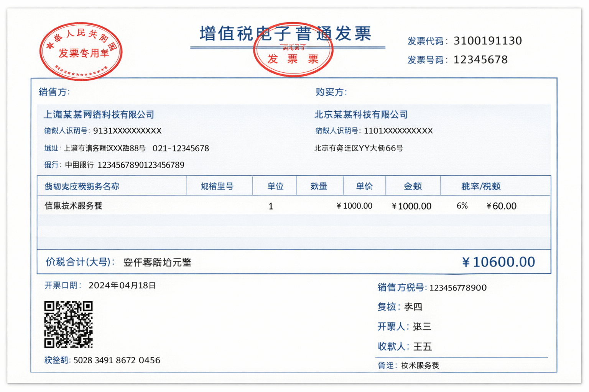

# 为什么开发票要填公司抬头和税号？公司就一定能报销吗？

[[toc]]



很多人开发票时都会遇到一个问题：

> 只要填了公司的 **发票抬头 + 税号**，公司就一定能报销吗？

答案是：**不一定。**

填写公司抬头和税号，只是 **具备了报销的基础条件**，但最终能不能报销，还要看很多因素。

下面用最简单的方式，把这件事讲清楚。

## 一、什么是发票抬头

**发票抬头，就是发票开给谁的名字。**

例如：

个人消费：

```
发票抬头：张三
```

公司消费：

```
发票抬头：上海某某科技有限公司
纳税人识别号：9131XXXXXXXXXXXX
```

如果是公司报销，一般都需要填写：

* **公司名称（发票抬头）**
* **纳税人识别号（税号）**

这两项信息。

## 二、为什么公司报销必须填写公司抬头

公司报销的本质，其实是 **财务做账和税务合规**。

根据税务规定，一张企业入账的发票必须证明四件事：

1️⃣ **谁买的（购买方）**
2️⃣ **买了什么（商品或服务）**
3️⃣ **金额多少**
4️⃣ **发票是否合法**

如果发票是这样：

```
发票抬头：张三
```

那从税务角度看，这笔消费就是：

**张三的个人消费。**

而不是公司的支出。

因此公司就无法：

* 作为企业成本入账
* 抵扣企业所得税
* 进行税务合规记账

所以很多公司会直接规定：

> **个人抬头发票，一律不能报销。**

## 三、为什么填公司抬头就可以报销

如果发票是这样：

```
发票抬头：上海某某科技有限公司
纳税人识别号：9131XXXXXXXX
```

那就代表：

**这笔消费是公司产生的费用。**

财务就可以把这笔费用计入企业成本。

例如员工买办公用品：

```
发票抬头：上海某某科技有限公司
金额：200元
内容：办公用品
```

财务做账时会记录：

```
借：管理费用 200
贷：现金 / 银行 200
```

这样企业就完成了一笔 **成本入账**。

## 四、填了公司抬头，也不一定能报销

很多人以为：

> 只要发票写公司名字就能报销。

其实并不是。

即使抬头正确，也可能 **无法报销**。

常见原因有三个。

### 1. 发票内容不符合公司制度

例如员工开了这样一张发票：

```
发票内容：香烟
```

很多公司的报销制度规定：

以下消费不能报销：

* 香烟
* 个人消费
* 娱乐消费
* 与工作无关的费用

因此财务可能直接拒绝报销。

### 2. 发票类型不符合要求

公司报销通常要求 **正规发票**。

例如：

* 增值税普通发票
* 增值税专用发票

如果只是：

```
收据
```

这种一般 **无法入账**。

所以公司也无法报销。

### 3. 发票不合法

例如：

* 假发票
* 发票金额异常
* 发票重复报销

很多公司现在都会通过 **国家税务系统查验发票**。

如果发票查验失败，也不能报销。

## 五、为什么公司一定要发票

很多人会问：

> 为什么公司报销一定要发票？

原因其实只有一个：

**税务合规。**

举个简单例子。

假设一家公司一年收入：

```
100万
```

如果没有任何成本发票：

```
利润 = 100万
```

企业所得税：

```
100万 × 25% = 25万
```

但如果公司有很多成本发票：

```
办公费 10万
服务器费 20万
差旅费 10万
```

总成本：

```
40万
```

利润变成：

```
100 - 40 = 60万
```

企业所得税：

```
60万 × 25% = 15万
```

公司就 **少交了10万税**。

所以企业一定要通过发票来记录成本。

## 六、为什么很多平台都要填写“发票抬头+税号”

现在很多平台都会要求填写发票信息，比如：

* 打车软件
* 电商平台
* SaaS服务
* 云服务器

通常填写内容是：

```
发票类型：企业
发票抬头：上海某某科技有限公司
税号：9131XXXXXXXX
```

系统就会自动生成发票：

```
购买方：上海某某科技有限公司
纳税人识别号：9131XXXXXXXX
```

员工下载发票后，就可以提交公司报销。
