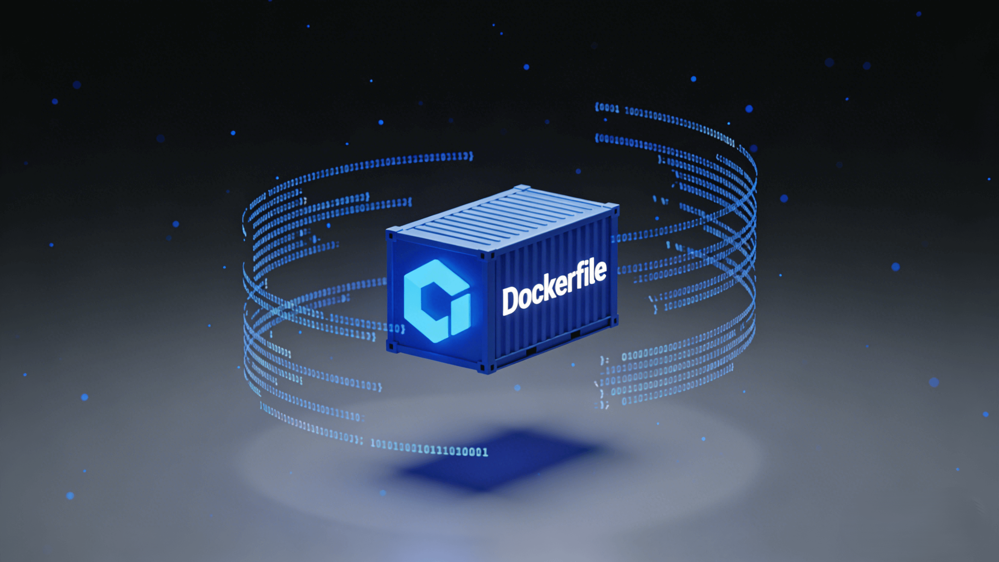

# Dockerfile：如何构建 Docker 镜像

[[toc]]



在前端工程化和部署中，**Dockerfile 是把“代码”变成“可运行应用”的关键文件**。

> **Dockerfile 是一份描述“如何构建 Docker 镜像”的脚本文件**

Docker 会 **从上到下逐行执行** Dockerfile 中的指令，最终生成一个镜像（Image）。

## 一、Dockerfile 的核心执行模型

### 1.1 分层（Layer）机制

每一条指令都会生成一层：

```dockerfile
FROM node:18-alpine
RUN pnpm install
RUN pnpm build
```

- 上一层不变 → 下一层可复用缓存
- 层越稳定，构建越快

👉 **理解缓存 = 写好 Dockerfile 的关键**

### 1.2 镜像 ≠ 容器

| 概念      | 含义             |
| --------- | ---------------- |
| Image     | 构建好的“模版”   |
| Container | Image 的运行实例 |

Dockerfile → Image → Container

## 二、Dockerfile 常用指令讲解

### 2.1 FROM：基础镜像

```dockerfile
FROM node:18-alpine
```

- 一切镜像的起点
- `alpine` 体积小，适合生产

### 2.2 WORKDIR：工作目录

```dockerfile
WORKDIR /app
```

- 类似 `cd /app`
- 后续指令都在这个目录执行

### 2.3 COPY / ADD：拷贝文件

```dockerfile
COPY package.json ./
```

- COPY：最常用（推荐）
- ADD：功能多（一般不用）

### 2.4 RUN：构建时执行命令

```dockerfile
RUN pnpm install
```

- 发生在 **build 阶段**
- 会生成新的镜像层

### 2.5 CMD / ENTRYPOINT：容器启动命令

```dockerfile
CMD ["nginx", "-g", "daemon off;"]
```

- 容器启动后执行
- 必须是前台进程

### 2.6 EXPOSE：声明端口

```dockerfile
EXPOSE 80
```

- 只是声明
- 真正端口映射由 `docker run -p` 决定

## 三、什么是多阶段构建？（重点）

### 问题背景

前端构建需要：

- Node
- pnpm
- node_modules（很大）

但运行时只需要：

- dist
- Nginx

👉 **如果都打进一个镜像，会非常臃肿**

> **构建阶段很重，运行阶段很轻**

```dockerfile
FROM node AS builder
...
FROM nginx
```

- 第一阶段：只负责 build
- 第二阶段：只负责 run
- 最终镜像只保留第二阶段内容

## 四、前端项目 Dockerfile 实战(完整配置)

`Dockerfile` 是一个用来 `构建镜像文件的文本文件，Dockerfile` 文件内包含了构建镜像所需的各种信息。

### 4.1 编写 Dockerfile

以 **Vue3 的客户端渲染** 为例：

在项目根目录下创建一个名为 `Dockerfile` 的文件，并在文件中编写镜像构成的信息。

```dockerfile
# 第一阶段：构建应用

# 选择一个基础镜像作为运行环境
FROM node:18-alpine AS builder

# 设置工作目录
# 在镜像内切换一个工作目录，后续所有的操作都是基于这个目录来的
WORKDIR /app

# 把复制 package.json 和 lock 文件 复制到镜像的工作目录
COPY package*.json pnpm-lock.yaml ./

# 安装 pnpm
RUN npm install -g pnpm@10.7.0

# 安装依赖
RUN pnpm install --frozen-lockfile

# 复制项目文件
# 将项目文件拷贝到镜像的工作目录 第一个 “.” 代表当前目录，第二个 “.” 代表镜像的工作目录
COPY . .

# 构建项目
RUN pnpm run build

# 第二阶段：运行应用

# 选择nginx服务前端项目
FROM nginx:alpine

# 复制自定义 nginx 配置
# 把 本地的nginx.conf配置 复制到镜像的 nginx 配置目录
COPY nginx.conf /etc/nginx/conf.d/default.conf

# 从构建阶段复制构建产物到 nginx 目录
# 把 构建阶段的 /app/dist 目录 复制到 镜像的 nginx 目录 /usr/share/nginx/html/vue3
COPY --from=builder /app/dist /usr/share/nginx/html/vue3

# 声明对外提供服务的端口是哪个
EXPOSE 80

# 启动 nginx 服务
# 启动 nginx 服务，并且保持在前台运行，否则容器会立即退出
CMD ["nginx", "-g", "daemon off;"]

```

上面用到的 `nginx.conf` 配置文件内容如下：

```nginx.conf
server {
    listen 80;
    server_name localhost;

    # 设置根目录
    root /usr/share/nginx/html;

    # 开启 gzip 压缩
    gzip on;
    gzip_vary on;
    gzip_min_length 1024;
    gzip_types text/plain text/css text/xml text/javascript application/x-javascript application/xml+rss application/javascript application/json;

    # 处理 /vue3/ 路径
    location /vue3/ {
        alias /usr/share/nginx/html/vue3/;
        try_files $uri $uri/ /vue3/index.html;

        # 设置缓存策略
        location ~* \.(js|css|png|jpg|jpeg|gif|ico|svg|woff|woff2|ttf|eot)$ {
            expires 1y;
            add_header Cache-Control "public, immutable";
        }
    }

    # 处理根路径，重定向到 /vue3/
    location = / {
        return 301 /vue3/;
    }

    # 错误页面
    error_page 404 /vue3/index.html;

    # 健康检查端点
    location /health {
        access_log off;
        return 200 "healthy\n";
        add_header Content-Type text/plain;
    }
}
```

**这份 Dockerfile 做了什么？**

1. 用 Node 构建前端
2. 得到 `dist` 静态资源
3. 用 Nginx 提供 HTTP 服务
4. **最终镜像中没有 Node / pnpm / node_modules**

👉 这是**前端生产部署的标准写法**

### 4.2 构建镜像

`Dockerfile` 文件写好了，可以使用 docker build 构建镜像。

```bash
#使用当前目录下的 Dockerfile 构建一个名为 vue3-nginx 的 Docker 镜像的命令。
docker build -t vue3-nginx .
```

```powershell
PS D:\MyProjects\vue3> docker build -t vue3-nginx .
[+] Building 2.3s (16/16) FINISHED                                                                docker:desktop-linux
 => [internal] load build definition from Dockerfile                                                              0.1s
 => => transferring dockerfile: 745B                                                                              0.0s
 => [internal] load metadata for docker.io/library/node:18-alpine                                                 1.3s
 => [internal] load metadata for docker.io/library/nginx:alpine                                                   1.4s
 => [internal] load .dockerignore                                                                                 0.1s
 => => transferring context: 122B                                                                                 0.0s
 => [internal] load build context                                                                                 0.1s
 => => transferring context: 2.43kB                                                                               0.0s
 => [stage-1 1/3] FROM docker.io/library/nginx:alpine@sha256:8491795299c8e739b7fcc6285d531d9812ce2666e07bd3dd8db  0.1s
 => => resolve docker.io/library/nginx:alpine@sha256:8491795299c8e739b7fcc6285d531d9812ce2666e07bd3dd8db00020ad1  0.1s
 => [builder 1/7] FROM docker.io/library/node:18-alpine@sha256:8d6421d663b4c28fd3ebc498332f249011d118945588d0a35  0.1s
 => => resolve docker.io/library/node:18-alpine@sha256:8d6421d663b4c28fd3ebc498332f249011d118945588d0a35cb9bc4b8  0.1s
 => CACHED [stage-1 2/3] COPY nginx.conf /etc/nginx/conf.d/default.conf                                           0.0s
 => CACHED [builder 2/7] WORKDIR /app                                                                             0.0s
 => CACHED [builder 3/7] COPY package*.json pnpm-lock.yaml ./                                                     0.0s
 => CACHED [builder 4/7] RUN npm install -g pnpm@10.7.0                                                           0.0s
 => CACHED [builder 5/7] RUN pnpm install --frozen-lockfile                                                       0.0s
 => CACHED [builder 6/7] COPY . .                                                                                 0.0s
 => CACHED [builder 7/7] RUN pnpm run build                                                                       0.0s
 => CACHED [stage-1 3/3] COPY --from=builder /app/dist /usr/share/nginx/html/vue3                                 0.0s
 => exporting to image                                                                                            0.3s
 => => exporting layers                                                                                           0.0s
 => => exporting manifest sha256:10829a6b02ed1459e7ae654ae3c25134eed4a601af256e66cca4fcfb9e14d04d                 0.0s
 => => exporting config sha256:84371a30f425f37ada0766aabc55b08f2c3f649d099f262dba197efc95de19a1                   0.0s
 => => exporting attestation manifest sha256:82afd6a7054e8d08bb90fbd039645bd83b05749ab571fb00e20461723ffe43de     0.1s
 => => exporting manifest list sha256:c7cefbe6161349c472c3a55979706b30fcd96eadaf6bcc60fdc5b4117a31398e            0.0s
 => => naming to docker.io/library/vue3-nginx:latest                                                              0.0s
 => => unpacking to docker.io/library/vue3-nginx:latest                                                           0.0s

View build details: docker-desktop://dashboard/build/desktop-linux/desktop-linux/tcpllf3uo107qcencwdnv9rjz
```

### 4.3 创建容器并运行

```bash
# 在后台运行一个名为 vue3-nginx-container 的容器，使用 vue3-nginx 镜像，将容器的 80 端口映射到宿主机的 8080 端口。
docker run -d -p 8080:80 --name vue3-nginx-container vue3-nginx
```

```powershell
# 创建容器并运行
PS D:\MyProjects\vue3> docker run -d -p 8080:80 --name vue3-nginx-container vue3-nginx
bb08d4f206f54210e832d02cf274a1ae10cd65047ace7118977438ad59fe0249

# 查看本地所有容器
PS D:\MyProjects\vue3> docker ps -a
CONTAINER ID   IMAGE        COMMAND                  CREATED              STATUS                      PORTS                                         NAMES
bb08d4f206f5   vue3-nginx   "/docker-entrypoint.…"   About a minute ago   Up About a minute           0.0.0.0:8080->80/tcp, [::]:8080->80/tcp       vue3-nginx-container
67f154e037dd   yqzl-app     "docker-entrypoint.s…"   19 hours ago         Up 19 hours                 0.0.0.0:3000->3000/tcp, [::]:3000->3000/tcp   yqzl-app
cb93546dda15   redis        "docker-entrypoint.s…"   21 hours ago         Exited (0) 21 hours ago
                             zen_turing
86cdd5f429ad   redis        "docker-entrypoint.s…"   2 weeks ago          Exited (255) 42 hours ago   0.0.0.0:6379->6379/tcp                        my-redis
PS D:\MyProjects\vue3>
```

**流程结束。**
