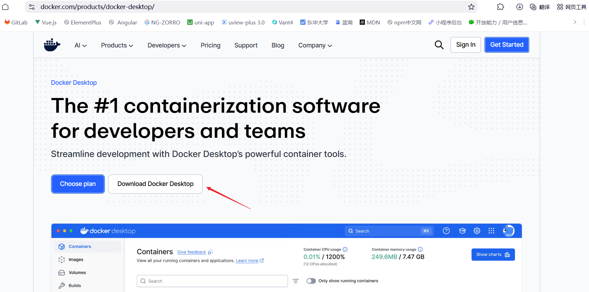
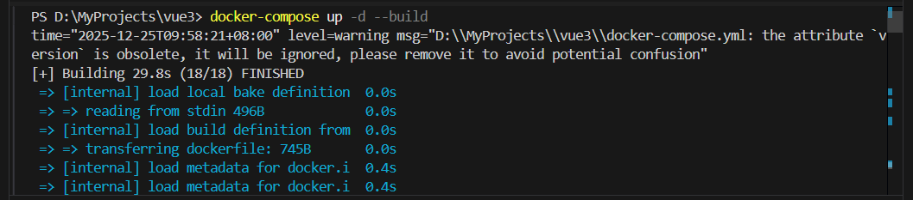
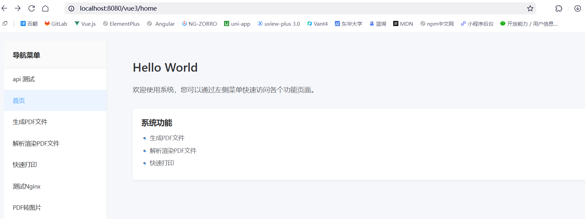

# 使用 Docker 本地部署 CSR 前端项目完整指南

> 本文将详细介绍如何使用 Docker 在本地部署一个基于 Vue3 + Vite 的客户端渲染（CSR）前端项目，包括完整的配置文件、部署流程和常见问题解决方案。

[[toc]]

## 一、前言

在现代前端开发中，`Docker` 已经成为项目部署的标准工具之一。通过` Docker`，我们可以将前端应用及其运行环境打包成一个独立的容器，实现"一次构建，到处运行"的目标。本文将以一个 Vue3 项目为例，详细介绍如何使用 `Docker` 进行本地部署。

**本项目使用的技术栈：**

- **前端框架**：Vue 3.4.21
- **构建工具**：Vite 5.2.0
- **UI 框架**：Element Plus 2.5.3
- **包管理器**：pnpm 10.7.0
- **容器化**：Docker + Docker Compose
- **Web 服务器**：Nginx (Alpine)

## 二、为什么使用 Docker 部署前端项目

**优势**

1. **环境一致性**：开发、测试、生产环境完全一致，避免"在我机器上能跑"的问题
2. **快速部署**：一条命令即可完成部署，无需手动配置 Nginx
3. **易于维护**：配置文件化，版本可控
4. **资源隔离**：容器之间相互独立，互不影响
5. **易于扩展**：可以轻松实现负载均衡和水平扩展

**适用场景**

- 本地开发环境搭建
- 团队协作开发
- CI/CD 流程
- 生产环境部署
- 微服务架构

## 三、准备工作

### 3.1 安装 Docker Desktop

**Windows 用户**：

- 访问 [Docker Desktop 官网](https://www.docker.com/products/docker-desktop/)
- 下载并安装 Docker Desktop for Windows
- 启动 Docker Desktop



**验证安装**：

```powershell
docker --version
docker-compose --version
```

### 3.2 配置 Docker 镜像加速器（可选但推荐）

在中国大陆，访问 `Docker Hub` 可能较慢，建议配置国内镜像源。

打开 `Docker Desktop → Settings → Docker Engine`，添加以下配置：

```json
{
  "builder": {
    "gc": {
      "defaultKeepStorage": "20GB",
      "enabled": true
    }
  },
  "experimental": false,
  "registry-mirrors": ["https://docker.m.daocloud.io", "https://docker.1panel.live", "https://hub.rat.dev"]
}
```

**如图所示：**


点击 **Apply & Restart** 重启 Docker。

## 四、项目结构和配置文件详解

**前端项目结构**

主要添加：`Dockerfile、docker-compose.yml、nginx.conf、.dockerignore`文件

```
vue3/
├── src/                    # 源代码目录
├── public/                 # 静态资源
├── dist/                   # 构建输出目录（自动生成）
├── node_modules/           # 依赖包
├── package.json            # 项目配置
├── vite.config.ts          # Vite 配置
├── Dockerfile              # Docker 镜像构建文件
├── docker-compose.yml      # Docker Compose 配置
├── nginx.conf              # Nginx 服务器配置
└── .dockerignore           # Docker 忽略文件
```

**配置文件详解**

### 4.1 Dockerfile

Dockerfile 采用**多阶段构建**策略，分为构建阶段和运行阶段，可以显著减小最终镜像体积。

```dockerfile
# 多阶段构建

# 第一阶段：构建应用
FROM node:18-alpine AS builder

# 设置工作目录
WORKDIR /app

# 复制 package.json 和 lock 文件
COPY package*.json pnpm-lock.yaml ./

# 安装 pnpm
RUN npm install -g pnpm@10.7.0

# 安装依赖
RUN pnpm install --frozen-lockfile

# 复制项目文件
COPY . .

# 构建项目
RUN pnpm run build

# 第二阶段：运行应用
FROM nginx:alpine

# 复制自定义 nginx 配置
COPY nginx.conf /etc/nginx/conf.d/default.conf

# 从构建阶段复制构建产物到 nginx 目录
COPY --from=builder /app/dist /usr/share/nginx/html/vue3

# 暴露端口
EXPOSE 80

# 启动 nginx
CMD ["nginx", "-g", "daemon off;"]
```

**关键点解析**：

1. **多阶段构建**：

   - 第一阶段使用 `node:18-alpine` 构建应用
   - 第二阶段使用 `nginx:alpine` 运行应用
   - 最终镜像只包含 Nginx 和静态文件，体积约 50-100MB

2. **依赖安装优化**：

   - 先复制 `package.json`，利用 Docker 缓存机制
   - 使用 `--frozen-lockfile` 确保依赖版本一致

3. **轻量级基础镜像**：
   - 使用 Alpine Linux，镜像体积更小

### 4.2 nginx.conf

Nginx 配置文件负责处理 HTTP 请求和静态文件服务。

```nginx
server {
    listen 80;
    server_name localhost;

    # 设置根目录
    root /usr/share/nginx/html;

    # 开启 gzip 压缩
    gzip on;
    gzip_vary on;
    gzip_min_length 1024;
    gzip_types text/plain text/css text/xml text/javascript
               application/x-javascript application/xml+rss
               application/javascript application/json;

    # 处理 /vue3/ 路径
    location /vue3/ {
        alias /usr/share/nginx/html/vue3/;
        try_files $uri $uri/ /vue3/index.html;

        # 设置缓存策略
        location ~* \.(js|css|png|jpg|jpeg|gif|ico|svg|woff|woff2|ttf|eot)$ {
            expires 1y;
            add_header Cache-Control "public, immutable";
        }
    }

    # 处理根路径，重定向到 /vue3/
    location = / {
        return 301 /vue3/;
    }

    # 错误页面
    error_page 404 /vue3/index.html;

    # 健康检查端点
    location /health {
        access_log off;
        return 200 "healthy\n";
        add_header Content-Type text/plain;
    }
}
```

**配置亮点**：

1. **支持 Vue Router History 模式**：

   - `try_files $uri $uri/ /vue3/index.html` 确保所有路由都指向 index.html

2. **Gzip 压缩**：

   - 减少传输数据量，提升加载速度

3. **静态资源缓存**：

   - 对 JS、CSS、图片等资源设置 1 年缓存
   - 使用 `immutable` 标记，浏览器永不重新验证

4. **健康检查端点**：
   - `/health` 端点用于监控服务状态

### 4.3 docker-compose.yml

Docker Compose 简化了容器的管理和编排。

```yaml
version: "3.8"

services:
  vue3-app:
    # 构建配置
    build:
      context: .
      dockerfile: Dockerfile

    # 容器名称
    container_name: vue3-app

    # 端口映射 (主机端口:容器端口)
    ports:
      - "8080:80"

    # 重启策略
    restart: unless-stopped

    # 环境变量（可选）
    environment:
      - NODE_ENV=production

    # 网络配置（可选）
    networks:
      - vue3-network

# 网络配置（可选）
networks:
  vue3-network:
    driver: bridge
```

**配置说明**：

- `build`: 指定 Dockerfile 位置
- `container_name`: 自定义容器名称
- `ports`: 将容器的 80 端口映射到主机的 8080 端口
- `restart`: 容器退出时自动重启（除非手动停止）
- `networks`: 创建独立网络，便于容器间通信

### 4.4 .dockerignore

排除不需要复制到镜像中的文件，减小镜像体积。

```
node_modules
dist
.git
.gitignore
.vscode
*.md
*.log
.DS_Store
Thumbs.db
```

**注意**：不要排除 `.eslintrc.cjs` 和 `.eslintignore`，因为构建过程可能需要这些文件。

## 五、部署步骤

### 方法一：使用 Docker Compose（推荐）

这是最简单的方式，适合大多数场景。

#### 1. 进入项目目录

```powershell
cd d:\MyProjects\vue3
```

#### 2. 构建并启动容器

```powershell
docker-compose up -d --build
```

**参数说明**：

- `up`: 启动服务
- `-d`: 后台运行（detached mode）
- `--build`: 构建镜像

**如图所示：**




部署成功！

#### 3. 验证部署

```powershell
# 查看容器状态
docker ps

# 查看容器日志
docker-compose logs -f

# 健康检查
Invoke-WebRequest -Uri http://localhost:8080/health -UseBasicParsing
```

**如图所示**：


#### 4. 访问应用

打开浏览器访问：**http://localhost:8080/vue3/**

**如图所示**：



#### 5. 停止容器

```powershell
# 停止并删除容器
docker-compose down

# 只停止容器（不删除）
docker-compose stop
```

### 方法二：使用 Docker 命令

如果需要更细粒度的控制，可以使用原生 Docker 命令。

#### 1. 构建镜像

```powershell
docker build -t vue3-app:latest .
```

#### 2. 运行容器

```powershell
docker run -d -p 8080:80 --name vue3-app vue3-app:latest
```

#### 3. 管理容器

```powershell
# 查看日志
docker logs -f vue3-app

# 停止容器
docker stop vue3-app

# 启动已停止的容器
docker start vue3-app

# 重启容器
docker restart vue3-app

# 删除容器
docker rm vue3-app
```

## 六、常见问题与解决方案

### 问题 1：无法连接到 Docker Hub

**错误信息**：

```
failed to fetch oauth token: Post "https://auth.docker.io/token": dial tcp 108.160.172.1:443: connectex
```

**解决方案**：

配置国内镜像加速器（参见[准备工作](#2-配置-docker-镜像加速器可选但推荐)）。

### 问题 2：ESLint 配置文件找不到

**错误信息**：

```
[vite-plugin-eslint] No ESLint configuration found in /app/src.
```

**解决方案**：

从 `.dockerignore` 中移除 `.eslintrc.cjs` 和 `.eslintignore`：

```diff
node_modules
dist
.git
.gitignore
.vscode
-.eslintignore
-.eslintrc.cjs
*.md
*.log
.DS_Store
Thumbs.db
```

### 问题 3：端口被占用

**错误信息**：

```
Bind for 0.0.0.0:8080 failed: port is already allocated
```

**解决方案**：

修改 `docker-compose.yml` 中的端口映射：

```yaml
ports:
  - "8081:80" # 改为其他端口
```

### 问题 4：容器启动后无法访问

**排查步骤**：

1. 检查容器是否正在运行：

   ```powershell
   docker ps
   ```

2. 查看容器日志：

   ```powershell
   docker logs vue3-app
   ```

3. 检查 Nginx 配置：

   ```powershell
   docker exec -it vue3-app cat /etc/nginx/conf.d/default.conf
   ```

4. 验证文件是否正确复制：
   ```powershell
   docker exec -it vue3-app ls -la /usr/share/nginx/html/vue3/
   ```

### 问题 5：修改代码后不生效

**原因**：Docker 镜像是不可变的，代码修改后需要重新构建。

**解决方案**：

```powershell
docker-compose down
docker-compose up -d --build
```

或使用一条命令：

```powershell
docker-compose up -d --build --force-recreate
```

## 七、容器管理最佳实践

### 日常开发流程

```powershell
# 1. 启动容器
docker-compose up -d

# 2. 查看日志
docker-compose logs -f

# 3. 代码修改后重新部署
docker-compose up -d --build

# 4. 停止容器
docker-compose down
```

### 容器生命周期管理

| 操作     | Docker Compose           | Docker 命令               |
| -------- | ------------------------ | ------------------------- |
| 启动     | `docker-compose up -d`   | `docker start vue3-app`   |
| 停止     | `docker-compose stop`    | `docker stop vue3-app`    |
| 重启     | `docker-compose restart` | `docker restart vue3-app` |
| 删除     | `docker-compose down`    | `docker rm vue3-app`      |
| 查看日志 | `docker-compose logs -f` | `docker logs -f vue3-app` |

### 资源清理

```powershell
# 删除停止的容器
docker container prune

# 删除未使用的镜像
docker image prune

# 清理所有未使用的资源
docker system prune -a
```

### 生产环境优化

1. **移除 sourcemap**：

   修改 `vite.config.ts`：

   ```typescript
   build: {
     sourcemap: false,  // 生产环境不生成 sourcemap
   }
   ```

2. **资源限制**：

   在 `docker-compose.yml` 中添加：

   ```yaml
   services:
     vue3-app:
       deploy:
         resources:
           limits:
             cpus: "0.5"
             memory: 512M
   ```

3. **健康检查**：

   ```yaml
   services:
     vue3-app:
       healthcheck:
         test: ["CMD", "wget", "--quiet", "--tries=1", "--spider", "http://localhost/health"]
         interval: 30s
         timeout: 10s
         retries: 3
   ```

4. **日志管理**：

   ```yaml
   services:
     vue3-app:
       logging:
         driver: "json-file"
         options:
           max-size: "10m"
           max-file: "3"
   ```

## 八、监控和日志

**查看实时日志**

```powershell
# Docker Compose
docker-compose logs -f

# Docker 命令
docker logs -f vue3-app

# 只查看最近 100 行
docker logs --tail 100 vue3-app
```

**容器资源监控**

```powershell
# 查看资源使用情况
docker stats vue3-app

# 查看容器详细信息
docker inspect vue3-app
```
