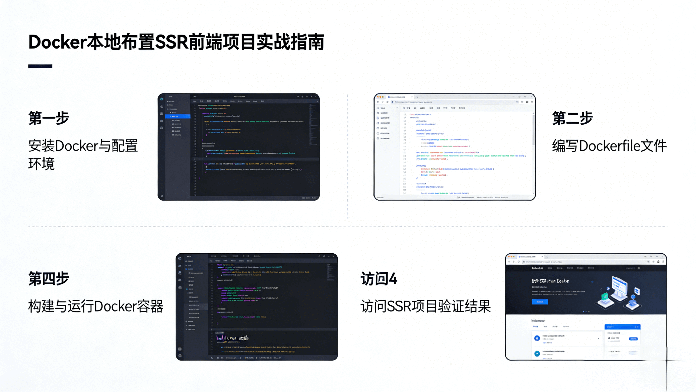

# Docker 本地部署 SSR 前端项目实战指南

[[toc]]



这篇文档详细介绍如何将基于 Next.js 的银企直连前置机管理系统(我本地的项目)容器化，并在本地使用 `Docker` 进行部署。

## 1. 项目技术栈

本项目采用现代化的 SSR (服务端渲染) 架构，主要技术栈如下：

- **核心框架**: [Next.js 15](https://nextjs.org/) (App Router 架构) - 提供服务端渲染、API 路由和文件系统路由。
- **前端库**: [React 18](https://react.dev/) - 构建用户界面。
- **UI 组件库**: [Ant Design 5](https://ant.design/) - 企业级 React 组件库。
- **样式方案**: [Tailwind CSS 4](https://tailwindcss.com/) & Sass - 原子化 CSS 与预处理器结合。
- **数据库交互**: [MySQL2](https://github.com/sidorares/node-mysql2) - Node.js 的 MySQL 驱动。
- **认证方案**: [NextAuth.js](https://next-auth.js.org/) - 完整的身份验证解决方案。
- **包管理工具**: pnpm - 高效的包管理器。

::: tip 提示

数据库用的是我本地安装的 MySQL，里面已有各种数据，省略了数据库相关的建库和建表。

:::

## 2. 项目目录结构

项目的核心结构基于 Next.js App Router：

```
yqzl/
├── app/                  # 应用主入口 (App Router)
│   ├── api/              # 后端 API 接口定义
│   ├── auth/             # 认证相关页面
│   ├── components/       # 公共组件 (Sidebar, ConditionalLayout 等)
│   ├── dashboard/        # 仪表盘页面
│   ├── documents/        # 文档管理模块
│   └── lib/              # 核心工具库 (如 mysql 数据库连接)
├── public/               # 静态资源
├── types/                # TypeScript 类型定义
├── Dockerfile            # Docker 构建描述文件
├── docker-compose.yml    # 容器编排配置
├── next.config.ts        # Next.js 配置文件
└── .env                  # 环境变量 (敏感信息)
```

## 3. 核心配置文件详解

### 3.1 Dockerfile (多阶段构建)

为了优化镜像体积和构建效率，我们使用了 Docker 的多阶段构建 (Multi-stage build) 功能。

- **Stage 1: deps**: 仅复制 `package.json` 和 `pnpm-lock.yaml` 并安装依赖。利用 Docker 缓存层，只要依赖不变，此阶段会被缓存。
- **Stage 2: builder**: 复制源码并运行 `pnpm build` 进行编译。
- **Stage 3: runner**: 生产运行环境。基于 `node:20-alpine`，仅复制构建产物 (`.next` 文件夹、`public` 文件夹) 和必要的 `node_modules`。

**dockerfile 完整配置**:

```dockerfile
# 1. 基础镜像
FROM node:20-alpine AS base
RUN npm install -g pnpm

# 2. 依赖安装阶段
FROM base AS deps
WORKDIR /app
COPY package.json pnpm-lock.yaml ./
RUN pnpm install --frozen-lockfile

# 3. 编译构建阶段
FROM base AS builder
WORKDIR /app
COPY --from=deps /app/node_modules ./node_modules
COPY . .
# 提示：如果 build 报错，记得在 next.config.ts 中暂时关闭 ESLint 检查
RUN pnpm build

# 4. 运行阶段
FROM base AS runner
WORKDIR /app
ENV NODE_ENV production
# 关键配置：允许从外部访问容器内的 3000 端口
ENV HOSTNAME "0.0.0.0"

COPY --from=builder /app/public ./public
COPY --from=builder /app/.next ./.next
COPY --from=builder /app/node_modules ./node_modules
COPY --from=builder /app/package.json ./package.json

EXPOSE 3000
CMD ["pnpm", "start"]
```

### 3.2 docker-compose.yml (编排与网络)

此文件定义了如何运行应用服务，特别是解决了**容器连接宿主机数据库**的问题。

```yaml
services:
  app:
    build:
      context: .
      dockerfile: Dockerfile
    container_name: yqzl-app
    ports:
      - "3000:3000"
    env_file:
      - .env
    environment:
      # 这里重写 MYSQL_HOST，使其指向宿主机
      # 在 Windows/Mac 的 Docker Desktop 中，host.docker.internal 指向宿主机
      - MYSQL_HOST=host.docker.internal
    extra_hosts:
      - "host.docker.internal:host-gateway"
    restart: always

networks:
  default:
    name: yqzl-network
```

- **`host.docker.internal`**: 这是 Docker Desktop (Windows/Mac) 提供的特殊 DNS 名称，允许容器内部访问宿主机的网络服务 (如本地运行的 MySQL)。

### 3.3 next.config.ts (构建配置)

针对 Docker 环境，我们建议在构建时适当放宽检查，以避免因细微的 Lint 错误导致构建失败：

```typescript
const nextConfig: NextConfig = {
  // ...
  eslint: {
    // 忽略构建时的 ESLint 错误，确保能够生成镜像
    ignoreDuringBuilds: true
  },
  typescript: {
    ignoreBuildErrors: true
  }
};
```

## 4. 为什么容器内不需要 Nginx？

在传统的 `SPA (Single Page Application)` 部署中，前端构建出的是静态 `HTML/CSS/JS` 文件，因此必须依赖 `Nginx 或 Apache` 这样的 `Web Server` 来提供文件服务。

但在 **SSR (Next.js)** 架构中，情况有所不同：

1.  **Node.js 自带服务**: Next.js 生产环境 (`next start`) 启动的是一个全功能的 Node.js HTTP 服务器。它不仅能处理 API 请求、服务端渲染动态页面，也能高效地托管 `public` 和 `.next/static` 中的静态资源。
2.  **架构解耦**: 根据容器化的“单一职责原则”，应用容器应该只包含应用本身。
3.  **反向代理通常在外层**: 如果需要 Nginx (用于 SSL 终止、负载均衡、gzip 压缩等)，通常建议将其部署在容器**外部** (作为宿主机服务或另一个独立的 Nginx 容器)，作为整个系统的网关 (Gateway)，而不是塞进应用容器里。

因此，直接在 Docker 中运行 `pnpm start` 是最简洁、高效且符合云原生理念的做法。

## 5. 部署步骤

1.  **准备环境**:

    - 确保已安装 [Docker Desktop for Windows](https://www.docker.com/products/docker-desktop/)。
    - 确保本地 MySQL 服务已启动，且用户权限允许远程连接 (或至少允许 Docker 网段连接)。

2.  **配置环境**:

    - 确保项目根目录存在 `.env` 文件，且包含正确的数据库凭证。

3.  **启动部署**: 在项目根目录打开 PowerShell 或终端，运行：

    ```powershell
    docker-compose up -d --build
    ```

    - `-d`: 后台运行。
    - `--build`: 强制重新构建镜像 (确保代码变更为最新)。

4.  **访问应用**: 打开浏览器访问 `http://localhost:3000`。

5.  **查看日志**: 如果遇到问题，查看容器日志：

    ```powershell
    docker-compose logs -f
    ```

6.  **停止服务**:
    ```powershell
    docker-compose down
    ```
