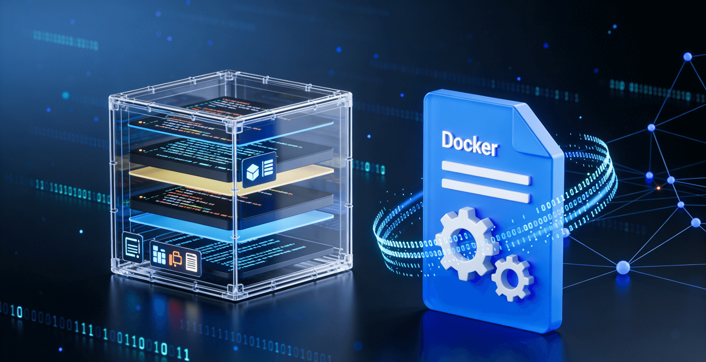

# Docker 镜像与容器

[[toc]]



## 一、Docker 镜像

### 下载镜像

`Docker Pull` 命令用来从仓库下载镜像。

```bash
docker pull docker.io/library/nginx:latest
```

一个 `Docker` 镜像下载地址包含 4 部分内容：

- **docker.io**: registry：仓库地址 / 注册表，如果是 Docker 官方仓库，则可以省略这个地址。
- **library**: 命名空间（镜像作者），为了防止不同用户上传同一个名字的镜像 发生冲突。“library" 是 docker 官方仓库的命名空间，这个空间下的所有镜像都是由 Docker 官方维护。如果是官方的命名空间 则可以省略不写
- **nginx**: 镜像名
- **latest**: 标签名、版本号。写 "latest" 或者不写 表示获取最新版本的镜像。

### 镜像库

`repository`: 镜像库，存放一个镜像的不同版本，"docker.io/library/nginx" 就是一个镜像库。

简化后的命令如下：

```bash
# 从 Docker 官方仓库的官方命名空间里面下载最新的 Nginx Docker 镜像
docker pull nginx
```

其他例子：

```bash
# 从 docker.n8n.io 的私有仓库下载 n8nio 上传的 n8n 镜像
docker pull docker.n8n.io/n8nio/n8n
```

### Docker Hub

docker 官方的镜像仓库地址为 https://hub.docker.com 可以在这个上面搜索自己需要的镜像，标有 "Docker Offcial Images" 表示 Docker 官方维护的镜像。

如果打不开 可以通过 https://docker.fxxk.dedyn.io/ 镜像站来搜索镜像。

### 镜像源配置

在国内的网络环境中，如果执行` docker pull`可能会出现 下载失败的问题，可以参考这篇文档配置镜像站解决：

```
https://github.com/tech-shrimp/docker_installer?tab=readme-ov-file#2-pull%E9%95%9C%E5%83%8F
```

拉取特定架构的镜像

```cmd
docker pull --platform=xxx nginx
```

默认情况下，docker 会选择当前宿主机 CPU 架构的镜像，大部分情况下我们不需要关注这个参数。

Mac 目前的 M 系列 CPU 都是 arm 架构的，但在运行 AMD64 架构的容器时，会自动调用 QEMU 来模拟 x86_64 指令集，从而实现兼容 AMD64 的镜像，不过可能会存在一些兼容性问题 以及额外的性能开销。

### 查看镜像

```cmd
docker images
```

使用此命令可以查看 所有 Pull 到本地的镜像

### 删除镜像

```cmd
docker rmi [镜像标识]

# 例如
docker rmi nginx
```

使用此命令可以删除 pull 到本地的镜像，镜像标识可以选择 镜像的 ID（image id）或者镜像的名称（repository）

## 二、Docker 容器

### 创建并运行容器

```cmd
docker run [镜像标识]
```

使用 run 命令 可以通过 镜像创建一个容器，并启动它。镜像标识可以是 镜像 ID 或者镜像名称。

例如：`docker run nginx` 就是创建一个 Nginx 容器。

docker pull 命令可以省略，直接使用 docker run 运行，如果 docker 发现本地没有这个镜像 则会自动拉取。

**分离模式**

默认情况下 `docker run` 创建容器后会导致当前终端挂起，不能进行其他操作，可以增加 -d 参数 表示容器在后台运行，不阻塞当前窗口。

```cmd
C:\Users\xinjie> docker run redis
Starting Redis Server
1:C 25 Dec 2025 06:07:08.379 * oO0OoO0OoO0Oo Redis is starting oO0OoO0OoO0Oo
1:C 25 Dec 2025 06:07:08.380 * Redis version=8.4.0, bits=64, commit=00000000, modified=1, pid=1, just started
1:C 25 Dec 2025 06:07:08.380 * Configuration loaded
1:M 25 Dec 2025 06:07:08.381 * monotonic clock: POSIX clock_gettime
1:M 25 Dec 2025 06:07:08.384 * Running mode=standalone, port=6379.
```

**自定义容器名称**

```cmd
docker run -d -name my-redis redis
```

容器的名称和 容器 ID 的效果是等价的，但是名字更方便记忆。

**端口映射**

容器的网络和宿主机的网络是隔离的，例如运行了一个 Nginx 容器，容器内的 Nginx 监听了 80 端口。这时通过宿主机的 80 端口是无法访问到 Nginx 服务的。

所以需要 `-p {宿主机端口}:{容器端口}` 命令进行映射，例如 `-p 8080:80` 标识将 `Nginx` 容器的 80 端口映射到宿主机的 8080 端口。


**目录映射（绑定挂载）**

与端口映射类似的就是目录映射，将容器外和容器内的目录进行绑定，容器内对文件的修改会影响宿主机的文件夹，宿主机的修改也会影响容器内文件夹。这种目录也被称为 挂载卷，他的最大作用是数据的持久化。 当容器删除时，容器内的所有数据都会被删除，但通过挂载卷映射到宿主机的文件夹将得以保留。

```cmd
docker run -d -p 8080:80 -v ./:/usr/share/nginx/html nginx
```

使用绑定挂载的时候，宿主机的文件会暂时覆盖掉容器内的目录。除了这种用法 还有一种叫 `Docker` 卷，可以在容器之间共享和重用。

**环境变量**

可以在命令行通过 -e 参数传递环境变量到容器内部，例如创建一个数据库应用，需要在 创建容器时，就指定数据库的账户、密码等信息。

```cmd
docker run -d -p 27017:27017 \
-e MONGO_INITDB_ROOT_USERNAME=tech \
-e MONGO_INITDB_ROOT_PASSWORD=dbkuaizi \
mongo
```

如果不知道容器的环境变量有哪些，可以在 `Docker Hub `上搜索一下，或者去 Github 上看一下 readme 文档，都有详细的描述。

**进入容器**

```cmd
docker run -it alpine
```

通过 `-it `参数可以在创建一共容器时，同时进入容器内部的终端。

**退出删除**

```cmd
docker run -it --rm alpine
```

`--rm `表示当退出容器时，自动删除这个容器。一般和 `-it` 命令配合使用

**容器重启策略**

```cmd
docker run -d --restart always nginx
```

`--restart` 参数用来表示 容器在停止时的重启策略，它有两个选项：

- **always**: 只要容器停止了，就会立即重启。包含容器因为内部错误崩溃，或者宿主机断电等场景
- **unless-stopped**: 与 always 类似，唯一区别是：手动停止的容器不会尝试重启了

### 创建容器

```cmd
docker create nginx
```

与 `run` 命令功能类似，区别在于只创建容器，不自动启动。

### 容器列表

```cmd
C:\Users\xinjie>docker ps
CONTAINER ID   IMAGE           COMMAND                   CREATED       STATUS       PORTS                                     NAMES
c4acace9689b   vue3-vue3-app   "/docker-entrypoint.…"   4 hours ago   Up 4 hours   0.0.0.0:8080->80/tcp, [::]:8080->80/tcp   vue3-app

```

`ps 是 Process Status `(进程状态) 的缩写，也是 Linux 上的一个经典命令，用于查看进程的状态信息。这一命令也被继承到 Docker 里面了

这些列含义如下：

- CONTAINER ID 容器 ID，每个容器在创建时会生成一个唯一的 ID
- IMAGE 基于那个镜像创建出来的
- CREATED 镜像创建时间
- STATUS 镜像当前状态
- PORTS 镜像使用端口
- NAMES 容器的名字，如果创建容器时没有指定名字，系统就会随机分配一个。

增加 `-a` 参数可以看到所有的容器，包括正在运行的和已经停止的。

### 启停容器

每次使用`docker run`运行都会创建一个新的容器，如果我们需要对同一个容器进行持续的操作，可以通过 容器的启停命令来控制。

```cmd
# 启动容器
docker start {容器标识}
# 停止容器
docker stop {容器标识}
```

使用 `start` 启停容器的时候，不需要再传递创建容器时的 端口映射、挂载卷、环境变量等参数都不需要重新写了，docker 已经自动保存了，重新启动可以按照原因运行。

### 删除容器

```cmd
docker rm {容器标识}
```

使用 `rm` 命令可以删除容器，如果要删除运行中的容器 需要加 -f 参数强制删除。

### 容器内部

```cmd
# 进入容器内部
docker exec -it {容器标识} bash
```

使用 `exec -it `命令 可以进入容器，在容器内部执行 shell 命令

```shell
docker exec {容器标识} {shell 命令}
```

也可以通过这种方式 在容器外部执行容器内部的命令

```shell
# 查看容器 alpine 中的进程信息
docker exec alpine ps -ef
```

注意 docker 镜像为了尽可能缩小镜像体积，内部一般是一个极简的操作系统，很多系统工具、基础命令都是缺失的

### 查看创建信息

```cmd
docker inspect {容器标识}
```

使用这个命令可以看到容器的所有信息，输出的是一个 JSON 格式，可以直接丢给 ai 帮忙解析

### 容器日志

```cmd
docker logs {容器标识}
```

这个命令可以看容器的日志，加上 `-f` 命令，可以持续输出，滚动查看。
