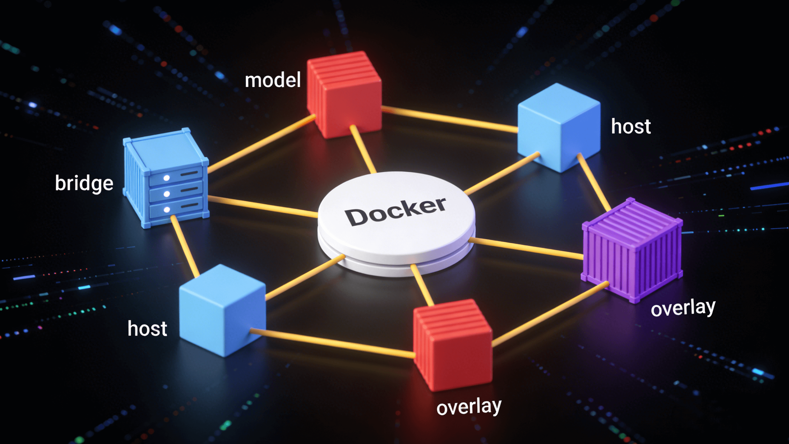

# Docker 网络：默认三大模式

[[toc]]



想象一下，你有一个包含 Web 服务器、数据库和缓存的微服务应用。这些容器需要相互通信，同时也需要被外部访问。`Docker 网络`系统就是为了解决这些通信问题而设计的。没有网络，容器就像孤岛一样无法协作。

## 一、为什么镜像启动后还要“网络”？

容器本质是隔离的进程，**网络栈（网卡、路由、iptables、DNS）也被隔离**。  
`Docker` 网络负责：

1. 让容器 **彼此通信**（同一主机、跨主机）
2. 让容器 **与外部通信**（互联网、宿主机）
3. 提供 **DNS 发现**（容器名即域名）
4. 支持 **热插拔**（运行时加端口、换网段）

## 二、默认三大模式速览

| 维度     | bridge（默认） | host               | none                 |
| -------- | -------------- | ------------------ | -------------------- |
| 独立 IP  | ✅ 有          | ❌ 无（=宿主机）   | ❌ 无                |
| 端口映射 | 需要 `-p`      | **不需要**         | 无意义               |
| 性能     | 普通（NAT）    | **极高**（零转发） | 无网络               |
| 安全隔离 | 默认网络隔离   | **与宿主机共享**   | **完全隔离**         |
| 平台支持 | 全平台         | **仅 Linux 真机**  | 全平台               |
| 典型用途 | 一般业务       | 高并发、端口爆炸   | 离线、密钥、安全沙箱 |

一键体验：

```bash
docker run --rm --network bridge nginx          # 默认
docker run --rm --network host   nginx          # 共享宿主机网络
docker run --rm --network none   ip addr        # 空网络
```

## 三、桥接模式（bridge）

Docker 网络 默认 Bridge（桥接模式），所有的容器都连接到这个网络中，每一个容器都分配了一个内部的 IP 地址，一般都是 172.17 开头。在这个内部子网里面，容器可以通过内部 IP 地址互相访问。

```text
┌────────────┐            ┌────────────┐
│  Container A │            │  Container B │
│  eth0@docker0 │────────────▶│  eth0@docker0 │
└────────────┘            └────────────┘
      ▲                         ▲
      │veth                     │veth
      └──────── Docker0 (172.17.0.1/16) ─────────┘
```

- **docker0** 是 Linux 虚拟网桥，内核自动生成
- 每启动一个容器，Docker 创建一对 **veth** 设备（一端在容器，一端插到 docker0）
- 容器获得 **172.17.x.x** 地址，同一网段互通；出网流量经宿主机 **iptables MASQUERADE** 规则转发

```bash
# 创建一个 名叫 network1 的子网
docker network create network1

# 创建一个 nginx 容器 使用 network1 的子网
docker run -d --network network1 nginx
```

## 四、主机模式（host）

host 模式下，docker 容器直接共享宿主机的网络，容器直接使用宿主机的 IP 地址，无需 -p 参数进行端口映射，容器内的服务直接运行在宿主机的端口上，通过宿主机的 IP 和端口就能访问到容器中服务。

**容器放弃独立网络栈，直接蹭宿主机网**

| 特点           | 说明                                                                      |
| -------------- | ------------------------------------------------------------------------- |
| **无隔离**     | 容器进程看到的 `eth0 / 127.0.0.1 / 端口空间` = 宿主机本身                 |
| **无端口映射** | `-p 8080:80` 变成 **多余**；容器里监听 `:80` 就是宿主机 `:80`             |
| **性能极高**   | 省去 veth + iptables 转发，吞吐量接近裸机，延迟低 10-20 µs                |
| **安全风险**   | 容器可嗅探宿主机全部流量，能绑定 0.0.0.0 抢占端口                         |
| **平台差异**   | **Windows / Mac 不可用**（Docker Desktop 基于 VM，host 指 VM 而非物理机） |

**一键体验**

```bash
docker run --rm --network host nicolaka/netshoot
# 在容器里
ip addr              # 就是宿主机的网卡列表
netstat -tunlp       # 能看到宿主机所有监听端口
```

**适用场景**

- 高并发网关、日志采集、Prometheus NodeExporter 等“对性能极度敏感”服务
- 需要绑定大量随机端口（ActiveMQ、FTP）时避免映射爆炸
- **仅限 Linux 生产节点**，且受信任镜像。

## 五、none 网络

**容器被拔网线，这个模式表示不联网**

| 特点                                    | 说明                                            |
| --------------------------------------- | ----------------------------------------------- |
| **零网络**                              | 容器内只有 `lo` 回环接口，无 IP、无路由、无 DNS |
| **攻击面最小**                          | 即使应用被 RCE，也无法外联、无法横向移动        |
| **日志 / sidecar 通过卷或 stdout 输出** | 常与 `docker logs` 或文件卷配合                 |
| **体积最小**                            | 镜像构建阶段无网络依赖时，可确保“离线纯净”      |

**一键体验**

```bash
docker run --rm --network none alpine sh -c "ip addr; ping 8.8.8.8"
# 只能看到 lo，ping 提示 Network unreachable
```

**适用场景**

- 离线加密运算、签名机、密钥管理——“绝不让数据出容器”
- 调试网络无关代码（纯算法、正则测试）
- CI 安全阶段：确保构建过程 **不偷偷下载依赖**。
