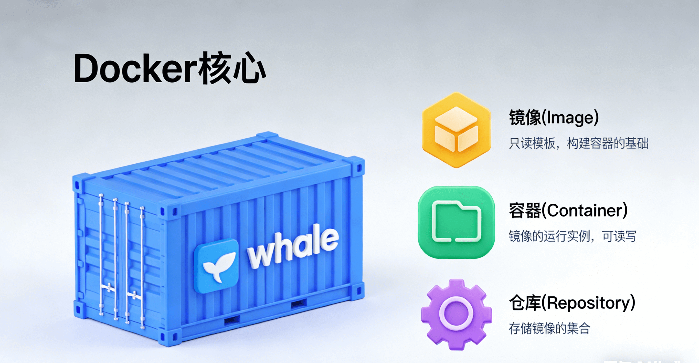
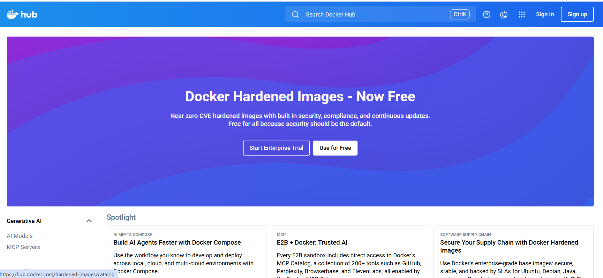
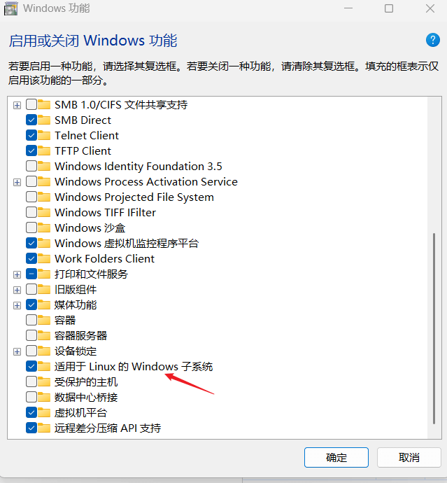

# Docker 核心概念和安装

[[toc]]



## Docker 容器

`Docker` 简单来说就是通过容器化技术给应用程序封装一个独立的运行环境，每个运行环境就是一个容器，运行容器的计算机被称为 宿主机。

**与虚拟机最大的区别是**：`Docker` 容器共享同一个系统内核，而每个虚拟机都包含一个完整的系统内核。所以 `Docker` 容器比虚拟机更轻量，启动速度更快。

## Docker 镜像

镜像可以理解为是一个**特殊的压缩包**，容器就像是通过压缩包解压（创建）出来的文件，我们可以使用同一个压缩包，解压出很多份相同的文件，也可以将这个压缩包分享给他人，得到和我们一样的文件。这里所说的 “文件”，就是上面提到的容器。

我们也可以通过修改容器，并生成自己特定的 `Docker` 镜像，并将这些镜像分享给他人，其他人可以通过镜像，创建出和我们一样的容器环境。

## Docker 仓库

`Docker` 仓库就是我们用来存储、分享镜像的地方。所有人都可以把自己的镜像上传到仓库里面，其他人就可以下载镜像并使用。

`Docker` 的官方仓库是 Docker Hub (https://hub.docker.com)



## Docker 技术原理

`Docker` 利用了 `Linux` 的两大原生功能，实现容器化：

- `Cgroups` 用来限制和隔离进程的资源使用。可以为每个容器设定 CPU、内存、网络带宽等资源的使用上限，确保容器的内存消耗不会影响到宿主机。
- `Namespaces` 用于隔离进程的资源视图，使得容器只能看到自己内部的进程 ID、网络资源、文件目录，看不到宿主机的。

容器本质上还是一个**特殊的进程**，但是当我们进入容器内部时，看起来就像是一个独立的操作系统。

## Docker 安装

`Docker` 是基于 `Linux` 的容器化技术，`Windows 和 Mac` 需要虚拟化一个 Linux 的子系统。所以 Docker 最好的使用方式是使用 Linux 系统的宿主机。

### 1. Linux 系统

Linux 系统可以通过包管理器安装 Docker，例如 Redhat 系可以使用 yum install docker 安装。

Alpine Linux 可以通过 apk add docker 安装

### 2. Windows 安装

打开 “Windows 功能”, 勾选上` Virtual Machine Paftform`（虚拟机平台）、适用于 `Linux 的 Windows 子系统`，并重启电脑。

{width=500}

管理员打开命令提示符，安装 wsl2

```cmd
wsl --set-default-version 2
wsl --update --web-download
```

去 `Docker` 官网 或者 https://github.com/tech-shrimp/docker_installer/releases 下载符合自己系统的` Docker Desktop` 安装包，并进行安装，安装成功后 可以在终端尝试一下：

```cmd
C:\Users\xinjie>docker --version
Docker version 28.5.1, build e180ab8
```

在使用的过程中 `Docker Desktop` 需要一直开着，否则执行命令会出现这个报错：

```cmd
C:\Users\xinjie>docker ps
error during connect: Get "http://%2F%2F.%2Fpipe%2FdockerDesktopLinuxEngine/v1.51/containers/json": open //./pipe/dockerDesktopLinuxEngine: The system cannot find the file specified.
```

### 3. Mac 安装

直接在 Docker 官网下载安装包 安装就行。
