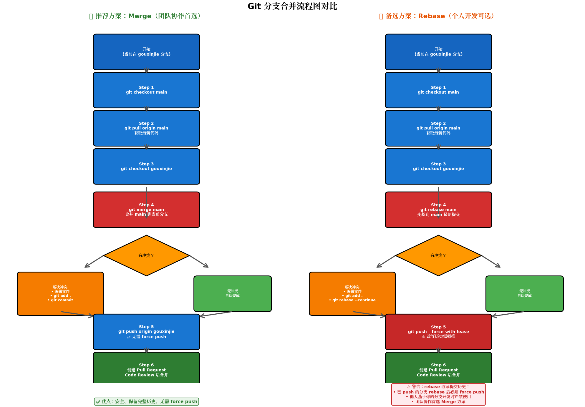
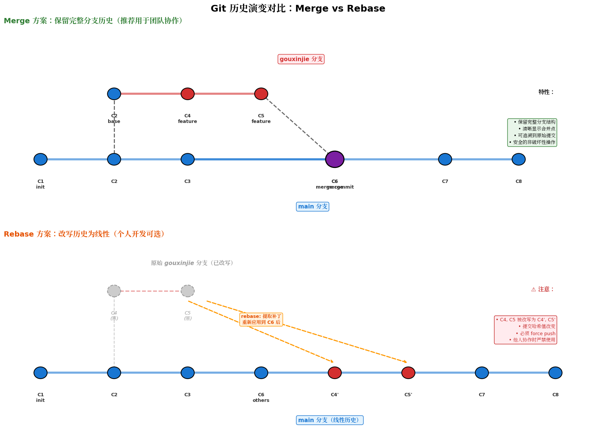

# Git 分支合并实战指南：团队协作的最佳实践

[[toc]]

当你的功能分支（`gouxinjie`）准备合并到主分支（`main`）时，同时需要同步主分支上其他同事推送的最新代码，这里我提供两种完整方案。**推荐优先使用 Merge 方案**，它在团队协作中更稳健、容错性更强。

## 🎯 推荐方案：使用 Merge（团队协作首选）

`Merge` 操作是最安全、最透明的协作方式，**保留完整历史记录**，便于追溯和回滚，适合多人协作场景。

### 步骤 1：切换到 main 分支并拉取最新代码

```bash
git checkout main
git pull origin main
```

### 步骤 2：切换回你的功能分支

```bash
git checkout gouxinjie
```

### 步骤 3：将 main 的最新代码合并到你的分支

```bash
git merge main
```

**这一步解决核心需求**：把别人推到 main 上的新代码，同步合并到你的分支中。

**如果出现冲突**：

```bash
# 1. 查看冲突文件
git status

# 2. 编辑解决冲突（冲突标记：<<<<<<< HEAD / ======= / >>>>>>> main）

# 3. 标记已解决
git add <冲突文件1> <冲突文件2>

# 4. 完成合并提交
git commit  # 会弹出编辑器，保存默认的合并提交信息即可
```

### 步骤 4：推送到远程

```bash
git push origin gouxinjie
```

> ✅ **无需 force push**，不会覆盖他人代码，安全可靠。

### 步骤 5：创建 Pull Request 合并到 main

在 GitHub/GitLab 等平台操作：

1. 从 `gouxinjie` 分支向 `main` 分支发起 **Pull Request / Merge Request**
2. 经过 Code Review 后点击 **Merge**
3. 选择 **"Create a merge commit"** 或 **"Squash and merge"**（根据团队规范）

```bash
# 或者本地完成最终合并（如果团队允许）
git checkout main
git merge gouxinjie
git push origin main
```

## 🌿 备选方案：使用 Rebase（个人开发可选）

Rebase 能让提交历史保持线性整洁，但**需要 force push**，在多人协作时风险较高。

### 步骤 1-2：同上，更新 main 分支

```bash
git checkout main
git pull origin main
git checkout gouxinjie
```

### 步骤 3：将 main 的最新代码 rebase 到你的分支

```bash
git rebase main
```

**如果出现冲突**：

```bash
# 解决冲突后
git add <冲突文件>
git rebase --continue

# 放弃 rebase 回退原状
git rebase --abort
```

### 步骤 4：强制推送到远程

```bash
git push origin gouxinjie --force-with-lease
```

> ⚠️ `--force-with-lease` 比 `--force` 安全，但如果团队其他人基于你的分支开发，**绝对不要使用 rebase**。

### 步骤 5：创建 Pull Request

同 Merge 方案，发起 PR 审核后合并。

## 方案对比：为什么推荐 Merge？

| 维度 | **Merge（推荐）** | Rebase |
|:---|:---|:---|
| **安全性** | ✅ 无需 force push，不会意外覆盖他人代码 | ⚠️ 必须 force push，存在覆盖风险 |
| **历史记录** | ✅ 完整保留分支合并历史，便于追溯 | 历史被改写，呈线性 |
| **协作友好度** | ✅ 多人协作同一分支时完全安全 | ❌ 他人基于你的分支开发时严禁使用 |
| **回滚难度** | ✅ 简单，每个合并点清晰可查 | 较复杂，需要 reflog 找回 |
| **历史美观度** | 可能出现"分叉"图 | 线性历史，更整洁 |
| **学习成本** | 低，冲突处理直观 | 较高，需理解 rebase 机制 |

**决策建议**

| 场景 | 推荐方案 |
|:---|:---|
| **团队项目、多人协作** | **Merge** |
| 个人项目、独立分支 | Rebase 可选 |
| 需要保留完整审计记录 | **Merge** |
| 开源项目贡献（fork 仓库） | Rebase 后提 PR |
| 分支已分享给他人协作 | **绝对用 Merge** |

## 流程图

**1、总体流程图**



---

**2、分支演变示意图**


