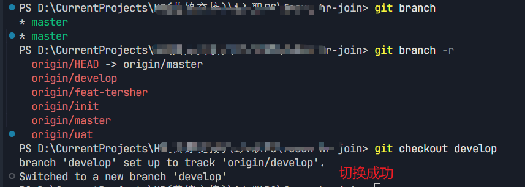

# Git 远程分支同步到本地指南

[[toc]]

在日常开发中，我们经常需要协作开发，这时就会遇到将远程分支同步到本地的情况。我总结几种常用方法，并详解参数含义。

## 场景说明

如下我的远程仓库有以下分支：

```bash
$ git branch -r
  origin/gouxinjie
  origin/main
  origin/main-bak-20260305
  origin/prd
```

我在gitlab新建了一个分支（源自 `origin/main`），本地现在是没有的，我现在需要把 `origin/gouxinjie` 同步到本地进行开发。

## 方法一：一键创建并切换

```bash
git checkout -b gouxinjie origin/gouxinjie
```

**参数解析**

| 参数 | 含义 |
|------|------|
| `-b` | `--branch` 的缩写，表示**创建新分支并立即切换** |
| `gouxinjie` | 本地新分支的名称（可自定义） |
| `origin/gouxinjie` | 基于的远程分支，同时建立跟踪关系 |

**图解**

```bash
git checkout -b gouxinjie origin/gouxinjie
#           ↑  ↑           ↑
#           │  │           └── 基于哪个分支/提交创建（这里是远程分支）
#           │  └────────────── 新分支名称
#           └───────────────── 创建并切换
```

**效果等同于**

```bash
git branch gouxinjie origin/gouxinjie    # 创建分支
git checkout gouxinjie                   # 切换分支
```

## 方法二：分步操作（更可控）

```bash
# 1. 获取远程最新分支信息
git fetch origin

# 2. 创建本地分支并关联远程
git checkout -b gouxinjie origin/gouxinjie
```

**仅创建不切换**

如果暂时不需要切换过去：

```bash
git branch --track gouxinjie origin/gouxinjie
```

## 方法三：直接切换（git branch **）

如图所示。我可以直接切换到 `develop` 分支：



**这是为什么呢？**

Git 版本 **2.23+** 引入了**隐式远程分支追踪**功能：

```
当满足以下所有条件时：
1. 本地不存在名为 "develop" 的分支
2. 远程存在名为 "origin/develop" 的分支
3. 远程分支名和你要切换的名字完全匹配

git checkout develop  等价于  git checkout -b develop origin/develop
```

Git 会自动帮你：

1. 创建本地分支 `develop`
2. 设置上游追踪 `origin/develop`
3. 切换到该分支

**什么时候需要用 `-b` 完整写法？**

```bash
# 场景1：本地分支名和远程分支名不同
git checkout -b my-dev origin/develop

# 场景2：远程分支名有特殊前缀/后缀
git checkout -b gouxinjie origin/feat-gouxinjie

# 场景3：存在多个远程仓库，需要指定具体远程
git checkout -b develop upstream/develop
```

## 总结

| 需求 | 命令 |
|------|------|
| 快速同步并切换 | `git checkout -b gouxinjie origin/gouxinjie` |
| 先更新远程信息 | `git fetch origin` |
| 仅创建不切换 | `git branch --track gouxinjie origin/gouxinjie` |
| 使用现代语法 | `git switch -c gouxinjie origin/gouxinjie` |

掌握 `-b` 参数的本质：**创建 + 切换一步到位**，可以大幅提高 Git 操作效率。
