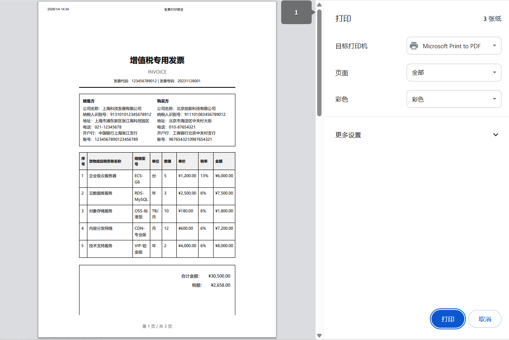

# CSS @media print：打印完美网页

[[toc]]

## 引言：为什么需要打印样式？

在现代 Web 开发中，我们经常忽略一个重要的场景：**打印**。用户可能需要打印网页内容作为参考资料、发票、报告或凭证。然而，默认的网页打印效果往往令人失望：

- 导航栏、侧边栏、广告等内容出现在打印页上
- 背景颜色和图片浪费墨水
- 链接无法点击且 URL 不可见
- 分页位置不合理，内容被切断

这就是 `@media print` 的用武之地！

## 一、@media print 基础语法

### 1.1 基本结构

```css
/* 方式1：在CSS文件中定义 */
@media print {
  /* 打印专用样式 */
  body {
    font-size: 12pt;
  }

  .no-print {
    display: none !important;
  }
}

/* 方式2：在HTML中链接专用打印样式表 */
<link rel="stylesheet" media="print" href="print.css">

/* 方式3：在style标签中定义 */
<style media="print">
  /* 打印样式 */
</style>
```

### 1.2 逻辑操作符

```css
/* 组合媒体查询 */
@media print and (min-width: 1200px) {
  /* 打印且屏幕宽度大于1200px时的样式 */
}

@media print, (orientation: landscape) {
  /* 打印时或横屏时的样式 */
}

@media not print {
  /* 非打印时的样式 */
}
```

## 二、核心打印样式技巧

### 2.1 隐藏不需要打印的元素

```css
@media print {
  /* 隐藏导航、广告、按钮等 */
  .navbar,
  .sidebar,
  .advertisement,
  .social-share,
  .no-print {
    display: none !important;
  }

  /* 只显示主要内容 */
  .print-only {
    display: block !important;
  }

  /* 隐藏视频、音频播放器 */
  video,
  audio,
  iframe,
  .video-container {
    display: none !important;
  }
}
```

### 2.2 优化颜色和背景

```css
@media print {
  /* 使用黑白打印优化 */
  * {
    color: #000 !important; /* 所有文字黑色 */
    background: transparent !important; /* 透明背景 */
    box-shadow: none !important; /* 去除阴影 */
    text-shadow: none !important; /* 去除文字阴影 */
  }

  /* 处理背景图片和渐变 */
  body {
    background: white !important;
  }

  /* 确保文字和背景有足够对比度 */
  .warning-text {
    color: #333 !important;
    border: 1px solid #ccc !important;
  }
}
```

### 2.3 链接处理

```css
@media print {
  /* 显示链接URL */
  a[href^="http"]:after,
  a[href^="https"]:after {
    content: " (" attr(href) ")";
    font-size: 90%;
    color: #666;
  }

  /* 内部链接不显示URL */
  a[href^="#"]:after,
  a[href^="/"]:after {
    content: "";
  }

  /* 保持链接可识别 */
  a {
    text-decoration: underline !important;
    color: #000 !important;
  }
}
```

## 三、分页控制（关键特性）

### 3.1 分页属性

```css
@media print {
  /* 避免在元素内分页 */
  .keep-together {
    page-break-inside: avoid;
    break-inside: avoid; /* 新标准 */
  }

  /* 在元素前强制分页 */
  .page-break-before {
    page-break-before: always;
    break-before: page; /* 新标准 */
  }

  /* 在元素后强制分页 */
  .page-break-after {
    page-break-after: always;
    break-after: page; /* 新标准 */
  }

  /* 避免在标题后立即分页 */
  h1,
  h2,
  h3 {
    page-break-after: avoid;
    break-after: avoid-page;
  }

  /* 表格分页优化 */
  table {
    page-break-inside: auto;
  }

  tr {
    page-break-inside: avoid;
    page-break-after: auto;
  }

  /* 图片分页处理 */
  img {
    max-width: 100% !important;
    page-break-inside: avoid;
  }
}
```

### 3.2 分页边距设置

```css
@page {
  /* 设置页面边距 */
  margin: 2cm; /* 所有边距2cm */

  /* 或分别设置 */
  margin-top: 3cm;
  margin-bottom: 2cm;
  margin-left: 2cm;
  margin-right: 2cm;
}

@page :first {
  /* 首页特殊样式 */
  margin-top: 5cm; /* 首页顶部更大的页眉空间 */
}

@page :left {
  /* 左侧页面（偶数页） */
  margin-left: 3cm;
  margin-right: 2cm;
}

@page :right {
  /* 右侧页面（奇数页） */
  margin-left: 2cm;
  margin-right: 3cm;
}
```

## 四、打印尺寸和单位

### 4.1 使用打印友好单位

```css
@media print {
  /* 使用物理单位 */
  body {
    font-size: 12pt; /* 点，打印标准单位 */
    line-height: 1.5;
  }

  .container {
    width: 100% !important; /* 充分利用纸张宽度 */
    max-width: none !important;
  }

  /* 页面尺寸相关 */
  .a4-page {
    width: 210mm; /* A4纸宽度 */
    height: 297mm; /* A4纸高度 */
    padding: 20mm;
    margin: 0 auto;
  }

  /* 名片尺寸示例 */
  .business-card {
    width: 90mm;
    height: 55mm;
    border: 1px solid #ccc;
  }
}
```

## 五、高级打印特性

### 5.1 页眉和页脚

```css
@media print {
  /* 使用固定定位创建页眉页脚 */
  .print-header {
    position: fixed;
    top: 0;
    left: 0;
    right: 0;
    height: 2cm;
    text-align: center;
    border-bottom: 1px solid #ccc;
    background: white;
  }

  .print-footer {
    position: fixed;
    bottom: 0;
    left: 0;
    right: 0;
    height: 2cm;
    text-align: center;
    border-top: 1px solid #ccc;
    background: white;
  }

  /* 页码 */
  .page-number:after {
    content: "第 " counter(page) " 页";
  }

  /* 总页数 */
  .total-pages:after {
    content: "共 " counter(pages) " 页";
  }
}
```

### 5.2 使用 CSS 计数器

```css
@media print {
  /* 重置页码计数器 */
  body {
    counter-reset: page;
  }

  /* 每页递增计数器 */
  @page {
    @bottom-center {
      content: "第 " counter(page) " 页";
    }
  }

  /* 章节编号 */
  .chapter {
    counter-increment: chapter;
  }

  .chapter h2:before {
    content: "第 " counter(chapter) " 章 ";
  }
}
```

## 六、实战案例

### 6.1 发票/收据打印

```css
@media print {
  .invoice {
    font-family: "Helvetica Neue", Arial, sans-serif;
    width: 210mm;
    margin: 0 auto;
  }

  .invoice-header {
    text-align: center;
    margin-bottom: 20px;
    padding-bottom: 10px;
    border-bottom: 2px solid #000;
  }

  .invoice-table {
    width: 100%;
    border-collapse: collapse;
    margin: 20px 0;
  }

  .invoice-table th,
  .invoice-table td {
    border: 1px solid #000;
    padding: 8px;
    text-align: left;
  }

  .invoice-total {
    font-weight: bold;
    font-size: 14pt;
    margin-top: 30px;
    text-align: right;
  }

  /* 避免金额被分割 */
  .amount {
    page-break-inside: avoid;
  }

  /* 签名区域 */
  .signature-area {
    margin-top: 50px;
    page-break-inside: avoid;
  }
}
```

### 6.2 报告/文档打印

```css
@media print {
  .report {
    line-height: 1.6;
  }

  /* 标题样式 */
  h1 {
    page-break-before: always;
    margin-top: 2cm;
  }

  h2 {
    page-break-after: avoid;
    margin-top: 1.5cm;
  }

  /* 代码块处理 */
  pre,
  code {
    white-space: pre-wrap;
    page-break-inside: avoid;
    background: #f5f5f5 !important;
    border: 1px solid #ddd !important;
  }

  /* 图表和图像 */
  .chart-container {
    page-break-inside: avoid;
    text-align: center;
  }

  .figure-caption {
    font-style: italic;
    text-align: center;
    margin-top: 5px;
  }

  /* 参考文献 */
  .references {
    page-break-before: always;
  }
}
```

## 七、JavaScript 配合

### 7.1 打印前准备

```javascript
// 添加打印按钮
<button onclick="prepareForPrint()">打印</button>;

function prepareForPrint() {
  // 添加打印专用class
  document.body.classList.add("printing");

  // 显示打印专用内容
  const printElements = document.querySelectorAll(".print-only");
  printElements.forEach((el) => (el.style.display = "block"));

  // 触发打印
  window.print();

  // 打印后清理
  setTimeout(() => {
    document.body.classList.remove("printing");
    printElements.forEach((el) => (el.style.display = "none"));
  }, 1000);
}

// 监听打印事件
window.addEventListener("beforeprint", () => {
  console.log("准备打印...");
  // 加载打印所需数据
});

window.addEventListener("afterprint", () => {
  console.log("打印完成");
  // 恢复页面状态
});
```

### 7.2 打印预览优化

```javascript
// 打开打印预览
function openPrintPreview() {
  // 创建打印专用窗口
  const printWindow = window.open("", "_blank");

  // 获取要打印的内容
  const content = document.getElementById("print-content").innerHTML;

  // 写入打印优化后的HTML
  printWindow.document.write(`
    <!DOCTYPE html>
    <html>
    <head>
      <title>打印文档</title>
      <style>
        ${getPrintStyles()}  // 获取所有打印样式
      </style>
    </head>
    <body>
      ${content}
    </body>
    </html>
  `);

  printWindow.document.close();
  printWindow.print();
}

// 收集所有打印样式
function getPrintStyles() {
  let styles = "";
  document.querySelectorAll('style, link[rel="stylesheet"]').forEach((el) => {
    if (el.tagName === "STYLE") {
      styles += el.innerHTML;
    }
  });
  return styles;
}
```

## 八、常见问题和解决方案

### 问题 1：打印时背景图片不显示

```css
@media print {
  /* Chrome 和 Safari 需要这个属性 */
  * {
    -webkit-print-color-adjust: exact !important;
    print-color-adjust: exact !important; /* 新标准 */
  }

  .with-background {
    background: white !important;
    -webkit-box-shadow: inset 0 0 0 1000px white !important;
  }
}
```

### 问题 2：分页符出现在表格中间

```css
@media print {
  table {
    page-break-inside: auto;
  }

  /* 确保表头在每页都重复 */
  thead {
    display: table-header-group;
  }

  /* 确保表尾在每页都重复 */
  tfoot {
    display: table-footer-group;
  }

  /* 表格行不被分割 */
  tr {
    page-break-inside: avoid;
  }
}
```

### 问题 3：长内容被截断

```css
@media print {
  /* 允许内容在页面内溢出 */
  .long-content {
    overflow: visible !important;
    height: auto !important;
    max-height: none !important;
  }

  /* 处理flexbox容器 */
  .flex-container {
    display: block !important;
  }
}
```

## 九、发票打印完整案例

点击打印预览按钮，进行打印。



**完整代码如下：**

```html
<!DOCTYPE html>
<html lang="zh-CN">
  <head>
    <meta charset="UTF-8" />
    <meta name="viewport" content="width=device-width, initial-scale=1.0" />
    <title>发票打印预览</title>
    <style>
      /* 屏幕样式 */
      * {
        margin: 0;
        padding: 0;
        box-sizing: border-box;
        font-family: "Microsoft YaHei", "PingFang SC", sans-serif;
      }

      body {
        background-color: #f5f5f5;
        color: #333;
        line-height: 1.6;
        padding: 20px;
      }

      .container {
        max-width: 1200px;
        margin: 0 auto;
        background: white;
        border-radius: 8px;
        box-shadow: 0 2px 10px rgba(0, 0, 0, 0.1);
        padding: 30px;
      }

      .header {
        text-align: center;
        margin-bottom: 30px;
        padding-bottom: 20px;
        border-bottom: 2px solid #e0e0e0;
      }

      .header h1 {
        color: #1890ff;
        margin-bottom: 10px;
      }

      .controls {
        background: #f8f9fa;
        padding: 20px;
        border-radius: 6px;
        margin-bottom: 30px;
        display: flex;
        gap: 15px;
        flex-wrap: wrap;
        align-items: center;
      }

      .print-preview {
        background: white;
        padding: 40px;
        border: 1px solid #e0e0e0;
        border-radius: 4px;
        min-height: 500px;
      }

      .btn {
        padding: 10px 24px;
        border: none;
        border-radius: 4px;
        cursor: pointer;
        font-size: 14px;
        font-weight: 500;
        transition: all 0.3s;
      }

      .btn-primary {
        background: #1890ff;
        color: white;
      }

      .btn-primary:hover {
        background: #40a9ff;
      }

      .btn-secondary {
        background: #f5f5f5;
        color: #333;
        border: 1px solid #d9d9d9;
      }

      .btn-secondary:hover {
        background: #e8e8e8;
      }

      .notification {
        background: #e6f7ff;
        border: 1px solid #91d5ff;
        padding: 15px;
        border-radius: 4px;
        margin-top: 20px;
      }

      /* 打印样式 - 核心部分 */
      @media print {
        /* 重置所有打印样式 */
        * {
          -webkit-print-color-adjust: exact !important;
          print-color-adjust: exact !important;
        }

        /* 隐藏所有不需要打印的元素 */
        body * {
          visibility: hidden;
        }

        /* 只显示打印预览内容 */
        .print-preview,
        .print-preview * {
          visibility: visible !important;
        }

        .print-preview {
          position: absolute !important;
          left: 0 !important;
          top: 0 !important;
          width: 100% !important;
          height: auto !important;
          margin: 0 !important;
          padding: 0 !important;
          border: none !important;
          background: white !important;
          box-shadow: none !important;
        }

        /* 隐藏所有按钮和控制元素 */
        .controls,
        .notification,
        .btn,
        .no-print {
          display: none !important;
        }

        /* 发票专用打印样式 */
        .invoice-container {
          width: 210mm !important;
          min-height: 297mm !important;
          margin: 0 auto !important;
          padding: 20mm !important;
          background: white !important;
          font-size: 12pt !important;
          color: black !important;
        }

        /* 强制黑色文字和透明背景 */
        .invoice-container * {
          color: #000 !important;
          background-color: transparent !important;
        }

        /* 页眉样式 */
        .invoice-header {
          text-align: center;
          margin-bottom: 25px;
          padding-bottom: 15px;
          border-bottom: 2px solid #000 !important;
        }

        .invoice-title {
          font-size: 24pt !important;
          font-weight: bold;
          margin-bottom: 10px;
          color: #000 !important;
        }

        .invoice-subtitle {
          font-size: 14pt;
          color: #666 !important;
        }

        /* 公司信息区域 */
        .company-info {
          display: flex !important;
          justify-content: space-between;
          margin-bottom: 25px;
          padding: 15px;
          border: 1px solid #000 !important;
        }

        .info-section {
          flex: 1;
        }

        .info-label {
          font-weight: bold;
          margin-bottom: 5px;
        }

        /* 客户信息 */
        .client-info {
          margin-bottom: 25px;
          padding: 15px;
          border: 1px solid #000 !important;
        }

        /* 商品表格 - 打印优化 */
        .invoice-table {
          width: 100% !important;
          border-collapse: collapse !important;
          margin: 25px 0 !important;
          page-break-inside: avoid !important;
        }

        .invoice-table th {
          background: #f0f0f0 !important;
          color: #000 !important;
          font-weight: bold;
          padding: 12px 8px;
          border: 1px solid #000 !important;
          text-align: left;
          font-size: 11pt;
        }

        .invoice-table td {
          padding: 10px 8px;
          border: 1px solid #000 !important;
          vertical-align: top;
        }

        .invoice-table tr {
          page-break-inside: avoid !important;
          page-break-after: auto !important;
        }

        /* 总计区域 */
        .total-section {
          margin-top: 30px;
          text-align: right;
          padding: 20px;
          border: 1px solid #000 !important;
        }

        .total-row {
          margin: 10px 0;
          font-size: 13pt;
        }

        .grand-total {
          font-size: 16pt !important;
          font-weight: bold;
          margin-top: 15px;
          padding-top: 15px;
          border-top: 2px solid #000 !important;
        }

        /* 备注和条款 */
        .remarks {
          margin-top: 30px;
          padding: 15px;
          border: 1px solid #000 !important;
          font-size: 11pt;
        }

        /* 签名区域 */
        .signature-area {
          margin-top: 60px;
          padding-top: 30px;
          border-top: 1px solid #000 !important;
          page-break-inside: avoid !important;
        }

        .signature-line {
          display: inline-block;
          width: 200px;
          border-bottom: 1px solid #000 !important;
          margin: 0 40px;
          padding-top: 30px;
          text-align: center;
        }

        /* 分页控制 */
        .page-break {
          page-break-before: always !important;
        }

        /* 页码和页脚 */
        @page {
          size: A4;
          margin: 2cm;

          @bottom-center {
            content: "第 " counter(page) " 页 / 共 " counter(pages) " 页";
            font-size: 10pt;
            color: #666;
          }
        }

        /* 首页特殊边距 */
        @page :first {
          margin-top: 3cm;
        }

        /* 链接显示URL */
        a[href] {
          text-decoration: underline !important;
          color: #000 !important;
        }

        a[href^="http"]:after {
          content: " (" attr(href) ")";
          font-size: 10pt;
          color: #666 !important;
        }
      }
    </style>
  </head>

  <body>
    <div class="container">
      <div class="header">
        <h1>发票打印系统</h1>
        <p>预览并打印专业的发票文档</p>
      </div>

      <div class="controls">
        <button class="btn btn-primary" onclick="window.print()">🖨️ 直接打印</button>
        <button class="btn btn-secondary" onclick="openPrintPreview()">👁️ 打印预览</button>
        <div style="margin-left: auto;">
          <label>
            <input type="checkbox" id="showMargins" onchange="toggleMargins()" />
            显示打印边距
          </label>
        </div>
      </div>

      <div class="notification">
        <strong>打印提示：</strong>
        请确保您的打印机纸张设置为A4尺寸。打印前建议使用"打印预览"功能查看效果。
      </div>

      <!-- 打印预览内容 -->
      <div class="print-preview" id="printContent">
        <div class="invoice-container">
          <!-- 发票头部 -->
          <div class="invoice-header">
            <div class="invoice-title">增值税专用发票</div>
            <div class="invoice-subtitle">INVOICE</div>
            <div style="margin-top: 10px; font-size: 11pt;">发票代码：123456789012 | 发票号码：20231128001</div>
          </div>

          <!-- 开票方信息 -->
          <div class="company-info">
            <div class="info-section">
              <div class="info-label">销售方</div>
              <div>公司名称：上海科技发展有限公司</div>
              <div>纳税人识别号：913101012345678912</div>
              <div>地址：上海市浦东新区张江高科技园区</div>
              <div>电话：021-12345678</div>
              <div>开户行：中国银行上海张江支行</div>
              <div>账号：1234567890123456789</div>
            </div>

            <div class="info-section">
              <div class="info-label">购买方</div>
              <div>公司名称：北京创新科技有限公司</div>
              <div>纳税人识别号：911101083456789012</div>
              <div>地址：北京市海淀区中关村大街</div>
              <div>电话：010-87654321</div>
              <div>开户行：工商银行北京中关村支行</div>
              <div>账号：9876543210987654321</div>
            </div>
          </div>

          <!-- 发票明细 -->
          <table class="invoice-table">
            <thead>
              <tr>
                <th style="width: 5%;">序号</th>
                <th style="width: 35%;">货物或应税劳务名称</th>
                <th style="width: 10%;">规格型号</th>
                <th style="width: 8%;">单位</th>
                <th style="width: 10%;">数量</th>
                <th style="width: 12%;">单价</th>
                <th style="width: 10%;">税率</th>
                <th style="width: 10%;">金额</th>
              </tr>
            </thead>
            <tbody>
              <tr>
                <td>1</td>
                <td>企业级云服务器</td>
                <td>ECS-G6</td>
                <td>台</td>
                <td>5</td>
                <td>¥1,200.00</td>
                <td>13%</td>
                <td>¥6,000.00</td>
              </tr>
              <tr>
                <td>2</td>
                <td>云数据库服务</td>
                <td>RDS-MySQL</td>
                <td>年</td>
                <td>3</td>
                <td>¥2,500.00</td>
                <td>6%</td>
                <td>¥7,500.00</td>
              </tr>
              <tr>
                <td>3</td>
                <td>对象存储服务</td>
                <td>OSS-标准型</td>
                <td>TB/月</td>
                <td>10</td>
                <td>¥180.00</td>
                <td>6%</td>
                <td>¥1,800.00</td>
              </tr>
              <tr>
                <td>4</td>
                <td>内容分发网络</td>
                <td>CDN-专业版</td>
                <td>月</td>
                <td>12</td>
                <td>¥600.00</td>
                <td>6%</td>
                <td>¥7,200.00</td>
              </tr>
              <tr>
                <td>5</td>
                <td>技术支持服务</td>
                <td>VIP-铂金版</td>
                <td>年</td>
                <td>2</td>
                <td>¥4,000.00</td>
                <td>6%</td>
                <td>¥8,000.00</td>
              </tr>
            </tbody>
          </table>

          <!-- 合计金额 -->
          <div class="total-section">
            <div class="total-row">
              <span>合计金额：</span>
              <span style="margin-left: 20px;">¥30,500.00</span>
            </div>
            <div class="total-row">
              <span>税额：</span>
              <span style="margin-left: 20px;">¥2,658.00</span>
            </div>
            <div class="grand-total">
              <span>价税合计（大写）：</span>
              <span style="margin-left: 20px;">叁万叁仟壹佰伍拾捌元整</span>
              <span style="margin-left: 40px; font-size: 14pt;">¥33,158.00</span>
            </div>
          </div>

          <!-- 备注 -->
          <div class="remarks">
            <div><strong>备注：</strong></div>
            <div>1. 付款期限：收到发票后30日内付款</div>
            <div>2. 合同编号：HT20231128001</div>
            <div>3. 订单号：DD20231128001</div>
            <div>4. 开票日期：2023年11月28日</div>
            <div>5. 收款人：张三 | 复核：李四 | 开票人：王五</div>
          </div>

          <!-- 签名区域 -->
          <div class="signature-area">
            <div style="display: flex; justify-content: space-around;">
              <div class="signature-line">销售方签章</div>
              <div class="signature-line">购买方签章</div>
            </div>
          </div>

          <!-- 第二页示例（如果需要多页） -->
          <div class="page-break"></div>
          <div style="padding: 20px;">
            <h2 style="margin-bottom: 20px;">发票条款与说明</h2>
            <div style="line-height: 1.8; font-size: 11pt;">
              <p><strong>第一条 发票有效性</strong></p>
              <p>本发票自开具之日起有效期为180天，请在有效期内进行认证抵扣。</p>

              <p><strong>第二条 退换货政策</strong></p>
              <p>如需退换货，请携带本发票原件及购买合同办理相关手续。</p>

              <p><strong>第三条 遗失处理</strong></p>
              <p>如发票遗失，请及时联系销售方办理挂失及补开手续。</p>

              <p><strong>第四条 争议解决</strong></p>
              <p>因本发票产生的任何争议，双方应友好协商解决；协商不成的，提交销售方所在地人民法院诉讼解决。</p>

              <p><strong>第五条 联系方式</strong></p>
              <p>销售方客服电话：400-123-4567</p>
              <p>官方网站：<a href="https://www.example.com">www.example.com</a></p>
              <p>电子邮箱：invoice@example.com</p>
            </div>
          </div>
        </div>
      </div>
    </div>

    <script>
      // 打印预览功能
      function openPrintPreview() {
        const printContent = document.getElementById("printContent").innerHTML;
        const printWindow = window.open("", "_blank", "width=800,height=600");

        printWindow.document.write(`
                <!DOCTYPE html>
                <html>
                <head>
                    <title>打印预览</title>
                    <style>
                        body {
                            margin: 0;
                            padding: 20px;
                            background: #f5f5f5;
                            font-family: "Microsoft YaHei", sans-serif;
                        }
                        .preview-container {
                            width: 210mm;
                            min-height: 297mm;
                            margin: 0 auto;
                            background: white;
                            box-shadow: 0 2px 10px rgba(0,0,0,0.1);
                            padding: 20mm;
                        }
                        .preview-controls {
                            text-align: center;
                            margin: 20px 0;
                        }
                        .btn {
                            padding: 10px 24px;
                            background: #1890ff;
                            color: white;
                            border: none;
                            border-radius: 4px;
                            cursor: pointer;
                            margin: 0 10px;
                        }
                        .btn:hover {
                            background: #40a9ff;
                        }
                    </style>
                </head>
                <body>
                    <div class="preview-controls">
                        <button class="btn" onclick="window.print()">打印</button>
                        <button class="btn" onclick="window.close()">关闭</button>
                    </div>
                    <div class="preview-container">
                        ${printContent}
                    </div>
                    <div class="preview-controls">
                        <button class="btn" onclick="window.print()">打印</button>
                        <button class="btn" onclick="window.close()">关闭</button>
                    </div>
                </body>
                </html>
            `);

        printWindow.document.close();
      }

      // 切换边距显示
      function toggleMargins() {
        const showMargins = document.getElementById("showMargins").checked;
        const invoiceContainer = document.querySelector(".invoice-container");

        if (showMargins) {
          invoiceContainer.style.outline = "1px dashed #ccc";
          invoiceContainer.style.backgroundColor = "#f9f9f9";
        } else {
          invoiceContainer.style.outline = "none";
          invoiceContainer.style.backgroundColor = "white";
        }
      }

      // 打印前事件监听
      window.addEventListener("beforeprint", () => {
        console.log("准备打印...");
        // 这里可以添加打印前的数据准备逻辑
      });

      window.addEventListener("afterprint", () => {
        console.log("打印完成");
        // 这里可以添加打印后的清理逻辑
      });
    </script>
  </body>
</html>
```
