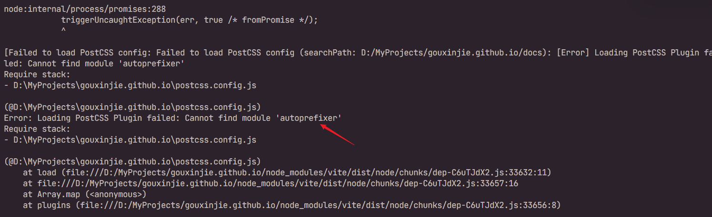

# PostCSS 与 Sass/LESS

[[toc]]

## 一、什么是 PostCSS(后处理器)？

**PostCSS** 是一个 `CSS` 处理工具，它本身不直接处理 CSS 样式，而是依赖插件来扩展功能。通过插件，`PostCSS` 可以执行很多任务，如自动加浏览器前缀、CSS 压缩、CSS 模块支持等。`PostCSS` 的强大之处在于它可以根据需求灵活选择插件，而不像传统的 CSS 预处理器那样预设了一些功能。

## 二、什么是 CSS 预处理器（Sass/LESS）？

**Sass** 和 **LESS** 是最常用的 CSS 预处理器，它们增加了变量、嵌套规则、混入（Mixins）、继承等功能。与 PostCSS 不同，Sass 和 LESS 更多地关注于扩展 CSS 的语法和结构，使得开发者能够编写更具逻辑性和复用性的 CSS 代码。

## 三、PostCSS vs Sass/LESS：功能和侧重点对比

我们可以通过以下表格来对比 **PostCSS** 和 **Sass/LESS** 的主要功能、侧重点和适用场景。

| 特性/功能            | **PostCSS**                                               | **Sass/LESS**                                                  |
| -------------------- | --------------------------------------------------------- | -------------------------------------------------------------- |
| **功能扩展方式**     | 通过插件实现，灵活定制                                    | 内置语法扩展，功能固定                                         |
| **语法扩展**         | 不直接扩展 CSS 语法，使用插件增强功能                     | 扩展了 CSS 语法，如变量、嵌套、Mixins 等                       |
| **自动加前缀**       | 通过插件（如 `autoprefixer`）自动加前缀                   | 不直接支持自动加前缀，需要额外配置（例如 `gulp-autoprefixer`） |
| **CSS 压缩**         | 通过插件（如 `cssnano`）进行 CSS 压缩                     | 可通过配置与其他工具（如 `gulp`）实现 CSS 压缩                 |
| **模块化支持**       | 通过插件支持 CSS Modules 和其他模块系统                   | 原生支持 CSS 文件的模块化，特别是 Sass 的 `@use` 和 `@import`  |
| **嵌套支持**         | 通过插件支持 CSS 嵌套（如 `postcss-nested`）              | 本身内建强大的嵌套支持                                         |
| **变量支持**         | 通过插件支持 CSS 变量（如 `postcss-custom-properties`）   | 本身内建变量支持                                               |
| **逻辑操作**         | 没有内建的逻辑功能，所有功能都需要通过插件实现            | 提供变量、运算、条件语句等逻辑功能                             |
| **目标浏览器兼容性** | 通过插件（如 `autoprefixer`）根据浏览器版本自动处理兼容性 | 不提供内建的浏览器兼容性处理，需外部工具支持                   |
| **开发模式支持**     | 高度可定制，通过插件定制构建流程                          | 有自己的编译流程，通常通过构建工具（如 `Webpack`）实现         |
| **使用场景**         | 适合现有 CSS 代码的优化，特别是需要灵活的插件配置         | 适合 CSS 的结构化和增强，注重开发体验与可维护性                |

## 四、PostCSS 的主要功能

PostCSS 是通过插件实现其功能的工具，以下是 PostCSS 常用插件及其功能汇总：

| 插件/功能                     | 说明                                                     |
| ----------------------------- | -------------------------------------------------------- |
| **Autoprefixer**              | 自动为 CSS 属性添加浏览器厂商前缀。                      |
| **cssnano**                   | 用于 CSS 压缩，移除不必要的空格、注释等。                |
| **postcss-nested**            | 使得 CSS 支持嵌套规则，类似 Sass 中的嵌套功能。          |
| **postcss-modules**           | 支持 CSS 模块化，避免样式冲突。                          |
| **postcss-preset-env**        | 使用最新的 CSS 特性并自动转换为兼容性好的代码。          |
| **postcss-import**            | 支持在 CSS 中导入其他 CSS 文件，类似 Sass 的 `@import`。 |
| **postcss-custom-properties** | 支持在不完全支持 CSS 变量的环境中使用 CSS 变量。         |
| **postcss-assets**            | 自动处理图片、字体文件的路径管理。                       |

## 五、如何在 Vite 项目中配置 PostCSS？

在 Vite 项目中配置 PostCSS 其实非常简单。Vite 会自动检测并支持 `postcss.config.js` 文件的配置，因此，你只需要安装并配置相关插件即可。以下是配置的步骤：

### 步骤 1：安装 PostCSS 和插件

首先，你需要安装 PostCSS 以及你所需要的插件（例如 `autoprefixer` 和 `cssnano`）：

```bash
npm install postcss autoprefixer cssnano --save-dev
```

### 步骤 2：创建 `postcss.config.js` 配置文件

在项目根目录下创建 `postcss.config.js` 文件，并配置相关插件：

```js
// postcss.config.js
module.exports = {
  plugins: [
    require("autoprefixer"), // 自动加浏览器前缀
    require("cssnano")({
      // 压缩 CSS
      preset: "default"
    })
  ]
};
```

### 步骤 3：在 `vite.config.js` 配置 PostCSS

Vite 会自动识别 `postcss.config.js`，但如果需要更详细的配置，也可以在 `vite.config.js` 中显式声明：

```js
import { defineConfig } from "vite";

export default defineConfig({
  css: {
    postcss: "./postcss.config.js" // 指定 PostCSS 配置文件
  }
});
```

### 步骤 4：启动开发服务器

完成配置后，可以运行 Vite 开发服务器，PostCSS 将在构建时自动处理你的 CSS：

```bash
npm run dev
```

## 六、报错处理



这是因为 VitePress 项目缺少 `autoprefixer` 模块。要解决这个问题，请执行以下命令：

```bash
npm install autoprefixer --save-dev
```

然后再`postcss.config.js`中添加

```js
module.exports = {
  plugins: {
    tailwindcss: {},
    autoprefixer: {} // 自动添加浏览器前缀
  }
};
```
