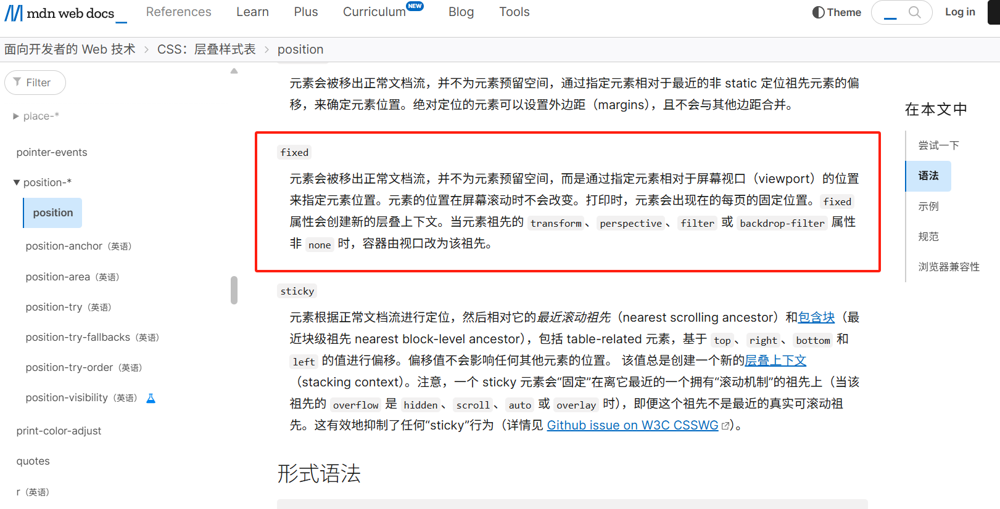

# transform影响fixed定位

## 问题 

我们都知道fixed定位是相对于视口的；但是如果具有fixed定位的祖先元素有`transform、perspective、filter 或 backdrop-filter` 属性非 none 时，容器由视口改为该祖先。也就是说变成绝对定位了。那么此时变现出来的和设想的不一样。

[MDN解释](https://developer.mozilla.org/zh-CN/docs/Web/CSS/position#fixed)

## 解决方案
 
1，使用fixed定位时注意父元素是否有`transform、perspective、filter 或 backdrop-filter`等属性。 
2，使用其他定位替代固定定位，根据业务灵活使用
