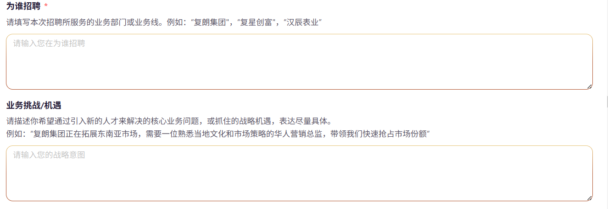

# css 实现上下渐变的框线

## 实现效果



## 实现思路

```html
   <p className={styles.subtitle}>阶段1：填写招聘意图</p>
      <div>
        <p className={`${styles.title} ${styles.required}`}>为谁招聘</p>
        <p className={styles.description}>请填写本次招聘所服务的业务部门或业务线。例如：“复朗集团"，“复星创富"，“汉辰表业”</p>
        <TextArea className="area-input" value={recruiter} onChange={(e) => setRecruiter(e.target.value)} rows={4} placeholder="请输入您在为谁招聘" />
      </div>

      <div>
        <p className={styles.title}>业务挑战/机遇</p>
        <p className={styles.description}>
          请描述你希望通过引入新的人才来解决的核心业务问题，或抓住的战略机遇，表达尽量具体。<br></br>
          例如：“复朗集团正在拓展东南亚市场，需要一位熟悉当地文化和市场策略的华人营销总监，带领我们快速抢占市场份额”
        </p>
        <TextArea
          className="area-input"
          value={businessChallenges}
          onChange={(e) => setBusinessChallenges(e.target.value)}
          rows={4}
          placeholder="请输入您的战略意图"
        />
      </div>

```

为上面容器添加类名`area-input`

```scss
.area-input {
  /* 设置元素边框为1像素宽度，样式为实线，颜色为透明。 */
  border: 1px solid transparent;
  /* 设置元素边框圆角为12像素。 */
  border-radius: 12px;
  /* 设置背景剪裁区域为内边距和边框区域。 */
  background-clip: padding-box, border-box;
  /* 设置背景绘制区域为内边距和边框区域。 */
  background-origin: padding-box, border-box;
  /* 设置元素的背景图像为两个线性渐变。第一个渐变从左到右，颜色从白色到白色；第二个渐变从上到下 */
  background-image: linear-gradient(to right, #fff, #fff), linear-gradient(to bottom, rgba(231, 196, 119, 1), rgba(178, 87, 45, 1), rgba(173, 77, 39, 1)); /* 修改为从上到下渐变 */
  &:focus-within {
    box-shadow: 0 0 8px #b0581d0d, 0 8px 16px #b0581d1a, 0 8px 16px #b0581d1a;
  }
  &:hover {
    box-shadow: 0 0 8px #b0581d0d, 0 8px 16px #b0581d1a, 0 8px 16px #b0581d1a;
  }
}
```
