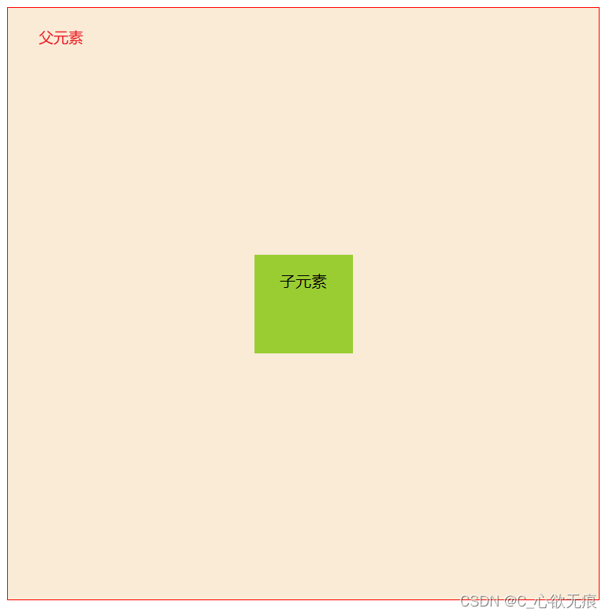

# 盒子水平垂直居中的几种方式

----


[[toc]]


实现效果图如下： {width=500px height=500px}

首先是父元素的基本样式：

```css
.container {
  width: 600px;
  height: 600px;
  border: 1px solid red;
  background-color: antiquewhite;
  margin: 0 auto;
  /* 父盒子开启相对定位 */
  position: relative;
}
```

## 1，定位走自身一半

这种方式需要知道子元素的实际高度和宽度，最后要水平方向和垂直方向利用 margin 属性的负值走自身一半；

```css
/* 子元素 */
.item {
  width: 100px;
  height: 100px;
  background-color: yellowgreen;
  /* 子元素开启绝对定位 */
  position: absolute;
  top: 50%; /* 子元素的上边界走父盒子高度的50% */
  left: 50%; /* 子元素的左边界走父盒子宽度的50% */
  margin-top: -50px; /*向上走回自身高度的一半*/
  margin-left: -50px; /*向左走回自身宽度的一半*/
}
```

## 2，定位使用 margin:auto

也是使用绝对定位，但上下左右的定位值都要设置为 0；不需要知道子元素的宽度和高度；

正常情况下不使用定位，`margin:auto等同于margin:0 auto`；也就是水平居中，无法达到垂直居中，既使垂直方向有剩余空间；

使用了绝对定位之后，margin: auto 就可以实现垂直方向的居中；我猜想是因为绝对定位触发了`BFC盒子规则`，导致父元素和子元素之间相互隔离；(仅个人观点)

```css
/* 子元素 */
.item {
  width: 100px;
  height: 100px;
  background-color: yellowgreen;
  /* 子元素开启绝对定位 */
  position: absolute;
  top: 0;
  left: 0;
  right: 0;
  bottom: 0;
  margin: auto; /*相当于宽度和高度自动计算为居中*/
}
```

## 3，使用 flex 弹性布局

flex 布局是很常用的方法；不需要知道子元素的宽度和高度， 主轴和交叉轴都设置为居中即可；

```css
/* 父元素 */
.container {
  width: 600px;
  height: 600px;
  border: 1px solid red;
  background-color: antiquewhite;
  display: flex;
  /* 主轴居中 */
  justify-content: center;
  /* 交叉轴居中 */
  align-items: center;
}
```

## 4，transform变换实现居中(推荐)

也是使用子绝父相，利用 css3 新增`transform的translate`属性来进行垂直居中；

`translate`可以同时传两个属性，第一个是水平方向移动距离，第二个是垂直方向的移动距离；
`translate`中的%百分比相对的是自身的 ，也就是向左向上走自身的%50 来实现居中效果；

```css
/* 子元素 */
.item {
  width: 100px;
  height: 100px;
  background-color: yellowgreen;
  position: absolute;
  top: 50%;
  left: 50%;
  // 走自身一半
  transform: translate(-50%, -50%);
}
```

## 5，使用 display:table-cell

`display:table-cell`属性指让标签元素以表格单元格的形式呈现，类似于`td`标签，利用这个特性可以实现文字的垂直居中效果；
但要想实现 div 的垂直居中，需要把子元素转为行内块元素，也就是： display: inline-block;

```css
/* 父元素 */
.container {
  width: 600px;
  height: 600px;
  border: 1px solid red;
  background-color: antiquewhite;
  /* 让标签元素以表格单元格的形式呈现 利用这个特性可以实现文字的垂直居中效果 */
  display: table-cell;
  vertical-align: middle;
  text-align: center;
}
/* 子元素 */
.item {
  width: 100px;
  height: 100px;
  /* 想要实现块元素的垂直居中 inline-block是必须的 */
  display: inline-block;
  background-color: yellowgreen;
}
```
