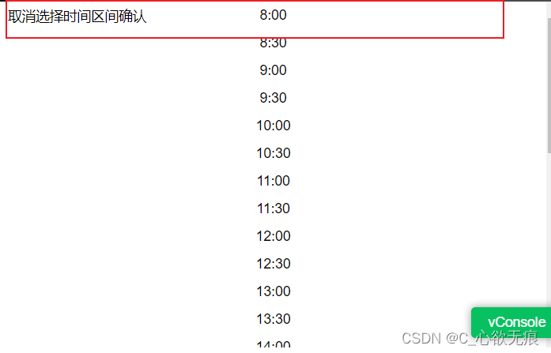
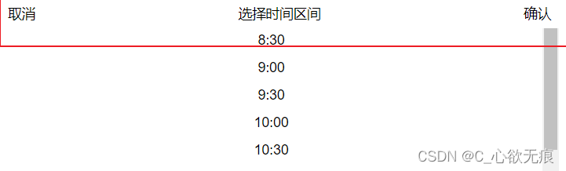

# 绝对定位与Flex布局冲突的解决方案

---

写这篇文章来记录一下自己不久前踩过的坑，相信很多人都有踩过这个坑:

在我们给一个元素设置好 `position:absolute` 以后,还需要用弹性布局来进一步完善时,会发现 flex 不生效.现在咱们就来探讨一下如何解决这个问题.

## 失效的截图

大家可以看到顶部的样式，定位已经定上去的，但是 flex 没有起作用（其实 display:flex 是起作用的，在同一行上了，只是 `justify-content: space-between;` 没有起作用 导致布局乱掉了）

{width=500px height=500px}

**css 代码如下：**
```javascript
.content {
    position: absolute;
    top: 0;
    display: flex;
    justify-content: space-between;
    background-color: #fff;
    padding: 5px 8px;
    align-items: center;
  }
```

## 解决方案

**1，给当前容器一个宽度**

```javascript
.content {
    position: absolute;
    top: 0;
    width: 100%;// [!code ++]  给当前容器一个宽度
    display: flex;
    justify-content: space-between;
    background-color: #fff;
    padding: 5px 8px;
    align-items: center;
  }
```

添加之后布局正常了;

{width=500px}

**2，添加父容器**

把当前容器的`position:absolute`属性给到当前容器的外一层容器(如果没有就再套上一层),即内层容器用弹性布局,外层容器用定位,既然两个属性冲突,把这两个属性分开给就完事了。(不行的话再给弹性盒子一个宽度)。
