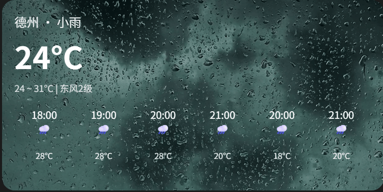

# 用 HTML5 视频做天气卡片背景：毛玻璃与动态 UI 效果实现原理

[[toc]]

在现代前端设计中，“视频背景 + 半透明毛玻璃 UI” 是一个很炫酷的视觉效果，常见于天气应用、音乐播放器和一些展示类网站。

## 一、效果展示

最终效果是这样的：

- 视频在卡片背景中循环播放（比如雨滴视频）。
- 卡片不是纯色，而是有 **半透明 + 毛玻璃模糊** 的层，保证文字清晰可见。
- 天气信息叠加在卡片上，形成“视频背景 + 信息 UI”的融合。

{width=80%}

## 二、实现原理

### 1. HTML5 `<video>` 元素作为背景

在 HTML5 中，我们可以直接使用 `<video>` 标签嵌入视频。常用属性：

- `autoplay`：自动播放
- `loop`：循环播放
- `muted`：静音（浏览器要求，静音才能自动播放）
- `playsinline`：移动端避免全屏

如果直接全屏铺满，会显得过于喧宾夺主。这里我们将视频限制在 **卡片容器内部**，作为“背景层”。

### 2. 视频叠放到卡片底层

通过 `position: absolute` 将视频定位到卡片内部，并设置 `z-index: -2`，让它始终位于最底层。

```css
.weather-card video {
  position: absolute;
  top: 0;
  left: 0;
  width: 100%;
  height: 100%;
  object-fit: cover; /* 保证填充裁剪 */
  z-index: -2;
}
```

### 3. 毛玻璃效果的本质

**毛玻璃（Frosted Glass）** 效果的关键在于 **半透明背景 + backdrop-filter: blur()**。

- `background: rgba(0,0,0,0.35)`：半透明遮罩，让视频不至于太亮/抢眼。
- `backdrop-filter: blur(10px)`：让背景产生模糊效果，模拟毛玻璃质感。

这一层我们放在视频和内容之间，提升可读性。

```css
.glass-overlay {
  position: absolute;
  inset: 0; /* 顶部/底部/左右都贴合 */
  background: rgba(0, 0, 0, 0.35);
  backdrop-filter: blur(10px);
  z-index: -1;
}
```

### 4. 内容层

卡片内部的文字、图标，位于最上层（`position: relative`）。因为有了毛玻璃层的衬托，即使背景是动态视频，文字依然清晰。

```css
.content {
  position: relative;
  padding: 20px;
  color: #fff;
}
```

## 三、完整代码示例

```html
<!DOCTYPE html>
<html lang="zh-CN">
  <head>
    <meta charset="UTF-8" />
    <meta name="viewport" content="width=device-width, initial-scale=1.0" />
    <title>天气卡片局部视频背景</title>
    <style>
      * {
        margin: 0;
        padding: 0;
        box-sizing: border-box;
      }

      body {
        height: 100vh;
        display: flex;
        justify-content: center;
        align-items: center;
        background: #1c1c1c;
        font-family: sans-serif;
        color: #fff;
      }

      /* 天气卡片容器 */
      .weather-card {
        position: relative;
        width: 600px;
        height: 300px;
        border-radius: 20px;
        overflow: hidden; /* 限制视频不溢出 */
      }

      /* 局部视频背景 */
      .weather-card video {
        position: absolute;
        top: 0;
        left: 0;
        width: 100%;
        height: 100%;
        object-fit: cover;
        z-index: -2;
      }

      /* 半透明 + 毛玻璃层 */
      .glass-overlay {
        position: absolute;
        top: 0;
        left: 0;
        width: 100%;
        height: 100%;
        background: rgba(0, 0, 0, 0.2); /* 半透明黑色 */
        backdrop-filter: blur(0px); /* 毛玻璃模糊 如果需要的话 */
        z-index: -1;
      }

      /* 卡片内容 */
      .content {
        position: relative;
        padding: 20px;
      }

      .header {
        font-size: 1.2rem;
        opacity: 0.9;
      }

      .temp {
        font-size: 3rem;
        font-weight: bold;
        margin: 5px 0;
      }

      .sub {
        font-size: 0.9rem;
        opacity: 0.8;
      }

      .forecast {
        display: flex;
        justify-content: space-between;
        margin-top: 20px;
      }

      .forecast-item {
        text-align: center;
        flex: 1;
      }

      .forecast-item span {
        display: block;
        margin-top: 20px;
        font-size: 0.8rem;
        opacity: 0.9;
      }
    </style>
  </head>
  <body>
    <!-- 卡片 -->
    <div class="weather-card">
      <!-- 背景视频 -->
      <video
        src="https://search-operate.cdn.bcebos.com/5b8fa41e5c92ea8793a99c5081a7a9d8.mp4"
        muted
        autoplay
        loop
        playsinline
        poster="https://search-operate.cdn.bcebos.com/9669cac22a5833622982ecfdf38f4694.png"
      ></video>

      <!-- 毛玻璃遮罩 -->
      <div class="glass-overlay"></div>

      <!-- 内容层 -->
      <div class="content">
        <div class="header">德州 · 小雨</div>
        <div class="temp">24°C</div>
        <div class="sub">24 ~ 31°C | 东风2级</div>

        <div class="forecast">
          <div class="forecast-item">
            <div>18:00</div>
            <div>🌧️</div>
            <span>28°C</span>
          </div>
          <div class="forecast-item">
            <div>19:00</div>
            <div>🌧️</div>
            <span>28°C</span>
          </div>
          <div class="forecast-item">
            <div>20:00</div>
            <div>🌧️</div>
            <span>28°C</span>
          </div>
          <div class="forecast-item">
            <div>21:00</div>
            <div>🌧️</div>
            <span>20°C</span>
          </div>
          <div class="forecast-item">
            <div>20:00</div>
            <div>🌧️</div>
            <span>18°C</span>
          </div>
          <div class="forecast-item">
            <div>21:00</div>
            <div>🌧️</div>
            <span>20°C</span>
          </div>
        </div>
      </div>
    </div>
  </body>
</html>
```

## 技术要点总结

1. **三层叠放结构**

   - 最底层：`<video>` 作为动态背景
   - 中间层：半透明 + 毛玻璃遮罩
   - 最上层：天气内容文字/图标

2. **避免全屏视频** 视频只占卡片区域，更聚焦，不会分散用户注意力。

3. **毛玻璃提升可读性** 直接在视频上放文字往往看不清，而加上 `backdrop-filter: blur()`，既保持了动态氛围，又保证了 UI 的清晰度。

4. **性能考虑** `backdrop-filter` 在低端设备上可能会有性能消耗，可以在必要时改成半透明纯色背景作为降级方案。
