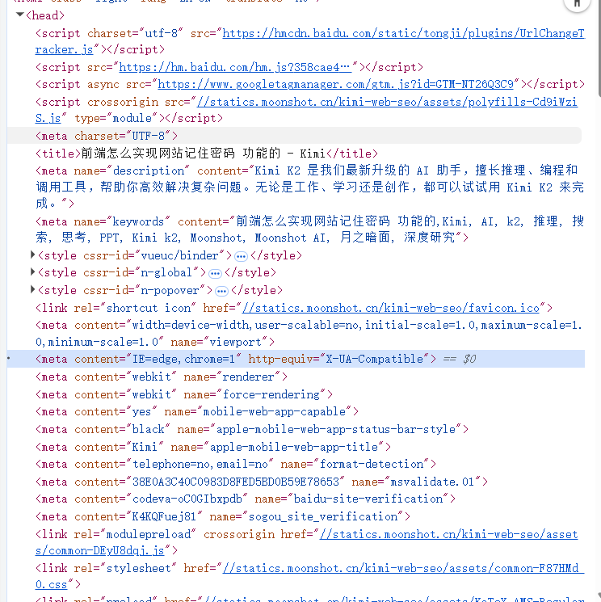

# HTML `<head>` 标签及其常用元素

[[toc]]

`<head>` 标签的内容通常不会直接显示在浏览器中，但它承载着大量关于页面的信息，包括元数据、样式、脚本、SEO 优化等方面的内容。

**如下图所示：**

{width=70%}

## 1. `<meta>` 标签

`<meta>` 标签是 HTML 中的元数据标签，用来提供关于网页的附加信息。常见的 `<meta>` 标签包括字符集、描述、关键词等。

### (1) **字符集设置：`<meta charset="UTF-8">`**

```html
<meta charset="UTF-8" />
```

这个标签指定网页使用的字符编码。`UTF-8` 是最常见的编码格式，它支持全球几乎所有的文字和符号。如果没有设置字符集，浏览器会使用默认的编码方式，这可能会导致一些非英语字符显示异常。

### (2) **描述信息：`<meta name="description" content="...">`**

```html
<meta name="description" content="这是一个关于HTML head标签的教程，帮助开发者理解常用标签的作用。" />
```

`description` 元素提供页面的简短描述，通常被搜索引擎用作搜索结果的摘要。优化此描述有助于提高页面在搜索引擎中的排名，并增加点击率。

### (3) **关键词：`<meta name="keywords" content="关键词1, 关键词2">`**

```html
<meta name="keywords" content="HTML, head标签, meta标签, SEO" />
```

`keywords` 元素列出了与页面内容相关的关键词，尽管现在大多数搜索引擎已经不再过度依赖这个标签，但它仍然对一些搜索引擎起到一定的作用。

### (4) **视口设置：`<meta name="viewport" content="width=device-width, initial-scale=1.0">`**

```html
<meta name="viewport" content="width=device-width, initial-scale=1.0" />
```

这个 `meta` 标签告诉浏览器如何设置页面的视口，尤其是在移动设备上。通过这个标签，可以实现响应式设计，确保网页在各种屏幕尺寸下良好显示。

## 2. `<title>` 标签

`<title>` 标签是页面中至关重要的一部分，它定义了网页的标题，通常会显示在浏览器的标签栏或窗口标题中，同时也是搜索引擎排名的重要依据之一。

```html
<title>HTML Head 标签详解 - 初学者教程</title>
```

一个好的标题应当简洁明了，并准确地概括网页内容。对于搜索引擎而言，标题是影响排名的重要因素，建议标题中包含关键词，但也要避免堆砌关键词。

## 3. `<link>` 标签

`<link>` 标签主要用于链接外部资源，如 CSS 文件、图标等。它在 `<head>` 中扮演着至关重要的角色。

### (1) **外部样式表：`<link rel="stylesheet" href="style.css">`**

```html
<link rel="stylesheet" href="style.css" />
```

`<link>` 标签用于引入外部 CSS 文件，它帮助控制页面的样式。使用外部样式表可以将 HTML 结构与样式分离，提高代码的可维护性。

### (2) **网站图标：`<link rel="icon" href="favicon.ico">`**

```html
<link rel="icon" href="favicon.ico" />
```

通过 `rel="icon"` 属性，可以为网站设置一个小图标，通常会显示在浏览器标签栏的左侧。这种图标叫做 favicon，它能够帮助用户快速识别网站。

### (3) **预加载资源：`<link rel="preload" href="script.js" as="script">`**

```html
<link rel="preload" href="script.js" as="script" />
```

`<link rel="preload">` 是一个较新的功能，它允许开发者提前加载一些页面资源（如脚本、样式表或字体），从而提升页面的加载性能。预加载可以减少页面渲染时的阻塞，优化用户体验。

## 4. `<style>` 标签

`<style>` 标签允许在页面中嵌入 CSS 样式，它的作用与 `<link>` 标签类似，但通常用于少量的样式或临时的样式调整。

```html
<style>
  body {
    background-color: #f0f0f0;
  }
</style>
```

尽管大多数 CSS 样式会放在外部文件中，但有时为了更高效的调试或特定的页面需求，嵌入式样式也非常常见。

## 5. `<script>` 标签

`<script>` 标签用于在网页中引入 JavaScript 脚本。它的位置和加载方式对页面性能有很大的影响。

### (1) **异步加载脚本：`<script async src="script.js"></script>`**

```html
<script async src="script.js"></script>
```

通过 `async` 属性，可以让浏览器异步加载脚本，而不阻塞页面的渲染。这对于提升页面加载速度尤为重要，尤其是当页面中包含多个外部脚本时。

### (2) **模块化脚本：`<script type="module" src="app.js"></script>`**

```html
<script type="module" src="app.js"></script>
```

`type="module"` 属性使得脚本成为 ES6 模块，这样你可以使用 `import` 和 `export` 等现代 JavaScript 功能。模块化脚本有助于代码的结构化和可维护性。

## 6. 其他常用标签

除了以上介绍的常见标签，还有一些用于增强用户体验和兼容性的标签：

- **`<meta http-equiv="X-UA-Compatible" content="IE=edge">`** 这个标签告诉浏览器使用最新的渲染引擎，避免在旧版 Internet Explorer 中出现兼容性问题。

- **`<meta name="robots" content="noindex, nofollow">`** 通过这个标签，开发者可以控制搜索引擎是否索引该页面及跟踪页面中的链接。
