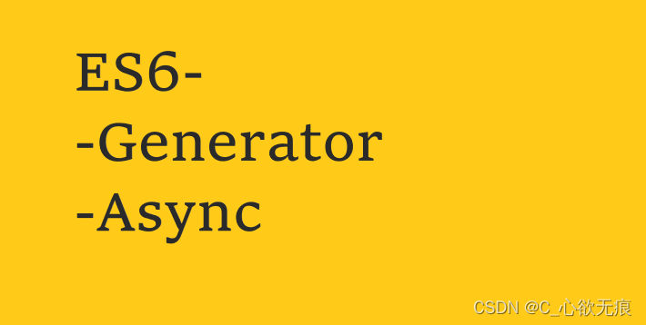

# generator 和 async 函数



### 一、前言

ES6 诞生以前，异步编程的方法，大概有下面四种。

::: tip 异步行为

- 回调函数
- 事件监听
- 发布/订阅
- Promise 对象

:::

`回调函数`本身并没有问题，它的问题出现在多个回调函数嵌套会造成回调地狱，非常不利于代码的维护和逻辑混乱等问题；

`Promise` 对象就是为了解决这个问题而提出的。它不是新的语法功能，而是一种新的写法，允许将回调函数的嵌套，改成链式调用。采用 `Promise`，连续读取多个文件，写法如下:

```js
var readFile = require("fs-readfile-promise");
readFile(fileA)
  .then(function (data) {
    console.log(data.toString());
  })
  .then(function () {
    return readFile(fileB);
  })
  .then(function (data) {
    console.log(data.toString());
  })
  .catch(function (err) {
    console.log(err);
  });
```

可以看到，`Promise` 的写法只是回调函数的改进，使用 `then` 方法以后，异步任务的两段执行看得更清楚了，除此以外，并无新意。

`Promise` 的最大问题是代码冗余，原来的任务被 `Promise `包装了一下，不管什么操作，一眼看去都是一堆 `then`，原来的语义变得很不清楚;

`那么，有没有更好的写法呢？`:

::: tip

Generator 函数将 JavaScript 异步编程带入了一个全新的阶段。

:::

---

### 二、简介

Generator 函数是 ES6 提供的解决异步编程的方案之一；​

整个 Generator 函数就是一个封装的异步任务，或者说是异步任务的容器。异步操作需要暂停的地方，都用 yield 语句注明。Generator 函数的执行方法如下。

```js
function* gen(x) {
  var y = yield x + 2;
  return y;
}

var g = gen(1);
g.next(); // { value: 3, done: false }
g.next(); // { value: undefined, done: true }
```

上面代码中，调用 Generator 函数，会返回一个内部指针（即遍历器）g。这是 Generator 函数不同于普通函数的另一个地方，即执行它不会返回结果，返回的是指针对象。调用指针 g 的 next 方法，会移动内部指针（即执行异步任务的第一段），指向第一个遇到的 yield 语句，上例是执行到 x + 2 为止。

换言之，next 方法的作用是分阶段执行 Generator 函数。每次调用 next 方法，会返回一个对象，表示当前阶段的信息（value 属性和 done 属性）。value 属性是 yield 语句后面表达式的值，表示当前阶段的值；done 属性是一个布尔值，表示 Generator 函数是否执行完毕，即是否还有下一个阶段。

### 三、特点

​ 1，定义`Generator` 函数需要在 function 后面加上<kbd>\*</kbd>号：

```js
function* helloWorldGenerator(){...}
```

​ 2，调用函数不会打印任何函数数据，而是会返回一个指针对象；

​ 3，每次调用指针对象中的 next 方法，来执行 generator 函数中的内容，返回结果和 iteraator 相似；

---

### 四、Generator 函数实现

由于 Generator 函数返回的遍历器对象，只有调用`next`方法才会遍历下一个内部状态，所以其实提供了一种可以暂停执行的函数。`yield`表达式就是暂停标志。

**遍历器对象的`next`方法的运行逻辑如下：**

（1）遇到`yield`表达式，就暂停执行后面的操作，并将紧跟在`yield`后面的那个表达式的值，作为返回的对象的`value`属性值。

（2）下一次调用`next`方法时，再继续往下执行，直到遇到下一个`yield`表达式。

（3）如果没有再遇到新的`yield`表达式，就一直运行到函数结束，直到`return`语句为止，并将`return`语句后面的表达式的值，作为返回的对象的`value`属性值。

（4）如果该函数没有`return`语句，则返回的对象的`value`属性值为`undefined`

**看下面的案例**：

```js
function* helloWorldGenerator() {
  yield "hello";
  console.log("111");
  yield "world";
  console.log("222");
  return "ending";
}
var hw = helloWorldGenerator();
console.log(hw.next());
console.log(hw.next());
console.log(hw.next());
```

运行结果：

```js
{value: 'hello', done: false}
111
{value: 'world', done: false}
222
{value: 'ending', done: true}
```

**也就是说：**

我们每一次调用都需要使用 next 进行调用，每次使用一个 next 都会调用到一个 yield，当程序触碰到 yield 那么程序会陷入阻塞状态，直到碰到下一个 next 为止 才会继续执行 执行到下下一个 yield。也就是说 每一次调用一次 yield 都会执行一个 yield；

> Generator 函数可以不用 yield 表达式，这时就变成了一个单纯的暂缓执行函数。如下：

```js
function* fun() {
  console.log("执行了！");
}
var generator = fun();
generator.next();
setTimeout(function () {
  generator.next();
}, 2000);
```

上面代码中，函数 fun 如果是普通函数，在为变量 generator 赋值时就会执行。但是，函数 fun 是一个 Generator 函数，就变成只有调用 next 方法时，函数 fun 才会执行。

另外需要注意，yield 表达式只能用在 Generator 函数里面，用在其他地方都会报错。

### 五、Async 函数

`async` 函数是什么？一句话，它就是 `Generator 函数`的语法糖。使得异步操作变得更加方便。这也是我们日常开发中常用的写法；

1，Generator 函数处理异步：

readFile 是异步操作，不必关系它做了什么

```js
const gen = function* () {
  const f1 = yield readFile("/etc/fstab");
  const f2 = yield readFile("/etc/shells");
  console.log(f1.toString());
  console.log(f2.toString());
};
```

2，async 函数处理异步

```js
const asyncReadFile = async function () {
  const f1 = await readFile("/etc/fstab");
  const f2 = await readFile("/etc/shells");
  console.log(f1.toString());
  console.log(f2.toString());
};
```

一比较就会发现，async 函数就是将 Generator 函数的星号（\*）替换成 async，将 yield 替换成 await，仅此而已。它的最大优点，就是代码的写法非常像同步操作，如果去除`yield`命令，简直一模一样；

**async 函数对 Generator 函数的改进，体现在以下四点:**

（1）内置执行器。

Generator 函数的执行必须需要调用`next`方法，或者用 co 模块，才能真正执行，得到最后结果。而`async函数自带执行器`。也就是说，async 函数的执行，与普通函数一模一样，只要一行。

（2）更好的语义化。

`async和await`，比起星号和 yield，语义更清楚了。async 表示函数里有异步操作，await 表示紧跟在后面的表达式需要等待结果。

（3）更广的适用性。

co 模块约定，yield 命令后面只能是 Thunk 函数或 Promise 对象，`而async函数的await命令后面`，可以是 Promise 对象和原始类型的值（数值、字符串和布尔值，但这时会自动转成立即 resolved 的 romise 对象）。

（4）返回值是 Promise。

`async函数的返回值是 Promise 对象`，这比 Generator 函数的返回值是 Iterator 对象方便多了。你可以用 then 方法指定下一步的操作。

进一步说，`async函数`完全可以看作多个异步操作，包装成的一个 Promise 对象，而`await`命令就是内部 then 命令的语法糖；

## 【参考文档】：

1，Generator 函数的语法：https://es6.ruanyifeng.com/#docs/generator

2，async 函数：https://es6.ruanyifeng.com/#docs/async
