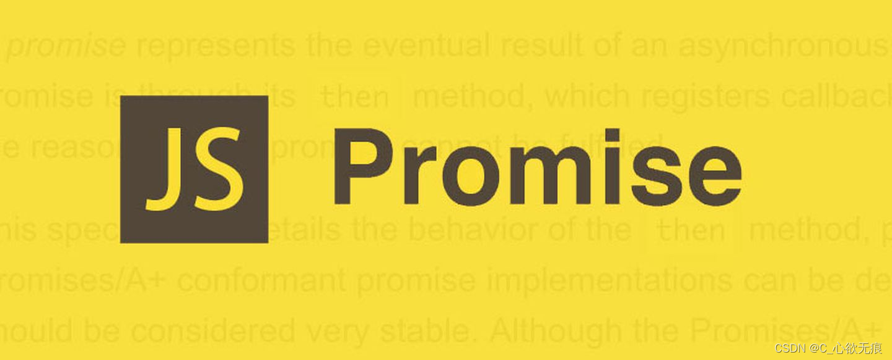

# Promise 使用

`Promise` 是 `JavaScript` 异步编程的核心解决方案，它解决了传统回调地狱问题，提供了更优雅的异步控制流。



**面试官：谈谈你对 Promise 的理解？**

::: tip 回答

Promise 用来解决异步回调问题，由于 js 是单线程的，很多异步操作都是依靠回调方法实现的，这种做法在逻辑比较复杂的回调嵌套中会相当复杂；也叫做回调地狱；

promise 用来将这种繁杂的做法简化，让程序更具备可读性，可维护性；promise 内部有三种状态，`pending，fulfilled，rejected`；

pending 表示程序正在执行但未得到结果，即异步操作没有执行完毕，

fulfilled 表示程序执行完毕，且执行成功，

rejected 表示执行完毕但失败；这里的成功和失败都是逻辑意义上的；并非是要报错。

其实，promise 和回调函数一样，都是要解决数据的传递和消息发送问题，promise 中的 then 一般对应成功后的数据处理，catch 一般对应失败后的数据处理。

:::

## **一、Promise 基础概念**

### **1.1 什么是 Promise？**

`Promise` 是一个表示异步操作最终完成或失败的对象，它有三种状态：

- **pending**（进行中）
- **fulfilled**（已成功）
- **rejected**（已失败）

### **1.2 创建 Promise**

```javascript
const promise = new Promise((resolve, reject) => {
  // 异步操作
  setTimeout(() => {
    const success = true;
    if (success) {
      resolve("操作成功");
    } else {
      reject("操作失败");
    }
  }, 1000);
});
```

### **1.3 使用 Promise**

```javascript
promise
  .then((result) => {
    console.log(result); // "操作成功"
  })
  .catch((error) => {
    console.error(error); // "操作失败"
  });
```

## **二、Promise 自带方法**

### **2.1 静态方法**

#### **Promise.resolve()**

创建一个立即解析的 Promise：

```javascript
Promise.resolve("立即返回").then(console.log); // "立即返回"
```

#### **Promise.reject()**

创建一个立即拒绝的 Promise：

```javascript
Promise.reject("错误").catch(console.error); // "错误"
```

#### **Promise.all()**

`Promise.all()`方法用于将多个 Promise 实例，包装成一个新的 Promise 实例。
等待所有 Promise 完成，或任意一个失败：

```javascript
const p1 = Promise.resolve(1);
const p2 = Promise.resolve(2);

Promise.all([p1, p2]).then((values) => {
  console.log(values); // [1, 2]
});
```

#### **Promise.race()**

返回最先完成的 Promise（无论成功或失败）：

```javascript
const p1 = new Promise((res) => setTimeout(res, 100, "慢"));
const p2 = new Promise((res) => setTimeout(res, 50, "快"));

Promise.race([p1, p2]).then((winner) => {
  console.log(winner); // "快"
});
```

#### **Promise.allSettled()**

等待所有 Promise 完成（无论成功或失败）：

```javascript
const p1 = Promise.resolve(1);
const p2 = Promise.reject("错误");

Promise.allSettled([p1, p2]).then((results) => {
  console.log(results);
  // [
  //   { status: 'fulfilled', value: 1 },
  //   { status: 'rejected', reason: '错误' }
  // ]
});
```

#### **Promise.any()**

返回第一个成功的 Promise（忽略失败）：

```javascript
const p1 = Promise.reject("错误1");
const p2 = Promise.resolve("成功");

Promise.any([p1, p2]).then((firstSuccess) => {
  console.log(firstSuccess); // "成功"
});
```

### **2.2 实例方法**

#### **.then()**

处理 Promise 的成功状态：

```javascript
fetch("/api")
  .then((response) => response.json())
  .then((data) => console.log(data));
```

#### **.catch()**

捕获 Promise 链中的错误：

```javascript
fetch("/api")
  .then((response) => response.json())
  .catch((error) => console.error("请求失败:", error));
```

#### **.finally()**

无论成功或失败都会执行：

```javascript
fetch("/api")
  .then((response) => response.json())
  .finally(() => console.log("请求结束"));
```

## **三、Promise 高级技巧**

### **3.1 链式调用**

```javascript
function getUser(id) {
  return fetch(`/users/${id}`)
    .then((response) => response.json())
    .then((user) => fetch(`/profile/${user.profileId}`))
    .then((response) => response.json());
}
```

### **3.2 错误处理策略**

```javascript
// 方式1：每个 then 后单独 catch
fetch("/api")
  .then((res) => res.json())
  .catch(handleJSONError)
  .then((data) => process(data))
  .catch(handleProcessError);

// 方式2：全局 catch
fetch("/api")
  .then((res) => res.json())
  .then((data) => process(data))
  .catch(handleAnyError);
```

### **3.3 取消 Promise**

原生 Promise 无法取消，但可以通过封装实现：

```javascript
function cancellablePromise(promise) {
  let isCancelled = false;

  const wrappedPromise = new Promise((resolve, reject) => {
    promise.then((value) => !isCancelled && resolve(value)).catch((error) => !isCancelled && reject(error));
  });

  return {
    promise: wrappedPromise,
    cancel: () => {
      isCancelled = true;
    }
  };
}
```

### **3.4 Promise 化回调函数**

将回调风格的函数转换为 Promise：

```javascript
const fs = require("fs");

function readFilePromise(path) {
  return new Promise((resolve, reject) => {
    fs.readFile(path, (err, data) => {
      if (err) reject(err);
      else resolve(data);
    });
  });
}
```

## **四、Promise 与 async/await**

### **4.1 基本转换**

```javascript
// Promise 风格
function getData() {
  return fetch("/api").then((res) => res.json());
}

// async/await 风格
async function getData() {
  const res = await fetch("/api");
  return res.json();
}
```

### **4.2 错误处理对比**

```javascript
// Promise
fetch("/api")
  .then((res) => res.json())
  .catch(console.error);

// async/await
try {
  const res = await fetch("/api");
  const data = await res.json();
} catch (err) {
  console.error(err);
}
```

## **五、常见问题与解决方案**

### **5.1 Promise 内存泄漏**

未处理的 Promise 拒绝会导致内存泄漏：

```javascript
// 错误示范（未捕获的拒绝）
function riskyOperation() {
  return new Promise((_, reject) => {
    setTimeout(reject, 1000, "错误");
  });
}

// 正确做法
riskyOperation().catch(() => {});
```

### **5.2 并行与顺序执行**

```javascript
// 顺序执行
async function sequential() {
  await task1();
  await task2(); // 等待 task1 完成
}

// 并行执行
async function parallel() {
  await Promise.all([task1(), task2()]);
}
```

## **六、总结**

Promise 的核心优势：

1. **链式调用**：解决回调地狱
2. **统一错误处理**：通过 `.catch()` 集中管理
3. **组合能力强**：`Promise.all`/`race` 等实现复杂控制流

**最佳实践建议：**

- 始终返回 Promise 链（避免中断）
- 使用 `async/await` 提升可读性
- 不要忘记错误处理

```javascript
// 终极实践示例
async function getFullData() {
  try {
    const [user, posts] = await Promise.all([fetchUser(), fetchPosts()]);
    return { user, posts };
  } catch (error) {
    console.error("加载失败:", error);
    throw error; // 向上传递
  }
}
```
