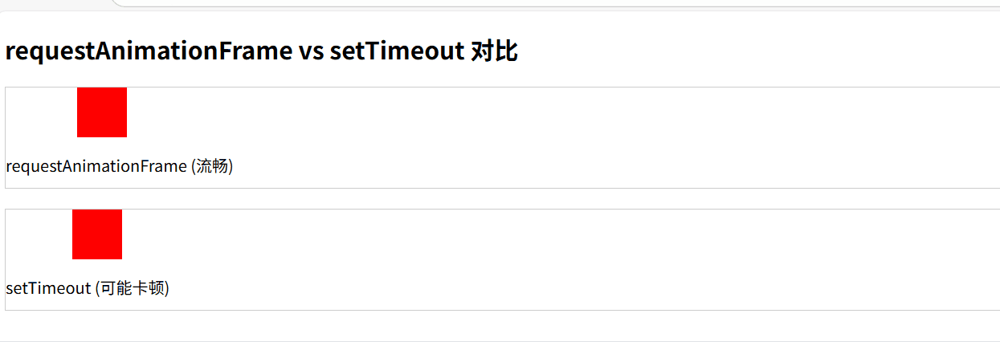

# 理解 requestAnimationFrame：现代 Web 动画的基石

---

[[toc]]

## 一、为什么我们需要 requestAnimationFrame？

在 Web 开发的早期，我们通常使用 `setTimeout` 或 `setInterval` 来创建动画效果。然而，这些方法存在根本性的缺陷：它们与浏览器的渲染周期不同步，可能导致**卡顿、丢帧和电池快速耗尽**等问题。

[requestAnimationFrame](https://developer.mozilla.org/zh-CN/docs/Web/API/Window/requestAnimationFrame) 的出现彻底改变了这一局面，它为 Web 动画提供了一个与浏览器渲染机制深度集成的解决方案。

::: tip 什么是 requestAnimationFrame？

`window.requestAnimationFrame()` 方法会告诉浏览器你希望执行一个动画。它要求浏览器在下一次重绘之前，调用用户提供的回调函数。

对回调函数的调用频率通常与显示器的刷新率相匹配。虽然 75hz、120hz 和 144hz 也被广泛使用，但是最常见的刷新率还是 60hz（每秒 60 个周期/帧）。为了提高性能和电池寿命，大多数浏览器都会暂停在后台选项卡或者隐藏的 `<iframe> `中运行的 requestAnimationFrame()。

:::

**基本语法**

```javascript
// 请求动画帧
const requestId = requestAnimationFrame(callback);

// 取消动画帧
cancelAnimationFrame(requestId);
```

## 二、工作原理：与浏览器渲染周期同步

### 2.1 浏览器渲染流水线

要理解 `requestAnimationFrame` 的强大之处，我们需要先了解浏览器的渲染过程：

```
1. JavaScript执行 → 2. 样式计算 → 3. 布局 → 4. 绘制 → 5. 合成
```

`requestAnimationFrame` 的回调函数在**第一步执行**，确保所有的动画更新都在同一渲染周期内完成。

### 2.2 与 setTimeout 实际案例对比

先说一下特性：

| 特性     | requestAnimationFrame          | setTimeout/setInterval |
| -------- | ------------------------------ | ---------------------- |
| 执行时机 | 浏览器下一次重绘前             | 固定时间间隔           |
| 性能     | 高效，自动暂停（标签页隐藏时） | 持续执行，浪费资源     |
| 帧率     | 与屏幕刷新率同步（通常 60fps） | 固定时间间隔           |
| 兼容性   | 现代浏览器                     | 所有浏览器             |

**案例代码：**  
下面案例展示 `requestAnimationFrame 和 setTimeout/setInterval` 的区别：

```html
<!DOCTYPE html>
<html>
  <head>
    <style>
      .box {
        width: 50px;
        height: 50px;
        background: red;
        position: relative;
      }
      .container {
        height: 100px;
        border: 1px solid #ccc;
        margin: 20px 0;
      }
    </style>
  </head>
  <body>
    <h2>requestAnimationFrame vs setTimeout 对比</h2>

    <div class="container">
      <div class="box" id="rafBox"></div>
      <p>requestAnimationFrame (流畅)</p>
    </div>

    <div class="container">
      <div class="box" id="timeoutBox"></div>
      <p>setTimeout (可能卡顿)</p>
    </div>

    <script>
      // requestAnimationFrame 版本
      function animateWithRAF() {
        const box = document.getElementById("rafBox");
        let position = 0;
        let lastTime = 0;

        function step(timestamp) {
          if (!lastTime) lastTime = timestamp;

          // 基于时间差计算移动距离，保证速度一致
          const elapsed = timestamp - lastTime;
          position += (elapsed / 16) * 2; // 60fps基准

          if (position > 300) position = 0;

          box.style.left = position + "px";
          lastTime = timestamp;

          requestAnimationFrame(step);
        }

        requestAnimationFrame(step);
      }

      // setTimeout 版本
      function animateWithTimeout() {
        const box = document.getElementById("timeoutBox");
        let position = 0;

        function step() {
          position += 2;
          if (position > 300) position = 0;

          box.style.left = position + "px";

          setTimeout(step, 16); // 模拟60fps
        }

        setTimeout(step, 16);
      }

      animateWithRAF();
      animateWithTimeout();
    </script>
  </body>
</html>
```

**效果如下：**



可以看出 `requestAnimationFrame` 对比 `setTimeout` 更流畅，因为 `requestAnimationFrame` 是在浏览器重绘前执行，而 `setTimeout` 是在固定时间间隔后执行。

## 三、为什么 requestAnimationFrame 是异步宏任务？

虽然 `JavaScript` 是单线程的，但浏览器使用事件循环机制来处理异步操作。在这个模型中：

- **同步任务**：立即执行，阻塞后续代码
- **微任务**：在当前任务结束后立即执行（如 Promise）
- **宏任务**：在下次事件循环时执行（如 setTimeout）
- **requestAnimationFrame**：特殊的宏任务，在渲染前执行

**执行顺序示例**

```javascript
console.log("1. 同步开始");

Promise.resolve().then(() => console.log("3. 微任务"));
setTimeout(() => console.log("5. 宏任务"), 0);
requestAnimationFrame(() => console.log("4. rAF"));

console.log("2. 同步结束");

// 输出顺序：
// 1. 同步开始
// 2. 同步结束
// 3. 微任务
// 4. rAF (渲染前执行)
// 5. 宏任务 (下次事件循环)
```

## 四、实际案例：进度条动画

下面是一个完整的进度条动画示例，展示了 `requestAnimationFrame` 的实际应用：

```html
<!DOCTYPE html>
<html>
  <head>
    <style>
      .progress-container {
        width: 100%;
        height: 20px;
        background-color: #f0f0f0;
        border-radius: 10px;
        overflow: hidden;
      }

      .progress-bar {
        height: 100%;
        width: 0%;
        background-color: #4caf50;
        border-radius: 10px;
        transition: none; /* 禁用CSS过渡 */
      }

      .controls {
        margin: 20px 0;
      }
    </style>
  </head>
  <body>
    <div class="progress-container">
      <div class="progress-bar" id="progressBar"></div>
    </div>

    <div class="controls">
      <button onclick="startProgress()">开始进度</button>
      <button onclick="resetProgress()">重置</button>
    </div>

    <script>
      const progressBar = document.getElementById("progressBar");
      let animationId;

      function startProgress() {
        cancelAnimationFrame(animationId);

        const startTime = performance.now();
        const duration = 2000; // 2秒完成

        function animate(timestamp) {
          const elapsed = timestamp - startTime;
          const progress = Math.min(elapsed / duration, 1);

          // 更新进度条
          progressBar.style.width = progress * 100 + "%";

          if (progress < 1) {
            animationId = requestAnimationFrame(animate);
          }
        }

        animationId = requestAnimationFrame(animate);
      }

      function resetProgress() {
        cancelAnimationFrame(animationId);
        progressBar.style.width = "0%";
      }
    </script>
  </body>
</html>
```

**效果如下：**

::: tip 进度条动画


:::
