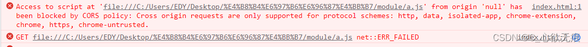
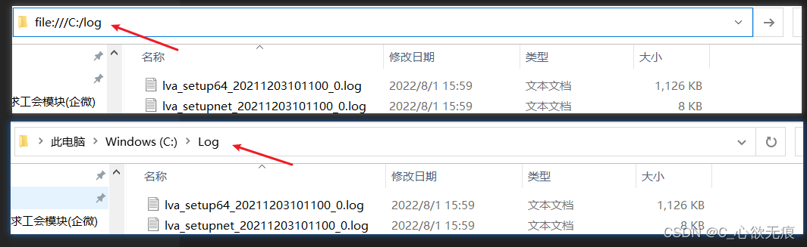
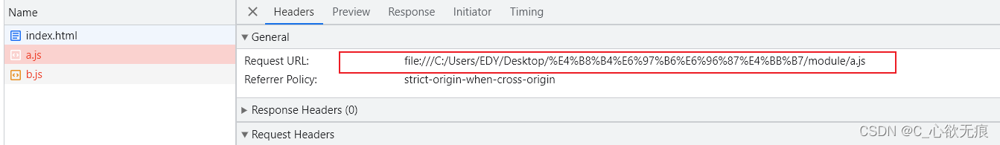
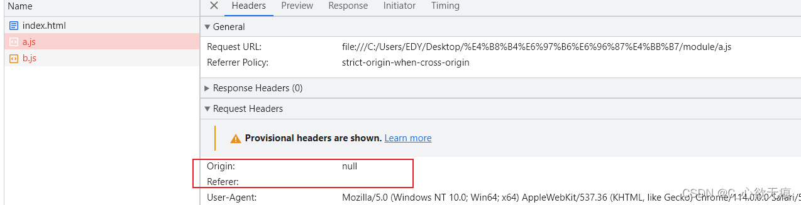
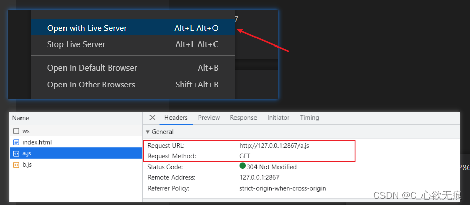

# 关于ES6 Module模块化的跨域报错


> ES6 在语言标准的层面上，实现了模块功能，而且实现得相当简单，旨在成为浏览器和服务器通用的模块解决方案。其模块功能主要由两个命令构成：`export`或`export default`和`import`。`export`命令用于规定模块的对外接口，`import`命令用于输入其他模块提供的功能。

___
ES模块化的标志也很简单，就是在script标签上面 添加 `type="module"`属性；

```js
<!DOCTYPE HTML>
<html lang='en'>
	<head>
		<meta charset="UTF-8" />
		<!-- 引入 -->
		<script src="./a.js" type="module"></script>
	</head>
</html>
```
**`从而产生的问题`**：直接在浏览器打开是会触发跨域报错的，如下：



首先，我们要明白是什么导致了跨域，根据内容翻译：

> `来自orgin的null`已被CORS策略(同源策略)阻止:跨源请求只支持协议方案:http，数据，chrome, chrome-extension, https。


::: warning 注意
这种跨域报错和普通后端接口跨域报的错并不一样，不要搞混了，此处明显说明了Orgin为null
:::


我们知道，我们的html文是在本地打开的文件（所以协议是file协议），而file协议并不会产生跨域。但是，`http, data, chrome, chrome-extension, https`这些协议都是会产生跨域请求的。

## 什么是file文件协议？

file协议就是本地文件传输协议，主要的目的就是用于访问本地计算机中的文件，好比通过`Windows的`资源管理器中打开文件或者通过右键单击‘打开’一样。然后通过`file:///文件路径`这样的形式去访问；

比如在文件资源管理器的地址栏输入 `file:///C:/Log` 就是相当于寻找C盘下面的Log文件夹，相当于：`C:\Log`；如下图所示：


而当你在某盘符位置下直接打开一个网页(script标签中引入了某地的某个js文件)，则在浏览器地址栏呈现：

```
file:///C:/Users/EDY/Desktop/%E4%B8%B4%E6%97%B6%E6%96%87%E4%BB%B7/module/a.js ；
```
如下图显示：



至于 ES6使用 `type="module"`产生的跨域问题其实是：


> ES6 使用模块的时候要在标签中声明 `type="module"`，而这类使用了模块的 `script` 是受限于同源策略的，默认会发起cors跨域请求，问题来了，这种请求要求 `request header（请求头） `的 `Origin` 必须带有 `http` 等类型，但是 `file` 协议下，Origin 是 null，所以不符合要求，就会报上面的跨域报错。

如下图：



___
**解决办法**

说了那么多怎么解决es6 module这个跨域的问题呢？

我们测试的时候使用 vs code扩展 “Live Serve”打开即可：也就是启动一个本地服务器；如下：
一切正常：


**当然**，我们日常开发过程中用的都是`vue，react框架`；这些框架里面的构建工具或者webpack都已经把这些问题解决了，所以我们在项目中正常使用就行了；无需操心这种问题，但需要知道；


## 为什么前端要使用模块化

我们定义两个文件a.js和b.js 。

a.js:

```js
let myName="Eula";
let age=20;
console.log("myName:"+myName+" age:"+age+" in a.js")
```
b.js:

```js
let myName="Umbar";
let age=20;
console.log("myName:"+myName+" age:"+age+" in b.js")
```
然后我们在html里面引入这两个js文件（先不使用ES6模块化）

```js
<!DOCTYPE HTML>
<html lang='en'>
	<head>
		<meta charset="UTF-8" />
		<!-- 引入 -->
		<script src="./a.js"></script>
		<script src="./b.js"></script>
	</head>
</html>
```
很显然，浏览器会直接报错，因为你重复定义变量。

报错信息：`Uncaught SyntaxError: Identifier 'myName' has already been declared (at b.js:1:1)`

这时候，只需要在引入js的时候添加type属性，并且设置类型为module就可以解决变量重复的问题了。浏览器认为你是两个模块的变量，是互相独立的。这就是ES6提供的模块化支持。

```js
<script src="./a.js" type="module"></script>
<script src="./b.js" type="module"></script>
```


**ES6模块化有以下特点：**

（1）ES6模块自动开启严格模式，不管你有没有在模块头部加上`"use strict"`。

（2）模块中可以导入和导出各种类型的变量，如函数，对象，字符串，数字，布尔值，类等。

（3）每个模块都有自己的上下文，每一个模块内声明的变量都是局部变量，不会污染全局作用域。

（4）每一个模块只加载一次（是单例的）， 若再去加载同目录下同文件，直接从内存中读取。


## 模块化的使用

ES6模块化提供了 `export`命令 和 `import` 命令，对于模块的导出和引入；

详细使用可以见这篇文档：[CommonJs和ES6 module的使用和区别](https://blog.csdn.net/qq_43886365/article/details/129443891?spm=1001.2014.3001.5502)

这里就不再赘述了；