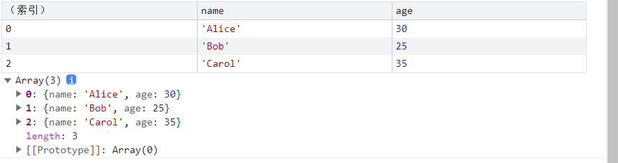
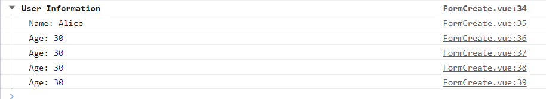

# console 打印的其它使用方式

[[toc]]
---

在 `JavaScript` `中，console` 对象提供了一系列的方法用于输出信息到浏览器的控制台或者 Node.js 的终端。

除了最基本的 `console.log()` 方法外，还有很多其他有用的函数。下面是一些 console 的其他使用方法及其示例：

## 1、console.error()

用于输出错误信息，通常用于调试。

```js
try {
  // 模拟错误
  throw new Error("An error occurred");
} catch (error) {
  console.error(error);
}
```

## 2、console.warn()

用于输出警告信息。

```js
function divide(a, b) {
  if (b === 0) {
    console.warn("Division by zero may result in NaN");
    return NaN;
  }
  return a / b;
}

divide(10, 0); // 输出警告信息
```

## 3、console.table()

用于以表格形式展示数据。

```js
const users = [
  { name: "Alice", age: 30 },
  { name: "Bob", age: 25 },
  { name: "Carol", age: 35 }
];

console.table(users);
```

截图如下：



## 4、console.dir()

用于显示对象的结构。

```js
const person = {
  name: "John Doe",
  age: 45,
  address: {
    street: "123 Main St",
    city: "Anytown"
  }
};

console.dir(person, { depth: null }); // 显示对象的所有层级
```

## 5、console.time() 和 console.timeEnd()

用于测量代码执行的时间。

```js
console.time("Loop execution time");

for (let i = 0; i < 10000; i++) {
  // 执行一些代码
  console.log(i);
}

console.timeEnd("Loop execution time");
```

结果如下：

```js
0
1
2
...
Loop execution time: 532.462890625 ms
```

## 6、console.group() 和 console.groupEnd()

用于分组输出信息。

```js
console.group("User Information");
console.log("Name:", "Alice");
console.log("Age:", 30);
console.log("Age:", 30);
console.log("Age:", 30);
console.log("Age:", 30);
console.groupEnd();
```

结果如下：



## 7、console.assert()

用于断言条件是否成立，如果条件不成立，则打印错误信息。

```js
const age = 16;

console.assert(age >= 18, "User must be at least 18 years old.");
```

## 8、console.trace()

用于输出堆栈跟踪信息，通常用于调试。

```js
function func1() {
  func2();
}

function func2() {
  console.trace();
}

func1();
```

## 9、console.clear()

用于清除控制台中的所有输出。

```js
console.log("Some output...");
console.clear();
```

## 10、总结

使用 `console` 的这些方法，可以帮助你在开发过程中更有效地调试代码、监控性能、查看数据结构等。不同的方法适用于不同的场景，可以根据实际需求选择合适的方法来输出信息。
