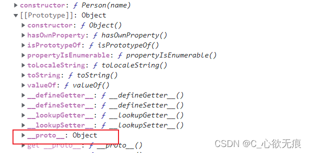
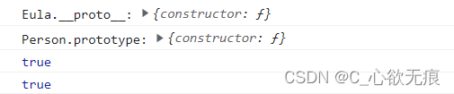

# typeof 与 instanceof 类型判断的区别和细节

## 1，typeof

描述：运算符返回一个字符串，表示操作数的类型。

**常用的类型判断**

```javascript
console.log(typeof 42); // number
console.log(typeof "blubber"); // string
console.log(typeof true); // boolean
console.log(typeof undefined); // undefined

console.log(typeof [1, 2, 3]); // object
console.log(typeof { name: "Eula" }); // object
console.log(typeof null); // object
```

`缺点也很明显`：只能检测简单数据类型，对象、函数和 null 都统一返回 object;

## 2，instanceof

**概念：**

`instanceof`：用于检测构造函数的 `prototype` 属性是否属于某个实例对象的原型链上；

它有两个必传参数，左侧必须为某个实例对象，右侧必须为某个构造函数。返回值为 Boolean 类型; 这说明`instanceof`是与原型和原型链有关系的，在弄懂 instanceof 之前我们就必须要了解什么是原型和原型链；

### 2.1 prototype(原型)

函数即对象，每个函数都有一个 prototype 属性，而这个属性就是这个函数的原型对象，在原型对象上定义的属性或方法，会被该函数的实例对象所继承，实例对象可以直接访问到原型对象里面的属性或方法。

### 2.2 原型链

当实例要访问某一个属性时，首先在实例自身查找，如果没有找到，则继续沿着\_**proto**对象查找，如果还是没找到，则继续对\_**proto**的\_**proto**对象查找，如果找到最终\_**proto**对象为 null 时都没找到，就返回属性未找到的错误，如果找到了则返回该属性值。而这个由若干个\_\_proto\_\_对象串联起来的查找路径，就称为原型链。

{width=500}

### 2.3 instanceof 检测原理

`instanceof` 的左侧是被检测的对象，右侧是用来判断实例关系的构造函数，而实例的\_**proto**对象是绝对等于其构造函数的 `prototype` 属性的，如果存在隔代关系，那么就要沿着\_\_proto\_\_一层一层的去比较。

::: tip 检测原理

说白了，只要右测变量的 `prototype` 在左测变量的原型链上即可。因此，`instanceof`在查找的过程中会遍历左边变量的原型链，直到找到右边变量的 `prototype`，如果查找失败，则会返回 false。

:::

如下：

创建一个构造函数，判断 Eula 是否属于 Person 构造函数；

```javascript
function Person() {
  this.name = name;
}
let Eula = new Person("优菈");
console.log("Eula.__proto__:", Eula.__proto__);
console.log("Person.prototype:", Person.prototype);
console.log(Eula.__proto__ === Person.prototype); // true
console.log(Eula instanceof Person); // true
```

**打印如下：**



**可以看出：** `Eula.proto === Person.prototype` 所以判断成立；

### 2.4 instanceof 常用的判断

::: tip 内置对象

JavaScript 中的 String、Object、Number、Array、Function、Date、Boolean、RegExp、Error 等都是 JS 内置的构造函数，在 JS 中由于一切皆接对象，所以它们也可以称为内置对象；

:::

**一些常见的判断如下：**

```javascript
// 判断字符串 -- 不能使用自变量创建否则直接返回false 需要 new String()
console.log("123" instanceof String); //false
console.log(new String(123) instanceof String); //true

// 判断数字 --也不能使用自变量创建也会直接返回false 也需要 new Number()
console.log(123 instanceof Number); //false
console.log(new Number(123) instanceof Number); //true

// 判断对象
console.log({ name: "Eula" } instanceof Object); // true

// 判断数组 数组也属于Object类型所以这两个都成立   建议使用Object.prototype.toString来判断数组
console.log([1, 2, 3] instanceof Array); // true
console.log([1, 2, 3] instanceof Object); // true

// 判断日期 Date对象也属于Object 类型
console.log(new Date() instanceof Date); // true
console.log(new Date() instanceof Object); // true

// 函数的判断
function test() {}
console.log(test instanceof Function); // true

// null的判断 发现它竟然不是一个对象 使用typeof判断时它还是一个对象  建议使用typeof 来判断null类型
console.log(null instanceof Object);
```

**`误区（需要铭记）`**：使用 instanceof 不能判断简单的数据类型，既使左侧和右侧是完全相等的，也依旧返回 false ，如下：

```javascript
console.log("123".__proto__ === String.prototype); // true  这是符合instanceof判断原理的
//依旧返回false instanceof方法好像不允许判断简单数据类型(比如String，Number)
console.log("123" instanceof String); // fasle

console.log((123).__proto__ === Number.prototype); // true
console.log(123 instanceof Number); //false
```

`instanceof`方法好像不允许判断简单数据类型(比如 String，Number)

### 2.5 手动实现 instanceof 方法

既然知道了原理，那么就可以手动实现了，如下：

```javascript
/**
 * @description 判断对象是否属于某个实例对象的原型链上
 * @prams L: 实例对象  R: 构造函数或内置对象(String、Object、Number、Array、Function等)
 * @return boolean
 */
function _instancof(L, R) {
  // 简单数据类型直接返回false
  if (typeof L !== "object") return false;
  let left = L.__proto__;
  let right = R.prototype;
  while (true) {
    if (left === null) {
      return false;
    }
    if (left === right) {
      return true;
    }
    // 如果本轮没找到，则沿着__proto__继续向上查找
    left = left.__proto__;
  }
}
```

使用如下：

```javascript
console.log(_instancof({ name: "Eula" }, Object)); //true
console.log(_instancof(new Number(123), Number)); //true
console.log(_instancof(new Date(), Object)); //true
```

End;
