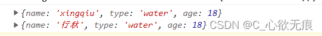

# 展开运算符的使用

## 1，展开数组

可以把数组中的每一项都展开(`注意`：但是不能展开对象)

```javascript
	 let arr = ['xingiqu', 'xinagling', 'hutao'];
      console.log('arr:', ...arr);
      打印结果为：
      arr: xingiqu xinagling hutao

      // 展开数组里面的对象可以吗
      // 可以展开数组中的对象
      let arrObj = [{ name: 'xingqiu' }, { name: 'xiangling' }, { name: 'hutao' }];
      console.log('arrObj:', ...arrObj);
      打印结果为：
      arrObj: {name: 'xingqiu'} {name: 'xiangling'} {name: 'hutao'}
```

## 2，在函数中使用扩展运算符

函数中只能接收参数时使用和 arguments 的用法差不多；都是对传入不定参数时，使用一个数组进行包装一下；下面两个案例是计算多个参数之间的累加。

```javascript
	// 1，函数中只能接收参数时使用
      function sum(...nums) {
        console.log('nums', nums); //  [1, 3, 5, 7, 9]
        return nums.reduce((preV, currentV) => {
          return preV + currentV;
        });
      }

   //2，这是之前使用arguments的写法 可以对比一下 用法是差不多的
      function sum1() {
        console.log('类型：', Object.prototype.toString.call(arguments)); // [object Arguments]
        // 因为arguments是一个伪数组 所以要用 Array.from()方法转为一个真正的数组再去遍历
        return Array.from(arguments).reduce((preV, currentV) => {
          return preV + currentV;
        });
      }
      对不定参数的计算结果如下：
      console.log('使用扩展运算符求和：', sum(1, 3, 5, 7, 9)); // 25
      console.log('使用arguments求和:', sum1(2, 4, 6, 8, 10)); // 30
```

## 3，深拷贝对象

扩展运算符不可以展开对象 但可以拷贝对象

```javascript
// 这里展开对象直接就报错了
let obj = { name: "xingqiu", type: "water", age: 18 };
console.log("展开对象：", ...obj);
```

开始拷贝对象：

```javascript
  	let obj = { name: 'xingqiu', type: 'water', age: 18 };
      // 可以深拷贝一个对象
      let deepObj = {...obj}
      deepObj.name='行秋'
      console.log(obj,deepObj);
      输出结果如下：没有相互影响
```



## 4，扩展运算符还可以改写属性和添加属性

```javascript
	  let obj2 = { name: 'xiangling', type: 'huo', age: 19 };
      // 改写属性
      let setObj2 = {...obj2,name:'香菱'}
      console.log("setObj2:",setObj2);
      输出如下：把xiangling改为香菱了
      setObj2: {name: '香菱', type: 'huo', age: 19}

      // 添加属性
      let addObj2 = {...obj2,gender:'女'}
      console.log("addObj2:",addObj2)
      输出如下：给obj2添加了一个性别的属性 gender
      addObj2: {name: 'xiangling', type: 'huo', age: 19, gender: '女'}
```
