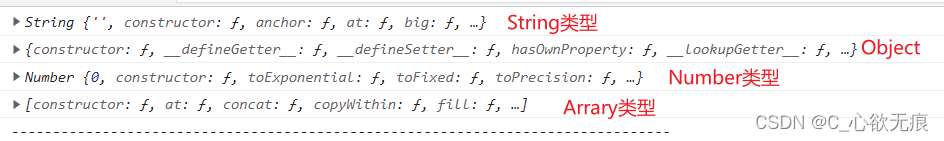
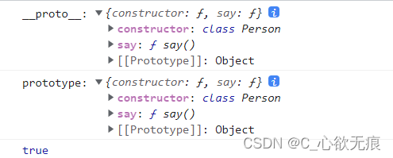
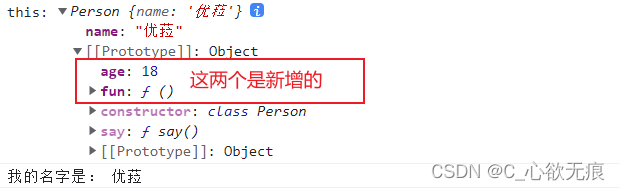
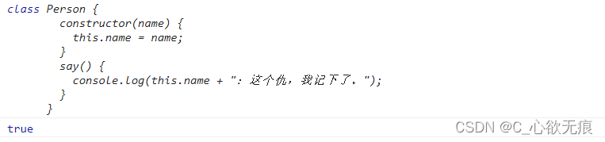
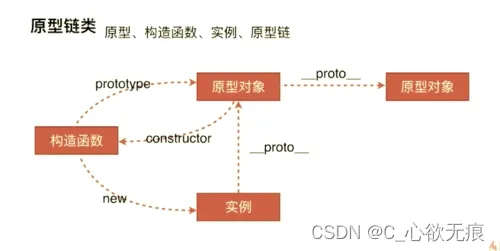

# 原型和原型链的简单理解

---

### 前言

有一个概念需要清楚，只有构造函数才有.prototype 对象，对象是没有这个属性的，\_\_proto\_\_只是浏览器提供的非标准化的访问对象的构造函数的原型对象的一种方式;

### prototype(原型对象)

函数即对象，每个函数都有一个`prototype`属性，而这个属性就是这个函数的原型对象，在原型对象上定义的属性或方法，会被该函数的实例对象所继承，实例对象可以直接访问到原型对象里面的属性或方法。

原型对象相当于创造一种实例的一个模板，里面存放着这种实例的各种属性和方法；

比如：Arrary.prototype 里面存放着所有关于数组的方法；

```javascript
console.log(Array.prototype); //  filter,find,map,push,pop,some,sort...
```

对象是没有 prototype 的（感觉这句话有点问题），如下：

```javascript
console.log("123".prototype); // undefined
console.log({ name: "Eula" }.prototype); // undefined
console.log((123).prototype); // undefined
console.log([123].prototype); // undefined
```

### \_\_proto\_\_（原型链的连接）

不知大家在控制台调试时有没有发现`proto`这个属性，这个属性其实是在实例被创建的时候，JS 引擎为实例自动添加的一个属性，它是绝对等于其构造函数的 `prototype` 属性的；

也就是说，实例的\_\_proto\_\_就是这个实例的原型对象，但是代码上不推荐直接访问\_\_proto\_\_，\_\_proto\_\_又称为隐式原型对象。如下：

```js
console.log("123".__proto__); // String类型
console.log({ name: "Eula" }.__proto__); // Object类型
console.log((123).__proto__); // Number类型
console.log([123].__proto__); // Arrary类型
```

打印如下：

 其实也就等同于下面的代码：顺序是一一对应的:

```javascript
console.log(String.prototype);
console.log(Object.prototype);
console.log(Number.prototype);
console.log(Array.prototype);
```

**说明：** js 中万物皆对象，String，Object，Number，Array 等 都是 js 内置的构造函数,在 js 中，由于一切皆对象，所以它们也可以称为内置对象，都有自己的原型对象，最顶层的原型对象是`Object`；

他们的实例化对象 所使用的方法 会向各自的原型对象中逐层查找，直到找到为之；

::: tip 其实这就是原型链的概念当实例要访问某一个属性时，首先在实例自身查找，如果没有找到，则继续沿着**proto**对象查找，如果找到最终**proto**对象为 null 时都没找到，就返回属性未找到的错误，如果找到了则返回该属性值。而这个由若干个**proto**对象串联起来的查找路径，就称为原型链。 
:::

### 实战

```javascript
class Person {
  constructor(name) {
    this.name = name;
  }
  say() {
    console.log(this.name + "：这个仇，我记下了。");
  }
}
let Eula = new Person("优菈");
console.log("__proto__:", Eula.__proto__);
console.log("prototype:", Person.prototype);
console.log(Eula.__proto__ === Person.prototype); // true
```

打印如下：  我们可以发现 `Eula.__proto__ === Person.prototype`，也就是 实例化对象可以通过**proto**访问到原型对象；既然可以访问，我们也能在上面添加自己的属性和方法，如下：

```javascript
  	 // 第一种添加方式
  	  注意此处添加函数不能使用箭头函数 否则this将指向window
  	 Eula.__proto__.fun = function() {
        console.log('this:',this);
        console.log("我的名字是：", this.name);
      };

      // 第二种添加方式
      Person.prototype.age = 18;
      Eula.fun();
      console.log(Eula);
```

打印如下：

 使用这两种方式分别添加了属性和方法，需要注意的是第一种方式添加方法`不能使用箭头函数`，否则它的指向会指向 window，这样就拿不到 Person 类下面的属性 了；

---

而且还可以通过原型对象的`constructor` 访问到构造函数：

```javascript
console.log(Person);
console.log(Eula.__proto__.constructor === Person); //true
```

打印如下： 

其实上面的案例是使用 `class`写的，换成`function`形式实现的效果其实是一样的，如下：

**因为：** ES6 class 的本质是 `Function`。它可以看作一个语法糖，让对象原型的写法更加清晰、更像面向对象编程的语法。

```javascript
function Person(name) {
  this.name = name;
  this.say = function () {
    console.log(this.name + "：这个仇，我记下了。");
  };
}
let Eula = new Person("优菈");
Eula.__proto__.fun = function () {
  console.log("this:", this);
  console.log("我的名字是：", this.name);
};
Person.prototype.age = 18;
console.log("__proto__:", Eula.__proto__);
console.log("prototype:", Person.prototype);
console.log(Eula.__proto__ === Person.prototype); // true
console.log(Eula.__proto__.constructor === Person); //true
Eula.fun(); //新增的方法
```

此处放一张关于原型、构造函数、实例、原型链的流程图：不难理解


