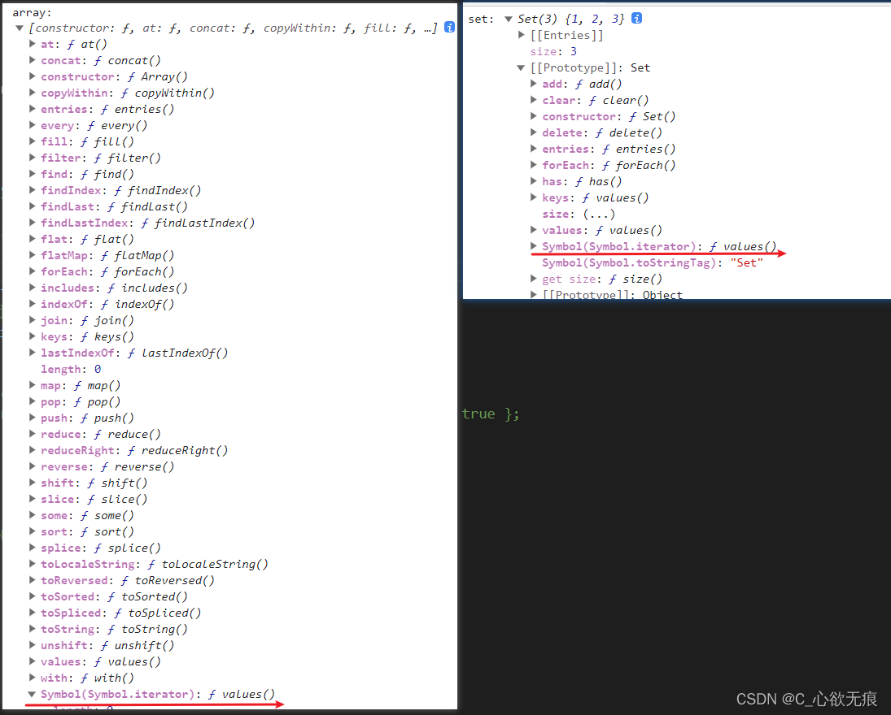
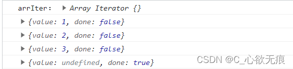

# Iterator 迭代器和 for...of 循环


[[toc]]

## 前言

JavaScript 原有的表示“集合”的数据结构，主要是数组（`Array`）和对象（`Object`），ES6 又添加了`Map`和`Set`。用户还可以组合使用它们，定义自己的数据结构，比如数组的成员是`Map`，`Map`的成员是对象。这样就需要一种统一的接口机制，来处理所有不同的数据结构。

## 一、Iterator 介绍

遍历器（Iterator）就是这样一种机制。它是一种接口，为各种不同的数据结构提供统一的访问机制。任何数据结构只要部署 Iterator 接口，就可以完成遍历操作（即依次处理该数据结构的所有成员）。

Iterator 的作用有三个：一是为各种数据结构，提供一个统一的、简便的访问接口；二是使得数据结构的成员能够按某种次序排列；三是 ES6 创造了一种新的遍历命令`for...of`循环，Iterator 接口主要供`for...of`消费。

## 二、Iterator 原理

Iterator 直接翻译是迭代器 他能够迭代出任何可迭代数据类型中的数据，为可迭代数据提供一个接口机制 能够迭代出数据；

一般情况下 ：迭代数据使用函数的 next 方法，如果说数据存在 那么返回对象`{value :数据, done : false}`，

如果说 ：没有数据了 那么返回对象：`{value : undefined , done : true}`

所以说 我们使用 iterator 之前 要先定义一个指针， 指针是为了指向数据从哪开始迭代；最开始 指针的指向是第 0 个元素；

如下面的案例：

```js
function makeIterator(array) {
  var nextIndex = 0;
  return {
    // 注意：此处使用了闭包，nextIndex会被一直引用，也就是会被下面一直累加；
    next: function () {
      // 注意：此处判断结束条件  当前长度是否小于数组的总长度
      // 小于说明未运行结束  不小于说明改结束了
      return nextIndex < array.length ? { value: array[nextIndex++], done: false } : { value: undefined, done: true };
    }
  };
}

var it = makeIterator(["a", "b"]);

it.next(); // { value: "a", done: false }
it.next(); // { value: "b", done: false }
it.next(); // { value: undefined, done: true }
```

**Iterator 的遍历过程是这样的：**

（1）创建一个指针对象，指向当前数据结构的起始位置。也就是说，遍历器对象本质上，就是一个指针对象。

（2）第一次调用指针对象的`next`方法，可以将指针指向数据结构的第一个成员。

（3）第二次调用指针对象的`next`方法，指针就指向数据结构的第二个成员。

（4）不断调用指针对象的`next`方法，直到它指向数据结构的结束位置。

每一次调用`next`方法，都会返回数据结构的当前成员的信息。具体来说，就是返回一个包含`value`和`done`两个属性的对象。其中，`value`属性是当前成员的值，`done`属性是一个布尔值，表示遍历是否结束。

## 三、实现 Iterator 接口的原生对象有

ES6 规定，默认的 Iterator 接口部署在数据结构的 Symbol.iterator 属性上；或者说，一个数据结构只要有 Symbol.iterator 属性，就认为是可遍历的。

**原生具备 Iterator 接口的数据结构有：**

- Array
- Map
- Set
- String
- TypedArray
- 函数的 arguments 对象
- NodeList 对象

可以看到 Array 原型对象和 Set 集合已经实现了 Iterator 这个属性：

```js
// 数组
console.log("array:", Array.prototype);
// Es6新增Set集合
let set = new Set([1, 2, 3]);
console.log("set:", set);
```

**打印如下图：** 

 

那么数组的实例对象当然也会拥有这个属性，如下：

```js
let arrIter = [1, 2, 3][Symbol.iterator]();
console.log("arrIter：", arrIter);
console.log(arrIter.next());
console.log(arrIter.next());
console.log(arrIter.next());
console.log(arrIter.next());
```



## 五、默认调用 Iterator 接口的场合

有一些场合会默认调用 Iterator 接口（即`Symbol.iterator`方法），除了下文会介绍的`for...of`循环，还有几个别的场合。

**（1）解构赋值**

对数组和 Set 结构进行解构赋值时，会默认调用`Symbol.iterator`方法。

```javascript
let set = new Set().add("a").add("b").add("c");

let [x, y] = set;
// x='a'; y='b'

let [first, ...rest] = set;
// first='a'; rest=['b','c'];
```

**（2）扩展运算符**

扩展运算符（...）也会调用默认的 Iterator 接口。

```javascript
// 例一
var str = "hello";
[...str]; //  ['h','e','l','l','o']

// 例二
let arr = ["b", "c"];
["a", ...arr, "d"];
// ['a', 'b', 'c', 'd']
```

实际上，这提供了一种简便机制，可以将任何部署了 Iterator 接口的数据结构，转为数组。也就是说，只要某个数据结构部署了 Iterator 接口，就可以对它使用扩展运算符，将其转为数组。

```javascript
let arr = [...iterable];
```

**（3）yield\***

`yield*`后面跟的是一个可遍历的结构，它会调用该结构的遍历器接口。

```javascript
let generator = function* () {
  yield 1;
  yield* [2, 3, 4];
  yield 5;
};

var iterator = generator();

iterator.next(); // { value: 1, done: false }
iterator.next(); // { value: 2, done: false }
iterator.next(); // { value: 3, done: false }
iterator.next(); // { value: 4, done: false }
iterator.next(); // { value: 5, done: false }
iterator.next(); // { value: undefined, done: true }
```

**（4）其他场合**

由于数组的遍历会调用遍历器接口，所以任何接受数组作为参数的场合，其实都调用了遍历器接口。下面是一些例子。

- for...of
- Array.from()
- Map(), Set(), WeakMap(), WeakSet()（比如`new Map([['a',1],['b',2]])`）
- Promise.all()
- Promise.race()

## 六，for... of 循环

`for... of循环其实就是 Iterator 的语法糖`

for...of 循环可以使用的范围包括数组、Set 和 Map 结构、某些类似数组的对象（比如 arguments 对象、DOM NodeList 对象）、字符串等。也就是说有 Iterator 接口的数据类型，for ...of 都可以遍历；

（不能遍历普通对象，会直接报错，obj is not iterable）

数组原生具备 iterator 接口，(默认部署 Symbol.iterator 属性)，`for...of 循环本质上`就是调用这个接口产生的遍历器：

for...of 使用如下：

```js

	  ## 1,遍历数组
	  let arr = [{name:'Eula',age:20},{name:'Kaya',age:20}]
      for (const iterator of arr) {
        console.log("iterator:",iterator); // {name: 'Eula', age: 20}  {name: 'Kaya', age: 20}
      }

	  ## 2,遍历字符串
      let str = "hello"
      for (const iterator of str) {
        console.log("iterator:",iterator); // 'h' 'e' 'l'' l'' o'
      }

	  ## 3,遍历set集合
      let set = new Set([{name:'Eula',age:20},{name:'Kaya',age:20}])
      for (const iterator of set) {
        console.log("iterator:",iterator); // {name: 'Eula', age: 20}  {name: 'Kaya', age: 20}
      }

	  ## 4,遍历map集合
      let map = new Map()
      map.set('name','Eula')
      map.set('age','18')
      console.log("map:",map); // Map(2) {'name' => 'Eula', 'age' => '18'}
      for (const iterator of map) {
        console.log("iterator:",iterator); //  ['name', 'Eula']  ['age', '18']
      }
```

如果想要遍历普通对象可以使用 for in 循环：

```js
let obj = { name: "Eula" };
for (const iterator in obj) {
  console.log("键:", iterator); // name
  console.log("值:", obj[iterator]); // Eula
}
```

## 七，总结

1.  一个数据结构的原型上只要有`Symbol.iterator`属性，就认为是可遍历的。
2.  for... of 循环其实就是 Iterator 的语法糖。
