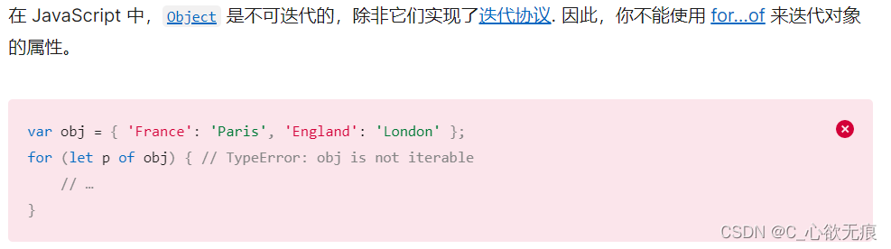

# for in 和 for of 循环的区别

> `for in 和 for of` 是 js 中常用的遍历方法；两者的区别如下： [[toc]]

## 一，遍历数组

1，`for in` 是 ES5 的语法标准，而`for of`则是 ES6 语法标准。

```javascript
const arr1 = ["Eula", "Umbra", "Kaya"];
for (let i in arr1) {
  console.log(i); // '0', '1', '2'
}
// 对比
for (let i of arr1) {
  console.log(i); // Eula, Umbra, Kaya
}
```

> 通过上述代码我们可以发现 for in 遍历的是下标，而`for of`遍历的是属性值；而且`for in`所遍历的下标是 Strign 类型而不是 Number 类型；

2，`for in` 遍历时可以遍历到当前数组的所有属性名和方法名。也能拿到原型链上定义的属性名和方法。如下代码：

```javascript
const arr1 = ['Eula', 'Umbra', 'Kaya'];

//下面两种在原型上添加属性的效果是一样的
Array.prototype.UmbraName = '安柏';
arr1.__proto__.constructor.prototype.EulaName = '尤菈-劳伦斯';

for (let i in arr1) {
  console.log(i + ':' + arr1[i]);
}

打印结果：
0:Eula
1:Umbra
2:Kaya
UmbraName:安柏
EulaName:尤菈
sayHello:function () {
  return 'hello';
}
```

而使用`for of`遍历时则不会遍历原型链上的属性和方法；代码如下：

```javascript
const arr1 = ['Eula', 'Umbra', 'Kaya'];

//下面两种在原型上添加属性的效果是一样的
Array.prototype.UmbraName = '安柏';
arr1.__proto__.constructor.prototype.EulaName = '尤菈-劳伦斯';
arr1.__proto__.constructor.prototype.sayHello = function () {
  return 'hello';
};
for (let i of arr1) {
  console.log(i);
}
打印结果：
Eula
Umbra
Kaya
```

## 二，遍历对象

1， `for in`本来就是用来遍历对象的，这没什么问题，需要注意的是它也会遍历出原型链上面的属性和方法；如果不想遍历原型链上面的属性可以配合使用`obj.hasOwnProperty(prop)`方法；

```javascript
const obj = {
  name: 'Eula',
  friend: 'Umbra',
  age: 18,
};
obj.__proto__.constructor.prototype.EulaName = '尤菈-劳伦斯';
Object.prototype.UmbraName = '安柏';
for (let key in obj) {
  console.log(key + ':' + obj[key]);
}
打印结果：
name:Eula
friend:Umbra
age:18
EulaName:尤菈-劳伦斯
UmbraName:安柏
```

而使用 `for of` 遍历对象时则会报错：`TypeError: 'x' is not iterable`；MDN 上截图如下：



**这是为什么呢？**

> 这是因为能够被`for of`正常遍历的数据类型都需要实现一个遍历器 Iterator。而数组、字符串、Set、Map 结构，早就内置好了 Iterator（迭代器），它们的原型中都有一个 Symbol.iterator 方法，而 Object 对象并没有实现这个接口，使得它无法被`for of`遍历。

如果想要 `for of` 遍历对象，做为替代你必须使用 Object.keys 来配合：

```javascript
const obj = {
  name: 'Eula',
  friend: 'Umbra',
  age: 18,
};

for (let key of Object.keys(obj)) {
  console.log(key + ':' + obj[key]);
}
成功遍历：
name:Eula
friend:Umbra
age:18
```

## 三，总结

**for...in 和 for...of 循环在有以下重要区别：**

1. **遍历的对象不同**：
   - for...in 循环用于遍历对象的可枚举属性（包括继承的属性）。
   - for...of 循环用于遍历可迭代对象（如数组、字符串、Set、Map 等）。
2. **遍历的顺序**：
   - for...in 循环的遍历顺序是不确定的，并且可能会遍历到对象的继承属性。
   - for...of 循环按照元素插入的顺序进行遍历。
3. **处理的值**：
   - for...in 循环返回的是属性名（通常是字符串）。
   - for...of 循环返回的是可迭代对象中的元素值。

`for in`适合遍历对象，`for of`适合遍历数组。for in 遍历的是数组的索引，对象的属性，以及原型链上的属性。

`for of`除了能够遍历真数组、字符串、ES6 的 Set、Map 集合还能遍历伪数组（NodeList）。
