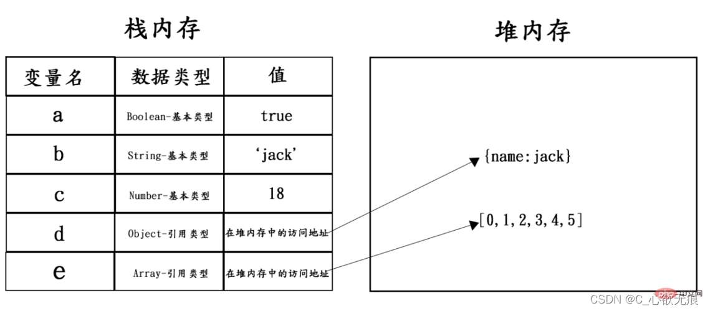
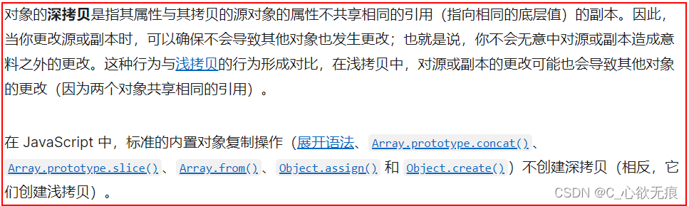

# 常用的浅拷贝和深拷贝

[[toc]]

## 一，JS 数据类型

**基本数据类型：**

Number、Boolean、String、undefined、Null; 变量是直接按值存放的，存放在栈内存中的简单数据段，可以直接访问。

**复杂数据类型（也叫引用类型）:**

Function、Array、Objec 等(`typeof()这个三种类型得到的都是object`)是存放在堆内存中的对象，变量保存的是一个指针，这个指针指向另一个位置。当需要访问引用类型的值时，首先从栈中获得该对象的地址指针，然后再从堆内存中取得所需的数据。

`基本类型都放在栈（图左）（stack）中`：

`引用类型都放在堆（图右）（heap）中`：



## 二，深浅拷贝概念

`浅拷贝`：只拷贝值的引用，不拷贝内存；对源或副本的更改可能也会导致其他对象的更改；

`深拷贝`：既拷贝值又拷贝内存；改动副本的数据不会对原数据产生影响；

[MDN](https://developer.mozilla.org/zh-CN/docs/Glossary/Deep_copy)上描述如下： 

---

## 三，浅拷贝

### 1，Object.assign()

> `Object.assign()`：用于对象的合并，将源对象的所有可枚举属性，复制到目标对象，并返回合并后的 target；用法： Object.assign(target, source1, source2);

#### 1.1，基本使用

```javascript
const obj = { a: 1 };
const copy = Object.assign({}, obj);
console.log(copy); // { a: 1 }

let obj1 = { a: 0, b: { c: 0 } };
let obj2 = Object.assign({}, obj1);
console.log(JSON.stringify(obj2)); // { "a": 0, "b": { "c": 0}}
```

`注意`：Object.assign 方法只会拷贝源对象可枚举的和自身的属性到目标对象；

- 它不会拷贝对象的继承属性；
- 它不会拷贝对象的不可枚举的属性；
- 可以拷贝 Symbol 类型的属性

如下所示：

```javascript
const obj1 = {
  a: {
    b: 1
  },
  c: 1,
  sym: Symbol(1)
};

Object.defineProperty(obj1, "innumerable", {
  value: "1",
  enumerable: false
});
const obj2 = {};
Object.assign(obj2, obj1);
obj1.a.b = 2;
obj1.c = 2;

console.log("obj1", obj1); // {a: {b: 2}, c: 2, sym: Symbol(1), innumerable: "1"}
console.log("obj2", obj2); // {a: {b: 2}, c: 1, sym: Symbol(1)}
```

从上面的样例代码中可以看到，利用 object.assign 也可以拷贝 Symbol 类型的对象，但是如果到了对象的第二层属性 obj1.a.b 这里的时候，前者值的改变也会影响后者的第二层属性的值，说明并没有完成深拷贝的功能， 而只是完成了浅拷贝的功能。

#### 1.2，assign()还可以合并具有相同属性的对象

属性会被后续参数中具有相同属性的其他对象覆盖。

```javascript
const o1 = { a: 1, b: 1, c: 1 };
const o2 = { b: 2, c: 2 };
const o3 = { c: 3 };

const obj = Object.assign({}, o1, o2, o3);
console.log(obj); // { a: 1, b: 2, c: 3 } 属性会被后续参数中具有相同属性的其他对象覆盖。
```

#### 1.3，assign()还会把基本类型包装为对象

基本数据类型将被包装，null 和 undefined 将被忽略。

```javascript
// 基本数据类型
const v1 = "abc";
const v2 = true;
const v3 = 10;
const v4 = Symbol("foo");

const obj1 = Object.assign({}, v1, null, v2, undefined, v3, v4);
// 基本数据类型将被包装，null和undefined将被忽略。
console.log(obj1);
```

### 2，slice()

> `slice()` 方法返回一个新的数组对象，这一对象是一个由 begin 和 end 决定的原数组的浅拷贝（包括 begin，不包括 end）。原始数组不会被改变。

#### 2.1，基本用法

```javascript
const animals = ['ant', 'bison', 'camel', 'duck', 'elephant'];
## 传一个值时表示从0开始
console.log(animals.slice(2));
// 输出结果: ["camel", "duck", "elephant"]

## 包括开始，不包括结尾
console.log(animals.slice(1, 5));
// 输出结果: ["bison", "camel", "duck", "elephant"]

## 什么都不传返回原数组：
console.log(animals.slice());
// 输出结果： ["ant", "bison", "camel", "duck", "elephant"]

## 负值表示从末尾开始查
console.log(animals.slice(2, -1));
// 输出结果： ["camel", "duck"]
```

它也只能拷贝一层对象。如果存在对象的嵌套，那么浅拷贝将无能为力；如下：

```javascript
const arr = [1, 2, { val: 4 }];

const newArr = arr.slice();

newArr[2].val = 5; // 也同时改变了arr
newArr[1] = 3;

console.log(arr); //[ 1, 2, { val: 5 } ]
```

#### 2.2，`slice` 还可以将一个类数组(伪数组)对象/集合转换成一个新数组

一个函数中的 arguments 就是一个类数组对象的例子

```javascript
function list() {
  return Array.prototype.slice.call(arguments);
}

var list1 = list(1, 2, 3); // 打印结果： [1, 2, 3]
```

### 3，concat()

> `concat()` 方法用于合并两个或多个数组。此方法不会更改现有数组，而是返回一个新数组。用法：array.concat(array1,array2,......,arrayN)；当 concat()不带任何参数的时候，默认参数为空数组

#### 3.1，基本用法-连接两个数组

```javascript
const array1 = ["a", "b", "c"];
const array2 = ["d", "e", "f"];
const array3 = array1.concat(array2);

console.log(array3);
// 输出： ["a", "b", "c", "d", "e", "f"]
```

数组的 concat 方法其实也是浅拷贝，连接一个含有引用类型的数组时，需要注意修改原数组中的元素的属性，因为它会影响拷贝之后连接的数组。如下：

```javascript
const arr = [1, 2, 3, { a: 1 }];
const newArr = arr.concat();

newArr[1] = 0; //当第一层改变时 不会影响原数组

console.log(arr); // [ 1, 2, 3, {a: 1} ]
console.log(newArr); // [ 1, 0, 3, { a: 1 } ]

newArr[3].a = 4; // 嵌套改变时 影响了原数组 时浅拷贝

console.log(arr); // [ 1, 2, 3, {a: 4} ]
console.log(newArr); // [ 1, 2, 3, {a: 4} ]
```

#### 3.2，连接多个数组

以下代码将三个数组合并为一个新数组：

```javascript
const num1 = [1, 2, 3];
const num2 = [4, 5, 6];
const num3 = [7, 8, 9];

const numbers = num1.concat(num2, num3);

console.log(numbers);
// 输出： [1, 2, 3, 4, 5, 6, 7, 8, 9]
```

#### 3.3，将值连接到数组

以下代码将三个值连接到数组：

```javascript
const letters = ["a", "b", "c"];

const alphaNumeric = letters.concat(1, [2, 3]);

console.log(alphaNumeric);
// 输出： ['a', 'b', 'c', 1, 2, 3]
```

#### 3.4，合并嵌套数组

以下代码合并数组并保留引用：

```javascript
const num1 = [[1]];
const num2 = [2, [3]];

const numbers = num1.concat(num2);

console.log(numbers);
// 输出 [[1], 2, [3]]

// 修改 num1 的第一个元素
num1[0].push(4);

console.log(numbers);
// 输出 [[1, 4], 2, [3]]
```

### 4，扩展运算符（...）

**4.1，基本用法**

可以展开对象和数组：

```javascript
// 1，对象使用（...）扩展运算符
let obj2 = {
    a: 1,
    b: {d: 2},
    c: [ 3, 4, 5 ]
  };
  let obj3 = {...obj2};
  console.log(obj3);
输出：{ a: 1, b: { d: 2 }, c: [ 3, 4, 5 ] }

// 2，数组使用（...）扩展运算符
let arr1 = [1, { name: 'xinjie' }, [2,3,4]];
let arr2 = [...arr1];
console.log(arr2);
输出：[ 1, { name: 'xinjie' }, [ 2, 3, 4 ] ]

```

**注意：** 使用展开运算符也只能和上面的方法一样 只能深拷贝一层；如下：

```javascript
/* 对象的拷贝 */
const obj = {
  a: 1,
  b: {
    c: 1
  }
};

const obj2 = {
  ...obj
};

obj.a = 2;

console.log(obj); //{a:2,b:{c:1}}
console.log(obj2); //{a:1,b:{c:1}}

obj.b.c = 2;

console.log(obj); //{a:2,b:{c:2}}
console.log(obj2); //{a:1,b:{c:2}}
```

扩展运算符 和 object.assign 有同样的缺陷，也就是实现的浅拷贝的功能差不多，但是如果属性都是基本类型的值，使用扩展运算符进行浅拷贝会更加方便。

## 四，深拷贝

### 1，使用 JSON 对象的 parse 和 stringify

`JSON.stringify()`是目前前端开发过程中最常用的深拷贝方式，原理是把一个对象序列化成为一个 JSON 字符串，将对象的内容转换成字符串的形式保存到栈空间，再用 JSON.parse()反序列化将 JSON 字符串变成一个新的对象（新对象是保存在堆空间的）所以可以实现深拷贝，但也有一系列缺点；

JSON 对象是 ES5 中引入的新的类型（支持的浏览器为 IE8+）

```javascript
let obj5 = {name : 'Eric',age : 18,sex : '男'};

先序列化将对象转化为json字符串 这时对象就和下面的没有任何关系了
因为字符串是标量类型  所以说只存储在栈空间 和堆空间的对象没有任何关系
let json6=JSON.stringify(obj5);
// 再将JSON转化会对象
let newObj5=JSON.parse(json6);
// 进行改变姓名
newObj5.name = 'xinjie'
console.log("原来的对象",obj5,);
console.log("深拷贝过的对象：",newObj5);
console.log(Object.is(obj5 ,newObj5)) = false 事实证明两个对象并不相等

```

**通过 JSON.stringify 实现深拷贝有几点要注意：**

- 拷贝的对象的值中如果有函数,undefined,symbol 则经过 JSON.stringify()序列化后的 JSON 字符串中这个键值对会消失
- 无法拷贝不可枚举的属性，无法拷贝对象的原型链上的属性
- 拷贝 Date 引用类型会变成字符串
- 拷贝 RegExp 引用类型会变成空对象
- 对象中含有 NaN、Infinity 和-Infinity，则序列化的结果会变成 null
- 无法拷贝对象的循环应用(即 obj[key] = obj)

### 2，自定义函数进行深浅拷贝

> 上面所说的序列化和反序列化虽然比较方便，但由于存在种种问题可用于简单对象的深拷贝；想要实现健壮的深拷贝最好还是我们封装一个可以深拷贝多层的函数，代码如下：

```javascript

let arr = ['华佗','李时珍','张仲景',['白起','王翦'],'扁鹊','喜来乐'];
// 自定义函数进行深浅拷贝
function deepCopy(object){
    let result;
    if (Object.prototype.toString.call(object) == '[object Object]'){
        result = {};
    }else if (Object.prototype.toString.call(object) == '[object Array]'){
        result = [];
    }else{
        return '不符合深拷贝的数据类型';
    }
    // 遍历空对象或者是空数组  也就是要拷贝的对象
    for(let key in object){
        if (typeof object[key] == 'object'){
            result[key] = deepCopy(object[key]);
        }else{
            result[key] = object[key];
        }
    }
    return result;
}
console.log(deepCopy(arr));  //[object Array]
结果如下：
[ '华佗', '李时珍', '张仲景', [ '白起', '王翦' ], '扁鹊', '喜来乐' ]

```
