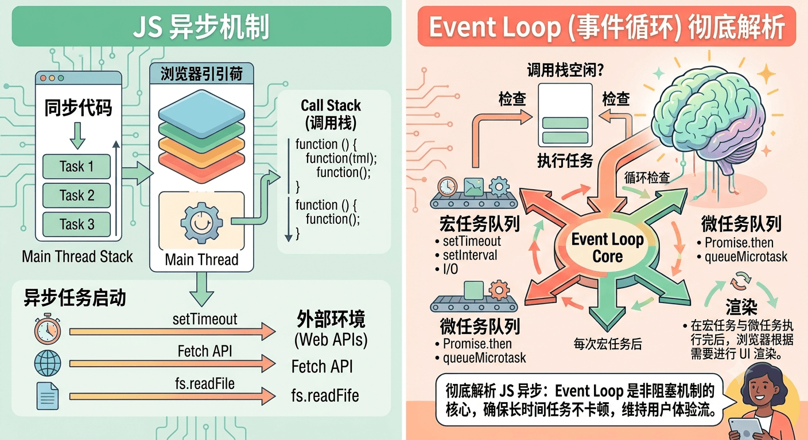

# 搞懂 JS 异步内核：从 Call Stack、Event Loop 到 DOM 渲染与 await 的假等待

[[toc]]



---


对于许多前端开发者来说，JavaScript 的异步机制一直充满“貌似矛盾”的迷局：

1. **单线程**的 JavaScript 凭什么能一边处理耗时的网络请求，一边保持页面流畅？
2. 遇到 `fetch` 的 `pending` 状态时，主线程**不轮询、不死等**，它是怎么知道数据什么时候回来的？
3. 写下 `await` 时，函数看起来明明**卡在那里等结果**，为什么浏览器没有死机？
4. **DOM 渲染**到底是在什么时候发生的？它属于宏任务还是微任务？

本文将从最底层的调用栈（Call Stack）讲起，层层剥离，带你构建一个关于 JS 异步与浏览器渲染运行机制的完整知识拓扑。


## 一、 起点：调用栈（Call Stack）为什么是“后进先出”？

要理解异步，首先要理解同步。JS 引擎用**调用栈**来追踪代码的执行位置。

调用栈遵从 **LIFO（Last In, First Out，后进先出）** 原则。这种数据结构并非为了异步设计，而是**所有编程语言处理“函数嵌套调用”的天然逻辑**。

### 1. 为什么必须是“后进先出”？

当函数 `A` 在执行过程中调用了函数 `B`，`A` 必须**暂停自身**，等待 `B` 执行完毕拿回返回值后，才能继续往下走。

```javascript
function funcC() {
  console.log('C 执行');
}

function funcB() {
  funcC(); // 暂停 B，先去执行 C
  console.log('B 执行');
}

function funcA() {
  funcB(); // 暂停 A，先去执行 B
  console.log('A 执行');
}

funcA();

```

* **压栈（Push）：** 执行 `funcA` $\rightarrow$ 入栈；`funcA` 调用 `funcB` $\rightarrow$ `funcB` 入栈；`funcB` 调用 `funcC` $\rightarrow$ `funcC` 入栈。
* **出栈（Pop）：** `funcC` 最先执行完，**最先被弹出**；返回 `funcB` 继续执行，`funcB` 完成后弹出；最后返回 `funcA` 执行完毕弹出。

> **结论：** “后进先出”确保了**内层函数执行完毕后，能准确返回到外层函数的上下文断点处**。


## 二、 核心引擎：Event Loop 的四方协作架构

当遇到了耗时任务（如定时器、网络请求），单个调用栈就不够用了。此时，运行环境（浏览器/Node.js）引入了另外三个角色配合工作：

```
        +----------------------------+
        |   Call Stack (调用栈)      |
        +-------------+--------------+
                      | (遇到异步任务委托出去)
                      v
        +----------------------------+
        | Web APIs (网络线程/定时器)  |
        +-------------+--------------+
                      | (底层事件就绪后放入)
                      v
     +----------------------------------+
     |   Microtask Queue (微任务队列)    | <--- 优先全额清空！
     +----------------------------------+
     |   Macrotask Queue (宏任务队列)    | <--- 每次循环只取一个
     +----------------------------------+

```

### 1. 四大组件职责

* **Call Stack（调用栈）：** 唯一负责执行 JS 代码的主线程。
* **Web APIs（浏览器后台线程池）：** C++ 编写的多线程模块，专门在后台跑耗时的异步任务（网络请求、Timer 计时、DOM 事件监听）。
* **Microtask Queue（微任务队列）：** 存放微任务（如 `Promise.then`、`queueMicrotask`、`MutationObserver`），**优先级最高**。
* **Macrotask Queue（宏任务队列）：** 存放宏任务（如 `script` 整体代码、`setTimeout`、`setInterval`、`I/O`）。

### 2. 事件循环的标准执行轮询（Loop Rule）

1. **执行主线同步代码**（这本身就是第一个宏任务），直到调用栈清空。
2. **清空所有微任务：** 检查微任务队列。若不为空，依次弹出**所有**微任务推入调用栈执行。*如果在执行微任务时又合成了新的微任务，会接着加入当前队列并在本轮直接清空！*
3. **渲染更新检查（Rendering Pipeline）：** 检查屏幕是否到了刷新周期（如 60Hz 屏幕约 16.6ms）。若需要，进行 UI 绘制（详见后文）。
4. **取出一个宏任务：** 从宏任务队列取出**一个**排队最久的任务推入调用栈执行。
5. **重复步骤 2**，如此周而复始。


## 三、 网络请求 pending 时，JS 到底在做什么？

当你发起 `fetch([https://api.example.com])`，Promise 处于 `pending` 状态时，**JS 主线程有没有在“等待”？如果没等，它怎么知道数据什么时候回来？**

答案是：**JS 主线程完全没有管这回事。等待的是操作系统和网卡。**

```
[JS 主线程]                      [浏览器网络线程 / 操作系统内核]
    |                                        |
    |--- 1. 发起 fetch 请求 ------------------>|
    |                                        |--- 2. 进行 DNS 解析/TCP 握手/发送 HTTP
    |--- 3. 拿到 Pending 的 Promise           |
    |                                        |--- 4. 线程休眠/依靠 OS epoll 机制监听 Socket
    |--- 5. 继续跑后续同步代码 (无卡顿)         |
    |                                        |--- 5. 网卡收到响应数据包 (触发硬件中断)
    |                                        |--- 6. OS 唤醒网络线程，状态变 Resolved
    |<-- 7. 将 .then() 回调推入【微任务队列】--|
    |
    |--- 8. 主线程空闲，从微任务队列取出回调执行

```

1. **非阻塞委托：** 主线程执行 `fetch()`，向浏览器网络线程下达指令后，**立刻拿到一个初始状态为 `pending` 的 Promise 对象**，接着去跑后续的同步代码。
2. **内核级异步 I/O：** 浏览器的网络线程发起请求后，利用操作系统底层的多路复用机制（如 Linux 的 `epoll`、Mac 的 `kqueue`）挂起监听，不需要占用 CPU 资源死循环检查。
3. **硬件中断与通知：** 当数据包到达网卡时，网卡触发**硬件中断**，操作系统收到信号后通知浏览器网络线程。网络线程将 Promise 状态修改为 `Resolved`，并将对应的 `.then()` 回调函数**推入微任务队列**。
4. **微任务被调度：** 主线程空闲时，Event Loop 发现微任务队列有回调，取出压入调用栈执行。


## 四、 破除迷思：`await` 到底是不是在“等待”？

许多开发者会迷茫：*“写了 `await` 之后，后面的代码确实没跑啊，这难道不是卡住等待吗？”*

这里的核心在于厘清：**“谁在等”与“谁没在等”。**

> * **在等待的：** 只有 **当前这个 `async` 函数本身**（它的局部执行上下文被暂停并压入后台）。
> * **没在等待的：** **JS 主线程**（它立刻跳出了这个函数，去执行外部的其他同步代码或响应用户点击）。
>
>

### 1. 用代码验证

```javascript
async function test() {
  console.log('2. 进入 test 函数');

  // 遇到 await，暂停 test 函数的后续执行，让出主线程控制权
  await fetch('https://api.example.com');

  // 这里的代码在 await 完成前【确实不会执行】
  console.log('4. await 结束，恢复 test 函数');
}

console.log('1. 主线程开始');

test(); // 调用 async 函数

console.log('3. 主线程结束');

```

**控制台输出顺序：**

1. `1. 主线程开始`
2. `2. 进入 test 函数`
3. `3. 主线程结束` **← 关键点！主线程根本没有等 await 返回，直接跑完了外部代码！**
4. `4. await 结束，恢复 test 函数` *(网络请求返回后)*

### 2. `await` 的底层本质：Generator 协程 + Promise 语法糖


当你写下：

```javascript
async function example() {
  console.log('A');
  await doSomething();
  console.log('B');
}

```

在 JS 引擎底层，`await` 后面的代码会被打包成 `Promise.then()` 中的微任务回调。这段代码会被等解为：

```javascript
function example() {
  console.log('A'); // 同步执行

  // await 相当于把【后面的所有代码】打包成了 .then() 中的微任务回调
  return doSomething().then(() => {
    console.log('B'); // 注册为微任务
  });
}

```

* **出栈（Yield）：** 遇到 `await` 时，引擎会保存当前函数的上下文（变量、作用域），**然后直接将该函数弹出调用栈**，把控制权还给主线程。
* **入队与恢复：** 当 `doSomething()` 的 Promise 完成时，之前打包的“后半段代码”被作为**微任务**推进队列，被 Event Loop 重新压栈继续执行。

----

💡 **工程避坑提醒（串行 vs 并行）：**

理解了 `await` 会挂起当前函数，就要避免将无依赖关系的请求写成连续 `await`：

```javascript
// ❌ 串行阻塞（耗时 T1 + T2）：
const res1 = await fetch('/api/user');
const res2 = await fetch('/api/posts');

// ✅ 并行触发（耗时 Max(T1, T2)）：
const [res1, res2] = await Promise.all([
  fetch('/api/user'),
  fetch('/api/posts')
]);

```


## 五、 进阶真相：DOM 什么时候渲染？是微任务还是宏任务？

先给出一个确切结论：**DOM 渲染既不是微任务，也不是宏任务！它是处于微任务清空之后、下一个宏任务开始前的“独立浏览器管线阶段”。**

### 1. 完整的 Loop 与 DOM 渲染管线

修改 DOM（如 `div.style.color = 'red'`）只是**同步更新了内存中的 DOM 树节点**，并不意味着屏幕像素发生了变化。真正的“绘制上屏（Paint）”由渲染引擎在特定节点统一触发：

> 很多人的误区在于：以为浏览器里的一切都是任务队列里的回调函数。但实际上，渲染（Rendering）是浏览器渲染引擎（如 Blink/WebKit）的绘制行为，而不是 JS 引擎的任务。

**完整的 Event Loop 轮询生命周期是这样的：**

```
+-------------------------------------------------------------+
| 1. 执行一个宏任务 (如 script 全局代码, setTimeout 回调)         |
+-------------------------------------------------------------+
                              |
                              v
+-------------------------------------------------------------+
| 2. 清空所有的微任务 (Microtasks: Promise.then, await 后续代码) |
+-------------------------------------------------------------+
                              |
                              v
+-------------------------------------------------------------+
| 3. 渲染更新检查 (Rendering Pipeline)                        |
|    - 检查屏幕是否需要刷新 (通常 60Hz 屏幕约 16.6ms 刷新一次)     |
|    - 若需要刷新：                                           |
|      a. 执行 requestAnimationFrame (rAF 回调)                |
|      b. Refine/Layout (重新计算样式与布局)                   |
|      c. Paint (像素绘制到屏幕，即真正肉眼可见的 DOM 渲染)      |
+-------------------------------------------------------------+
                              |
                              v
+-------------------------------------------------------------+
| 4. 取出下一个宏任务执行 (进入下一轮 Loop)                      |
+-------------------------------------------------------------+

```

> **关于 `requestAnimationFrame` (rAF)：**
>
> 它既不是宏任务也不是微任务，而是专为动画设计的**帧前回调**，精准运行在 Style 计算与 Layout 之前的步骤 1。

> **检查屏幕是否需要刷新：**
> 1，修改了 DOM 或 CSS 样式  2，注册了动画帧回调： 调用了` requestAnimationFrame(callback)`。 3，页面上有正在播放的动画： 如 CSS Animation、Transition、`<video>` 播放、`<canvas>` 绘图等。4，发生了用户交互： 页面发生滚动（Scroll）、鼠标移动引发 :hover 状态改变等。


### 2. 实验验证：DOM 修改 vs 真实上屏

```javascript
document.body.style.background = 'red'; // 1. 改变内存中的 DOM

Promise.resolve().then(() => {
  // 2. 微任务阶段
  console.log('微任务执行中...');
  // 如果在此处加上 alert('画面变红了吗？')
  // 答案是：没有！页面依然是白色的！因为 Paint 渲染阶段还没到。
});

setTimeout(() => {
  // 3. 宏任务阶段
  console.log('下一个宏任务...');
}, 0);

```

从上述流程可以看出：

* 在**微任务执行完毕前**，屏幕上绝对不会呈现最新的 DOM 变化。
* 浏览器会在**微任务清空后**，根据帧率控制（通常 60fps），集中将内存中所有的 DOM 变更一次性进行 Style/Layout/Paint 处理，以此获得最高效的渲染性能。

## 六、 总结全景图

我们将整个 JS 异步与渲染运行机制整合为一张总结对比表：

| 阶段 / 概念 | 发生时机与触发源 | 执行特点与规则 | 典型代表 |
| --- | --- | --- | --- |
| **调用栈 (Call Stack)** | 主线程同步执行 | **LIFO 后进先出**，函数嵌套调用的天然上下文管理 | 普通函数调用、`new Promise()` 构造函数 |
| **Web APIs** | 浏览器后台 C++/Rust 线程 pool | **不阻塞 JS 主线程**，由 OS 网卡中断或 Timer 硬件驱动 | `fetch` 请求、`setTimeout` 计时、DOM 事件 |
| **微任务 (Microtask)** | 语言层面的异步承诺回调 | 宏任务结束或同步代码跑完后，**立刻一次性全额清空** | `Promise.then`、`await` 后续代码、`queueMicrotask` |
| **DOM 渲染 (Paint)** | 浏览器渲染引擎 (Rendering Engine) | 发生在**微任务清空后、下一个宏任务前**，负责绘制像素 | `requestAnimationFrame`、Style/Layout/Paint |
| **宏任务 (Macrotask)** | 宿主环境（浏览器/Node）发起的任务 | **每次 Event Loop 轮询只取出一个执行** | `script` 整体代码、`setTimeout`、`I/O` |

**一句话记住 JS 异步模型：**

> 主线程永不阻塞，异步耗时交给底层，数据到期推入队列；遇到 await 暂停函数出栈让路，微任务清空后渲染上屏，最后轮询下一个宏任务。

## 七、 疑惑点讲解

### 1、 出栈（Yield）： 遇到 await 时，引擎会保存当前函数的上下文（变量、作用域），然后直接将该函数弹出调用栈，把控制权还给主线程。

这句话确实是理解 `async/await` 最烧脑的地方！因为它同时涉及到了**内存保存**和**代码执行权的让出**。

我们可以把这句话拆成 **三个动作**，用一个“看书暂停”的比喻来彻底讲透它：

---

#### 💡 形象比喻：看书打书签

假设你在看一本小说（执行 `async` 函数），看到第 10 页时发现这一页有一道谜题（`await fetch(...)`），你需要等朋友查完资料告诉你答案才能继续看第 11 页。

这时候你有两种选择：

* **死等（同步阻塞）：** 你双手死死按着书不放，眼睛盯着门外，啥也不干，后面的所有工作全停下（线程卡死）。
* **Yield 挂起（`await` 的做法）：**
1. **夹书签（保存上下文）：** 你在第 10 页**夹了一张书签**，记下当前的笔记和思路（保存当前的变量 `a, b` 和代码执行位置）。
2. **把书放回书架（弹出调用栈）：** 你把书合上放一旁，**双手腾出来了**（调用栈清空了该函数）。
3. **去干别的（控制权还给主线程）：** 你去烧水、扫地、接电话（主线程去跑外部的其他同步代码）。
4. **朋友把答案送来了（Promise 完成）：** 你把书从书架拿下来，翻到书签页（恢复上下文），压入调用栈继续读第 11 页。

---

#### 核心拆解：这句话里的 3 个动作

理解了比喻后，我们再看这句话里的三个关键概念：

##### 1. “保存当前函数的上下文（变量、作用域）”

* **普通函数结束：** 函数执行完弹栈时，函数内部的变量会被**直接销毁**（被垃圾回收）。
* **`await` 暂停：** 函数虽然暂停了，但**还没执行完**。所以 JS 引擎会把这个函数当前的所有局部变量、`this`、以及“代码执行到了哪一行”**拍一张快照存到堆内存里**。等请求回来时，能原封不动地恢复现场。

##### 2. “直接将该函数弹出调用栈”

* **为什么一定要弹出？**
调用栈（Call Stack）的规则是：**只有栈顶的任务才能执行，而且栈顶任务不结束，下面的任务全被卡住。**
如果不把 `async` 函数弹出去，调用栈就被占着，后续的任何代码（包括用户的点击事件、UI 渲染）都进不来，页面就会无响应。
所以引擎必须**强制把当前 `async` 函数移出调用栈**，让调用栈空出来。

##### 3. “把控制权还给主线程”

* 当 `async` 函数被弹出调用栈后，主线程（CPU）就空闲了。
* 它会顺着之前的调用链路，**继续向下执行调用该 `async` 函数后面的同步代码**。

---

#### 📊 代码 + 调用栈动态变化图

用一段简单代码来看看调用栈里具体发生了什么：

```javascript
async function foo() {
  let x = 10;
  await fetch('...'); // <-- 执行到这里
  console.log(x);
}

function main() {
  foo();
  console.log('主线程继续跑');
}

main();

```

##### 调用栈（Call Stack）的变化过程：

```text
时刻 1：主线程启动
|            |
|   main()   |  <-- main 压栈
+------------+

时刻 2：main 调用 foo
|   foo()    |  <-- foo 压栈，开始执行到 await
|   main()   |
+------------+

时刻 3：遇到 await！【关键时刻】
1. 引擎把 foo 的变量 (x=10) 和执行进度存入堆内存（打书签）。
2. 把 foo() 弹出调用栈！
|            |
|   main()   |  <-- foo 弹出后，栈顶变回了 main()！
+------------+

时刻 4：主线程恢复自由
main() 继续执行，打印 "主线程继续跑"，执行完毕后 main 也出栈。
|            |  <-- 调用栈完全清空！主线程可以去处理点击、渲染等其他事
+------------+

时刻 5：很久以后，fetch 完成了
网络线程把 foo() 的后半段放进微任务队列。
主线程从微任务队列取出，恢复变量 (x=10)，重新压栈执行！
| foo(恢复)  |  <-- 重新压栈，打印 x (10)
+------------+

```
#### 总结

这句话的核心意思就是：**`await` 并不是真的让 CPU 在那里死等，而是把当前函数“打包存档”，然后立刻踢出 CPU，让 CPU 去跑别的代码；等到异步有了结果，再把存档解包，重新放回 CPU 继续跑。**
