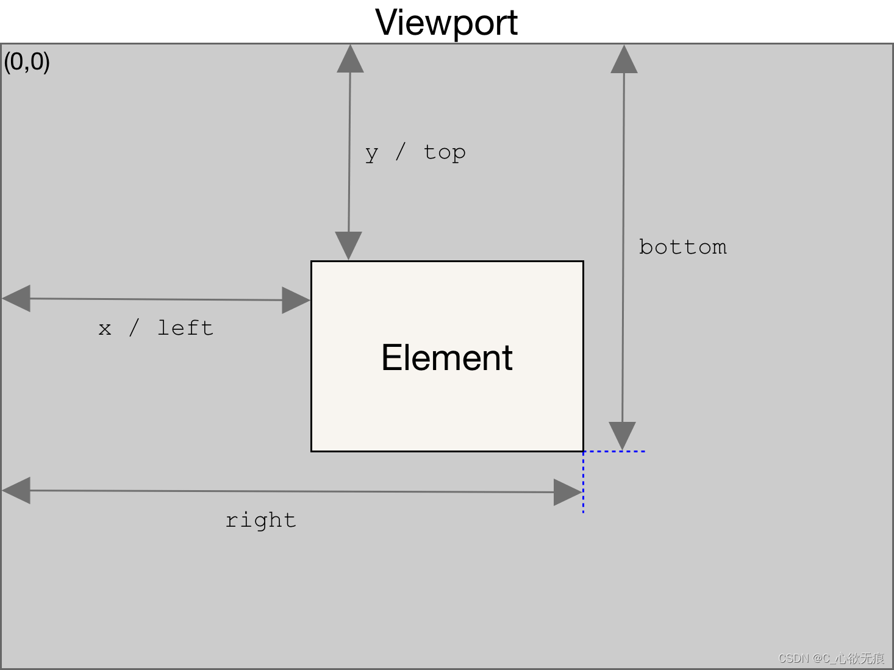
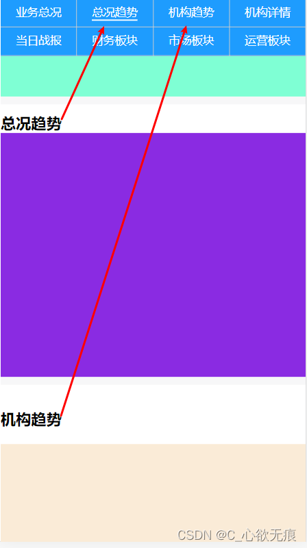

# getBoundingClientRect()方法的使用


介绍一下此方法的一些属性，以及具体的使用场景和一些需要注意的问题；

## 1，属性

此方法返回元素的大小及其相对于视口的位置；返回的是一个对象： 包括 `left、top、right、bottom、x、y、width 和 height` 这几个属性；

| 属性                                      | 描述                       |
| ----------------------------------------- | -------------------------- |
| `Element.getBoundingClientRect().top`     | 元素上边距离页面上边的距离 |
| `Element.getBoundingClientRect().left`    | 元素左边距离页面左边的距离 |
| `Element.getBoundingClientRect().right`   | 元素右边距离页面左边的距离 |
| `Element.getBoundingClientRect().bottom`  | 元素下边距离页面上边的距离 |
| `Element.getBoundingClientRect().x`       | 元素左边距离页面左边的距离 |
| `Element.getBoundingClientRect().y`       | 元素右边距离页面左边的距离 |
| `Element.getBoundingClientRect().width `  | 元素自身的宽度             |
| `Element.getBoundingClientRect().height ` | 元素自身的高度             |


::: tip 注意
1. 对象中的width和height属性是包含了内边距（padding）和边框（border）的宽度的，而不仅仅是内容部分的宽度和高度。
2. 当页面过高且滚动的时候，元素不在视口的可视区域时 是会出现负值的。
3. 空边框盒（没有内容的边框）会被忽略。那么这个矩形给该元素返回的width、height 值为 0，left、top值为第一个CSS盒子（按内容顺序）的 top-left值。
:::

**如图所示:**
{width=500}

## 2，使用场景

由图可知这是一个吸顶的菜单栏，当内容向上滚动时，总况趋势滚动到页面的上半部分时，吸顶菜单相对应的项要高亮起来，当机构趋势模块滚动到页面上半部分时，吸顶菜单的机构趋势也要高亮起来；


{width=350}


**思路：** 
1. 第一首先要监听滚动条，每一滑动都要判断距离页面上面的距离； 
2. 判断总况趋势顶部距离上边视口的高度如果小于`200`且总况趋势底部距离上边的距离大于0，就高亮总况趋势；

主要代码如下： tabItem 是通过 this.$ref 获取的每一项内容模块（页面紫色和淡黄色的部分）；

实际情况还是要根据业务要求来实现，这只是记录一种思路；

```javascript
// 记录选中的当前项
for (let i = 0; i < tabItems.length; i++) {
  let ClientRect = tabItems[i].getBoundingClientRect().top;
  // 此行是为了向上滚动出现负数的情况 处理上半部分
  let handleTop = ClientRect <= 0 ? ClientRect * -1 : ClientRect;
  // 获取元素容器下边 距离页面上边的距离
  let handleBottom = tabItems[i].getBoundingClientRect().bottom;
  // console.log("下面距离上面的高度：",handleBottom);
  // handleTop <= 200是为了控制上半部分  handleBottom >0是为了控制向上滑动的过程中下面也需要判断
  if (handleTop <= 200 && handleBottom > 0) {
    this.act_index = i;
    break; //退出所有的循环
  }
}
```
