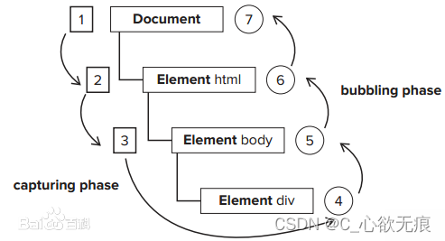
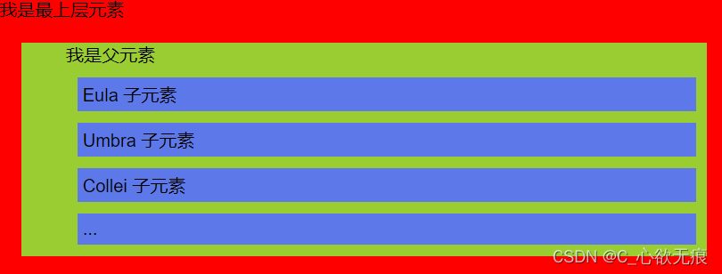

# 事件冒泡和事件委托

## 1，DOM事件模型

1. `事件捕获阶段(Capturing Phase)`：事件从 document  一直向下传播到目标元素，依次检查经历过的节点是否绑定了事处监听函数（事件处理程序），如果有则执行，反之不执行；
2. `事件处理阶段(Target Phase)`：事件到达目标元素，触发目标元素的监听函数；
3. `事件冒泡阶段(Bubbling Phase)`：事件从目标元素冒泡到document，依次检查经过的节点是否绑定了事件监听函数，如果有则执行，反之不执行；

::: tip 简而言之
事件一开始从文档的根节点流向目标对象（捕获阶段），然后在目标对向上被触发（目标阶段），之后再回溯到文档的根节点（冒泡阶段）；
:::
## 2，什么是事件冒泡

当事件发生后，这个事件就要开始传播(从里到外或者从外向里)。为什么要传播呢？因为事件源本身（可能）并没有处理事件的能力，即处理事件的函数（方法）并未绑定在该事件源上。

> 例如我们点击一个按钮时，就会产生一个click事件，但这个按钮本身可能不能处理这个事件，事件必须从这个按钮传播出去，从而到达能够处理这个事件的代码中；

看下图右侧部分，事件是会向父级传递的，会依次向上触发父级的点击事件；看一下代码演示：



```javascript
 <div class="bubbling">
  	我是最上层元素
      <dir class="content" @click="content($event)">
        <ul @click="father($event)">
          我是父元素
          <li @click="li($event)">Eula 子元素</li>
          <li>Umbra 子元素</li>
          <li>Collei 子元素</li>
          <li>...</li>
        </ul>
      </dir>
  </div>
 <script>
export default {
  methods: {
  // 最上层元素
    content(){
      console.log("3-content");
    },
    // 父元素
     father(event){
      console.log("2-father");
    },
    // 子元素
    li(){
      console.log('1-li');
    },
  },
};
</script>
```
效果图：


打印结果如下：

当我点击蓝色的子元素时，事件冒泡会`依次向上触发` `li、father、content`事件函数；
这就是上面所说的：当我们点击一个按钮时，就会产生一个click事件，但这个按钮本身可能不能处理这个事件，事件必须从这个按钮传播出去，从而到达能够处理这个事件的代码中；

```javascript
1-li
2-father
3-content
```

## 3，阻止冒泡与默认行为

 1. 捕获不可以取消，但是冒泡可以，使用event.stopPropagation()可以阻止冒泡；
vue中可以直接使用`@click.stop =" "`来阻止冒泡行为；
 2. 阻止默认行为使用event.preventDefault()，可以使用MDN查阅事件是否冒泡（Bubbles）以及是否能取消默认行为（Cancelable），是否能取消默认行为与冒泡无关;
## 4，事件委托
**定义：**

> 利用事件冒泡的特性，将本应该注册在子元素上的处理事件注册在父元素上，这样点击子元素时发现其本身没有相应事件就到父元素上寻找并做出响应。


**优点：**
 1. 节省监听数，减少内存消耗，提高性能；
 2. 随时可以添加子元素，添加的子元素会自动有相应的处理事件，也就是可以监听动态元素；

代码如下：

把事件加在父元素上面，此时点击子元素，会触发`father` 事件函数，然后通过`event.target`来获取实际触发事件的元素；

```javascript
<div class="bubbling">
       我是最上层元素
      <dir class="content">
        <ul @click="father($event)">
          我是父元素
          <li >Eula 子元素</li>
          <li>Umbra 子元素</li>
          <li>Collei 子元素</li>
          <li>...</li>
        </ul>
      </dir>
   </div>
 	// 父元素
    methods:{
	    father(event){
	      if(event.target && event.target.nodeName == "LI"){
	        console.log("我点击的是：",event.target.innerText);
	      }
	    },
    }
```
输出结果：

```javascript
我点击的是： Eula 子元素
```

## 5，targt 和 currentTarget 区别

 1. `event.target`是用户操作的元素；
 2. `event.currenttarget`是监听的元素；
 3. `this是event.currentTarget`；

::: warning 注意
实际上以上所说的DOM事件并非JS的功能，而是属于浏览器提供的DOM的功能，浏览器只是调用DOM提供的addEventListener而已。
:::