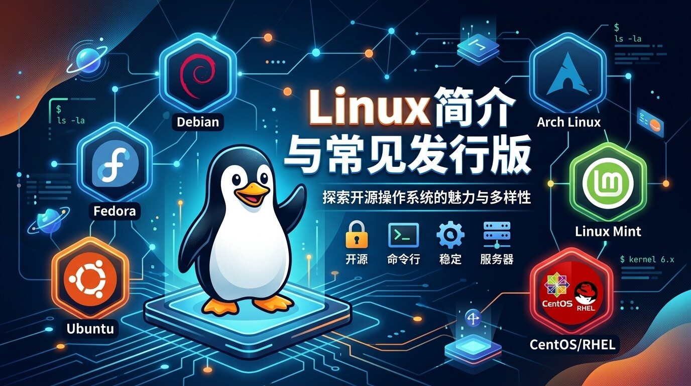
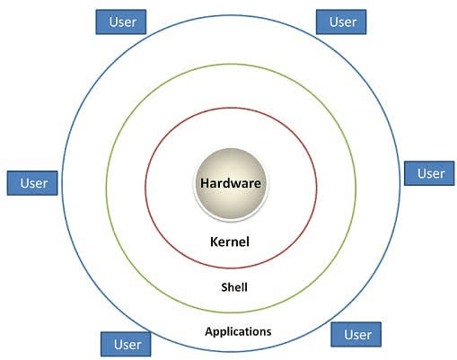
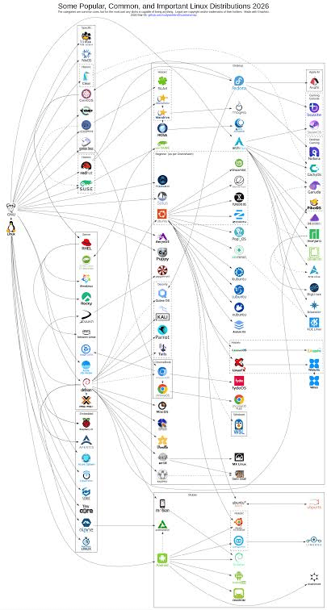

# Linux 简介与常见发行版

[[toc]]

在开始学习 Linux 命令、权限、系统服务之前，我们需要先搞清楚一件事：**Linux 到底是什么？** 以及市面上那么多叫「Linux」的系统，它们之间到底有什么区别。

## 1. 什么是 Linux？

很多人常说「我在用 Linux」，但更准确的说法是：**我在用一个基于 Linux 内核的操作系统**。

### Linux 内核 vs 操作系统

- **Linux 内核（Kernel）**：由林纳斯·托瓦兹（Linus Torvalds）于 1991 年发起并开源。它是系统的底层核心，专门负责管理硬件资源（CPU、内存、磁盘、网络等）与进程调度。
- **操作系统（GNU/Linux）**：只有内核是无法直接作为完整系统给用户使用的。将 Linux 内核与 GNU 项目的命令行工具（Shell、核心工具链）、包管理器及桌面环境打包在一起，才构成了可用的系统。

> **核心公式**：Linux 发行版 (Distribution) = Linux 内核 + GNU 系统工具 + 包管理器 + 预装应用/桌面环境

## 2. 为什么 Linux 如此重要？

1. **服务器领域的绝对霸主**：全球绝大多数网站、云计算服务、后端 API 以及高性能数据库均部署在 Linux 上。
2. **开源且免费**：无商业授权费用，代码透明，支持全球开发者共同维护与定制。
3. **稳定与高安全性**：基于严格的 Unix 权限管理模型，系统服务可以连续稳定运行数年而无需重启。
4. **高扩展与高定制性**：从 TOP500 超级计算机，到智能手机（Android）、路由器及物联网设备，均可按需裁剪。

## 3. 常见 Linux 发行版及家族分类

虽然市面上发行版有数百种，但它们绝大多数继承自几大核心系谱：

发行版可以简单理解为：「内核 + 各种软件 + 独特的包管理方式 + 厂商/社区的特色工具」。市面上的主流发行版主要分为以下几个家族系谱：

### 3.1 Debian / Ubuntu 派系（易用性与社区之王）

- **Debian**：Linux 界的大老级开源项目，以**极致的稳定性**和**坚守自由软件精神**著称。软件更新偏保守，常用于追求绝对稳定的服务器。
- **Ubuntu**：基于 Debian 二次开发，目前全球最流行、对新手最友好的发行版之一。
  - **特点**：开箱即用，硬件兼容性好，社区生态极度丰富。
  - **主流版本**：推荐使用 **Ubuntu Server LTS**（长期支持版）。
- **Linux Mint / Deepin（深度）**：基于 Debian/Ubuntu，界面美观贴心，适合作为桌面系统使用。

### 3.2 Red Hat (RHEL) 派系（企业级标准）

- **RHEL (Red Hat Enterprise Linux)**：红帽公司推出的企业级系统，提供商业技术支持，是金融和世界 500 强企业的首选。
- **Rocky Linux / AlmaLinux**：在 CentOS 改变策略后，社区发起的 **100% 兼容 RHEL** 的开源替代方案，目前是企业生产环境的热门选择。
- **Fedora**：红帽公司的“新技术试验田”，更新频繁，适合喜欢体验最新内核与软件特性的开发者。

### 3.3 Arch Linux 派系（极客与定制玩家）

- **Arch Linux**：采用 **滚动更新（Rolling Release）** 机制，遵从极简理念。系统只提供基础框架，从安装到组件选择完全由用户手动配置。
- **Manjaro**：基于 Arch 打造，预装了图形化安装程序与桌面，降低了 Arch 的上手门槛。

### 3.4 SUSE 派系（欧洲企业之王）

- **openSUSE**：源自德国的知名发行版，以强大的图形化系统配置工具 **YaST** 闻名，在欧洲及工业自动化领域应用广泛。

## 4. 主流发行版横向对比与选型建议

针对不同场景和需求，以下是常见发行版的特点汇总与选型对照：

| 派系 / 发行版 | 包管理器 | 核心优势 | 推荐应用场景 |
| :--- | :--- | :--- | :--- |
| **Ubuntu** | `apt` (dpkg) | 社区庞大，文档丰富，软件生态最好 | 新手入门、开发环境、AI/算法研究 |
| **Debian** | `apt` (dpkg) | 系统轻量，资源占用低，极致稳定 | 追求稳定的底层服务器、VPS 部署 |
| **Rocky / Alma** | `dnf` / `yum` | 100% 兼容 RHEL，企业级稳定 | 企业生产环境、运维、后端服务 |
| **Fedora** | `dnf` | 引入最新技术与最新内核，更新积极 | 前沿技术尝鲜、桌面个人开发 |
| **Arch Linux** | `pacman` | 软件库 (AUR) 庞大，高度自由定制 | 极客玩家、深入学习 Linux 系统底层 |

### 快速选择建议
- **完全新手 / 个人开发** ➡️ 首选 **Ubuntu**
- **后端开发 / 运维 / 生产服务器** ➡️ 推荐 **Ubuntu Server** 或 **Rocky Linux**
- **想深入研究系统原理** ➡️ 尝试手动折腾 **Arch Linux**

## 5. 总结

- **Linux 本身是内核**，我们平时使用的是打包好的各类「发行版」。
- 不同发行版的本质区别主要在于：**包管理工具**、**软件更新策略（滚动更新 vs 定期 LTS）** 以及**系统预装组件**。
- 对于初学者来说，**不必在“选哪个发行版更酷”上消耗精力**。选定 Ubuntu 或 Rocky Linux 后，尽快把基础命令行、文件权限、网络及服务管理打牢才是最重要的。
